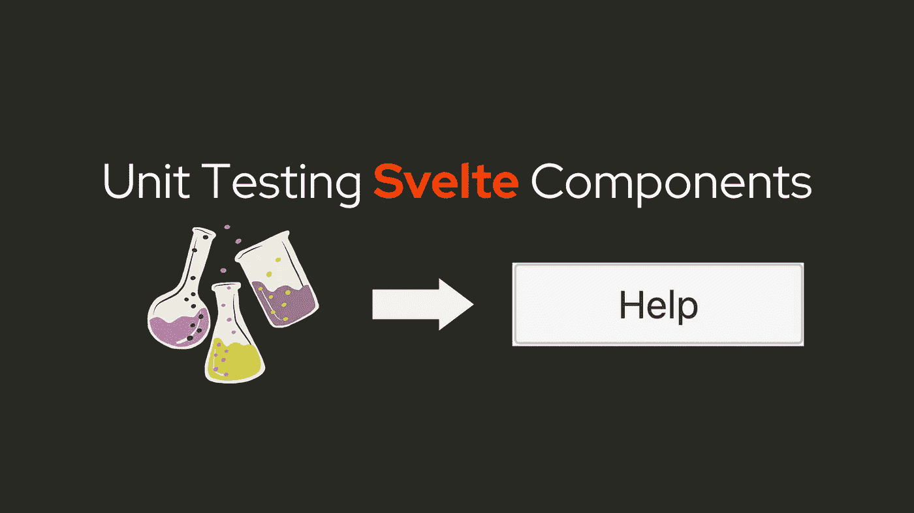

# 单元测试细长组件的总体情况

> 原文：<https://levelup.gitconnected.com/an-overall-look-at-unit-testing-svelte-components-c6d612adf269>



**如果你正在为你的项目管理**一系列组件**，单元测试**会被证明是非常有用的。如果您想确保组件在未来更改后仍能正常工作，建议在每次更改后进行单元测试。

# 入门—初始设置

我们将使用 [**Jest**](https://jestjs.io/) 以及 [**测试库**](https://testing-library.com/) 来测试我们的组件。

将`jest`、`@testing-library/jest-dom`、`@testing-library/svelte`安装到您项目的`devDependencies`中。

让我们为你的组件创建一个**测试文件**。假设我们有一个文本输入组件`Input`，它接受属性`id`、`class`和`type`。

为了测试组件，为它创建一个`__test__` **文件夹**。Jest 会寻找文件名末尾有`.test.js`或`.spec.js`的文件。

我是这样构建这些文件的:

## 进口

```
import { render, fireEvent } from '@testing-library/svelte';
import Component from "../src/Component.svelte";
import SlotTest from "../../../test/slot/SlotTest.svelte";
```

通常你需要**从`@testing-library`导入**函数`render`和`fireEvent`，组件本身，以及一个组件来测试插槽(`SlotTest`)。

让我们来看看`render`和`fireEvent`是做什么的:

## 渲染-获取组件

```
const result = render(Component, { props });
```

`render`功能主要是**用指定的**道具**将**组件渲染到**文档体**上。

之后，我会像这样使用`**result.container**`获取元素本身:

```
const { container } = result;
// OR
const { container } = render(Component, { props };
```

然后，使用选择器获取元素本身:

```
const component = container.getElementsByClassName(props.class)[0];
```

如果你知道你在搜索什么，建议使用一个**更窄的 get 方法**。如果没有，您可以使用`querySelector`或`querySelectorAll`，但是这些函数**不是很有效**，并且在搜索整个文档时可能需要一些资源。

## 火灾事件—测试事件

```
await fireEvent.click(component)
```

`fireEvent`模拟**事件**如点击、输入、更改等。它允许您测试当事件被触发时**会改变**什么。

# 创建测试

为了测试，我们使用了函数`describe`和`it` / `test`。`it` / `test`用于**单个**测试用例，而`describe`用于将**多个**测试用例分组在一起。

`describe`和`it` / `test`需要**两个参数**，第一个是字符串，也就是测试的**名称**。最好把**你正在测试的**放在那个字段。第二个是您将**执行**测试的功能。

我的测试通常基于使用`**expect**`函数检查**属性或文本内容**以查看它们是否与期望值匹配。

```
expect(component.id).toEqual(props.id);
```

`**expect**`用于**以多种不同方式**将中的一个值与另一个值进行比较，并可根据其结果确定该组的**测试结果**。

一些例子是:

等式(`toEqual`):

```
expect(component.value).toEqual(10);
```

比较(`toBeGreaterThan`，`toBeLessThan`)

```
expect(component.value).toBeGreaterThan(5);
```

布尔型(`toBeTruthy`，`toBeFalsy`)

```
expect(component.activeElement).toBeTruthy();
```

## 示例测试

将所有这些功能放在一起，您将得到如下结果:

```
import { render, fireEvent } from '@testing-library/svelte';
import Component from "../src/Component.svelte";
import SlotTest from "../../../test/slot/SlotTest.svelte";describe("Component test", () => {
  const props = {
    id: "component",
    class: "component-custom",
    style: "width: 100%; height: 100%",
  }; it("should render properly", () => {
    const result = render(Component, { props });
    expect(() => result).not.toThrow();
  }); it("should render with slots", () => {
    const result = render(SlotTest, { props: { component: Component, props } });
    expect(() => result).not.toThrow();
  }); // getElementsByClassName, getElementsByTagName, etc may be used
  it("should have correct props", () => {
    const { container } = render(Component, { props });
    const component = container.getElementsByClassName("component")[0]; expect(component.getAttribute("style").toEqual(props.style);
  }); it("fireEvent", async () => {
    const { container } = render(Component, { props });
    const component = container.getElementById("component"); expect(component.value).toEqual(1);
    await fireEvent.click(component);
    expect(component.value).toEqual(2);
  });
});
```

准备好测试文件后，要开始单元测试，使用**命令**

```
jest
```

Jest 也可以通过使用一个**可选的**参数来设置**目录名**来覆盖你想要的某个**文件或文件夹**。

```
jest src/components
```

## 提示:预提交

一旦你设置好测试，我建议你通过设置**预提交**在每次提交前自动运行它们。这将**改进您的工作流程**，并且消除每次您对组件进行修改时运行测试的需要。然而，我们不会在本文中详细介绍它们，但是我会推荐像`[**pre-commit**](https://pre-commit.com/)`这样的库。

# 结论

一开始，单元测试对你来说似乎势不可挡(对我来说确实是这样)，但是一旦你掌握了窍门，就很容易理解了。由于有了`jest`库，编写测试也非常**简单**。我希望这能帮助你测试你的苗条 UI 组件。感谢您的阅读！

## 相关链接

请阅读`jest`和测试库的文档，以获得更多关于单元测试的信息。

*   笑话:[https://jestjs.io/docs/getting-started](https://jestjs.io/docs/getting-started)
*   测试库:[https://testing-library.com/docs/](https://testing-library.com/docs/)

也可以去看看 Svelte Society，那里有关于组件、设计模式和单元测试的食谱。

*   苗条社会——食谱:[https://sveltesociety.dev/recipes](https://sveltesociety.dev/recipes)

# 分级编码

感谢您成为我们社区的一员！更多内容见[升级编码出版物](https://levelup.gitconnected.com/)。
跟随:[推特](https://twitter.com/gitconnected)，[领英](https://www.linkedin.com/company/gitconnected)，[通迅](https://newsletter.levelup.dev/)
**升一级正在转型理工大招聘➡️** [**加入我们的人才集体**](https://jobs.levelup.dev/talent/welcome?referral=true)