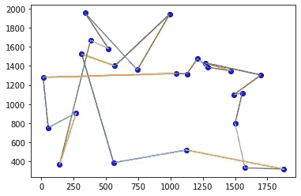

# 数据科学中被忽视的工具:遗传算法(python 语言)

> 原文：<https://levelup.gitconnected.com/an-overlooked-tool-in-data-science-genetic-algorithms-in-python-e40d10afe9c6>

你可以在一天内学会的强大的优化算法绝对值得添加到你的数据科学武库中。


# 介绍

令我惊讶的是，我们今天在人工智能中使用的算法有多少是受生物系统的启发。顾名思义，遗传算法就是一个例子。从本质上来说，遗传算法是一种优化算法，它将“适者生存”的概念应用于我们问题的解决方案，而不是生物物种。

在本文中，我将对遗传算法背后的概念进行一个直观的概述(如果你曾经上过生物课，希望你不会花超过几分钟的时间来掌握)，然后我们将从头开始用 python 实现一个遗传算法来解决[‘旅行推销员’](https://en.wikipedia.org/wiki/Travelling_salesman_problem)问题。

如果您刚刚开始学习遗传算法，并希望一口气完全掌握它们，我建议您打开 python 编辑器，使用此页面分割屏幕，并在阅读概述部分后一节一节地浏览代码。你也可以在这里找到这个项目的[](https://gist.github.com/mohdabdin/09242eb84af9f04c1271fe110c5e5378#file-ga-py)**的完整代码。**

# ****遗传算法的高级概述****

**简而言之，遗传算法试图通过使用适应度来获得问题的最佳解决方案，该适应度确定解决方案有多好，并应用“最适合的生存”来帮助我们获得该解决方案。**

****

**图 1，流程图**

**我们从个体(解)的初始群体开始，每个个体都有相应的适应值。**

**基于适应值，我们从群体中选择“2”个个体，并应用交叉来产生新的解决方案。**

**如图 ***图 2*** 所示，通过在解决方案中选择一个随机点并交换来完成交叉。**

****

**图 2，单点交叉**

**突变是另一种可以应用于个体以增加群体多样性的算子。变异只是翻转部分解，如图 ***图 3*** 所示。**

**新的解决方案现在被添加到新的群体中。**

****

**图 3，突变**

**选择->交叉->变异的过程一直进行，直到我们填充了一个新的种群，然后这些步骤重复多次迭代，或者直到我们满足了我们的问题。**

**伪代码可能会给你一个更好的想法:**

```
population = initialize_population()
i=0
while i<100 {
    evolved_population = []
    while evolved_population<population_size{
        compute fitness & select parents from current population
        perform crossover -> mutation
        add new solution to evolved_population
    }
    population = evolved_population
    i=i+1
}
return the solution with the highest fitness from the final population
```

# **用遗传算法解决“旅行商”问题**

## **导入和超参数**

**我们将从导入开始，你会看到我们为什么使用下面列出的每一个库。我们还初始化了我们的超参数，就像机器学习算法一样，这些值是任意的，找到它们的最佳值是另一篇文章的主题。但是让我们检查一下每个超参数:**

*   ****人口规模(POP_SIZE):** 这是我们希望每一代拥有的候选解的数量。在我们的例子中，人口中的每一个人都是推销员将要走的路线。**
*   ****迭代次数(N_ITER):** 基本上是返回我们的解之前我们将经历的代数。每一次迭代都有一个不同的群体，这个群体应该比前一个群体有更好的整体适应度。**
*   ****精英主义因子(ELITISM_FAC):** 如前所述，选择父母为下一个群体繁殖是概率性的，因此有可能丢弃具有最高适应性的个体。Elistism 确保了最优秀的个体(在我们的例子中是 10 个)被自动传递给下一代。**

## ****问题****

**一个销售人员想穿过几个城市回到起点城市，所以我们想找到一条他能走的最短距离的最佳路径。**

**现在用代码编写旅行推销员问题，这里我们定义了一个类对象 **travelingSalesman()** 我们设置了我们想要访问的城市的数量和范围。我们假设我们的城市使用 **(x，y)** 坐标绘制在 2D 图上。xy_range 是沿 x 和 y 轴的最大距离，所以我们在随机整数生成器中使用这个值来随机化我们城市的坐标。**

**接下来，我们必须开始定义我们的遗传算法将使用的核心函数:**

**首先， **generateRoute()** 方法生成一条随机路径。这可以简单地通过重新排列城市列表来完成，路线被定义为一个大小为 25 的列表，其中每一项都是一个城市的元组，因此它们的排序定义了我们要走的路线，所以简单地重新排列城市列表给了我们一个随机化的路线。我们将用它来初始化我们的人口。**

****getDistance(route)** 使用毕达哥拉斯定理返回给定路线在路线列表中每个相邻城市之间的距离。最后，因为我们希望销售人员返回到他出发的城市，所以我们使用 if 语句来检查我们是否在路线的最后一个城市。**

****计算适合度(路线)**适合度是我们试图优化的指标，因此，由于我们试图找到距离最短的路线，所以适合度可以定义为距离的倒数。我使用值 100，000 作为命名者，而不是 1，只是因为这样更容易阅读适应性值，所以我们将得到 2.4，而不是 0.000024，但它们都是一样的。**

## **形象化**

**最后，对于我们的 **travelingSalesman()** 类，我们将添加这两个函数来给我们一个网格和路线的可视化。**

**在 **plotCities()** 中，我们只是用 matplotlib 将城市标为‘蓝色 O’。在 **plotRoute(route)** 中，我们在我们的城市之间绘制线条，以查看我们正在走的道路。我没有花时间实际编号这些线，但它仍然应该是一个有用的可视化，你会看到优化的路径看起来更干净。这是我们的基线图:**

****

**你可能注意到了，这并不是一条有效的途径。我们从这里得到的距离大约是 25，000。**

## **选择**

**既然我们已经完成了问题的编码，我们可以从遗传算法开始。首先，我们定义一个选择函数，该函数接受群体，这里群体是一个数据帧，其中一列是实际的个体(解决方案)，第二列是对应于每条路线的“适合度”。**

**我们将使用轮盘赌技术来选择父母，这些父母将被提供给我们的交叉函数，并返回一个新的个体用于下一代。**

**轮盘赌是通过定义一个概率分布来应用的，因此适应度越高，我们选择那个个体的机会就越高。这是通过迭代适应度列表并将每个适应度值除以适应度和来完成的，这样我们的概率分布总计为 1。然后，我们使用 numpy 的 random.choice 返回基于该分布的个人指数。**

## **杂交(育种)**

**这就是奇迹发生的地方，我们本质上是合并两个解决方案，给我们一个新的个体，它将被传递给下一代。**

**为了为我们的子解决方案创建染色体，我们从第一个父代中随机选取一部分，附加到染色体的第一部分(child1 ),并使用第二个父代中的城市填充染色体的剩余部分，条件是该项目不在我们的染色体中，因为我们不想在我们的路线中重复出现相同的城市，然后我们将这两部分相加以返回新的个体。**

## **我们模型的基线**

**现在我们可以开始把所有东西放在一起了。**

**我们首先初始化我们的 **travelingSalesman()** 对象，为了获得初始性能的基线，我们生成一条随机路线并使用我们之前定义的可视化函数，然后打印路线的距离。**

## **初始化群体**

**如前所述，此处的群体是一个包含 2 列的数据框架，一列用于解决方案/个体，另一列用于与我们的 **selectParents()** 函数所使用的每个个体相对应的适合度。**

**接下来，我们用随机路线的设定群体大小(POP_SIZE)填充我们的数据帧，并计算每条路线的适合度，并将其添加到“适合度”列。最后，我们在保留索引的同时，根据适合度对数据帧进行降序排序。**

## **实现遗传算法**

**最后，我们可以开始迭代寻找最佳解决方案。**

**我们初始化一个列表 evolved_pop，我们将使用 **crossover()** 函数填充它，直到它达到所需的 100 个种群大小，之后我们用新的进化种群替换以前的“解决方案”列，重新计算适应值并对数据帧进行排序。**

**精英主义在填充进化的一代之前被应用，使得我们的进化列表中的前 10 个值是来自先前群体的前 10 个解决方案。**

**在迭代过程之后，我们从我们的群体数据框架中取出具有最高适合度的解决方案，并将其作为我们的最终解决方案返回。**

## **结果**

**我们从大约 25，000 的总距离开始，我们的最终解决方案以大约 9，000 结束。我们也可以看看标绘的路径，它看起来更清晰，比随机的路径更有意义:**

******

优化前后的路线** 

# **结论和最终想法**

**总之，在这篇文章中，我们讨论了遗传算法及其应用，并用 python 实现解决了“旅行推销员”问题。我第一次接触遗传算法是在我的大学课程中，但并没有真正费心去完全理解它们的机制。在看到它们是如此简单易学，而且被证明是非常强大之后，我决定把它添加到我的“机器学习武库”中。遗传算法肯定有更多有趣的应用，例如使用它们来学习神经网络权重和超参数调整。这可能是我下一篇文章的主题。**

**如果你发现理解一个概念有任何困难，我的建议是摆弄一下[**代码，你可以在这里找到**](https://gist.github.com/mohdabdin/09242eb84af9f04c1271fe110c5e5378) 。希望你发现这篇文章有价值和快乐编码！:)**