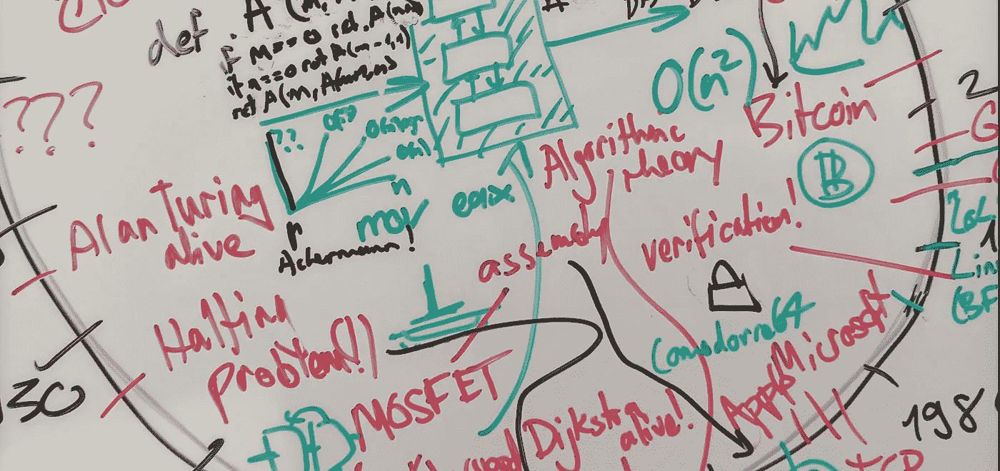

# 所有计算机历史的概述

> 原文：<https://levelup.gitconnected.com/an-overview-of-all-computer-history-a2a18aad71d7>

虽然原始计算机科学可以追溯到巴比伦时代，但直到 17 世纪和 18 世纪，随着机械计算器和机械化织布机的出现，工作计算机背后的一般概念才出现。在那之后，第一台计算机在 19 世纪早期被设计出来，但是从未被制造出来，它的想法仍然是一个新奇的想法。在 20 世纪 30 年代成为理论计算机科学的基础出现之前，一些特殊用途的计算设备在接下来的一个世纪里来来去去

在此之前，数学的基础在 19 世纪 80 年代取得了长足的进步，数字逻辑以图表的形式出现，它建立在 200 年前二进制数的基础上。从 19 世纪 80 年代到 19 世纪 30 年代初，数字逻辑不断完善，第一个物理门诞生了。只有使用二进制逻辑，数字计算机才能首先存在(我们忽略模拟计算机的发展，因为它们遵循完全不同的范式)

在 30 年代，思想被投入到计算方法中。正是在这个时候，我们看到了重要思想的发展，如停机问题、Lambda 演算和自动机理论，后者大多数是对计算机或计算机程序及其能力的最逻辑完整的描述。不同的逻辑系统导致了验证技术的出现，验证技术在 20 世纪 80 年代进入了舞台，在 20 世纪 90 年代达到了理论高度，对于验证软件和硬件系统的正确运行至关重要。考虑到这些系统会变得多么复杂，这是非常必要的。

从 30 年代到 40 年代的最终战争，计算机工程领域的技术进步在欧洲大陆受到压制，只有密码学例外，这门学科可以追溯到罗马时代。结果，计算机工业在美国起飞了，那里的研究项目致力于建造计算机(资金较少，另一个世界超级大国苏联在数学领域声名鹊起)。在 20 世纪 50 年代，从这些新的计算机中，用热离子管制造出了几台有影响的计算机。虽然第一个现代晶体管(MOSFET)是在 40 年代末制造的，但像热离子管一样，运行起来仍然很昂贵。晶体管实际上是导致计算机占据大空间的原因。

正因为如此，逆向计算的研究应运而生，以节省电费开支。它没有产生很大的影响。然而，它确实揭示了量子层面上宇宙本质的一些有趣特性，以及信息理论。正是在这里，物理学第一次与信息理论联系起来，这对量子计算机产生了影响。不久之后，在 50 年代的后半期，第一批 MOSFETs 使用光刻工艺制造出来，这使得计算机变得更小、更便宜，从而产生了计算能力更强的计算机，这些计算机现在才在给定的硬件下达到其最终的前沿。作为回应，摩尔定律和它鲜为人知的兄弟，库米定律在 60 年代出现。

计算能力的增长可能是 50 年代最重要的计算发展，现在被称为汇编程序。汇编程序是一种软件，它收集符号并把它们转换成设备应该执行的指令。其他汇编语言的发展在不久之后出现，以适应不同的指令集体系结构，这很快引起了对编程语言的研究。这些实际上只有一个目的:用越来越短的文本告诉计算机，做越来越多的事情，同时计算机和文本的作者犯更少的错误。带头冲锋陷阵的是女性，因为男性认为编程是微不足道的学科。

虽然直到今天，新语言的发展与所有其他发展是并行的，但计算机科学的理论知识在 60 年代达到了顶峰，那时计算机的许多基础都得到了发展，如算法复杂性。今天，许多人将这一学科视为计算机科学的典范。信息论和一个被称为算法信息论的奇怪领域在计算机科学的研究中也享有一席之地，这被证明在软件和电信的发展中有着广泛的应用。混沌理论出现在第一次模拟中，“洛伦兹吸引子”是第一个发现的(数学)混沌系统。

随着计算机的日益普及及其在学术界的影响，如 1976 年第一个数学“计算机证明”，计算机销售成为一种普遍的业务。随着 70 年代计算能力的降低，组织可以负担起他们自己的计算机，并订购它们用于簿记和琐碎的任务。然而，看到公司不愿意分享辛苦赚来的计算机研究成果，大量的企业出现了，他们建立自己的软件，甚至硬件，导致每个系统的工作方式与其他系统非常不同。这意味着任何时候计算机科学家离开一家公司，他们都必须在另一家公司从零开始学习新的架构。

这种计算不透明的主要驱动力是从 60 年代早期开始，随着时间的推移变得越来越普遍的操作系统。这种技术/想法允许计算机容纳多个程序，这意味着每台计算机有多个用户。虽然这是一个包含更多用户的运动，但计算机编程和工程的实践和理论学科仍然主要由数学家和工程师组成的神秘神职人员领导，他们的知识在 80 年代末之前大多是私人的。

所有列出的研究和商业领域继续享有重大的研究和投资，尽管硬件仍在发展。半导体工程越来越好，电信和信号处理也越来越好(如快速傅立叶变换，1965)。70 年代初，第一次有多台计算机相互连接，可以说创造了一个真正的“计算机网络”。1971 年带来了第一个无线网络。大约在这个时候，在阿帕网上发现了第一个计算机病毒，这标志着后来将在网络安全(安全研究的一个分支)中处理的事情的开始。

随着这些众多学科的不断发展，计算机现在足够便宜，理论上人们可以拥有单台计算机，如 1969 年出现的 Unix 机器。随之而来的是后来被称为“所有现代编程语言之父”的 c 语言的引入。它建立在出现在它之前的其他语言的基础上，其中大部分现在都是历史珍品。c 今天仍然被使用，主要是因为它对内存的管理是通用的，替换它是困难的。游戏机出现了。

有了 Unix，计算机现在可以由一个人使用，这意味着帮助人们自动化的软件变得更加普遍。这个时代的计算机公司，如 IBM 或 DEC，享有大量的成功。随着对计算机科学和软件自动化越来越好的理解，越来越新的机器可以被制造出来，让用户用越来越少的资源做越来越多的事情。70 年代中期，出现了两家最有影响力的计算机公司，微软和苹果，它们至今仍在运营并蓬勃发展。

随着工业 70 年代的结束，计算机网络现在将许多大学相互连接起来。许多其他提供非链接计算机服务的公司诞生了。尽管如此，兼容的软件很难得到。像伯克利软件基金会这样的组织允许某些实体将他们的软件用于教育目的。然而，这还不足以全面理解操作系统或程序是如何运行的。

在 80 年代早期，现在著名的 GNU 项目作为对此的回应而启动，它得到了一小群程序员的支持。该组织的中心信条是，软件，像许多书面文本一样，应该是自由的。GNU 的目的是创造出当时商业计算机可能拥有的所有软件，并使其 100%可供任何人使用。他们花了 8 年时间完成了第一个完全免费的操作系统，包括文本处理器、IDE、自己的文件系统、设备驱动程序、其他移植软件、游戏等。当它最终在 1990 年全部出版时，它是革命性的。这种操作系统被称为 Linux。

与此同时，互联网的发展惠及了每一个人:军人、学者、企业、学生、劳动人民。70 年代奠定了计算机网络的理论基础，而 80 年代将他们所学到的一切应用到大规模的跨洲网络中。当时最便宜的方式是通过电话线(即拨号上网)，因为它们已经作为电力传输媒体出现。

我们必须记住，在整个过程中，计算机的计算能力并没有停止增长。随着它们变得更加有效，从 80 年代初开始，计算机现在可以定制颜色选项。随着计算机行业争夺全球客户群，UI/UX 现在变得更加重要。苹果朝着这个目标大步前进，而微软更专注于计算的功能方面，为专业人士提供神秘的解决方案。

90 年代开始后，计算机历史的新时代到来了:互联网变得越来越普及。中产阶级家庭开始在家里拥有电脑。许多信息正在被数字化，如果你想使用不同的操作系统，你只需要使用 GNU 提供的操作系统。看到微软和苹果的成功，许多电脑公司都倒闭了，互联网变得更加流行。出现了三个主要的操作系统家族:(GNU) Linux，Windows 和 Darwin(以 MacIntosh 计算机的形式)。

随着对计算机器的广泛理解，量子计算出现在大学的物理学家角落，并被深入研究到足以引起网络安全(主要是理论上的)担忧:1994 年发明的肖尔算法，如果在物理上实现成本低廉，将能够破解 RSA 加密，危及每台计算机的安全。这是今天激发人们对量子计算兴趣的主要原因(比如在 IBM)，尽管结果至今仍不确定。

随着互联网的普及，新的软件服务出现了，它们与“互联网”连接，提供以前不可能提供的服务。因特网上信息交换的主要格式出现了，如 1991 年的 HTML，它带来了对在线服务的惊人投资。这导致了互联网泡沫(2000 年初破裂)，人们想象互联网会变得多么有利可图，同时夸大了它的实际价值。2000 年，一场有意制造的潜在灾难，在一切都进入新千年之际，给计算机工程行业蒙上了一层阴影。对于计算机化的世界来说，幸运的是，1999 年的西尔维斯特平静地过去了。

在进入 21 世纪之前，我们回忆一下搜索引擎的出现，谷歌是一个引擎的发电站，其 PageRank 算法现在已经扩展到更复杂的东西，其所有者是一个技术服务的庞然大物。社交媒体也在这个时候出现，它通过聊天甚至可能是声音和视频将(计算机)用户联系起来，如果有人购买了硬件的话。外行人远距离交流的方式开始改变。

随着互联网进入每个家庭，更多的服务出现了，这些服务使用了更多的计算能力。信息交换仍然是在纸上进行的，尽管这种情况在 2000 年代末会有所改变。随着公司升级他们的网络来处理越来越多的数据传输，在互联网上完成所有的事情只是一个时间问题。基于可靠数据传输的理论含义，分布式系统的研究本身成为一门正当的学科。边缘计算可能是其最著名的发明，对大规模数据库管理具有重要意义。

因为信息同时存在于许多地方，并且交换的信息没有形式化，所以本体工程作为一种控制信息和理解它与其他信息的关系的方法出现了。这不仅包括互联网上的信息，还包括存在于更大数据库中的信息，这有助于信息学专业人员统一他们的(信息)存储。尽管这是一个很有前途的学科，但它已经在 21 世纪初建立了最重要的本体论，因此，慢慢地变得默默无闻。然而，最终结果仍然被图书馆员和信息科学家使用。

不知从哪里冒出来的，苹果公司在 2004 年差不多同一时间决定进入手机市场。紧接着，谷歌也做了同样的事情:苹果现在与微软竞争，同时与谷歌争夺一个被认为正在增长的手机电脑市场。当 iOS(基于达尔文)和 Android(基于 Linux)作为一场几乎没有人知道正在发生的战斗的胜利者出现时，他们在这里可能已经或将要拥有的任何其他竞争对手都被消灭了。“应用程序”变得司空见惯。

从这里开始，物联网只是一个小小的概念跳跃，在这里，我们以前想象不到需要计算的东西将安装在无线微控制器上。随着通过 WiFi 的无处不在的互联网接入，在设备中安装电脑的想法似乎是一个好主意，因为人们可以读出他们一直在收集的数据，并对它们进行编程以远程处理事情，否则这将是非常无聊的。

在这几十年中，人工智能(AI)领域一直如此沉默、令人沮丧和亵渎神明，最终从 20 世纪 50 年代以来象征性(获胜)和统计性(失败)人工智能追随者之间的无声战争中抬起头来。随着硬件在计算上变得足够强大，足以解决随机过程和人工神经网络所需的计算能力，这些自 20 世纪 40 年代以来就已为人所知，统计人工智能人员似乎最终结束了这场冲突。有用的人工智能终于触手可及，并导致了一个尚未达到顶峰的行业增长。第四次工业革命即将到来。

我们在这里做一个回调，到 90 年代 GPU 的创建，它允许完全充实的 3D 世界/模型被有效地创建。这些设备被证明是神经网络存在的需要，而不管它们最初的预期用途。这就是高端游戏所需的 GPU 价格昂贵的原因:它们也被用于人工智能。

不管怎样，互联网已经变得足够普及，以至于一个网站显示不同程度的流量，发出“高峰”问题的信号，类似于电网的问题。在公司总部运行的一台计算机不足以处理突然增加的请求。因为仅仅为了处理“请求高峰”而购买许多计算机是不可行的，新计算机可以按需出租。人们可以通过容器来管理这些计算机，容器出现在 10 年代初，以适应计算机中心的发展。这是云的开始。

就在这个新的十年开始之前，最初几个不祥的互联网趋势第一次被注意和监控。人类仍然对这种新型的超物体感到高兴，创意人员正在为他们的手机和网站推出软件，以及软件的利基用途，通过手机中的一系列新传感器，可以修改这些软件来做任何可以想象的事情。任何人都可以并且愿意(在一定程度上)在网上发布他们想要的任何东西，包括一种新的货币形式，这种货币使用了从分布式系统研究、密码学(例如区块链)和边缘通勤中获得的知识。

2010 年是因为错误信息，是计算机历史上的黑暗时期。互联网是所有关于计算机讨论的焦点。网络攻击和安全变得越来越普遍，因为人们可以随时获取(大量)信息。这十年来，人们也清楚地意识到，从事间谍活动的政府跨越了私人住宅和国界，这对监控、隐私和国际关系产生了巨大影响。宣传从来没有像现在这样容易消除，尤其是使用人工智能或者至少是智能软件。

在整个 2010 年代，电脑变得越来越强大，手机也是如此。虽然在线游戏在 2000 年代中期达到了第一个高峰，但随着手机和电子竞技的出现，又达到了新的高度。随着许多免费游戏挖掘用户的信息，限制显然是必要的，以遏制隐私的损失，并试图控制隐私的损失。其他服务也这样做，这导致了 GDPR 和类似的倡议出现。

在这十年的后五年，互联网成为公司而不是人的地方，在那里自然人的行为被挖掘以获取利润，以及广告。机器人比比皆是，信息/数据成了当今的黄金。随着加密货币和这种新的“货币”范式的出现，采矿获得了新的意义。互联网迷因伴随着 90 年代互联网的传播而诞生，从 2010 年代开始使用特殊的 Impact 字体。总的来说，模因在“2016 年模因战争”中达到了一个奇怪的顶峰。

这场“战争”是用显示与当时美国大选相关的政治忠诚的模因进行的。唐纳德·特朗普(Donald Trump)被任命为美国总统，人们开始意识到社交媒体的危险，尽管社会学家在 2000 年代就已经知道了。这种形式的媒体仍然被认为是有害的，尽管我们很少有人能抵制它的诱惑。随着数据从计算机化的手机(现在每个人都拥有一部手机)中被处理，软件可以比自己更好地了解一个人的行为，并出于利润的原因而智胜人。互联网上的回音室甚至让普通人也开始互相攻击。

在 21 世纪 20 年代，COVID 向我们展示了互联网的优势，并加速了记者半个多世纪前所怀疑的工作和生活安排去中心化的趋势。随着大量的人突然被限制在家中，人们将注意力集中在他们以前只是在某个地方模糊听说过的事情上:在线金融行为变成了天真的痴迷，这加剧了财富不平等。然而，并非一切都不成功:自组织实体在此之前就已存在，但首次作为一种可能改变金融体系的运动出现:一场不协调但成功的做空特定股票的噱头就证明了这一点。

在我写这篇文章的时候，我想到了我的一些同事正在研究的进展。机器人技术(如波士顿动力公司所做的)以及无人机开发目前非常受欢迎，还有潜在的量子互联网或高科技神经网络的数学，它们可以生成与“真实”数据无法区分的“虚假”数据。人类和机器创造的东西之间的界限正在消失，因此不清楚互联网上有多少用户的人工制品是真实的:人工智能生成的人脸、声音、文本等。在这里，几乎不可能知道谁是人，谁是机器。

虽然仍然有可能与互联网断开连接，但随着时间的推移，这变得越来越困难。随着生物技术的进步，拒绝技术可能会变得越来越不可行，尽管看看用计算工具增强人体的非侵入性程序是否会受欢迎，而不仅仅是用可穿戴设备，这将是一件有趣的事情。有了电脑化的手表，以前被认为是人类的一切都电脑化的趋势从未像现在这样强烈。

说完，我合上笔记本电脑，放下手机，走到外面。我不戴任何手表。也许再过几十年，我们就可以坐在户外，享受阳光，然后计算机时代就会以某种方式向我们袭来，人类的新时代将再次开始。我们看看会发生什么。