# Apache NiFi 和工具包 CLI 部署概述

> 原文：<https://levelup.gitconnected.com/an-overview-of-apache-nifi-and-toolkit-cli-deployments-785978dbce3b>

> Apache NiFi 是一个用于通过拖放界面创建数据管道的工具，旨在自动化系统之间的数据流。它属于“*无代码/低代码*”类工具，主要面向那些不喜欢编写和管理代码或构建需要大量工程工作的解决方案的公司。

# NiFi 可以用来做什么？

NiFi 擅长在平台之间可靠地传输数据，例如 Kafka 到 ES，并允许您在此过程中执行一些轻量级 ETL。它可以丰富和准备数据，执行数据格式之间的转换，更改命名字段和过滤/路由数据到不同的位置。

但是，它不应该用于复杂的事件处理、分布式处理、连接、滚动窗口或聚合(它不是 Apache Spark，也不自称是！😎).因此，它不应该与 AWS EMR 等大数据处理工具或 Talend 等更灵活的开源 ETL 工具相比较。更合理的比较应该是在 [Apache NiFi 和 StreamSets](https://statsbot.co/blog/open-source-etl/) 之间。

NiFi 可以集成一些 AWS 服务，比如 S3、SNS、Lambda、SQS 和 DynamoDB。

如果您需要与流媒体服务集成，值得注意的是，对 Apache 产品 Kafka 的支持比 AWS Kinesis 更多。目前没有读取 Kinesis 数据流的能力，但有一个[公开公关](https://issues.apache.org/jira/browse/NIFI-2892)的变化！

# NiFi 术语

下面是一些特定于构建 NiFi 流的有用术语，它们将有助于理解本文的其余部分:

**流文件** —是数据，它由内容(数据)和属性(元数据键值对，例如“创建日期”)组成

**处理器** —将一组转换和规则应用于流文件，并生成新的流文件。Apache NiFi 声称有 280 多种处理器可供选择！示例包括 getKafta、getFTP、putKinesisStream、putHDFS、convertRecord、replaceText、validateCSV 等。

**连接器** —尚未由下一个处理器处理的所有流文件的队列。它定义了关于流文件如何被优先化的规则(哪些是第一个，或者被过滤掉，例如 FIFO)。连接器可用于负载平衡和重定向“失败的”流文件。

**控制器服务** —处理器使用的共享服务，例如 DB 连接、AWS 凭证、写入器和读取器，您可以在转换处理器中使用(仅举几例)。

**过程组**——充当抽象层，通常使用它们作为分解大型数据流的一种方式是一种良好的实践。

**模板** —如果您有一组处理器执行一些您想要重复和重用的逻辑，可以使用模板。例如，您希望与其他人分享的常用组件。

**输入/输出端口** —允许您将数据传入或传出远程进程组。

# 装置

安装非常简单，你可以通过这个[链接](https://nifi.apache.org/download.html)下载 nifi- <version>-bin.tar.gz 或者拉取、构建并运行 [docker 镜像](https://hub.docker.com/r/apache/nifi/)。</version>

# UI 和 NiFi 流

用户界面非常直观，使用简单。您将不同的组件从顶部横幅中拖到画布上，并相应地进行配置。你也可以在代码中写标签，有点像 JavaDoc！

下面是 UI 的图像，您可以在画布的中心看到一个处理组，您可以右键单击并“进入”它以显示其中的流程。

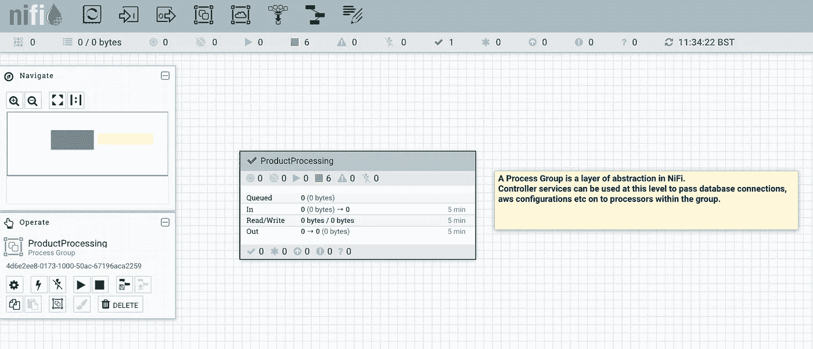

带有进程组的 NiFi 画布

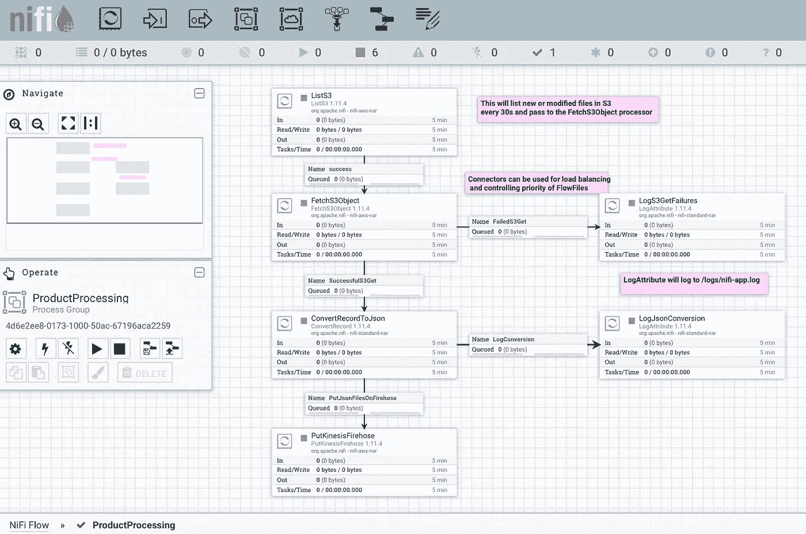

一个示例 NiFi 流:从 S3 读取，转换为 JSON，并写入 Kinesis Firehose

在这里，您可以看到处理器如何与连接器结合使用来处理数据流。失败的文件可以被重定向到其他路径，并被相应地处理/记录。不需要任何代码，这都是通过配置完成的。这个流在一个 S3 桶中列出 CSV 文件(要实现这一点，您需要一个 ListS3 和 fetchs 3 对象处理器的组合)，通过一个 LogAttribute 处理器记录任何问题，将文件转换成 JSON 并放到一个 Kinesis Firehose 流中。

在您的根安装 NiFi 目录中(例如“/Applications/nifi- <version>”)，状态存储在“/state”文件夹中(除非您作为集群运行，否则 Zookeeper 会存储它)。日志存储在“/logs”下，该目录由 LogAttribute 处理器使用。默认情况下，流保存在“/conf/flow.xml.gz”中，但是您可以通过编辑“/conf/nifi.properties”文件来覆盖此配置以及许多其他配置。</version>

NiFi 通过小书图标引导您进入文档(如果有)，例如下面的查看用法选项:

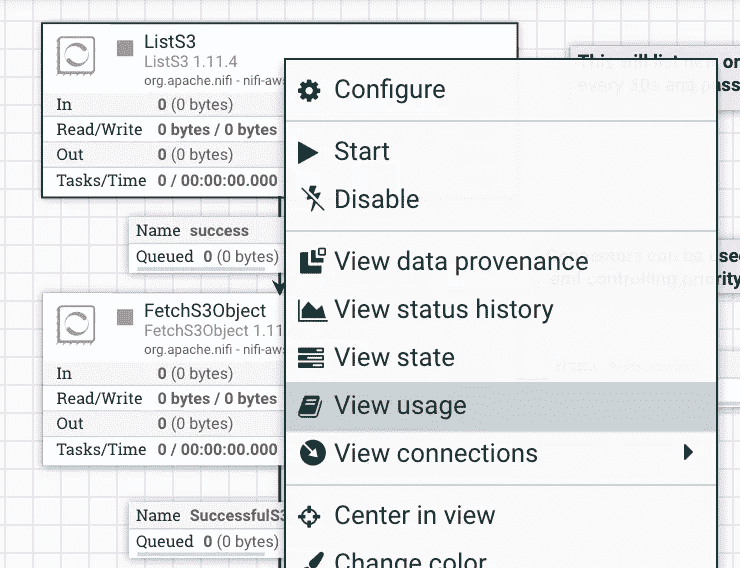

当向进程组添加控制器服务时，这也是可用的。

# AWS 连接

您可以创建一个 awscrdentialsprovidercontrollerservice(在流程组级别设置),以便在流程的多个组件中重用您的 AWS 凭据。指定凭据文件的位置，该文件规定了 AWS 访问密钥和秘密访问密钥，或者直接在控制器服务的属性中设置这些密钥。

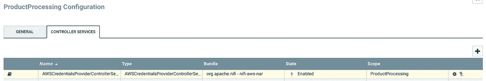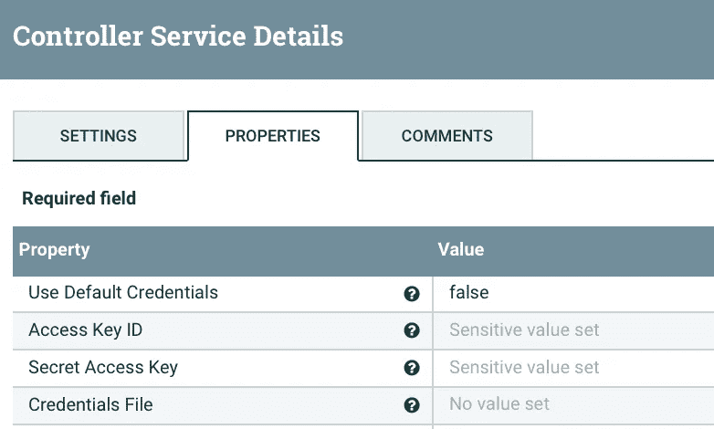

然后，您可以在需要 AWS 连接的处理器配置中引用此控制器服务，例如 PutKinesisFirehose 处理器属性。

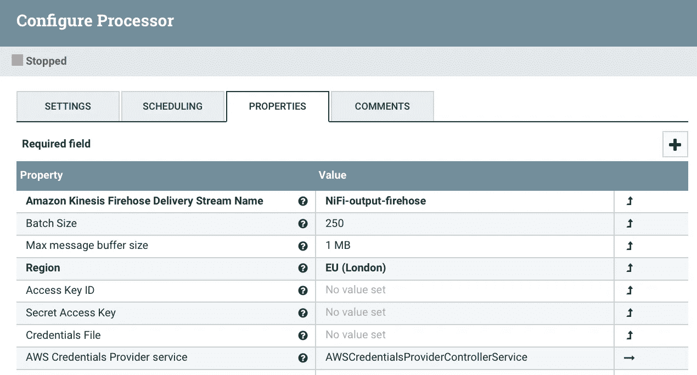

PutKinesisFireshose 处理器配置

需要停止正在运行的处理器，以应用任何更改，例如新的控制器服务或其他属性修改。

# NiFi 注册表

NiFi Registry 是 Apache NiFi 的子项目，旨在满足人们的部署和版本控制需求！它提供了一个中心位置来存储资源组流。在您的本地 NiFi 流中添加新的注册中心客户端之前，您必须首先使用注册中心 UI 创建一个“bucket ”(用于组织版本控制流)。本文:[NiFi-how-do-I-deploy-my-flow？](https://bryanbende.com/development/2018/01/19/apache-nifi-how-do-i-deploy-my-flow)有一些精心编写的步骤，详细说明了如何做到这一点。

> 你可以通过[这个链接](https://nifi.apache.org/registry.html)或者使用 [Docker](https://hub.docker.com/r/apache/nifi-registry/) 在本地下载注册表。

# NiFi 工具包和部署

该工具包提供了几个命令行实用程序来帮助在单个和集群环境中设置 NiFi。在研究部署选项时，我使用 cli 工具连接到 NiFi 注册表。

> 你可以通过[这个链接](https://nifi.apache.org/download.html)在本地下载工具包，或者使用 [Docker](https://hub.docker.com/r/apache/nifi-toolkit) 。

在您下载的工具包 bin 目录(例如/Applications/nifi-toolkit-version/bin)中，有一个“cli.sh”脚本，可用于启动交互式 shell。

对于 AWS 帐户的部署，我使用 terraform 创建了两个 EC2 实例([使用 m4.large 实例类型](https://www.batchiq.com/nifi-selecting-an-aws-instance-type.html))运行在同一个 VPC 中，一个安装了 NiFi，另一个安装了 NiFi Registry。NiFi 的简单 user_data 配置如下:

```
#!/usr/bin/env bash 
curl -fsSL https://get.docker.com get-docker.sh | sh 
sudo docker pull apache/nifi:latest 
sudo docker build -t apache/nifi:latest . 
sudo docker run --name nifi -p 8080:8080 -d apache/nifi:latest
```

….和 NiFi 注册表:

```
#!/usr/bin/env bash 
curl -fsSL https://get.docker.com get-docker.sh | sh 
sudo docker pull apache/nifi-registry:latest 
sudo docker build -t apache/nifi-registry:latest . 
sudo docker run --name nifi-registry -p 18080:18080 /
-d apache/nifi-registry:latest
```

这两个 shell 脚本都安装 docker，拉取、构建和运行最新的映像，并将默认的容器端口发布到实例。

> 对于我的 ami_id，我使用了 Ubuntu-focal-20.04-amd64-server 的社区版——这允许您在实例上安装 docker。

我已经在远程 NiFi 注册表中创建了一个 bucket(*“Leah ' s _ bucket”*)，并提交了一个流( *product_flow* )。现在，我想看看如何将它部署到远程 NiFi 实例…

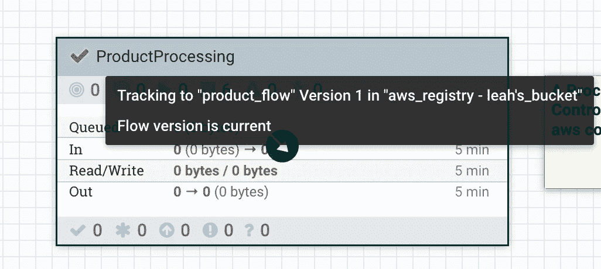

本地版本控制的进程组

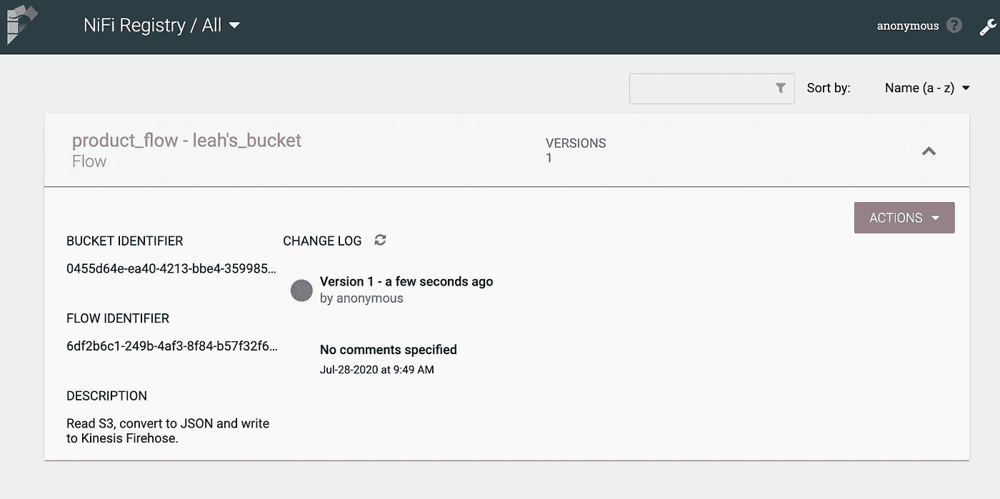

具有已提交版本化流的远程注册中心

一旦您启动了交互式 shell，您就可以使用几个 cli 命令来部署和启动一个版本化的流:

**首先，您需要在远程 NiFi 实例中创建一个新的注册中心客户端，例如:**

```
nifi create-reg-client --baseUrl http://<public_ip_of_nifi>:8080 \
--registryClientUrl http://<private_ip_of_registry>:18080 \
--registryClientName leah's_client
```

baseUrl 是对其执行命令的 Url(当我在本地机器上运行这些 cli 命令时，baseUrl 是 NiFi EC2 实例的公共 IP 地址—因为我是通过互联网连接的)。

> EC2 实例安全组被修改为允许来自我的本地机器的流量

registryClientUrl 可以引用 NiFi 注册中心的私有 IP——因为这两个 EC2 实例位于 AWS 中的同一个 VPC 内，所以可以相互通信！

registryClientName 是您希望这个注册表在 NiFi UI 中被调用的任何名称。

**接下来，我们需要通过从注册中心导入一个版本化的流程来创建一个流程组，例如:**

```
nifi pg-import --bucketIdentifier 0455d64e-ea40-4213-bbe4-359985de09f9 --flowIdentifier 6df2b6c1-249b-4af3-8f84-b57f32f6c5aa \
--flowVersion 1 --baseUrl http://<public_ip_of_nifi>:8080
```

bucketIdentifier 和 flowIdentifier 都可以在上面提交的版本化流的屏幕截图中找到，它们是唯一的。

这个 pg-import 命令为进程组(processGroupId)返回一个惟一的 id，您将在接下来的步骤中用到它！

**启用您正在使用的任何控制器服务，例如:**

```
nifi pg-enable-services --processGroupId 94a93dc0-0173-1000-fee3-442454b1ecd6 --baseUrl http://<public_ip_of_nifi>:8080
```

**然后您可以启动过程组，例如:**

```
nifi pg-start --processGroupId 94a93dc0-0173-1000-fee3-442454b1ecd6 --baseUrl http://<public_ip_of_nifi>:8080
```

您应该能够在 UI 中看到新部署的进程组正在运行！

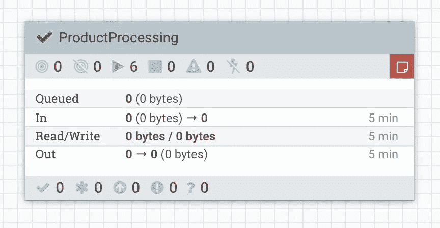

可以编写这些命令的脚本，以提供更加自动化的部署方式。

> 如果您需要在您部署的 NiFi 流中设置变量，请查看[这个链接](https://pierrevillard.com/2018/04/09/automate-workflow-deployment-in-apache-nifi-with-the-nifi-registry/)了解更多细节。

# 使用 Apache NiFi 时需要考虑的事项

*   单元测试——对于大多数“低代码”解决方案，单元测试从来都不容易，而且经常被忽视😢。NiFi 提供了一种使用 [TestRunner 类](https://nifi.apache.org/docs/nifi-docs/html/developer-guide.html#testing)测试单个处理器的方法，但是没有方法测试一个进程组。[本文](https://touk.pl/blog/2019/01/10/testing-nifi-flow-the-good-the-bad-and-the-ugly/)讨论了测试应用程序的困难，并介绍了他们为测试完整流程而创建的库。
*   审查代码——由于流代码格式是 xml，因此很难通过代码审查工具检测到对流文件的微小但有潜在影响(例如连接器负载平衡变化)的修改。这里您需要一个相当严格的审查过程，并考虑在 UI 中查看流配置历史(下图)。注册表提供了一种控制代码版本的方法，因此您可以在将它提升到另一个环境之前，在本地检查配置。

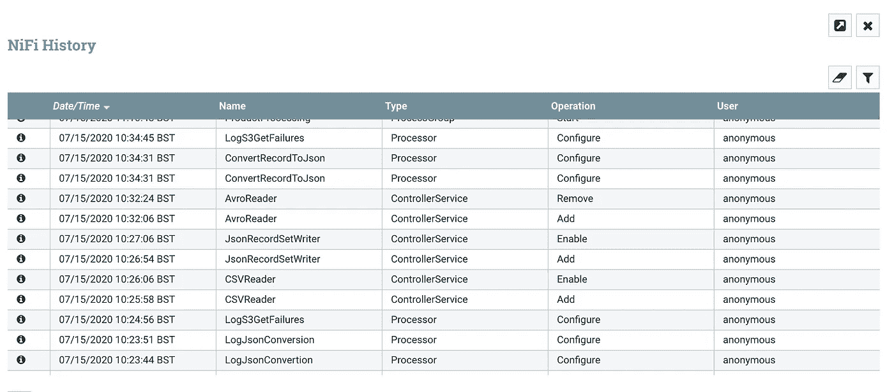

流程配置历史

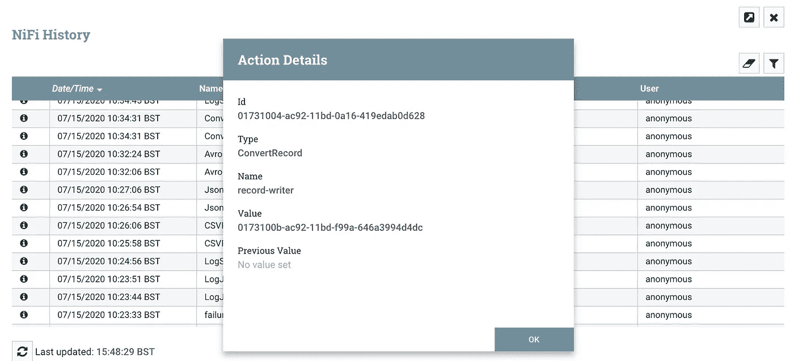

组件的流程配置活动详细资料

感谢阅读我的 Apache NiFi 之旅！我希望你已经发现它有用😊