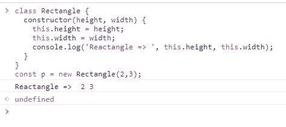
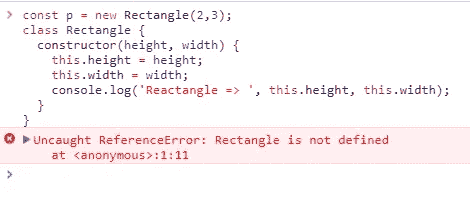
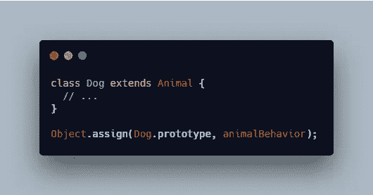

# JavaScript 中的类概述

> 原文：<https://levelup.gitconnected.com/an-overview-of-classes-in-javascript-1414dda962d1>


照片由[迈克·肯尼利](https://unsplash.com/@asthetik?utm_source=unsplash&utm_medium=referral&utm_content=creditCopyText)在 [Unsplash](https://unsplash.com/search/photos/coffee?utm_source=unsplash&utm_medium=referral&utm_content=creditCopyText) 拍摄

在本文中，我将讨论 JavaScript 中的`class`。我们将讨论以下主题:

1.  课程突出显示
2.  提升
3.  子类化/继承
4.  混合蛋白
5.  Getters 和 Setters

*更多类似的内容，请查看*[https://betterfullstack.com](https://betterfullstack.com/stories/)

# 课程突出显示

**ECMAScript 2015 中引入的 JavaScript 类**，主要是 JavaScript 现有的基于原型的继承的语法糖。类其实只是一个**特殊函数**。

定义类的一种方法是使用`**class**` **声明。**

示例:

```
class Rectangle {
  constructor(height, width) {
    this.height = height;
    this.width = width;
  }
}
```

类表达式是定义类的另一种方式。类表达式可以是命名的，也可以是未命名的。

示例:

```
// unnamed
let Rectangle = class {
  constructor(height, width) {
    this.height = height;
    this.width = width;
  }
};

// named
let Rectangle = class Rectangle2 {
  constructor(height, width) {
    this.height = height;
    this.width = width;
  }
};
```

类的主体在 [**严格模式**](https://developer.mozilla.org/en-US/docs/Web/JavaScript/Reference/Strict_mode) 下执行。

**构造函数**方法是一种特殊的方法，用于创建和初始化用类创建的对象。

`**static**`关键字定义了一个类的静态方法。静态方法是类本身的函数，不能使用`this`关键字从类实例中调用。它们必须在类本身上被调用—例如，`Rectangle.area(x, y)`。

# 提升

**函数声明**和**类声明**的一个重要区别是函数声明被[提升](https://developer.mozilla.org/en-US/docs/Glossary/Hoisting)而类声明没有。这是什么意思？

这意味着您需要首先声明您的类，然后访问它。



使用没有错误类

否则，如下代码将抛出`Uncaught ReferenceError`。



错误类别使用

# 子类化/继承

在*类声明*或*类表达式*中使用`[extends](https://developer.mozilla.org/en-US/docs/Web/JavaScript/Reference/Classes/extends)`关键字来创建一个类作为另一个类的子类。

类扩展类

如果子类中有一个`constructor`，那么在使用`this`之前需要先调用`super()`。

您还可以从函数中扩展:

使用函数扩展

在扩展常规对象的情况下使用`Object.setPrototypeOf()`:

使用 o `bject.setPrototypeOf() sample`

`[super](https://developer.mozilla.org/en-US/docs/Web/JavaScript/Reference/Operators/super)`关键字用于调用超类的相应方法。这是没有糖的严格基于原型的遗传的一个优势。

课堂上的晚餐

# 混合蛋白

据[维基百科](https://en.wikipedia.org/wiki/Mixin)。

> 在面向对象编程语言中，mixin(或 mix-in)是包含供其他类使用的方法的类，而不必是这些其他类的父类。

我们用普通的方法创建一个对象，并把它作为 mixin 模板。

混合样本

通过使用这种方式，你也可以从一个类扩展并包含 mixin 在一起。



狗是动物的延伸，包括动物行为混合

我们也可以通过使用`class`来同时应用许多混音。

通过 2 个混合样本继承

# Getters 和 Setters

类还允许您使用 getters 和 setters。

为您的属性使用 getters 和 setters 可能是明智的，特别是如果您想在返回它们之前或者在设置它们之前对值做一些特殊的处理。

要在类中添加 getters 和 setters，使用`get`和`set`关键字。

示例:

setter 和 getter 示例

# 摘要

使用`class`给我们的实现带来了一些好处，比如更简单的语法，更少的错误，更容易建立继承层次，以及通过使用`super.method()`更简单地调用父原型。

我希望这篇文章对你有用！可以跟着我上[[3]:Javascript mixins](https://medium.com/@transonhoang#a-mixin-example </p><p id=)[https://developer . Mozilla . org/en-US/docs/Web/Javascript/Reference/Classes # Mix-ins](https://developer.mozilla.org/en-US/docs/Web/JavaScript/Reference/Classes#Mix-ins)

[](https://gitconnected.com/learn/javascript) [## 学习 JavaScript -最佳 JavaScript 教程(2019) | gitconnected

### JavaScript 是世界上最流行的编程语言之一——它随处可见。JavaScript 是一种…

gitconnected.com](https://gitconnected.com/learn/javascript) [](https://betterfullstack.com/stories/) [## 故事-更好的全栈

### 关于 JavaScript、Python 和 Wordpress 的有用文章，有助于开发人员减少开发时间并提高…

betterfullstack.com](https://betterfullstack.com/stories/)