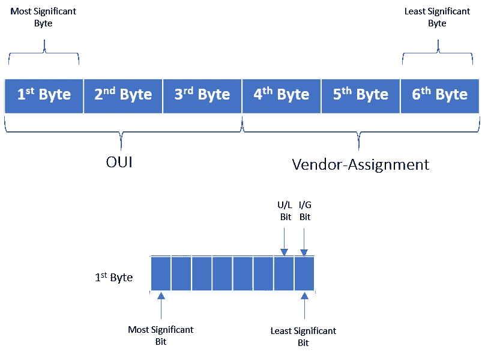

# MAC 地址:简要概述

> 原文：<https://levelup.gitconnected.com/an-overview-of-mac-addresses-a32ff0b1818b>

## 什么是 MAC 地址，为什么我们需要它

不溅

1983 年，计算机网络与今天完全不同。陆地拓扑的一个显著区别是可切换集线器还没有发明出来。这意味着网络上的许多或所有设备经常共享一个冲突域。

# 冲突域

冲突域是这样一种情况，当一个设备向网络发送消息时，包括在其冲突域中的所有其他设备都必须注意它，而不管它是否以它们为目的地。冲突域是一个网段，一次只能有一台设备发言。这导致了一个问题，因为在两个设备同时发送它们的消息的情况下，将会发生冲突，导致它们等待并一次一个地重新发送它们各自的消息。如果两台计算机同时通过电线发送数据，这将导致代表 1 和 0 的电流发生字面上的冲突，使最终结果难以理解。以太网作为一种协议，通过使用一种称为*载波侦听多路访问与冲突检测* (CSMA/CD)的技术解决了这个问题。CSMA/CD 用于确定通信信道何时畅通以及设备何时可以自由传输数据。CSMA/CD 的工作方式实际上非常简单。如果网段上当前没有数据传输，节点可以自由发送数据。

如果结果是两台或多台计算机试图同时发送数据，这些计算机会检测到冲突并停止发送数据。然后，在尝试再次发送数据之前，所涉及的每个设备会等待一段随机的时间间隔。这个随机间隔有助于防止所有参与冲突的计算机下次试图传输任何东西时再次发生冲突。当一个网段是冲突域时，这意味着该网段上的所有设备都会收到整个网段上的所有通信。这意味着我们需要一种方法来识别传输实际上是针对哪个节点的。这就是所谓的*媒体访问控制*地址或 MAC 地址发挥作用的地方。

# 什么是 MAC 地址？

*媒体访问控制*或 MAC 地址是附加到单个网络接口的全球唯一标识符。它是一个 48 位数字，通常由六组两个十六进制数字表示。MAC 地址中的每组数字都是一个二进制八位数。MAC 地址分为两部分。MAC 地址的前三个八位字节称为*组织唯一标识符*或 OUI。这些由 IEEE 或*电气和电子工程师协会*分配给各个硬件制造商。人们总是可以通过网络接口的 MAC 地址来识别其制造商。MAC 地址的最后三个八位字节可以按照制造商喜欢的任何方式分配，条件是他们只将每个可能的地址分配一次，以保持所有 MAC 地址的全球唯一性。

以太网使用 MAC 地址来确保它发送的数据既有发送传输的机器的地址，也有传输的目标机器的地址。这样，即使在作为单个冲突域的网段上，该网络上的每个节点都知道流量何时发往它。

# 单播、多播和广播

当一台设备向另一台设备传输数据时，这称为单播。单播传输总是只针对一个接收地址。在以太网层，这是通过查看目的 MAC 地址中的特殊位来实现的。如果第一个二进制八位数(也称为 ***)中的最低有效位(目的地址的个人/组* (I/G)** 位)被设置为零，这意味着以太网帧仅用于目的地址。

这意味着它将被发送到冲突域中的所有设备，但实际上只有预期目的地会接收和处理它。

例如，MAC 地址的***4A****-30–10–21–10–1A*转换为二进制时的第一个八位字节:

这里，第一个二进制八位数的最低有效位是 0。因此，以太网帧只用于一个目的地址。如果目的地址的第一个二进制八位数的最低有效位设置为 1，这意味着它是一个组播帧。例如，当组播 MAC 地址的第一个八位字节***01****–00–0C-CC-CC-CC*转换为二进制时:

类似地，多播帧被设置到本地网络信号上的所有设备。不同的是，除了它们自己的硬件 MAC 地址之外，每个设备将根据标准来接受或丢弃它。可以将网络接口配置为接受为此类通信配置的多播地址列表。第三种类型的以太网传输称为广播。以太网广播会发送到 LAN 上的每一台设备。这是通过使用称为广播地址的特殊目的地来实现的。以太网广播地址为***FF-FF-FF-FF-FF*T3。使用以太网广播是为了让设备能够更好地相互了解**

# 全球与本地

MAC 地址可以是*全球管理地址* (UAA)或*本地管理地址* (LAA)。通用管理地址由制造商唯一分配给设备。网络管理员将本地管理的地址分配给设备，覆盖已烧录的地址。

通过设置地址第一个二进制八位数的第二个最低有效位来区分通用管理地址和本地管理地址。该位也被称为 **U/L** 位，是*通用/本地*的缩写，用于标识地址的管理方式。如果该位为 0，则地址是统一管理的。如果为 1，则该地址是本地管理的。在示例地址***06–00–00–00–00–00***中，第一个八位字节是 06(十六进制)，其二进制形式是 00000110，其中第二个最低有效位是 1。因此，它是一个本地管理的地址。