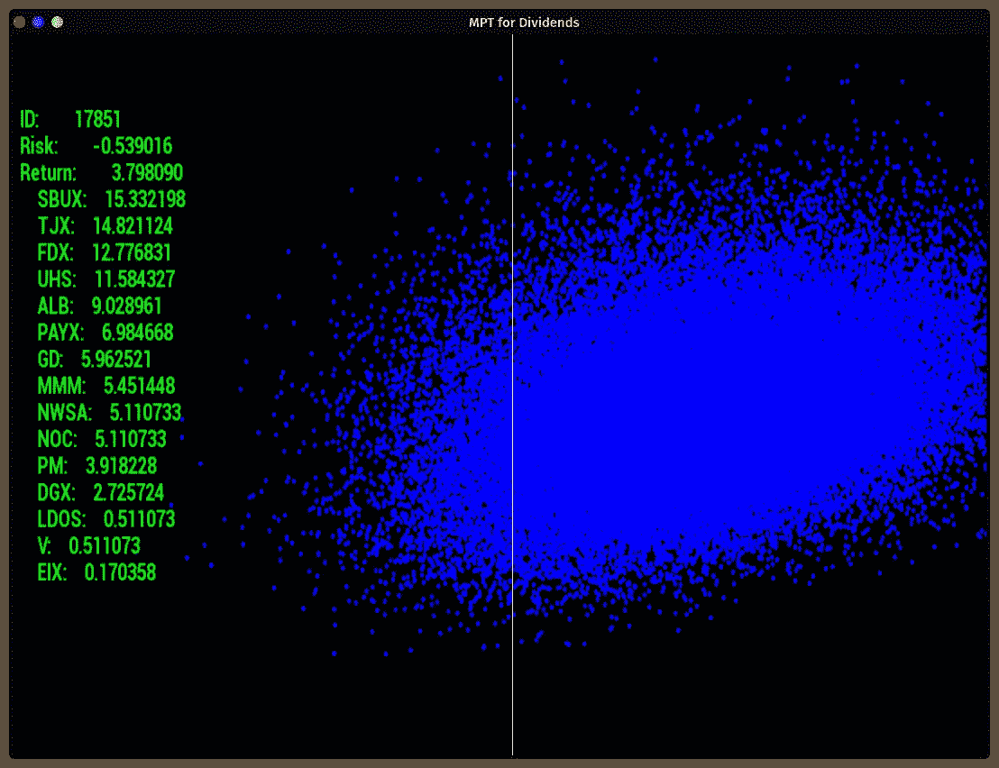
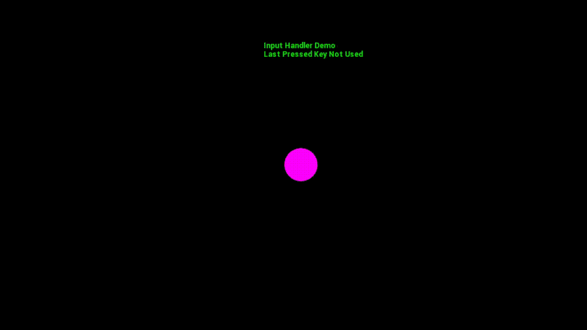
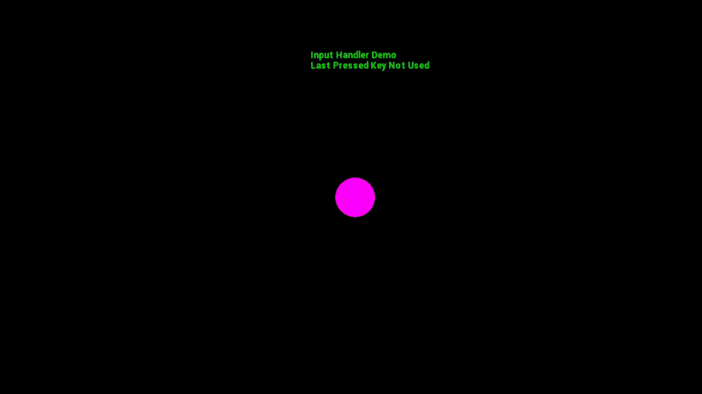

# 使用 C++ Lambda 函数的 SFML 输入处理程序

> 原文：<https://levelup.gitconnected.com/an-sfml-input-handler-using-c-lambda-function-d011157d2907>

*支持我的内容通过* [*成为中等会员*](https://anthony-a-morast.medium.com/membership) *或者了解更多关于* [*有效*](https://amzn.to/3NH9BZl)*[*现代*](https://amzn.to/3NGXtY7)*[*c++*](https://amzn.to/3mBMy6m)*开发(亚马逊附属链接)。***

**传统上，当处理计算机图形应用的输入时，例如用户界面、视频游戏等。使用越来越长的 switch 语句来确定哪个键被按下或释放，或者哪个鼠标按钮被点击。最近，我用 C++创建了一个用户界面，使用 SFML 绘制了我最近关于现代投资组合理论的博客文章中的观点，以便更容易地查看数据(我知道我可以用 Python 来做这些，但我想学习 SFML 已经有一段时间了)。在这个过程中，我发现了一个有趣的解决方案，使用一组 *std::maps* 和 lambda 函数来处理用户输入。在这篇文章中，我将通过一个简单的演示来介绍这种输入处理方法。**

****

# **演示**

**为了便于演示，我们创建了一个简单的二维 SFML 应用程序。这个应用程序在屏幕中间画了一个圆。用户可以使用箭头键移动圆圈(玩家)。可以使用数字键盘移动摄像机，包括对角线。加号和减号用于放大和缩小，按下 Escape 键可以关闭窗口并结束演示。此外，鼠标输入的一个例子是为鼠标左键添加一个回调函数，当鼠标左键被按下时，如果光标在 player 对象内，一条消息将被打印到屏幕上。**

**演示的大部分代码如下所示。在这篇文章的结尾提供了完整的代码。**

# **λ表达式**

**Lambda 表达式是在 C++11 中引入的，并且已经找到了许多实际的用例。本质上，Lambda 表达式允许开发人员将 C++函数视为变量，这比传递指向函数的指针要干净得多。Lambdas 是许多其他编程语言的一个特性，包括 Python 和 Java，并且已经成为许多类型的问题解决方案的支柱。我不会在这里详细介绍 lambda 表达式的基础知识，但是感兴趣的读者可以在[这篇文章](https://towardsdatascience.com/c-basics-understanding-lambda-7df00705fa48)或者从 [C++文档](https://en.cppreference.com/w/cpp/language/lambda)中了解更多。**

**在我们的例子中，我们将每个回调函数定义为一个 lambda 表达式，将它们存储在一个 map 中，并在需要时调用它们(即当相应的按钮被按下时)。**

# **功能参数**

**可能会想到的一个直接问题是:我们将如何处理不同输入可能需要的不同参数？很简单。创建一个类 InputCallbackParameters，它保存所有回调函数需要的所有参数。这样做的好处是为每个回调创建一个通用的函数定义，因此输入处理类可以非常通用。由于这个类会很快变得很大(内存方面)，我建议尽可能通过*引用*或 [*常量引用*](https://stackoverflow.com/questions/2627166/what-is-the-difference-between-a-const-reference-and-normal-parameter) 来传递它，这样就不会在复制对象上花费太多的计算资源。**

**在演示中，InputCallbackParameter 类非常小**

**该类将有四个可公开访问的成员:**

1.  **一个指向 SFML 窗口的指针，用来更新窗口和决定某些游戏参数。注意，这必须是一个指针，因为 sf::Window 类是不可复制的。**
2.  **最后按下的键。这用于处理需要多次连续按键的输入。**
3.  **“播放器”，实际上只是一个 sf::CircleShape，即一个围绕屏幕移动的圆圈。**
4.  **一个 bool 值，用于存储当鼠标左键单击屏幕上的任何位置时，播放器是否被单击。**

# **InputHandler 类**

**使用这个回调参数类，可以定义和实现输入处理类。**

**正如这里所看到的，这个类有三个私有映射，它们保存了从键盘/鼠标按钮到 lambda 回调函数的映射。lambda 回调必须被定义为 C++函数对象(std::function)。语法概括为**

> **标准::功能< <return type="">( <parameter list="">)> ></parameter></return>**

**因此，我们的 lambda 函数将不返回任何内容(void ),只接受一个参数，parameter，它被定义为 InputCallbackParameters 类，或者是对一个参数的引用。**

> **使用 PARAMETER = InputCallbackParameters &；**

**InputHandler 类中还有 5 个方法，其中 3 个方法用于将键/函数对添加到三个映射中的每一个，另外 2 个方法用于查找要执行的适当函数，前提是按钮/键被按下。实现如下所示。**

**InputHandler 类的实现非常简单明了。在 Initialize*方法中将键/函数对添加到适当的映射中，并根据 GetCallback 方法的参数从适当的映射中提取回调。然后执行这些功能来完成所需的动作。**

# **处理事件**

**通常，事件处理是在图形应用程序的循环中完成的。这是通过下面的代码完成的。**

**如此处所示，处理了 KeyReleased、KeyPressed 和 MouseButtonReleased 事件，并使用 InputHandler 类的一个实例( *ih* )来检索和执行回调函数。**

# **单按钮释放**

**最简单的情况是当用户按一次键时处理输入。这些事件被称为按键释放事件，因为按键事件是在按键被按下(即被按住)时发生的。可以说最有用的单个按键是关闭窗口的退出键(否则关闭 SFML 应用程序就太麻烦了)。因此，我们将首先实现这个回调。**

**Escape 键回调很容易处理，只需用 sf::Keyboard::Escape 键和一个 lambda 函数初始化 InputHandler 中的 key released 事件来启动窗口关闭事件。这里有一个演示，虽然不是很精彩(以后的演示会更精彩一点)。**

****

# **按键(按住键)**

**其他有用的功能是通过按下(或按住)键来启动的。比如移动角色，移动相机，放大缩小。如果用户每次移动角色时都必须按下并释放按键，这种行为将会非常令人讨厌。所有这些都在下面的键绑定中实现。**

**上面，数字键盘键 1、2、3、4、6、7、8 和 9 用于移动相机(绘制的对象保持静止)，箭头键用于移动角色(圆形)，加减键分别用于放大和缩小。下面是演示。观察“上次按下的键”文本的变化，以查看正在执行的操作。**

## **变焦**

****

## **相机移动**

****

## **角色移动**

****

# **顺序按钮组合**

**接下来，需要多次按键的动作被添加到 InputHandler 中。请注意，这些是连续的按钮按下。不幸的是，这种方法不能处理同时按下按钮的情况，尽管可以把它们看作顺序按下按钮来代替。为了演示这一点，如果按下“C”键，然后按下“Y”、“R”、“B”或“G”中的一个，将会改变玩家的颜色，分别改变为黄色、红色、蓝色或绿色。**

**如果在 Y、R、G 或 B 键之前立即按下 C 键，此逻辑会将播放器的填充颜色更新为指定的颜色。**

## **演示**

****

# **鼠标点击**

**最后，鼠标左键点击功能将被初始化，如果玩家圈被点击，该功能将在屏幕顶部添加文本。如果在玩家当前不在的地方点击屏幕，文本将被清除。**

**此方法依赖于 LocalContains 方法，如果 sf::Vector2f 参数在 sf::CircleShape 参数内部，该方法将返回 true。sf::Vector2f 参数是单击鼠标左键时鼠标指针的位置。**

## **演示**

****

# **结论**

**在这篇文章中，我介绍了一种使用 std::map 对象和 C++11 Lambda 表达式处理鼠标和键盘事件的方法。这个方法可以扩展到处理滚轮事件和这里没有明确提到的其他键。虽然并不完美，但我觉得这种实现是标准的 300 行 switch 语句或更短的 switch 语句的一种受欢迎的替代方式，它具有许多不同的功能来实现所需的功能。**

# **完整代码**

## **主页面**

## **InputHandler.cpp/hpp(包含 InputCallbackParameters 类)**

## **生成文件**

## **机器人字体 TTF**

**为了编译和运行代码，需要一个***font/roboto _ bold . TTF***文件。Roboto 字体可以从[谷歌](https://fonts.google.com/share?selection.family=Roboto:wght@900)下载。**