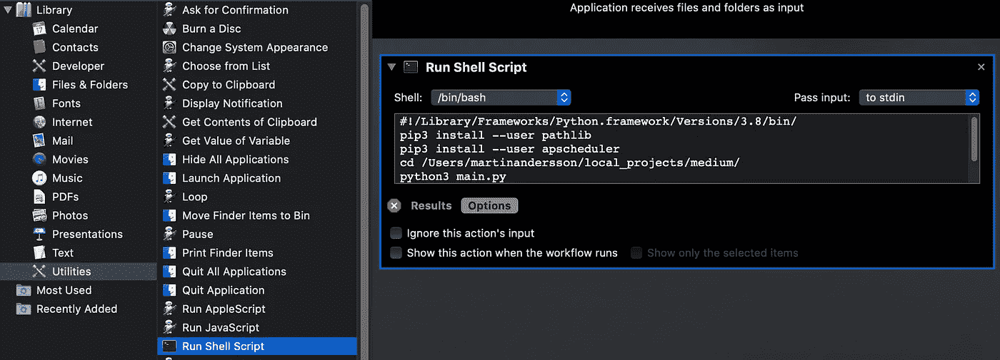

# 用 Python 编写清理程序的未过滤之旅

> 原文：<https://levelup.gitconnected.com/an-uncensored-timeline-of-writing-a-cleanup-python-project-cee4ea728541>

## 从构思到完成的混乱过程，展示了开发过程背后的想法


照片由[像素](https://www.pexels.com/photo/person-looking-searching-clean-2371/?utm_content=attributionCopyText&utm_medium=referral&utm_source=pexels)的[地形](https://www.pexels.com/@gratisography?utm_content=attributionCopyText&utm_medium=referral&utm_source=pexels)拍摄

嗨欢迎来到混沌！不是不受控制的混乱，而是从想法到产品的路径。在这篇文章中，我想尝试一些新的东西。通常情况下，文章会经过润色和微调，为您提供一份食谱。代码及其背后的所有工作都经过过滤和清理，因此您不会被幕后进行的所有思考所干扰。

如果你能从未经过滤的时间线中获益会怎样？代码背后的思想才是真正重要的吗？文档将指导你，并给你一个函数能做的所有事情的总体概述。你知道使用它的所有方法吗？你知道如何走出错误吗？并不总是这样，我相信观察别人是如何思考的，尤其是他们是如何改正错误的，这很有价值。

当你看一个 youtube 教程，身体前倾看别人如何改正错误时，你不讨厌吗？相反，他们剪切视频，说“那么…现在它工作了，让我们继续吧”

加入我从纸上到屏幕的旅程，我会告诉你我所有的错误，以及我如何从 A 到 b。

通过包括所有的谷歌搜索，试验和错误，以及草图，我希望你能够了解我的过程。

想法→研究→初始代码→重构代码

如果你通读这篇文章，偶然发现一些糟糕的代码或可怕的错误，请让我知道。请务必通读一遍，这样你就可以看到我是否一路修正了错误。如前所述，本文的大部分内容都是关于试错的。

这篇文章是为初学 Python 的程序员而写的，但是任何人都应该能够从中有所收获。最终结果是一个工作程序，但是与操作系统的集成可以更好。我们会回来的。

## 让旅程开始吧…


来自 [Pexels](https://www.pexels.com/photo/brown-road-sign-on-pavement-near-mountain-2009968/?utm_content=attributionCopyText&utm_medium=referral&utm_source=pexels) 的[马克·尼尔](https://www.pexels.com/@mark-neal-201020?utm_content=attributionCopyText&utm_medium=referral&utm_source=pexels)的照片

# 开始打扫(。py)

> 老实说，你真的有时间手动清理文件夹吗？

每当我开始一个新项目，我做的第一件事就是试图找到程序的范围。我的程序到底应该让**做什么**？什么问题应该由**来解决**？

在这种情况下，我想创建一个程序，将清理文件夹。像*下载*或*桌面*这样的文件夹会很快变得杂乱。老实说，你真的有时间手动清理文件夹吗？

有几个功能可以应用于清理程序。这里有一些很快在纸上勾画出来的想法。


在这个最初的草图之后，我决定采用文件扩展名→文件夹的方法。这意味着该程序将寻找文件扩展名，并创建与扩展名同名的文件夹。它会将文件移动到相应的文件夹中。

```
# make the script run on intervals. Once per day maybe?# go to folder# loop through files# create folders based on file type# move files to corresponding folder# (sort with subfolders on month ?)# (additional options on what to do with the files?)
```

伪代码帮助我规划出代码中的各个部分。一次专注于一个问题比试图一口气创造出一个成品更容易。即使你像这样列出功能，也不意味着你需要按时间顺序来解决它。

对我来说，让脚本自动运行并不是目前的首要任务。如果我没有一个可以运行的程序，让它自己运行是没有意义的。

这是我们期待的最终结果:


# 文件和文件夹

当我查看我的伪代码时，很明显我需要查看如何访问磁盘上的文件并使用它们。

使用 Python 浏览磁盘上的文件已经做了一百万次了，所以我很有信心有一个专门的库。我也相信谷歌搜索就能给我所有我需要知道的信息。


没过多久，谷歌就给出了正确的搜索词

第一次点击把我带到…你猜对了——stack overflow。

下面是我去搜索的线程的链接:目录中的[文件](https://stackoverflow.com/questions/10377998/how-can-i-iterate-over-files-in-a-given-directory)

投票最高的答案在他/她的代码中包含以下内容:

```
import os
for filename in os.listdir(directory):
```

从这个回答中我能读到的是`os`会帮助我们完成任务。方法`listdir()`用于列出目录(文件夹)中的内容。但是我并不喜欢仅仅获取和使用这些信息。既然我知道操作系统可以帮助我们，我想更多地了解`os`本身。我通常会做以下事情:

1.  去 python.org 看文档
2.  使用`os`上的终端阅读文档
3.  去 geeks for geeks([www.geeksforgeeks.org](http://www.geeksforgeeks.org))找例子

操作系统文档位于此处:[操作系统文档](https://docs.python.org/3/library/os.html?highlight=os#module-os)

使用终端简要查看文档:


寻找关于“操作系统”的文档


享受阅读文档的乐趣

最后，在 geeks 上为极客们阅读一些好例子:[操作系统例子](https://www.geeksforgeeks.org/os-module-python-examples/)

到目前为止，我已经研究了如何攻击伪代码中的两个要点:

```
# go to folder
# loop through files
```

## 循环浏览文件

我在我的 Mac 上创建了一些随机文件，所以我有一些数据要处理。我确保我有多种文件类型。


初始代码:

这里是输出，正如我所料。


## 调整可读性

我不得不承认我是一个打印的家伙…我知道我不应该依靠打印来解决代码问题，但是我喜欢它给我即时反馈的方式，我可以完全控制它。有了 python3 的格式，设置起来真是一件乐事。

下面是重构后的代码，这样我就可以看到发生了什么:

这让我更容易阅读。


对于我的程序，我将删除`.DS_Store`文件。根据您的操作系统和设置，您可能会遇到一组不同的规则。

## Python 关键词？

现在我正在处理文件，我开始想我是否必须小心，这样我就不会在代码中错误地使用 python 关键字。比如说`file`是不是一个 python 关键字？

如果您想知道是否使用了 python 的任何关键字作为变量名，您可以运行以下代码(或者阅读在线文档):


## 创建文件夹

我们拿到文件了。现在，我们希望基于文件类型创建文件夹。

`os`有一个模块叫`path`,`os.path`有一个模块叫`os.path.splitext()`。我最近在发表了另一篇文章后了解到这一点，文章中一些程序员同事建议使用`splitext()`。我想在真实案例中尝试使用它。

让我们用它来创建我们想要的子文件夹。我必须弄清楚如何不创建一个已经存在的文件夹。

代码抛出一个语法错误:

```
return ([file for file in os.listdir(directory)] if file != '.DS_Store')^SyntaxError: invalid syntax
```

一个愚蠢的语法错误，应该很容易修复。我似乎放错了我的`)`，在我想排除`‘.DS_Store’`的时候把`]`落在了列表理解的后面。

```
return ([file for file in os.listdir(directory) if file != '.DS_Store'])
```

修复它会将我带到下一个错误。这个错误更有趣。

```
os.mkdir(get_ext)TypeError: mkdir: path should be string, bytes or os.PathLike, not tuple
```

为了更好地理解错误，我将它分解并隔离问题。由于错误与`mkdir`有关，我需要看看我正在尝试做什么。这个错误还告诉我它想要一个字符串，而不是一个元组。那么，是什么创造了元组呢？

我之前写的函数`def strip_file_ext(file_input)`，就是做这个的。如果我仔细观察我的输出，我可以看到这样一行:

```
found file extension: ('project_registration', '.mov')
```

看，这就是为什么我喜欢在实际编码时在代码中使用 print。❤️

当我们分解它时，我们可以看到它打印的行。我们有一个返回元组的函数。首先，它返回`filename`，然后返回`extension`。因为我们想要创建扩展名为的文件夹——在本例中是`mov`,所以我们需要找到一种方法来做到这一点。如果我们打印 get_ext[1],我们得到:

```
successfully created .mov folder
```

我不想在我的文件夹名中出现点号，所以我开始想办法解决这个问题，我想这是其他人在我之前做过的事情，所以我又开始了搜索。我的发现是什么？大多数答案只涉及如何完全移动扩展。我们已经知道了。

*   我可以在`get_ext[1]`上使用`replace()`
*   我可以用`strip()`去掉`.`
*   我可以调查一下`pathlib`

当我处于必须决定如何前进的位置时，我喜欢尝试一下。以下是对他们所有人的测试:

```
import os
from pathlib import Pathfile_string = 'somefile.txt'
print (os.path.splitext(file_string)[1].replace('.' , ''))print (os.path.splitext(file_string)[1].strip('.'))check = Path(file_string)
print(check.suffix.strip('.'))
```

它输出我们想要的东西:


如果你不能决定选哪个，你可以用数学来支持它。使用计时器检查哪个代码运行时间更长。也许这能帮你做决定:


希望阅读这篇文章的人会指出一个来源，在那里我可以读到如何获得不带点的扩展名。这些至少是你可以做到的一些不同的方法。由于`pathlib`对我来说是新的，我想试着用它继续前进。我对 os 给我的东西很满意，但是我决定尝试一下这个后缀，以便更好地了解它。

这段代码根据文件扩展名为我们创建文件夹。它无法检查文件夹是否存在，所以是时候做更多的挖掘了。


我需要研究的代码是这样的:

```
if get_ext not in check_existing_folders:
    os.mkdir(check_folder + get_ext)
    print (f'successfully created {get_ext} folder')
```

我想做的第一件事是检查类型。

```
print (type(get_ext))
print (type(check_existing_folders))<class 'str'>
<class 'generator'>
```

那个 get_ext 是一个字符串，我在创建它的时候就非常确定。os.walk 是一个发电机。首先想到的是转换成列表。如果我对照列表中的字符串检查单个字符串，我可能会成功。你可能不能直接把它转换成一个列表。让我们试一试。

通过运行两次，我们可以检查它是否工作。


您可以看到它如何列出文件夹:

```
('/Users/martinandersson/local_projects/clean_up/txt', [], [])('/Users/martinandersson/local_projects/clean_up/pdf', [], [])('/Users/martinandersson/local_projects/clean_up/png', [], [])('/Users/martinandersson/local_projects/clean_up/mov', [], [])
```

在做了一些研究之后，我了解到 os.walk()返回一个元组。极客对极客的解释很好:

[os.walk()解释](https://www.geeksforgeeks.org/os-walk-python/)

当我需要更深入地挖掘新的东西时，我会创建一个新文档并专注于那一件事。下面是我写的一些测试代码，看看是否有办法在创建文件夹之前完成文件夹检查。

我使用 list comprehension 来获取元组的第 0 个元素，并创建一个新的列表来检查目录。

一个敏锐的观察者已经开始认为我会遇到巴布亚新几内亚和巴布亚新几内亚等问题。所以我会用。lower()在进行检查之前将 png 转换为 PNG。

以下是更新后的代码:

代码已更新，但仍然出现同样的错误。我需要检查我的 if 语句是否有效。我还需要检查循环本身，因为它在 mp4 上丢失了。这里似乎发生了几个问题。调试时间到了。

```
FileExistsError: [Errno 17] File exists: '/Users/martinandersson/local_projects/clean_up/png'
```

## 将所有事情分解到最低限度

经历了很多挫折后，我需要打破它。显然有些事情我没有完全理解。我把`main()`减到绝对最小。

```
def main():
    check_folder = '/Users/martinandersson/local_projects/clean_up/'
    list_folders = list(os.walk(check_folder))
    for folders in list_folders:
        print (folders)
```

输出给了我一个想法。`os.walk()`列出给定路径中的所有目录及其子目录。我已经在前面的文档中读到过这一点。我只是选择了错误的方法。目录列表就在那里！只要我们从中吸取教训，犯傻也没关系😉


第一行清楚地显示了我可能要寻找的是元组的第二个索引。那里的列表包含所有的目录。我错过了这么简单的事情吗？

```
def main():
    check_folder = '/Users/martinandersson/local_projects/clean_up/'
    list_folders = list(os.walk(check_folder))
    **list_folders = list_folders[0][1]**
    for folders in list_folders:
        print (folders)
```

这也意味着有一个非常简单的方法来访问当前文件夹中的文件。如果我将代码改写成这样，我可以遍历文件并尝试再次创建文件夹:

## 重构重新开始

此时，稍微重构一下代码是有意义的。有了这个新发现，一些部分变得没用了，而另一些部分变得干净多了。我做了以下工作:

*   杀了`function list_files()`
*   创建了一个新功能，可以检查文件夹/目录和文件，`list_content(path, return_type)`
*   扒下`main()`重新开始。

回到起点肯定感觉有很多工作要做，但是这里发生了一些重要的事情。

1.  我现在明白 os.walk()的用法了
2.  我对代码进行了重构，使之成为我认为最有利于程序通用性的部分
3.  有了重构，我应该能够在没有任何严重错误的情况下编写剩下的部分。

是时候回到创建文件夹了。我将再次查看文件的扩展名。如果没有该扩展名的文件夹，将会创建该文件夹。这段代码将通过一些打印来告诉我们结果，从而为我们做检查。

```
if get_ext not in list_content(check_folder, 'directory'):
    print (f'no such folder. Time to create it.')
else:
    print (f'folder exists. Skipping...')
```


代码有效。现在是时候确保我们可以创建目录了。这不需要太多。

```
if get_ext not in list_content(check_folder, 'directory'):
    os.mkdir(check_folder + get_ext)
```


## 移动文件

我之前知道我可以使用`shutil`来移动文件。快速的谷歌搜索也会把我们带到几个有这种建议的网站。如果你想了解更多关于`shutil`的内容，可以查看 geeks 和 python 文档。

```
shutil.move((check_folder + file) , (check_folder + get_ext))
```

这一行就是移动文件的全部。我把它放在 if/else 语句之后，这样我们可以确保所有的文件夹问题都得到解决。


# 间隔运行

现在我们已经有了功能，我们需要弄清楚如何让它每天运行。谷歌搜索应该能让我们找到正确的方向。这里有一些文档:

[StackOverflow —调度器](https://stackoverflow.com/questions/22715086/scheduling-python-script-to-run-every-hour-accurately)

[调度程序—阻塞](https://github.com/agronholm/apscheduler/blob/master/examples/schedulers/blocking.py)

[StackOverflow —启动时执行脚本](https://stackoverflow.com/questions/29338066/mac-osx-execute-a-python-script-at-startup)

让调度程序运行非常简单。我将`main()`改写为`execute_folder_cleanup()`，并添加了这段代码块，以使动作每 20 秒运行一次

```
if __name__ == '__main__':
    scheduler = BlockingScheduler() scheduler.add_job(execute_folder_cleanup, 'interval', seconds=20)
    scheduler.start()
    print (f'scheduler started. Press Ctrl+C to cancel')
```

然后，我将 python 文件保存为 main.py。这样，每当文件运行时，它都会执行调度。如果我们现在执行 main.py，它将开始清理。

互动真的很有趣:


# 重构代码

程序运行，大家都很开心。我想对代码做的最后一步是重构它。

# 启动时运行

这个程序完全符合我们的初衷，最后一步是让它在我登录时运行。我不太喜欢这个函数，因为为了更好的控制，我宁愿自己执行清理脚本，但这可能是一个很好的教训。

一如既往，我们从健康的研究开始。我想先试试 shell 脚本版本。

将这个 sh 文件添加到登录项应该可以完成这个任务:

 →系统偏好设置→用户与群组→用户→登录项目


现在一些文件的重新安排和重新启动。手指交叉…

显然，交叉手指不起作用，所以我们需要做更多的挖掘。当我重新登录时，什么也没有发生，所以它看起来根本没有运行。在 StackOverflow 和其他网站、博客等等上寻找了很久之后，我尝试了以下方法:

*   chmod +x 文件，以确保它有适当的权限。
*   进入`get info`设置默认程序启动到终端
*   授予终端访问所有文件和文件夹的权限


现在运行了，但是没有用 python3 运行。在 sh 文件中用 python3 替换 python 也不行。

经过数小时的研究，我尝试创建一个. sh 文件来执行我的 python 脚本，我尝试使用。plist，让 Mac OS 用 Launch Deamon 启动它，我试了一下 Automator。

我决定再试一次，把 cleanup.sh 脚本从我的登录项中删除，重新开始使用 Automator。

在 Mac 上，您可以前往 Automator 并创建新的应用程序。然后使用实用程序→运行 Shell 脚本。

我试着运行与之前 shell 脚本设置相同的命令，但是它不能运行 python，当我将路径改为实际的 python 路径时，它找不到`pathlib`或`apscheduler`。

我运行过一次:



这使得脚本运行，我可以恢复到这一点:


难题的最后一部分是将这个脚本添加到登录项中，就像我们之前尝试的那样。

保存脚本并添加它，以便在登录时启动。

设置工作，但我不舒服的方式强行通过。我的下一步将是获得对我的环境的完全控制，并找出为什么`pathlib`和`abscheduler`没有跳出盒子。

# 最后

从想法到最终产品可能是一项艰巨的任务。不管你有多有条理，都会有一些混乱。有时候你知道自己想做什么，但不知道如何去做。这是研究阶段开始的时候，也是学习的最佳阶段之一。我们已经完成了这个演练，但是可以自由地做进一步的实验。


照片由 [Pexels](https://www.pexels.com/photo/photo-of-woman-standing-on-sunflower-field-3756168/?utm_content=attributionCopyText&utm_medium=referral&utm_source=pexels) 的 [Andrea Piacquadio](https://www.pexels.com/@olly?utm_content=attributionCopyText&utm_medium=referral&utm_source=pexels) 拍摄

我根据日期跳过了子文件夹。也许你想知道如何做到这一点。基于文件的所有者呢？如果你在办公室，也许你想创建`Bob-`或`Susan`用户文件夹(因为在美国，所有的办公室职员似乎都叫鲍勃和苏珊……)

## 如何？

做事情有很多不同的方法。仅仅因为你知道做某事的一种方法并不意味着没有其他选择。确保你通读了你能找到的所有不同方法的例子，并对如何进行下一步下了决心。你也可以依靠专家，在 StackOverflow 或脸书的群组上发布你的问题。

## 计划免责声明

这个项目远未完成，也不是它能达到的最好水平，但是本文的重点并不是最终结果。是关于去那里的路。你可能也注意到了这个程序并不是在所有的环境下都能工作。. tar.gz 文件呢？也许你想调查一下`suffixes()`等。为此。我希望这篇文章关注的是*思维过程*。

## 研究！

在这篇对我的项目至关重要的文章中，我没有谈到的一件事是寻找灵感。也许有人在你之前已经这样做了。当我写这篇文章时，我不想检查卡勒·哈尔登的清理脚本，以避免任何偏见。我知道他有一个非常好的分类清理脚本和一个正常工作的自动启动器。你可以在这里查看:

[桌面清洁器，第一部分](https://www.youtube.com/watch?v=HcZ3gS1Rgcs)
[桌面清洁器，第二部分](https://www.youtube.com/watch?v=LfxZMofHs_U)

如果你还没有订阅卡勒的频道，我建议你看看。一个非常好的，随和的家伙，有一些很好的编程技巧。

我本可以将 Automator 部分排除在本文之外，因为它相当不成功，但我想保留它，以表明有时您使一些东西工作，但您对它不满意，您应该从头开始。

## 最后的想法

请记住，在我们的 python 生涯中，我们都处于不同的阶段。我不是职业程序员。拥有解决问题的心态是这一切如此有趣的原因。学习方面是一个额外的收获，坐在那里学习某种课程是跨越临时终点线的一枚不错的奖牌。

请随时对文章提出反馈。我确信有很多程序员知道更好的方法来处理代码，或者我如何从 A 到 b。

感谢您的宝贵时间！

-M