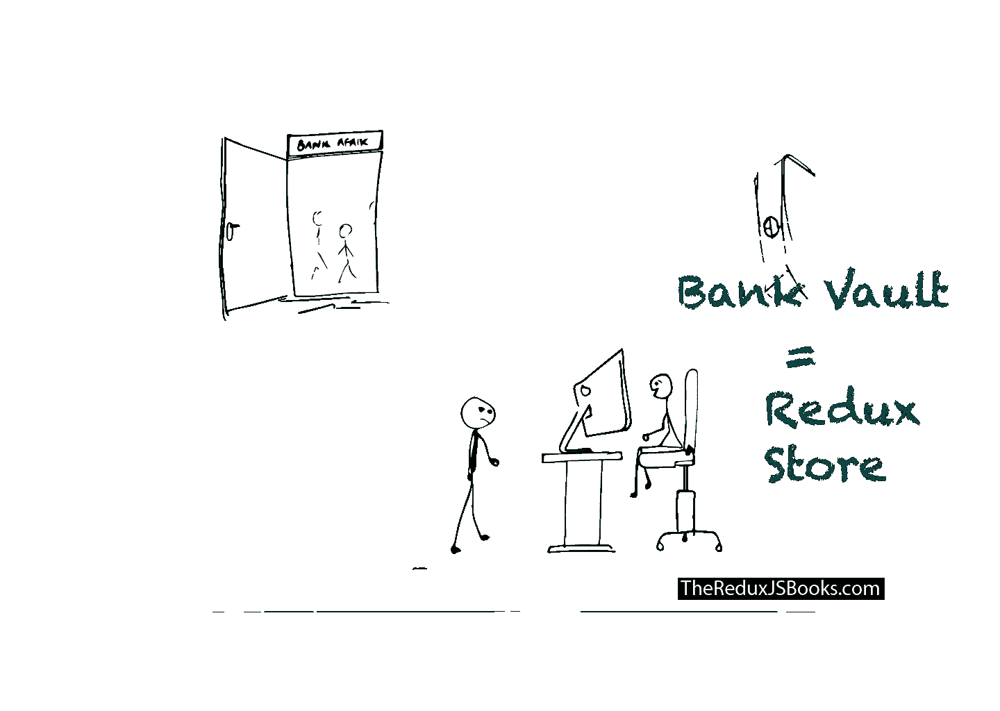
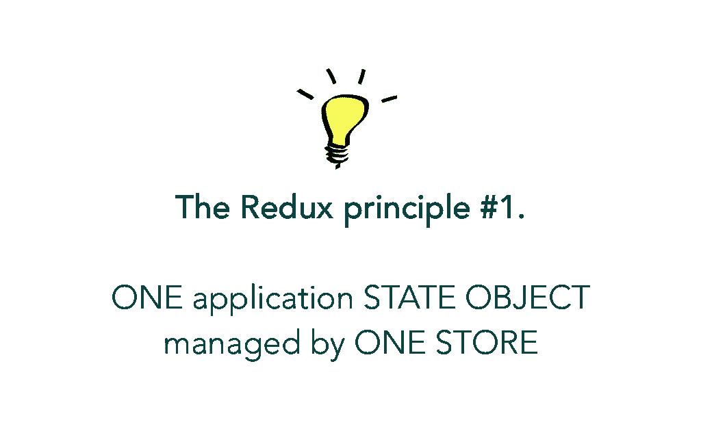
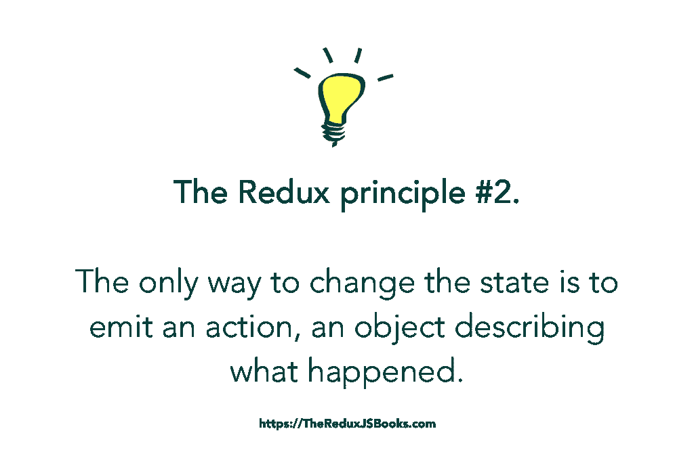
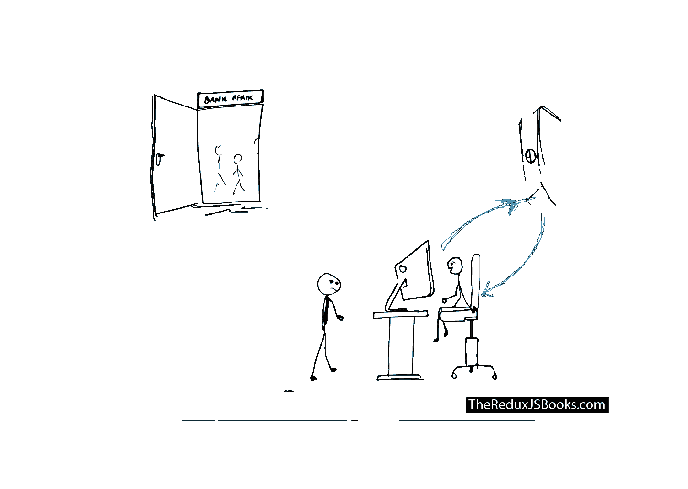
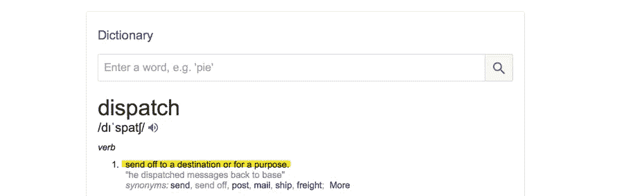
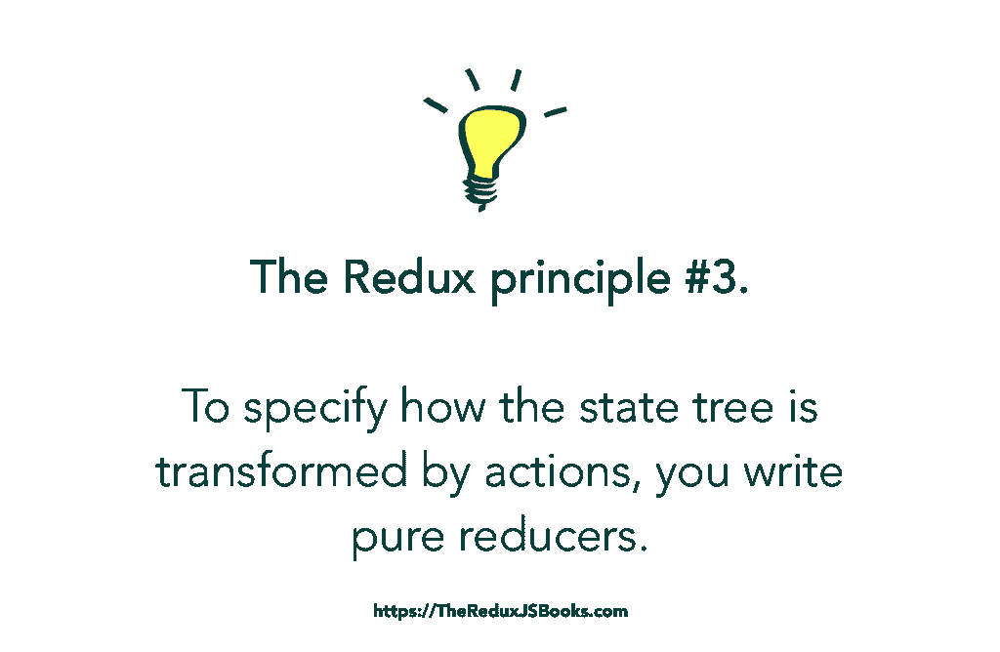

# 一个难忘的学习 Redux 的方法——可视化指南

> 原文：<https://levelup.gitconnected.com/an-unforgettable-way-to-learn-redux-f36afd38c966>


注意:这并不能解释 Redux 的全部——只是基本原理。

以下是学习 Redux 的可视化指南。一个侧重于核心 Redux 原则，用令人难忘的联想和自定义插图进行解释。

准备好了吗？

开始了。

考虑一个你可能熟悉的事件——去银行取钱。即使你不经常这样做，你也可能知道这个过程是什么样子的。


乔洋向银行走去——刚好只有 3 分钟的路程。

故事时间。

一天早上，你醒来，尽快去银行。去银行的时候，你脑子里只有一个**意图/行动**即 ***取钱*** *。*

让我们明确这一点。你想从银行提取一些钱。仅此而已。


乔洋去银行打算取些钱。

这就是事情变得有趣的地方。

当你进入银行时，你直接去出纳员那里提出你的要求，对吗？


年轻的乔在银行！他直接去见收银员，说出了他的要求。

等等，你去收银台了？

你为什么不直接去银行金库拿钱？


要是乔洋进了金库就好了。他会找到多少就带走多少。

毕竟是你的血汗钱。

好吧，就像你已经知道的，事情不是那样运作的。是的，银行的金库里有钱，但你必须与出纳员交谈，以帮助你按照适当的程序提取自己的钱。

收银员从他们的电脑上输入一些命令，然后把你的现金交给你。很简单。


这是你赚钱的方法。抱歉，不是金库里的。

现在，Redux 如何融入这个故事？

我们很快会谈到更多的细节，但首先是术语。

## 1.银行金库之于银行，犹如超市之于超市。



银行金库可以比作 Redux 商店！

银行金库把钱存在银行，对吧？

在你的应用程序中，你不需要花钱。相反，你的应用程序的状态就像你花的钱。应用程序的整个用户界面都是状态的函数。

就像银行金库将您的钱安全地存放在银行一样，您的应用程序的状态也由一个叫做 redux STORE 的东西来保证安全。因此，商店保持你的“钱”，即国家，完好无损。

呃，你要记住这个，好吗？

Redux 商店可以比作银行金库。它保存您的应用程序的状态，并保证它的安全。

这就引出了第一个 Redux 原则:

> 只有一个真实的来源:整个应用程序的状态存储在一个 Redux 存储的对象树中。

不要让这些话迷惑了你。

简单地说，使用 Redux，建议将应用程序状态存储在由 Redux 存储管理的单个对象中。这就像有一个金库，而不是沿着银行大厅到处扔钱。



## 2.带着一些行动的想法去银行。

如果你想从银行取钱，你必须带着某种取钱的意图或行动进去。

如果你走进银行，四处闲逛，没有人会给你钱。你甚至可能会被保安赶出去。悲伤的事情。

Redux 也是如此。

想写多少代码就写多少代码，但是如果您想更新 Redux 应用程序的状态(就像您在 React 中使用`setState`一样)，您需要通过一个动作让 Redux 知道这一点。

就像你通过正当程序从银行提取*你自己的钱*一样，Redux 也通过正当程序改变/更新你的申请状态。

现在，这导致了 Redux 原则#2。

> 状态为只读:
> 
> 改变状态的唯一方法是发出一个动作，一个描述发生了什么的对象。

用通俗的语言来说，这是什么意思？

当你走向银行的时候，你是带着明确的行动去的。在这个例子中，您想要提取一些钱。

如果我们选择在一个简单的 Redux 应用程序中表示这个过程，那么您对银行的操作可以用一个对象来表示。

看起来像这样的一个:

```
{ 
  type: "WITHDRAW_MONEY",
  amount: "$10,000"
}
```

在 Redux 应用程序的上下文中，这个对象被称为**动作！它总是有一个描述你想要执行的动作的字段。在这种情况下，`WITHDRAW_MONEY`**

每当您需要更改/更新 Redux 应用程序的状态时，您都需要分派一个动作。



先不要强调如何分派动作。明白原理说什么就行了。

以编程方式创建存储的方式如下:

```
import { createStore } from "redux"; //an import from the redux lib
import reducer from "./reducers" const **store** = createStore(reducer);//see the next section for how the imported reducer is created
```

## 3.出纳对于银行就像还原剂对于还原器一样重要

好吧，退后一步。

请记住，在上面的故事中，你不能直接进入银行金库从银行取回你的钱。不。你得先去见收银员。

好吧，你心中有一个行动，但你必须把这个行动传达给某人，即出纳员，而这个人反过来(以他们所做的任何方式)与存放银行所有资金的金库进行沟通。



收银员和金库沟通！

Redux 也是如此。

就像您让收银员知道您的操作一样，您必须在 Redux 应用程序中做同样的事情。如果您想要更新您的应用程序的状态，您可以将您的操作传递给 REDUCER——我们自己的收银员。

这个过程通常被称为分派动作。



Dispatch 只是一个英文单词。在这个例子中，在 Redux 世界中，它被用来表示将动作发送给 reducers。

减速器知道该做什么。在本例中，它将采取您的行动*取款*并确保您拿到您的钱。

用 Redux 的话说，你花的钱就是你的状态。所以，你的 reducer 知道该怎么做，它总是会返回你的新状态。

嗯。这并不难理解，对吧？

这就引出了最后一个 Redux 原则:

> 为了指定状态树是如何被动作转换的，你需要编写纯 reducers。

随着我们的继续，我将解释“纯”减压器的含义。现在，重要的是要理解，要更新应用程序的状态(就像你在 React 中使用`setState`一样)，你的动作必须总是被发送(分派)给 reducers 以获得你的新状态。



## 不要在减速器内改变状态。

简单来说，缩减器就是一个函数，它接受`state`和`action`，并返回一个新的`state`

```
export default (state, action) => {
  return state;
};
```

当从减速器返回`state`时，有些事情可能会让你一开始就放弃。然而，如果你已经写了很好的`ReactJS`代码，那么你应该已经很熟悉了。

你不应该改变减速器中的`state`。相反，您应该总是返回状态的新副本。

从技术上讲，您永远不应该这样做:

```
export default (state=[], action) => {
  **state.push('new value');** return state
};
```

这是优选的:

```
export default (state=[], action) => {
  return **[...state, 'new value']**
};
```

我返回一个新的**数组，而不是改变从 reducer 接收到的状态。这个数组有前一个状态数组的所有值，还附加了*‘新值’***

感谢 ES6 传播运营商`[**...**state, 'new value']`

你写的每一个缩减器都应该是一个没有副作用的纯函数，即没有 API 调用或者更新函数范围之外的值。

明白了吗？

希望如此。

# 结论

通过这个类比，您现在应该知道最重要的 Redux 参与者是什么了:存储、REDUCER 和一个动作。

这三个角色对于任何 Redux 应用程序都是至关重要的。一旦你理解了它们是如何工作的，大部分工作可能已经完成了。

这是我的 Redux 书籍的摘录。如果你喜欢，去[看看](https://thereduxjsbooks.com)。

[](https://thereduxjsbooks.com) [## ReduxJS 书籍

### 您购买的每本书，我们都会免费送给印度、尼日利亚和突尼斯的一位支付不起书费的开发者

thereduxjsbooks.com](https://thereduxjsbooks.com) 

编码快乐！

*原载于*[*Zeolearn*](https://www.zeolearn.com/magazine/an-unforgettable-way-to-learn-redux-a-visual-guide)*。*

[](https://levelup.gitconnected.com)[](https://gitconnected.com/learn/redux) [## 学习 Redux -最佳 Redux 教程(2019) | gitconnected

### 8 大 Redux 教程。课程由开发者提交和投票，使你能够找到最好的重复…

gitconnected.com](https://gitconnected.com/learn/redux)