# 危险的注射

> 原文：<https://levelup.gitconnected.com/an-unwanted-injection-6a5b6bbc4582>

黑客如何窥视不安全的网络连接数据库


黑客+注入+数据库=问题

# 长期存在的问题

SQL 注入的攻击并不新鲜。自从网站第一次连接到数据库，它们就存在了。行为不端的黑客发现，他们有时可以操纵网站的 URL，访问不属于他们的数据。或者，如果他们努力工作，他们可以找到聪明的方法来破坏连接到网站的数据库中的数据，只需在查询字符串中传递一点 SQL。想象这样一个 SQL 语句被执行，由一个外来者发起攻击，简单地通过修补一个网站的动态 url。

```
select * from users; drop table users;
```

这两个声明，连续运行，将是灾难性的。噗！用户表被蒸发了。

如果这还不够可怕的话，根据 w3schools.com 的[，SQL 注入是…](https://www.w3schools.com/sql/sql_injection.asp)

> …一种可能会**摧毁你的数据库**的代码注入技术。
> …最常见的**网络黑客技术之一。
> …通过网页输入在 SQL 语句**中放置恶意代码**。**

我还要补充一点，SQL 注入可以通过类似于 [Postman](https://www.postman.com/) 的工具来实现，这些工具模拟 http 请求和响应。Postman 和其他类似的工具对于测试 API 端点是非常宝贵的，我们将在这里进行测试。


API 开发的协作平台

在这篇文章中，我们将使用 Postman 来制作我们自己的简单的 **SQL 注入攻击**在我们自己的一个**无保护** [节点](https://nodejs.org/) / [express](https://expressjs.com/) 基于 web 服务器的 [sqlite3](https://www.sqlite.org) 数据库上使用 [node-sqlite3](https://www.npmjs.com/package/sqlite3) npm 包。Express 是一个快速、无偏见、极简的 web 框架。我们将通过这个简单的攻击来更好地理解 SQL 注入是如何工作的。


快速简单的 web 服务器:Node.js + express

下面的 express web 服务器是在一个名为 **server.js** 和另一个名为 **utils.js** 的 JavaScript 文件中创建的，其中包含进行数据库查询的函数。在这里你可以看到定义的各种路线。下面的 **server.js** web 服务器代码基于 http 请求路由查询数据库。来自数据库的玩家数据被相应地返回。

server.js

上面的网络服务器演示可以在[这里](http://138.68.23.63:4060/)访问。可以把这看作一个简单的 API 端点，一个不太安全的端点。

**关注的行是 21 和 29** 。在这些行中，从 **utils.js 调用函数。**这些函数从 sqlite3 数据库查询返回数据。我们将一个数据库对象传递给该函数，并且，在 **getPlayerByEmail 的情况下，**我们还传递我们正在查询的玩家的电子邮件地址。该电子邮件地址直接来自发送到/ **playerByEmail** 路线的电子邮件值。

在 **utils.js** 中，我们可以看到每个函数中的底层 SQL 语句。 **getPlayers** 函数不接受来自外部的输入，但是 **getPlayersByEmail** 在下面第 16 行的 **const sql** 的模板文本创建中使用了直接**中传递的电子邮件字符串。它假设电子邮件字符串是有效且无害的。**

因此，让我们在网络浏览器中访问我们的路线。

如果我们在/ route 访问我们的 web 服务器，我们会得到预期的欢迎消息。这里没有数据库查询。

```
[http://138.68.23.63:4060/](http://138.68.23.63:4060/)
```

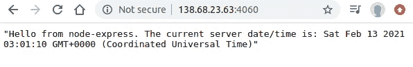

[http://138.68.23.63:4060/](http://138.68.23.63:4060/)

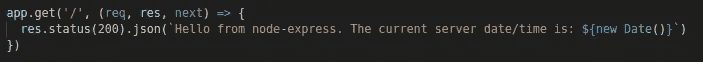

Hello / route，显示 web 服务器正在工作

接下来，我们访问**/玩家**路线，并从 [sqlite3](https://www.sqlite.org) 数据库查询中获得玩家的数组。看起来不错。

```
[http://138.68.23.63:4060/players](http://138.68.23.63:4060/players)
```

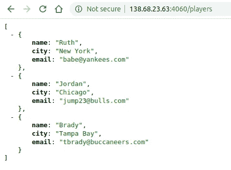

db 的玩家

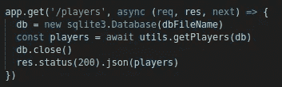

/players route in server.js

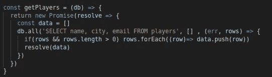

utils.js 中/players route 后面的 getPlayers()方法

最后，我们有/ **playerByEmail** 路线。**它只能通过 HTTP POST** 到达，因为它的签名在 **server.js 中。**我们可以使用 Postman 来模拟 POST 请求，发送一个“email”值，API 将使用该值来组装带有 where 子句的字符串 SQL 查询。

```
POST: [http://138.68.23.63:4060/playerByEmail](http://138.68.23.63:4060/playerByEmail)
```

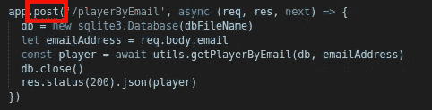

/playerByEmail 邮政路线

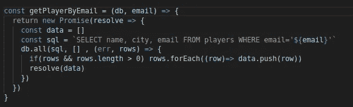

SQL 字符串由传入的电子邮件字符串组装而成

这里我们发送一个 POST 请求，并传递“email”值，然后我们得到正确的匹配用户。

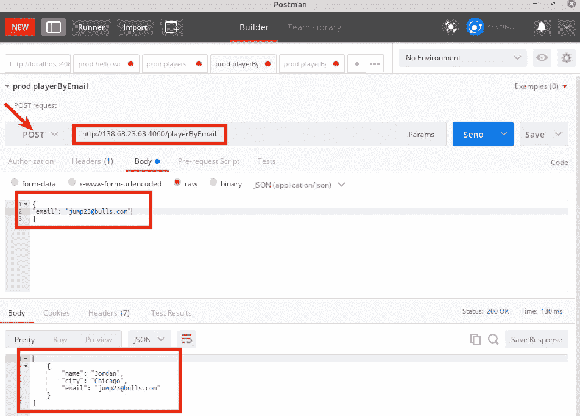

jump23@bulls.com 匹配约旦


jump23@bulls.com

如果我们发送其他有效的电子邮件，它们也会返回正确的用户。

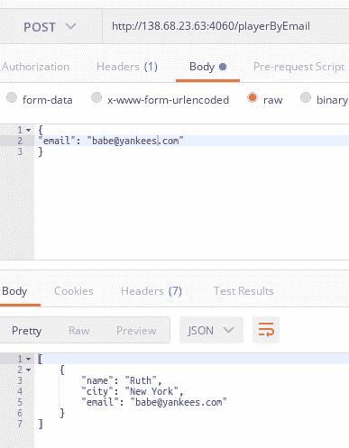

babe@yankees.com 和露丝匹配

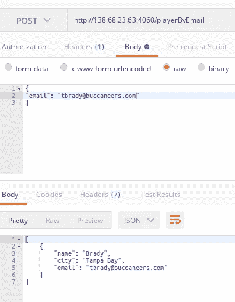

tbrady@buccaneers.com 和布雷迪匹配


一切似乎都没问题…

…除此之外，API 对 **SQL 注入攻击**是开放的。这是为什么呢？

使用 Postman，很容易开始窥探并发现。假设我们不只是无害地传递一个电子邮件地址字符串，而是传递一个以电子邮件开头的字符串，然后我们**在地址后面添加一些额外的 SQL** ，这是一个 **SQL union** (见下面的粗体文本)。这是我们这次请求中发送的数据…

```
{
"email": "[jump23@bulls.com](mailto:jump23@bulls.com)**' union SELECT 1,sql,3 FROM   sqlite_master WHERE type!='meta' AND sql NOT NULL AND name NOT LIKE 'sqlite_%' AND name = 'players';**"
}
```

SQL 注入部分的格式来自这个文档，[注入一个基于 SQLite 数据库的应用程序](https://www.exploit-db.com/docs/english/41397-injecting-sqlite-database-based-applications.pdf)，它展示了许多邪恶的 SQL 注入策略。

通过在电子邮件地址后**注入**的 **SQL union** ，黑客可以恶意地查询关于玩家表中所有列**或任何其他已知(或猜测)名称的表的性质的信息。请看下面，其中的响应揭示了 players 表的 CREATE TABLE 语句及其所有列名和类型！哎哟！**

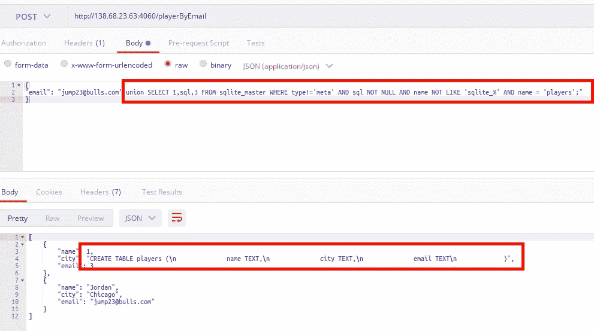

SQL 注入在行动

在这里，我们可以从后端的角度看到攻击，当攻击发生时，有一个违规 SQL 的 console.log。请注意 union SQL 字符串是如何附加到在后端执行的 SQL 上的。

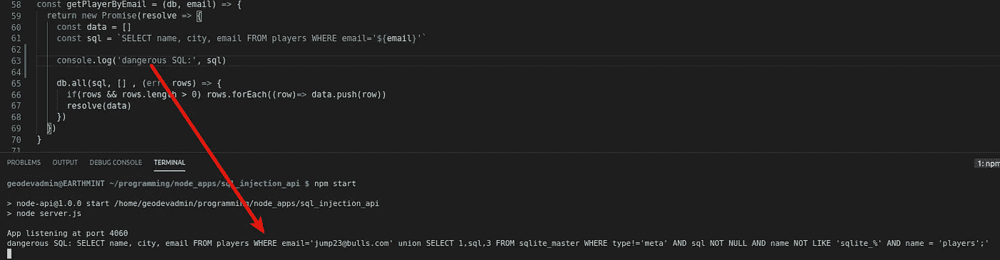

危险的注射

```
dangerous injection:
SELECT name, city, email FROM players WHERE [email='jump23@bulls.com](mailto:email='jump23@bulls.com)' **union SELECT 1,sql,3 FROM sqlite_master WHERE type!='meta' AND sql NOT NULL AND name NOT LIKE 'sqlite_%' AND name = 'players';'**
```

这种注入是可行的，因为后端代码只是从传入的电子邮件字符串中组装 SQL 语句。**不检查电子邮件字符串**。

虽然这个例子没有破坏或改变数据，但是一旦黑客发现了这样的漏洞，并获得了包含敏感信息(想象一下社会安全号码或其他敏感的个人数据)的表的列名，在发生**破坏**之前只是时间问题，例如**删除数据**或**窃取敏感数据**。

## 怎样才能停止 SQL 注入？

幸运的是，防止 SQL 注入并不困难，只是需要一点小心来确保用户输入不会被直接组装到 SQL 字符串中。大多数平台都提供了使用[参数化 SQL](https://cheatsheetseries.owasp.org/cheatsheets/Query_Parameterization_Cheat_Sheet.html) 的方法，这解决了 SQL 注入漏洞。

在这里，我们有两个功能，目的是做同样的事情(返回传入的电子邮件的用户数据)。第一个函数( **getPlayerByEmail** )是对 SQL 注入开放的**，因为它**不使用参数化查询**，而第二个函数， **getPlayerByEmailStrong** 使用参数化查询，并且不受 SQL 注入攻击。在 **getPlayerByEmailStrong** 中，来自 sqlite3 库的 [db.all](https://github.com/mapbox/node-sqlite3/wiki/API#databaseallsql-param--callback) 函数接受一个参数数组**【email】**，这些参数映射到**？执行时 SQL 字符串中的**(问号)。这是有问题的 SQL 被阻塞的地方。**

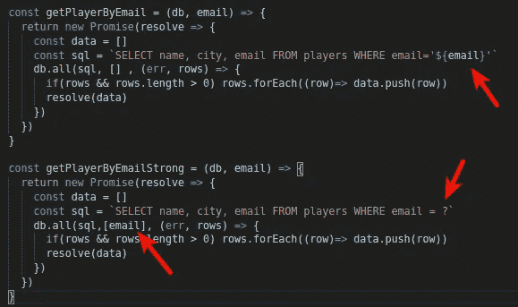

这里我们可以在 Postman 中看到，如果我们向**getplayeremailsstrong**发送附加了恶意 SQL 的邮件，它不会像上面的 **getPlayerByEmail** 那样返回玩家表数据。它只是返回一个空数组。这是因为 SQL 注入漏洞已经通过参数化电子邮件地址被关闭。

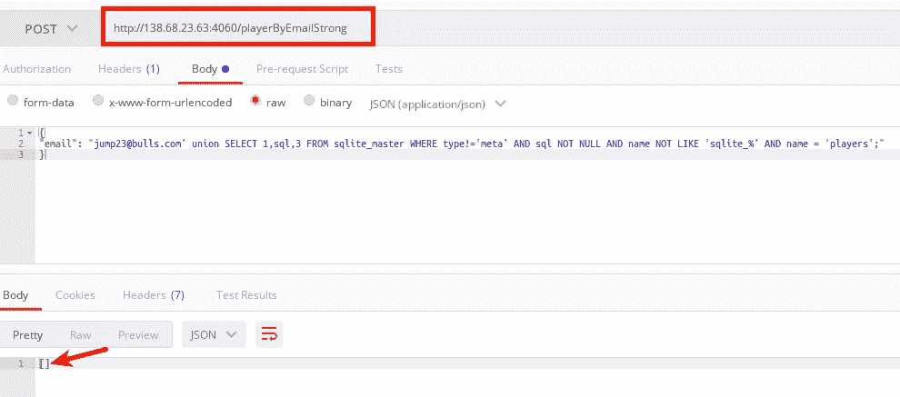

防止注入的参数化 SQL

## 进一步保护

虽然[对象关系映射器](https://en.wikipedia.org/wiki/Object%E2%80%93relational_mapping) (ORMs) [不能防止 SQL 注入漏洞](https://bertwagner.com/posts/2-5-ways-your-orm-will-allow-sql-injection/)，但是它们确实在用户输入和数据库之间提供了一个额外的代码和抽象层。此外，它们还提供了其他优势，值得应用程序后端考虑。

值得注意的是，大多数 ORM，如[活动记录](https://guides.rubyonrails.org/active_record_querying.html)和[序列](https://sequelize.org/master/manual/raw-queries.html)允许在 ORM 框架内执行[原始 sql 查询](https://sequelize.org/master/manual/raw-queries.html)。如果没有参数化，这样的 SQL 语句将**容易受到上述**SQL 注入**的攻击。**

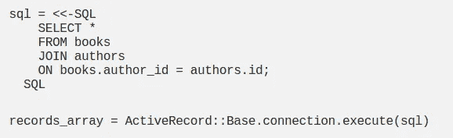

活动记录表单中的原始 SQL 查询

## 演示

[http://138.68.23.63:4060/](http://138.68.23.63:4060/)

github 回购和来源这个帖子可以在这里找到:[https://github.com/FergusDevelopmentLLC/sql_injection_api](https://github.com/FergusDevelopmentLLC/sql_injection_api)

## 参考

[Express.js](https://expressjs.com/) ，Node.js
[的快速、非个性化、极简的 web 框架 node-sqlite3](https://www.npmjs.com/package/sqlite3) ，Node.js
[的 sqlite3 数据库连接器注入基于 sqlite 数据库的应用](https://www.exploit-db.com/docs/english/41397-injecting-sqlite-database-based-applications.pdf)，www.flaticon.com[的 Nikita Golubev 制作的 SQL 注入技术
黑客图标](http://www.flaticon.com)的注射器和 www.flaticon.com[的 Freepik 制作的服务器图标](http://www.flaticon.com)

谁是/曾经是有史以来最好的？请在下面评论。:)


布雷迪露丝乔丹。谁是有史以来最棒的？