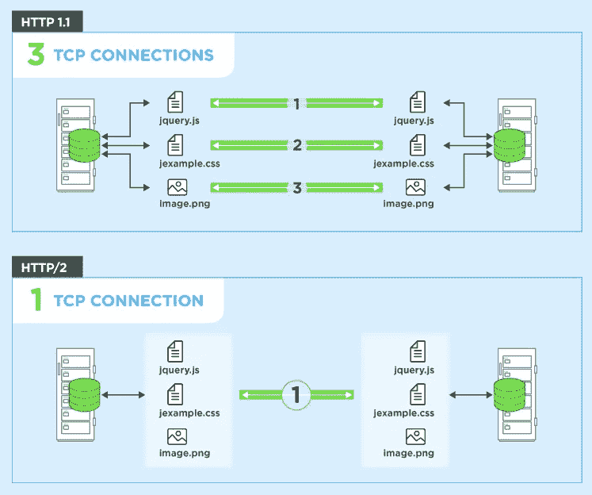
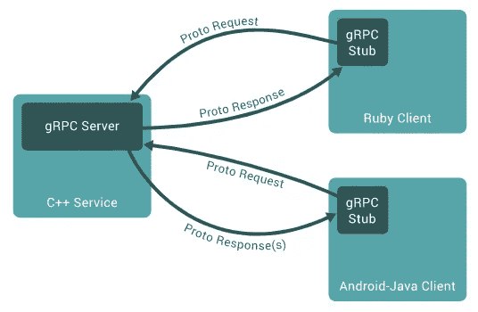
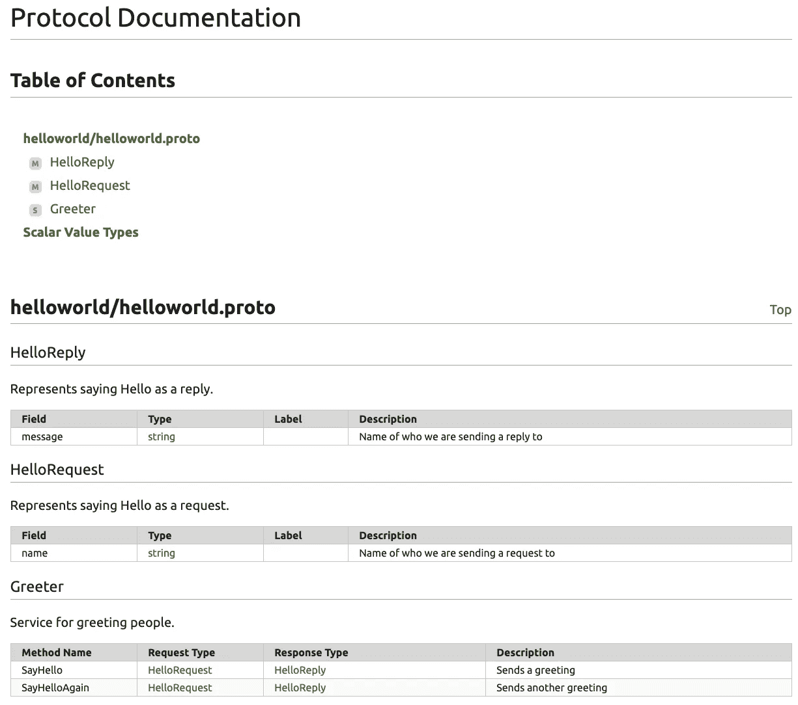

# GoLang 对 gRPC 的最新评述

> 原文：<https://levelup.gitconnected.com/an-up-to-date-review-of-grpc-with-golang-b8cc78b584f7>

## 当今科技领域最受欢迎的组合。


来自 [gRPC Conf 2020](https://events.linuxfoundation.org/grpc-conf/)

你可能听过这句话，唯一不变的是变化本身。不管是好是坏，这句话在技术领域尤其适用。流行的协议 gRPC(远程过程调用，由于某些原因，我们不讨论 g)已经成为软件工程师的一个有吸引力的选择，因为它的高性能，语言独立和基于契约的解决方案来连接客户端和服务器通信。

无论您以前是否使用过 gRPC，或者您是第一次接触它，本文都将涉及 GoLang 中 gRPC 的以下方面:

*   为什么创建 gRPC
*   gRPC + protobuf 概述
*   在 Go 中实现客户端和服务器
*   **奖励**:为你的`.proto`文件生成文档

让我们开始吧！

*免责声明:我假设你熟悉 Go，可以创建一个新项目，编译等。我将包括代码示例，但我不会重复编译，使用* `*go mod*` *等。*

# gRPC 的起源

多年来，web 开发的世界高度依赖于基于 REST(表述性状态转移)的 API(应用程序编程接口)。这种与其他应用程序和第三方数据交互的方式有四个主要方法，GET、POST、PUT 和 DELETE。中间的两个已经不是你见过的最具描述性的命名标准了。

此外，基于 REST 的 API 通常缺乏标准化，许多公司实现了他们认为是基于 REST 的解决方案，而实际上他们开发的代码更符合他们自己的设计习惯。这就要求 gRPCs 具有一个令人满意的特性——**一致性**。

RESTful APIs 通常也使用 JSON 或 XML 发送消息。虽然 JSON 是许多开发人员的热门选择，但它仍然是人类可读的格式，这是以高效的数据传输为代价的。因此，gRPC 的开发人员创建了 Protobuf(协议缓冲区),它通过以字节编码的格式传输数据而保持语言独立的平台。

gRPC 对以前解决方案的另一个改进是**利用现代 HTTP** (超文本传输协议)选项。HTTP 版本背后有很多东西，因为它们是互联网的支柱，所以我们将保持简单。HTTP/1.1 必须打开多个 TCP(传输控制协议)连接，而 HTTP/2 只需要一个。



HTTP/1.1 与 HTTP/2

TCP 连接只是客户端和服务器之间建立信任的一种方式，在能够更有效地发送数据之前，需要一些时间来发起“握手”。大多数 REST 服务都是使用 HTTP/1.1 构建的，所以当然 **gRPC 利用了 HTTP/2。**

gRPC 相对于 REST 提供的另外两个主要优势包括实时双向流，以及为不同语言生成可靠的客户端。gRPC 还希望提供 HTTP/3 支持，一个比 HTTP/2 更快的版本。

> *这里我们还可以介绍更多的东西，而且很明显，基于 REST 的 API 仍然有很多优势。然而，如果你想记住* ***性能*** *，那么* ***gRPC 可能值得一试。***

# gRPC 和 Protobuf 概述

远程过程调用混淆了通信逻辑，使得看起来您是在客户端中直接调用服务器方法，反之亦然。利用 gRPC，您可以更高效地创建分布式应用程序和服务。您需要做的只是通过指定方法参数和返回类型来定义服务。服务器将实现您定义的接口来处理客户端连接。然后，客户端将能够通过存根提供与服务器相同的方法。这可以在任何支持的语言配置中完成。



来自 [grpc.io](https://grpc.io/docs/what-is-grpc/introduction/)

## 使用 Protobuf —也称为协议缓冲区

gRPC 数据传输的默认行为是通过协议缓冲区完成的。这是一种**序列化结构化数据**的方法，虽然也可以用于 JSON 之类的格式。您可以通过简单地将数据结构定义为*消息*来使用协议缓冲区，然后使用编译器`protoc`来生成数据访问类。包含在一个`.proto`文件中的示例协议缓冲服务和消息定义如下所示:

如果您想处理双向数据流，您可以简单地在第 4 行的`HelloRequest`和`HelloReply`前添加`stream`——尽管在这个例子中我们不会涉及数据流。

下一步是用您选择的语言生成数据访问代码，这将在下一个示例部分中讨论。

# 在 Go 中实现 gRPC 客户端和服务器

幸运的是，在 Go 中设置 gRPC 客户端和服务器时，gRPC 保持了 Go 的简单性。一旦我们为`.proto`数据定义生成了访问代码，我们就可以快速编写方法来实现 gRPC 接口需求。首先，让我们创建我们的项目结构。

```
$ mkdir server client hello
$ touch server/main.go client/main.go hello/helloworld.proto
```

## 添加 Protobuf 定义

首先让我们添加`helloworld.proto`的代码。我们通过定义`syntax="proto3"`为 Protobuf 使用最新的语法。

要为这个`.proto`文件生成数据访问代码，这取决于您选择的语言，您必须查阅[文档](https://grpc.io/docs/)以了解您的具体选择。如果你要生成 GoLang 代码，你首先需要协议编译器插件。

```
$ export GO111MODULE=on  *# Enable module mode*
$ go get google.golang.org/protobuf/cmd/protoc-gen-go **\
**         google.golang.org/grpc/cmd/protoc-gen-go-grpc
```

您还需要更新 PATH 环境变量:

```
$ export PATH="$PATH:**$(**go env GOPATH**)**/bin"
```

最后，为了**生成您的代码**，您将运行:

```
$ protoc --go_out=. --go_opt=paths=source_relative **\
**    --go-grpc_out=. --go-grpc_opt=paths=source_relative **\
**    hello/helloworld.proto
```

现在，在您的`hello`目录中应该有两个额外的数据访问 Go 文件。这两个生成的文件包含用于**填充、序列化和检索** `HelloRequest`和`HelloReply`消息类型的代码，以及客户端和服务器代码。现在我们可以设置我们的客户端和服务器程序。

## 实现服务器代码

在导入必要的库和包含 protobuf 代码的目录`hello`后，我们将端口设置为`50051`。TCP 端口`50051`使用传输控制协议，并保证数据包以相同的顺序发送。

然后，我们定义一个名为 server 的结构，它嵌入了`UnimplementedGreeterServer` `struct`。这是最近添加的，有一个[很长的线程](https://github.com/grpc/grpc-go/issues/3669)与之关联，但长话短说，它被添加到**支持向前兼容**并遵守 protobuf [APIv2](https://blog.golang.org/protobuf-apiv2) 的最新版本。

接下来，我们添加两个简单的函数`SayHell()`和`SayHelloAgain()`，它们具有相同的逻辑，并且附属于`server`T3。在`main()`方法中，我们使用 TCP 协议在端口`50051`上调用`net.Listen()`并进行标准错误处理。如果一切顺利，我们简单地实例化一个名为`s`的 gRPC 服务器对象，然后注册实现`GreeterServer` `interface`的`server`。这就是我们需要的服务器逻辑！

## 实现客户端代码

客户端也有简单的逻辑。我们导入必要的包和 protobuf 文件，并定义我们需要的任何常量。在 main 函数中，我们首先使用`grpc.Dial()`建立到服务器的连接。然后，我们将连接对象传递给`protobuf.NewGreeterClient()`来生成我们的客户端存根。下面几行只是接受一个命令行参数，我们将把它附加到我们的消息中。

根据命令行参数，我们获得一个上下文对象，并将其传递给客户端方法调用。注意我们如何调用客户机存根来直接调用服务器方法`SayHello()`和`SayHelloAgain()`。此外，我们不必担心数据类型是如何被访问、序列化或传递的。我们只需传递变量`name`，它会自动转换为字节码，作为`HelloRequest`，随后是`HelloReply`。以上是 gRPC 的一些主要优势！

## 运行我们的代码

打开两个终端，我们可以启动我们的服务器，然后从客户端发出请求。

服务器托管终端:

```
$ go run server/main.go 
```

客户端请求的终端:

```
$ go run client/main.go Izzy
2021/04/16 15:23:26 Greeting: Hello Izzy
2021/04/16 15:23:26 Greeting: Hello again Izzy
$
```

就这样，gRPC 在 Go 中实现了！

# 记录 Protobuf 定义

Protobuf 编译器`protoc`有一个文档工具叫做[protoco-gen-doc](https://github.com/pseudomuto/protoc-gen-doc)。回购维护得很好，有 20 多个贡献者和 400 多个对其开发的承诺。如果您开始发现自己创建了许多不同的`.proto`文件，并且想要记录它们的用例，这是一个非常方便的选择。要安装该工具，只需运行:

```
$ go get -u github.com/pseudomuto/protoc-gen-doc/cmd/protoc-gen-doc
```

该工具还使用特定的注释来添加到生成的文档中。要查看效果，将`helloworld.proto`更新如下:

然后，您可以使用推荐的和可重用的 Docker 映像，或者您可以简单地在本地运行该工具。对于我们的示例，您可以运行:

```
$ protoc --doc_out=./ --doc_opt=html,index.html helloworld/*.proto
```

如果我们在 web 浏览器中打开生成的`index.html`文件，我们会得到一些非常干净的文档！



现在，您已经开始了解如何使用 gRPC 开发高效的解决方案。另外，如果您需要记录 Protobuf 定义，您可以保持您的团队有组织。

我希望您喜欢阅读这篇文章，并了解为什么 gRPC 和 Go 是您的技术堆栈的理想选择。如果你喜欢这篇文章的任何部分，或者有自己的想法，我鼓励你在下面留下评论。非常感谢你的阅读！