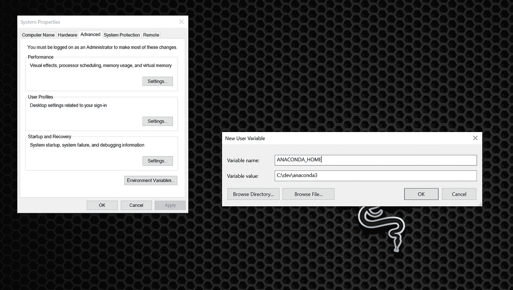
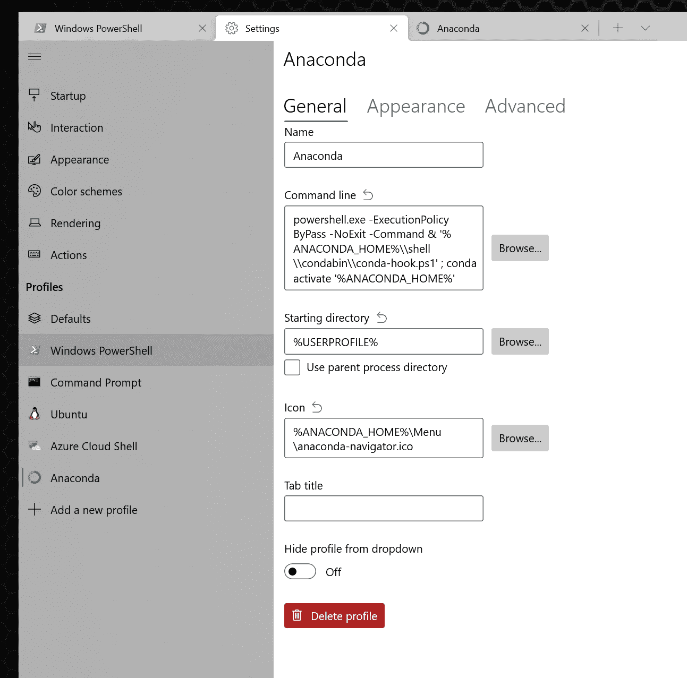
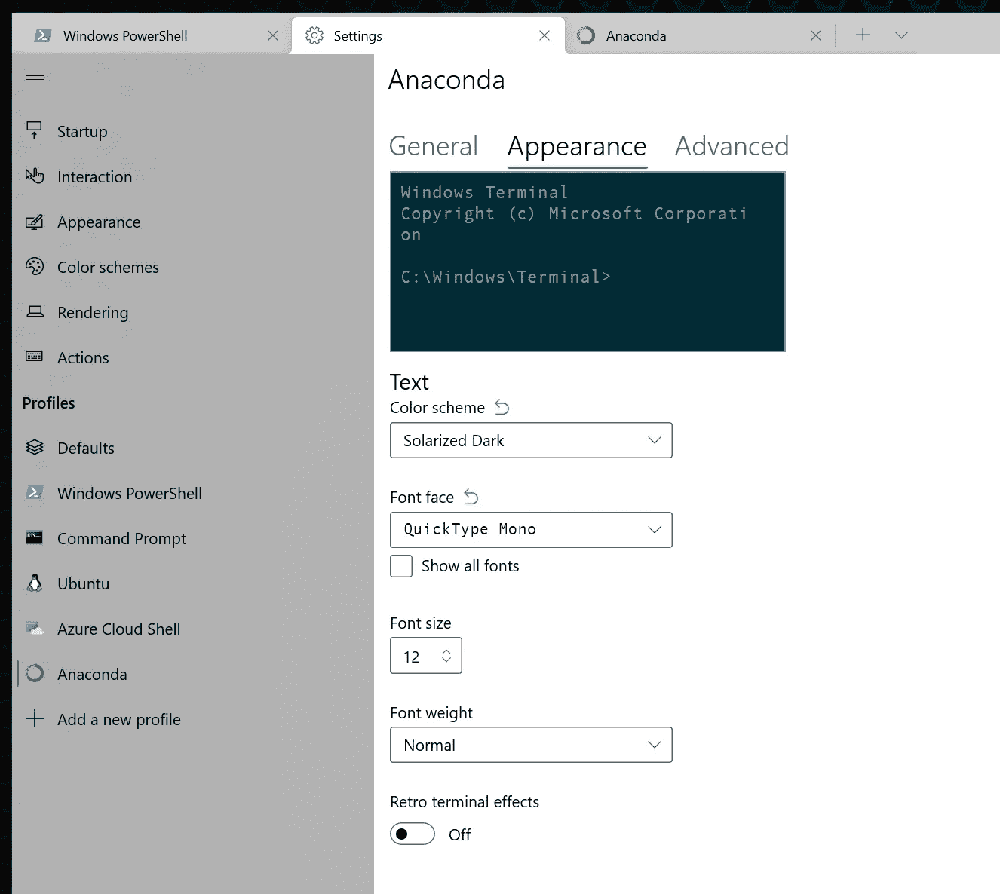

# Windows PowerShell 上的 Anaconda

> 原文：<https://levelup.gitconnected.com/anaconda-on-the-windows-powershell-c3b1425be9ae>

## 操作指南


如果您是 Anaconda Python 开发环境的用户，您可能知道 Anaconda 喜欢将其可执行文件与一般的系统可执行文件分开。这很有道理。您的操作系统可能在某个地方安装了默认的 Python，Anaconda 希望避免库冲突。

因此，anaconda 自带了自己的 shell，作为“Anaconda Prompt”安装。如果你碰巧是 windows 用户和程序员，很有可能你正在使用 PowerShell 一个灵活的命令行提示符，允许您作为选项卡运行不同的环境。我更喜欢把所有东西都放在一个地方，所以我想在 PowerShell 中添加一个 Anaconda 概要文件，而不是在不同的 Shell 上运行它。事实证明，要做到这一点需要一点挖掘，所以我创建了这个详细的指南，以节省我的读者(和我未来的自己)的一些努力。

## 定义环境变量

作为第一步，我为安装目录设置了一个环境变量。我称之为添加水蟒之家。只需打开“环境变量”，添加一个新的，如下图所示。



## 添加 PowerShell 配置文件

1.  打开 Windows Powershell
2.  从顶部菜单栏中，单击箭头并选择“设置”
3.  单击“添加新配置文件”
4.  单击“新建空配置文件”
5.  给它起个名字，比如“Anaconda”
6.  在“命令行”区域输入以下内容:

```
powershell.exe -ExecutionPolicy ByPass -NoExit -Command & '%ANACONDA_HOME%\\shell\\condabin\\conda-hook.ps1' ; conda activate '%ANACONDA_HOME%'
```

7.在起始目录中，取消选择“使用父进程目录”。它应该默认为%USERPOFILE%。

8.在图标部分中，输入以下内容:

```
%ANACONDA_HOME%\Menu\anaconda-navigator.ico
```

屏幕应该是这样的:



如果您希望每个配置文件都与其他的不同，以便于辨别您当前使用的是哪一个，您可以自定义外观。单击“外观”选项卡，为“配色方案”、“字体”、“文本格式”等选择不同的选项。



## Jupyter 笔记本

作为一个有点离题，但可能有用的注意事项，这里是如何快速打开 Jupyter 笔记本。Anaconda 附带了一个名为“Anaconda Navigator”的工具，可以用来打开包括 Jupyter 笔记本在内的各种工具。我发现这是一个非常迂回的方式来获得笔记本，所以，相反，我去命令外壳，只是键入

```
jupyter notebook
```

这将立即启动笔记本服务器和与之连接的浏览器窗口。