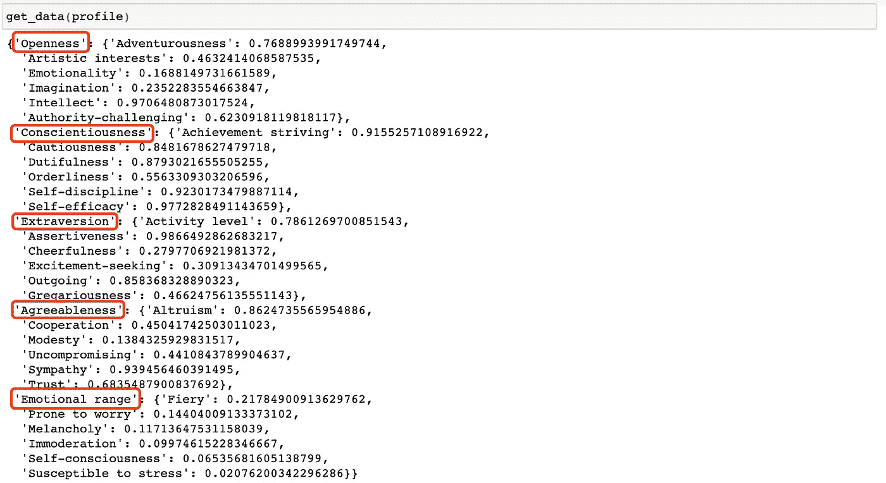

# 唐纳德·特朗普的五大个性:用沃森个性洞察 API 分析 50000 条推文，并用雷达图可视化

> 原文：<https://levelup.gitconnected.com/analyse-over-50000-tweets-of-trump-with-watson-personality-insights-visualise-with-seaborn-1f25b050905f>

## 介绍

本文将分析唐纳德·特朗普的五大人格特质，并发现他在总统选举前、从选举到就职以及就职后三个时期的人格变化。

该分析基于[***realDonaldTrump***](https://twitter.com/realDonaldTrump)截至 2020/08/09 的所有公开推文，从 2009/05/04 的第一条推文开始。我们将使用 ***熊猫*** 读取数据， [***预处理 _ kgptalkie***](https://github.com/laxmimerit/preprocess_kgptalkie)*进行数据预处理， [***沃森个性洞察 API***](https://www.ibm.com/watson/services/personality-insights/) 进行个性分析， ***Seaborn*** 和[***I lotter***](https://github.com/niloch/iplotter)*

*最终输出:*

**

*现在让我们开始吧！*

## *第一步:获取特朗普推文的完整档案*

*如果你已经申请了一个开发者账户来访问 Twitter APIs，那么**搜索 API**可以用来浏览用户的推文。然而，一个标准的搜索 API 只能让我们检索过去七天的推文。*

*在 Tweepy 也是一样。Tweepy 是一个用于访问 Twitter API 的 Python 库，`**API.search_full_archive**`也需要一个高级环境。*

*在我们的情况下，我们需要特朗普推特上的所有公开推文。感谢 [***特朗普推特存档***](http://www.trumptwitterarchive.com/archive) ，我们可以免费获得特朗普推特的完整存档！*

*[](http://www.trumptwitterarchive.com/archive) [## 特朗普推特档案

### 特朗普的所有 30，000 多条推文都可以立即搜索到

www.trumptwitterarchive.com](http://www.trumptwitterarchive.com/archive) 

2015 年 6 月 16 日，特朗普宣布参选总统。2017 年 1 月 20 日，特朗普就任美国第 45 任总统。基于这两个关键节点，我们可以将完整归档分为三个时期:

*   2009/05/04–2015/06/15:在特朗普宣布参选之前
*   2015/06/16–2017/01/19:在特朗普就职典礼之前
*   2017/01/20–2020/08/09:特朗普就职后

在 [***川普推特存档***](http://www.trumptwitterarchive.com/archive) 中，我会导出三个 CSV 文件，分别保存为“*before _ candidate . CSV*”、“*before _ 就职典礼. csv* ”、“*after _ 就职典礼. csv* ”


分三个时段导出数据

## 步骤 2:读取 CSV 文件

```
import pandas as pd
df = pd.read_csv ('/Users/tianlu/Downloads/before_candidacy.csv')
df.shape
df.head()
```

**pandas.read_csv** 可以将逗号分隔值(csv)文件读入 DataFrame。Pandas 有三种主要的数据结构:序列、数据帧和索引。DataFrame 是一种二维数据结构。

**DataFrame.shape** 返回形状的元组(行，列)。第一个文件中有 30344 条 tweet 记录，DataFrame 中有 68 列。


df.shape 的输出

**DataFrame.head()** 返回 DataFrame 的前五行。我们可以看到，我们需要分析的推文存储在***‘文本’***列中。


df.head()的输出

现在做同样的事情来读取另外两个文件:

```
import pandas as pddf2 = pd.read_csv ('/Users/tianlu/Downloads/before_inaguration.csv')df3 = pd.read_csv ('/Users/tianlu/Downloads/after_inauguration.csv')
```

我们将获得以下输出:


现在我们已经将三个时期的数据读入 DataFrame，特朗普参选前共有 30344 条推文进入 total，参选期有 8188 条推文，特朗普就职后有 20880 条推文。

下一步，我们将删除转发，并获得干净的推文。

## 第二步:数据处理

**2.1 从数据帧中删除转发**

```
df.is_retweet.value_counts()
df2.is_retweet.value_counts()
df3.is_retweet.value_counts()
```


我们可以用 ***df 访问一个列。[column_label]，value_counts()*** 返回包含数据帧中唯一行的计数的序列。这里我们得到了当*为 _retweet* 为 False *，*第一周期有 *2* 2156 条原始推文时的行数。

现在，我们可以从 DataFrame 中删除转发:

```
df_retweets = df.loc[df.is_retweet == True]
df_retweets = df_retweets.drop(columns=['is_retweet'])
df = df.loc[df.is_retweet == False]
df = df.drop(columns=['is_retweet'])
df.info()
```

***df.loc*** 可以通过标签或布尔数组访问一组行和列。首先，当 *is_retweet* 为真时，我们获取这些行，然后删除这些行，现在我们可以删除 *is_retweet* 列。

对 df2 和 df3 重复相同的步骤。

**2.2 用*预处理 _kgptalkie*** 清理 Tweet 文本

```
import preprocess_kgptalkie as pp
import rex = ['x']
df['text']=df['text'].apply(lambda x:x.lower())
df['text']=df['text'].apply(lambda x:pp.cont_exp(x))
df['text']=df['text'].apply(lambda x:pp.remove_emails(x))
df['text']=df['text'].apply(lambda x:pp.remove_urls(x))
df['text']=df['text'].apply(lambda x:pp.remove_rt(x))
df['text']=df['text'].apply(lambda x:pp.remove_html_tags(x))
df['text']=df['text'].apply(lambda x:pp.remove_special_chars(x))
```

***预处理 _kgptalkie*** python 包由`[***Kgptalkie***](https://github.com/laxmimerit/preprocess_kgptalkie)`准备。按照 [***自述***](https://github.com/laxmimerit/preprocess_kgptalkie/blob/master/README.md) 安装包，导入 ***预处理 _kgptalkie*** ，还有 ***re*** (正则表达式)。

***df['text']*** 是 DataFrame 中的文本列，我们可以应用 lambda 函数删除邮件、URL 等。从推文文本中进行数据清理。

对 df2 和 df3 重复相同的步骤。

**2.3 获得清洁文本**

```
text = "\n".join(tweet for tweet in df.text)print ("There are {} words in the combination of all tweet in  the first period.".format(len(text))) 
```

***df.text*** 是一个 Pandas 系列数据类型，我们现在可以使用***' for tweet in df . text’***来迭代该系列，以获得每个 tweet，最后，将每个 tweet 连接成一个***【text’***。我们将使用 ***【正文】*** 作为步骤 3 中的性格分析材料。

对 df2 和 df3 重复上述步骤。您将获得以下输出:


现在我们得到了三块干净的文本用于人格分析。

## 步骤 3:使用个性洞察 API 进行数据分析

**3.1 设置环境**

使用个性洞察的第一步是使用[***IBM Cloud***](https://cloud.ibm.com/)创建一个帐户。这允许您访问个性洞察 API。

要创建一个服务，直接进入 [***IBM 云目录***](https://cloud.ibm.com/catalog) 。搜索并激活沃森人格洞察服务。

现在转到您的资源列表，您将获得 ***API 密钥*** 和 ***URL*** ，我们将使用这些值对服务实例进行认证。


资源列表

最后的设置步骤是用***pip install IBM _ Watson***安装 Watson 开发者云。

**3.2 创建个性档案**

现在，我们已经创建了 API 凭证，安装了 watson-developer 云模块，并获得了要分析的文本块(来自步骤 2)。这些都是我们创建个性档案所需要的。

```
from ibm_watson import PersonalityInsightsV3
from ibm_cloud_sdk_core.authenticators import IAMAuthenticatorapikey = 'PUT YOUR API KEY HERE'
url = '[PUT YOUR URL HERE'](https://api.au-syd.personality-insights.watson.cloud.ibm.com/instances/41e696fb-34c6-4a2c-9f07-0150c045a9c7')authenticator = IAMAuthenticator(apikey)personality_insights = PersonalityInsightsV3(version='2017-10-13',authenticator=authenticator)personality_insights.set_service_url(url)profile = personality_insights.profile(text,accept='application/json').get_result()profile2 = personality_insights.profile(text2,accept='application/json').get_result()profile3 = personality_insights.profile(text3,accept='application/json').get_result()
```

首先，用 API 键和 URL 实例化一个 Personality Insights 服务实例。然后我们可以将 ***【文本】*** 发送给服务。这将处理文本文件中的数据，并生成新的个性档案。

***‘廓’***是字典。***profile[' word _ count ']***的输出是 42976，也就是说即使我们发送 200 多万字，服务也只需要 42976。

```
type(profile)
profile.keys()
profile['word_count']
```


根据 IBM Cloud 的说法，我们可以向服务发送高达 20 MB 的输入内容。在某种程度上，更多的单词可能会产生更好的结果，通过减少预测结果和作者实际得分之间的偏差来提高服务的精确度。但是准确性在大约 3000 个单词的输入时稳定下来，更多的内容不会有助于概况的准确性。因此，该服务只从大型请求中提取和使用前 250 KB 的内容，不包括任何 HTML 或 JSON 标记。

现在，我们已经为唐纳德·特朗普在三个时期创建了三个性格特征，接下来我们将可视化并比较这三个特征。

## 步骤 4:数据可视化

首先，我们将通过条形图快速浏览一下性格特征。然后我们将深入探讨 big5 人格特质，并用雷达图对这三个时期进行比较。

**4.1 Seaborn 快速条形图**

```
needs = profile['needs']result = {need['name']:need['percentile'] for need in needs}df = pd.DataFrame.from_dict(result,orient='index')
df.reset_index(inplace=True)df.columns = ['need','percentile']
df['period'] = 'period1'df.head()
```

我们将获得以下输出:


对 profile2/profile3 重复相同的步骤，以获得 df2/df3。现在我们可以将这三个数据帧连接成一个，并用 ***Seaborn*** 可视化:

```
result2 = pd.concat([df,df2,df3])import seaborn as sns
plt.figure(figsize=(15,5))
sns.barplot(x='need',y='percentile',hue='period',data=result).set_title('Needs of Donald Trump')
```

**Seaborn** 是一个基于 matplotlib 的 Python 数据可视化库。函数有四个变量:x，y，色调和数据。 ***数据*** 是绘图的数据帧， ***x*** 和 ***y*** 是指定 x 轴和 y 轴位置的变量， ***色相*** 是一个分组变量，会产生不同颜色的点。

我们将获得以下输出:


现在对人格做同样的事情:

```
personalities = profile['personality']result = {personality['name']:personality['percentile'] for personality in personalities}df = pd.DataFrame.from_dict(result,orient='index')
df.reset_index(inplace=True)
df.columns = ['trait','percentile']
df['period']='period1'df.head()
```

对 profile2 和 profile3 重复相同的步骤。连接三个数据框架，想象五大人格:


现在我们对唐纳德·特朗普在三个时期的需求和五大性格有了一个基本的形象化，接下来我们将使用雷达图来形象化每个性格的特征。

**4.2 使用 iPlotter 进行大五人格可视化的雷达图**

在 Jupyter 笔记本中创建 JavaScript 图表，我们将使用[***I lotter***](https://github.com/niloch/iplotter)***。***[***I lotter***](https://github.com/niloch/iplotter)使用原生 python 数据结构将最新的 D3.js 和 canvas 制图库带到 Jupyter 笔记本中。iPlotter 集成了 C3.js、plotly.js、Chart.js、Chartist.js 和 Google Charts。

在这种情况下，我们将使用 Chart.js 创建雷达图，以可视化和比较唐纳德·特朗普在三个时期的个性。

首先，导入 ***iplotter*** 包和**【IPython.core.display.HTML】*****【IPython.core.display.HTML】***可以将渲染的 HTML 输出嵌入到 IPython 输出中。

```
import iplotter
from IPython.core.display import HTML# remove iFrame border for cleaner chart rendering
# increase size of text explanations
HTML("""
<style>
iframe {border:0;}
</style>
""")
```

接下来，为图表准备数据，我们需要得到每种性格中每种特征的百分比。

```
def get_data(profile_name):
    personalities = profile_name['personality']
    data = {}
    for personality in personalities:
        trait_dic = {}
        personality_name = personality['name']
        personality_traits = personality['children']
        for trait in personality_traits:
            trait_dic[trait['name']] = trait['percentile']
            data[personality_name] = trait_dic
    return data
```

返回的数据是一个嵌套的字典，关键字是大 5 人格的名称(开放性/责任心/外向性/宜人性/情感范围)，值是每个人格的儿童人格特征及其相应的百分位数。



现在我们可以用雷达图把川普三个不同时期的每个人格形象化。

从第一个人格“开放性”开始，图表的 ***标签*** 是“开放性”人格的特质名称， ***数据*** 是特质的百分位值。数据集里的 ***标签******数据*** 必须是 JSON 可序列化的，所以我们要用***list(my _ dict . values())***来得到一个列表。

```
labels = list(get_data(profile)['Openness'].keys())
data1 = list(get_data(profile)['Openness'].values())
data2 = list(get_data(profile2)['Openness'].values())
data3 = list(get_data(profile3)['Openness'].values())
```

现在我们可以使用 ***标签、数据 1、数据 2 和数据 3*** 来创建图表数据。

```
data = {    
        "labels": labels,
        "datasets": [
            {
                "label": "Before Candidacy",
                "backgroundColor": "rgba(179,181,198,0.2)",
                "borderColor": "rgba(179,181,198,1)",
                "pointBackgroundColor": "rgba(179,181,198,1)",
                "pointBorderColor": "#fff",
                "pointHoverBackgroundColor": "#fff",
                "pointHoverBorderColor": "rgba(179,181,198,1)",
                "data": data1,
            },
            {
                "label": "Before inauguration",
                "backgroundColor": "rgba(255,99,132,0.2)",
                "borderColor": "rgba(255,99,132,1)",
                "pointBackgroundColor": "rgba(255,99,132,1)",
                "pointBorderColor": "#fff",
                "pointHoverBackgroundColor": "#fff",
                "pointHoverBorderColor": "rgba(255,99,132,1)",
                "data": data2,
            }
            ,
            {
                "label": "After inauguration",
                "backgroundColor": "rgba(0,191,255,0.2)",
                "borderColor": "rgba(0,191,255,0.2)",
                "pointBackgroundColor": "rgba(0,191,255,1)",
                "pointBorderColor": "#fff",
                "pointHoverBackgroundColor": "#fff",
                "pointHoverBorderColor": "rgba(0,191,255,1)",
                "data": data3,
            }
        ]
    }options = {
            "title": {
                "display": True,
                "text": 'Big5 Personalities of Trump - Openness'
            }
        }
```

最后一步是实例化***ChartJSPlotter***并绘制图表。绘图函数有五个变量，我们上一步创建的 ***数据*** ，图表类型，图表图形的宽度和高度，以及选项配置。

```
chart_js = iplotter.ChartJSPlotter()chart_js.plot(data, chart_type="radar", w=600, h=600,options=options)
```

现在我们将得到以下输出:


开放的雷达图

将“开放性”这一名称改为 Big 5 中的其他四种人格，我们将另外四个雷达图:


责任心的雷达图


外向性的雷达图


宜人性的雷达图


情绪范围的雷达图*