# 分析在新加坡出售的 HDB 公寓列表

> 原文：<https://levelup.gitconnected.com/analysing-listings-of-hdb-flats-for-sale-in-singapore-8f0a0b855d39>

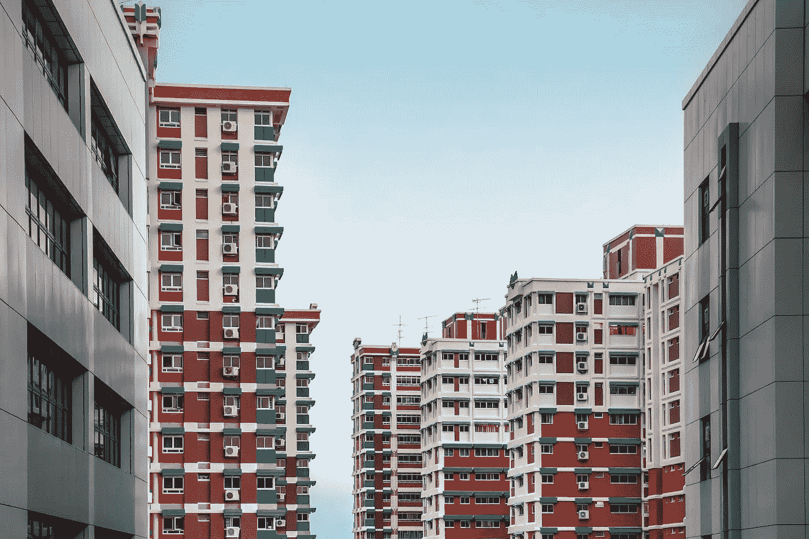

想在新加坡买第一套公寓吗？

在本帖中，我们将会看到 HDB 转售价格的可视化，以及在新加坡出售的公寓。数据是从在线房地产门户网站[99.co](https://www.99.co/)公开获得的。*(数据截至 2021 年 2 月 13 日准确)*

清理获得的数据后，我们的数据集包含以下内容:

HDB 待售房屋总数:9412

列包含:
名称(列表名称)
地区(邮政区)
售价(列表要价)
每平方英尺价格(每平方英尺价格)
床位数(HDB 的卧室数，1-5 间卧室)

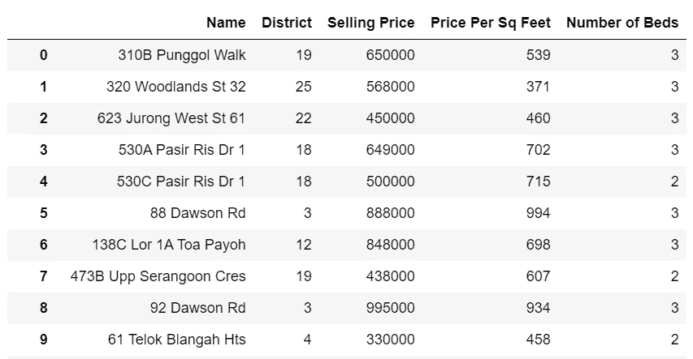

数据帧样本

对数据集执行一些描述性统计，这些是获得的值:

(所有美元均以新加坡元计价)

总销售计数= 9412
最低挂牌售价= 210000.0 美元
最高挂牌售价= 2074000.0 美元
平均挂牌售价= 595002.28 美元
中间挂牌售价= 575000.0 美元
出现频率最高的挂牌售价= 650000 美元
挂牌售价的偏斜度= 0.88

0.88 的偏斜度更接近于值 1，表明列表销售价格向右偏斜。

**最低和最高售价列表详情:**

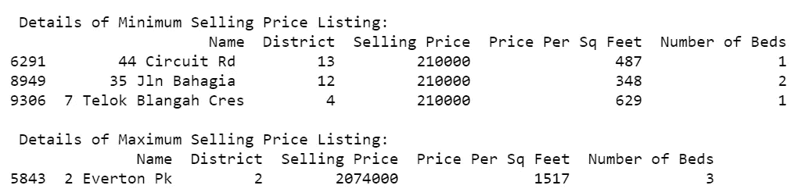

**按地区和频率统计的前 10 个销售列表:**

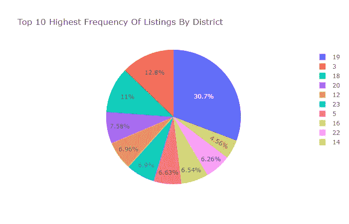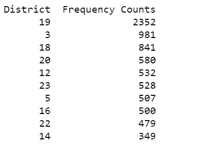

我们可以看到，大多数出售房源属于这三个地区:

*   第 19 区东北——HDB 位于*后港、丰国、胜康*
*   东北 3 区——HDB 位于皇后镇中巴鲁*亚历山德拉路*
*   远东 18 区——HDB 位于*塔姆派恩斯市西美镇的帕西尔里斯*

**按销售价格和频率统计的前 10 个销售列表:**

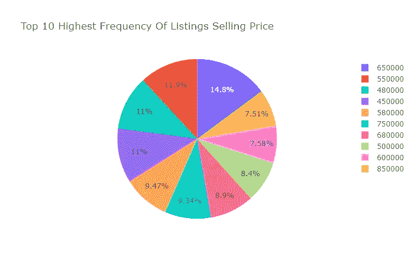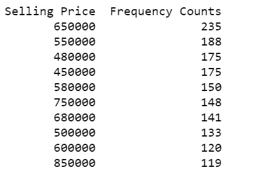

可视化 HDB 出售列表中卧室数量的频率分布:

**1 号卧室**

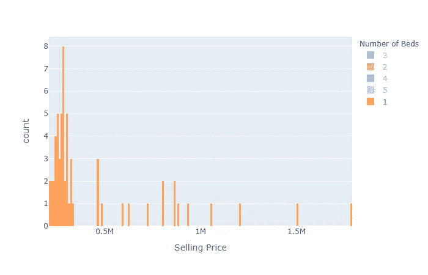

单卧室组屋售价的频率分布

**两间卧室**

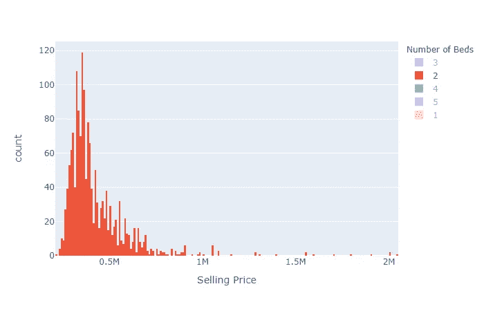

双卧室组屋售价的频率分布

**3 间卧室**

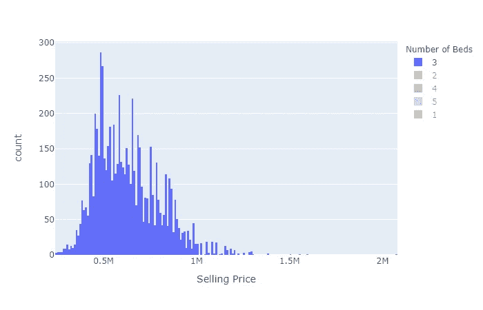

三居室组屋售价的频率分布

**4 间卧室**

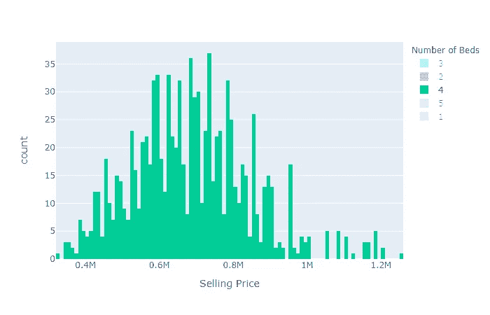

4 间卧室组屋售价的频率分布

**5 间卧室**

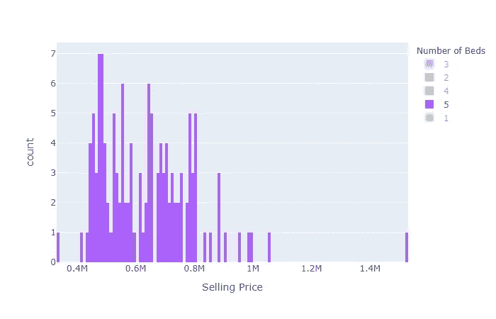

4 间卧室组屋售价的频率分布

**组合式(1-5 间卧室)**

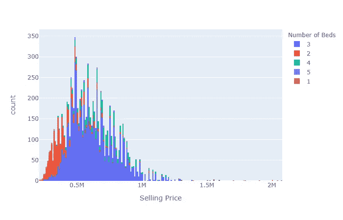

1-5 间卧室组屋售价的频率分布

根据上面的频率分布，我们可以看到数据集中所有销售列表的大部分要价的平均售价大约为 500000 美元到 600000 美元。大多数房源主要由 3 间卧室的单元组成。

**各地区待售卧室单元数量的频率分布:**

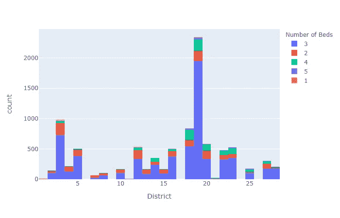

各地区待售卧室单元数量的频率分布

另一个频率分布让我们看到，大多数出售的**三居室**单元倾向于属于**第 19 区** *(后港、丰戈尔、桑康)*，其次是**第 3 区** *(亚历山德拉路、宗巴鲁、皇后镇)*和**第 18 区** *(帕西尔里斯、西美、坦帕因斯)*

**房源要价箱线图:**

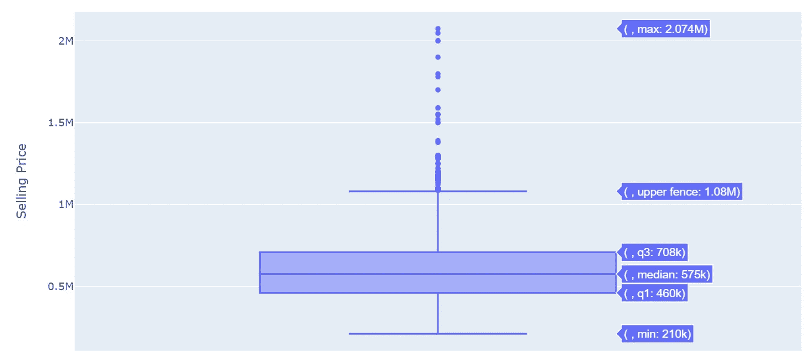

最后，我们将尝试使用数据集建立一些预测模型，以预测未来产品的销售价格。我们将尝试多元线性回归模型和决策树(回归)模型。

**多元线性回归**

我们的测试和训练集将由 20/80%的部分组成。

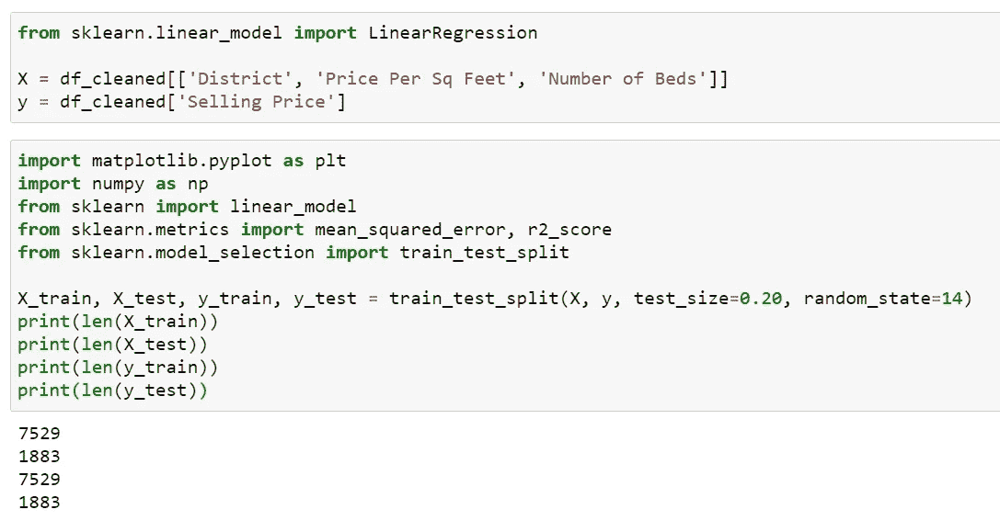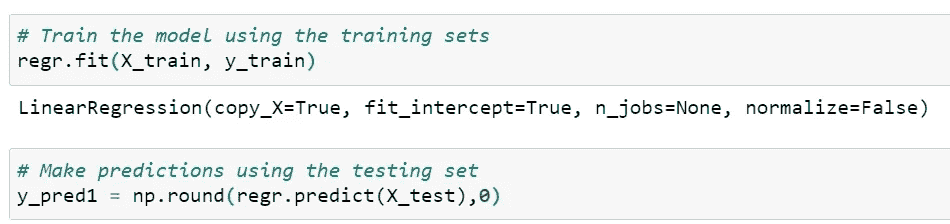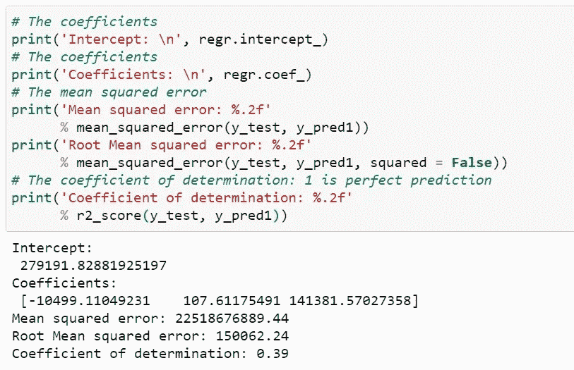

最后，我们用回归模型方程来预测 HDB 上市公司的销售价格:

预测值= 279191.81 - 10499.11( **区** ) + 107.61( **每平方英尺价格** ) + 141381.57( **床位数**)

我们的模型的 r [oot 均方误差](https://lzpdatascience.medium.com/performance-measures-of-predictive-models-5e387941ea26)为 150062.24，这可以在以后与我们的决策树模型进行比较时使用。(越低越好)此外，在 R 平方值的决定系数为 0.39 的情况下，自变量预测了 39%的因变量(目标)。(其中接近 1.0 代表完美匹配)

我们可以看到，我们的模型似乎过度预测了基于数据集值的销售价格，例如，使用变量来预测第 0 行的销售价格。

**预测结果:**

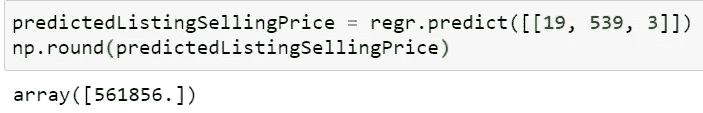

**实际结果:**

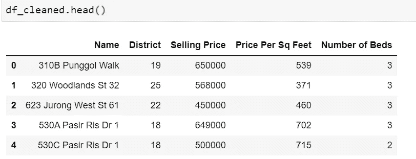

**其他实际与预测结果:**

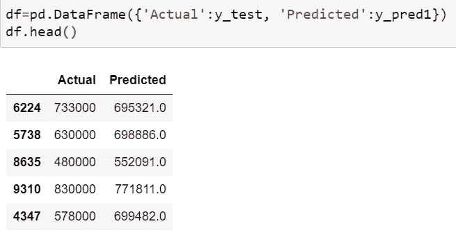

**回归决策树**

接下来，我们将使用销售测试和培训百分比对回归模型的决策树进行实验，并将其与之前的模型进行比较。

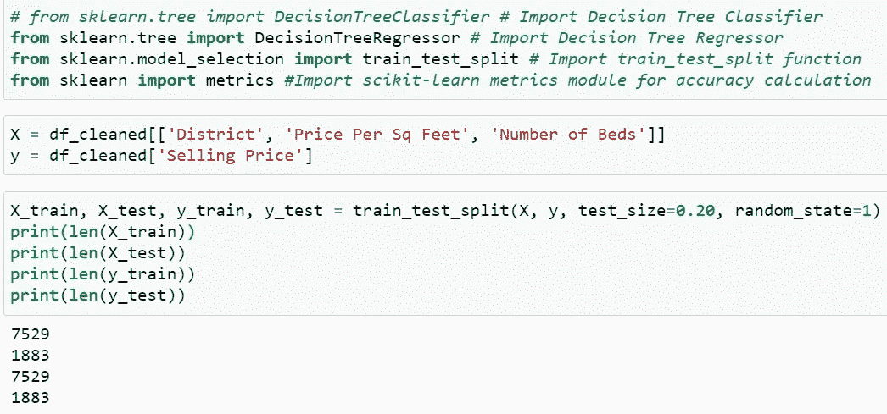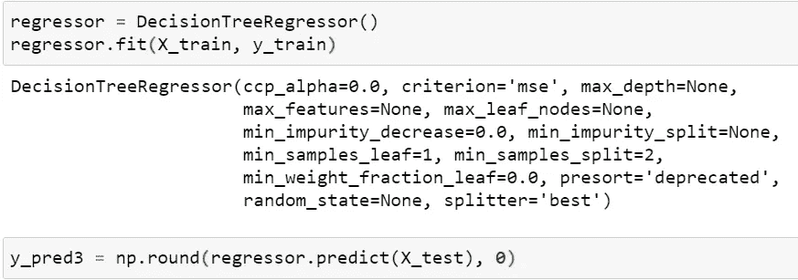

以及我们决策树模型的指标:

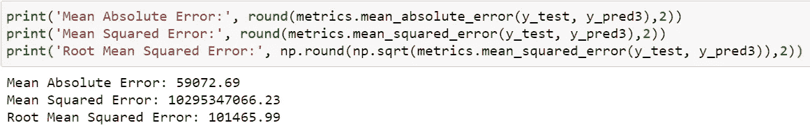

与我们之前的模型相比，决策树模型似乎具有更小的均方根误差，101465.99 比 150062.24。

**其他实际与预测结果:**

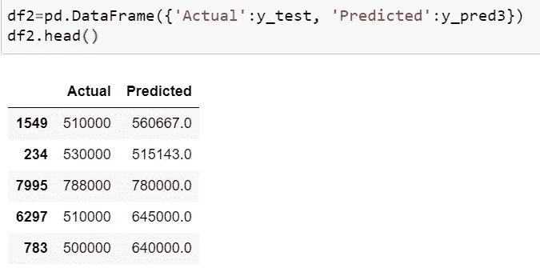

我们仍然可以看到模型在几行上高估和低估了。

最后，预测模型仍需要进一步微调以用于未来预测，并且仅用于解释目的。我希望你对在新加坡出售的 HDB 公寓的分析有了一些有趣的见解。

好奇的学习者？释放你在媒体上学习的全部潜力，用不到一杯咖啡的钱支持像我这样的作家。

 [## 通过我的推荐链接加入媒体——杰森·LZP

### 作为一个媒体会员，你的会员费的一部分会给你阅读的作家，你可以完全接触到每一个故事…

lzpdatascience.medium.com](https://lzpdatascience.medium.com/membership)