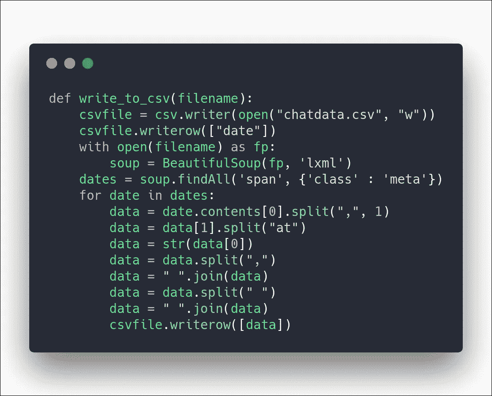

# 分析您的 Facebook Messenger 聊天

> 原文：<https://levelup.gitconnected.com/analysing-your-facebook-messenger-chat-a099b0c69652>

## 脸书对你的部分数据的洞察

脸书总是提供你的数据存档。剑桥分析公司数据泄露事件发生后，这一问题才浮出水面。在我看来，我觉得谷歌为一个用户存储的用户数据比脸书还多。我发现我所有的搜索都是由谷歌存储的，而不是在谷歌上，甚至是在 GitHub 等外部网站上。虽然这些数据可以被删除，但这些数据仍然存在，只需用户名和密码的组合，任何人都可以访问。

# **想法**

我被数据可视化迷住了，想要开始。所以在剑桥分析事件发生的几个月前，我想到要画一张我和我的脸书朋友聊天的图表。所以这个想法是绘制一天内发送或接收的信息总数。我通常用 [python](https://gitconnected.com/learn/python) 编码，并且知道一个绘图库`matplotlib`。

# 入门:收集聊天数据

所以最终在决定做什么和使用什么技术后，主要任务是从聊天中获取所有信息。一种想法是抓取完整的聊天记录，但抓取效率不高，而且在消息数以千计的情况下，抓取单个聊天记录需要几个小时。此外，这可能会暂时禁止我的 IP 地址，因为没有网站支持抓取。我在学习网络抓取时已经有过被 Reddit 临时封禁的经历，我不想再这样做了。

然后我想起脸书提供了一个用户数据档案，我试着尝试了一下。幸运的是，当我解压这个 zip 文件时，我发现了一个消息的 html 页面，其中列出了我在数据请求之前与每个人和组的所有聊天记录。每个名字都是一个 html 页面，包含与该用户的完整聊天内容。每个 html 的代码都被缩小了，所以为了分析那里写了什么，它必须被去统一。在分解 html 时，很明显，聊天的每个 html 文件中的代码都是通用格式的，每个消息都在一个带有“message”类的 div 中。消息 div 包含发送者姓名、消息时间戳和消息，每一项都包含在一个单独的 span 标记中。发送者的名字在具有类 user 的 span 中，时间戳在具有类 meta 的 span 中，消息内容在段落“p”标签中。

包含 chat.html 所需数据的代码块

# 步骤 1:提取邮件日期

现在我有了完整的 html 格式的聊天记录，只需要抓取它就可以得到数据。我使用 beautiful soup 获取每条消息的时间戳，并将这些数据转储到一个 csv 文件“chatdata.csv”中。这个过程只需要 4-5 秒钟，只有在有很多消息的情况下，否则几乎是即时的。到目前为止，csv 处于一个非常糟糕的状态，具有冗余值，即相同时间戳的多个行。

提取和导出邮件日期。

# 步骤 2:计算给定日期的邮件数

下一个任务是统计一天内发送的消息数量。我用熊猫图书馆做的。数据帧是完整的 csv。我使用`groupby`函数根据特定日期对行进行分组。在这一步之后，我将邮件发送的所有日期和当天发送的邮件数导出到“count.csv”中。剩下的唯一一步是按升序对日期进行排序，以便以有序的方式绘制图表。

# 步骤 3:对数据进行排序

通过使用 pandas 库中的`sort_values`函数，我按照日期的升序对上一步中的 count.csv 进行了排序。时间戳最初包含格式为`Sunday,April 8,2018 at 12:02pm UTC+5:30`的日期和时间。因此，在创建“chatdata.csv”时，我只从时间戳中提取了日期，在创建最终的 sorted.csv 时，使用 pandas 库中的`to_date`函数将日期转换为 YYYY-MM-DD 格式。“sorted.csv”是一个数据文件，它以日期的升序排列某一天的邮件数。剩下的最后一项任务是在图上绘制这两列。

对消息日期进行计数和排序

# 最后一步:绘制图形并运行脚本。

为了绘制数据，我使用了 matlplotlib 库。我在 x 轴上记录日期，在 y 轴上记录当天的消息数。

创建数据集和绘制图形的主函数

现在是时候测试 python 脚本了，瞧！输出显示在屏幕上。在不同的聊天中测试脚本并比较它们之间的图表是很有趣的。

样本输出图

完整脚本的源代码可以在 GitHub 上找到。

 [## 阿努帕姆-达加尔/数据-可视化-脸书-聊天

### 数据-可视化-脸书-聊天- Python 脚本来可视化你和你朋友的 Facebook 聊天

github.com](https://github.com/Anupam-dagar/Data-Visualisation-Facebook-Chat) 

代码是在很短的时间内编写的，因此有不好的变量命名和 3 个文件的创建。我相信生成的文件数量可以减少到 1 或 2 个，完整的代码可以通过加入更多的功能变得更好。此外，包含日期的 x 轴变得混乱，因为空间更小，日期长度更长，需要进行纠正。脚本目前只绘制了发送或接收消息的天数，没有发送或接收消息的任何一天都没有意义，即一天中有 0 条消息，如果这些天也适用，绘图会更好。欢迎任何对代码的贡献。

# 关于我

我叫阿努帕姆·达加尔。我是阿拉哈巴德印度信息技术学院的本科生。我正在攻读信息技术的学士学位。

当我没有大学作业的时候，我喜欢创造和学习新事物。我喜欢用 python 编程，最近开始接触 javascript 框架。

你可以在 [Twitter](https://twitter.com/siriusdagar) 和 [GitHub](https://github.com/Anupam-dagar) 上关注我。