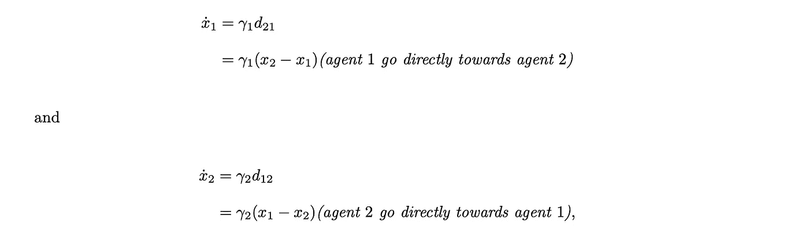
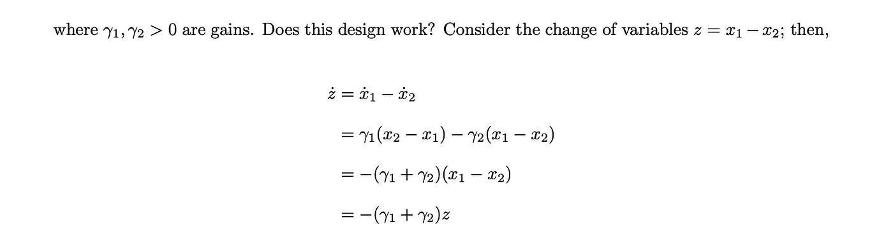
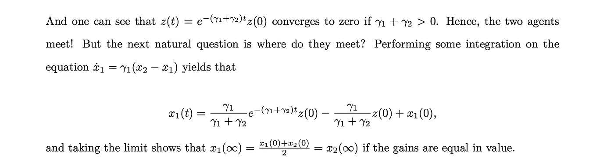
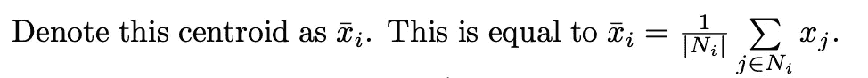
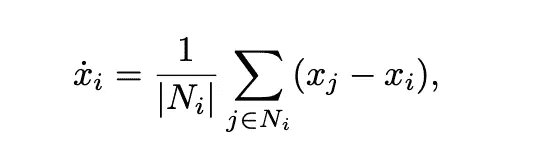

# N=2 个智能体会合问题的解析解

> 原文：<https://levelup.gitconnected.com/analytical-solution-to-the-rendezvous-problem-for-n-2-agents-f6d1ab60bc6e>

弗拉季斯拉夫·格鲁霍特科在 [Unsplash](https://unsplash.com/s/photos/robots-connecting?utm_source=unsplash&utm_medium=referral&utm_content=creditCopyText) 上的照片

在我最近的文章中，我介绍了多智能体系统的会合问题:

 [## 多智能体系统的会合问题

### 在上一篇文章中，我从较高的层面介绍了网络控制系统领域:

medium.com](https://medium.com/@CalebMBowyer/the-rendezvous-problem-for-multi-agent-systems-889bcfac870b) 

在本文中，我发展了数学来理解对于 N=2 个代理的简化设置，集合的解是什么。一旦理解了两个智能体的求解过程和控制规律，就很容易扩展到两个以上的智能体。对于两个代理，考虑标量状态 x_1 和 x_2，其动力学由下式给出:

这很有趣，因为在简单改变变量后，这个微分方程有了众所周知的指数解。此外，为了使两个代理会合，增益的总和必须服从正条件:

当 t 趋于无穷大时，x1(t)的极限告诉我们，当两个智能体的增益相等时，每个智能体到达两个智能体开始位置的中点。也许你预料到了这个结果；但是，也许你没有！

下一个自然要考虑的问题是，对于 N 个代理呢？直觉告诉我们，每个代理都应该瞄准我们邻居集合的质心，也就是我们所知的邻居集合。设 N_i 表示作为代理 I 的“邻居”的一组代理。

因此，对于任意数量的代理，建议的更新法则如下:

然而，邻域集的基数是随时间变化的，因为它依赖于代理 I 当前能感知到的其他代理，并且随着代理开始移动到集合点而变化！用于每个代理的这种更新控制法则的一些其它特征是它是局部的和可扩展的。更新控制法则是局部的，因为它仅使用使用邻居信息的相对距离。它是可扩展的，因为没有代理需要全局信息，每个局部控制器不需要知道系统中的每个状态，甚至每个相对距离对。

在本文中，我们已经分析性地看到，当 N=2 时，驱使一个代理向它的邻居移动是可行的，但是我们仍然不知道这个想法是否适用于任意数量的代理。在我的下一篇文章中，我将为不同数量的代理 N=2、3 和更高数量的代理编写所提出的控制律，以查看从不同初始位置(随机和结构化)观察到的整个系统的行为。你认为会合会实现吗？会不会有些代理人误入歧途？敬请期待一探究竟！

直到下一次，

凯勒。

考虑成为一个媒体成员，永远不会错过我的故事。无限制地访问我的作品和其他作者的作品:

 [## 加入我的介绍链接媒体-迦勒鲍耶

### 阅读凯莱布·m·鲍耶(以及媒体上成千上万的其他作家)的每一个故事。您的会员费直接支持…

medium.com](https://medium.com/@CalebMBowyer/membership) 

# 分级编码

感谢您成为我们社区的一员！在你离开之前:

*   👏为故事鼓掌，跟着作者走👉
*   📰查看[级编码出版物](https://levelup.gitconnected.com/?utm_source=pub&utm_medium=post)中的更多内容
*   🔔关注我们:[推特](https://twitter.com/gitconnected) | [LinkedIn](https://www.linkedin.com/company/gitconnected) | [时事通讯](https://newsletter.levelup.dev)

🚀👉 [**软件工程师的顶级工作**](https://jobs.levelup.dev/jobs?utm_source=pub&utm_medium=post)