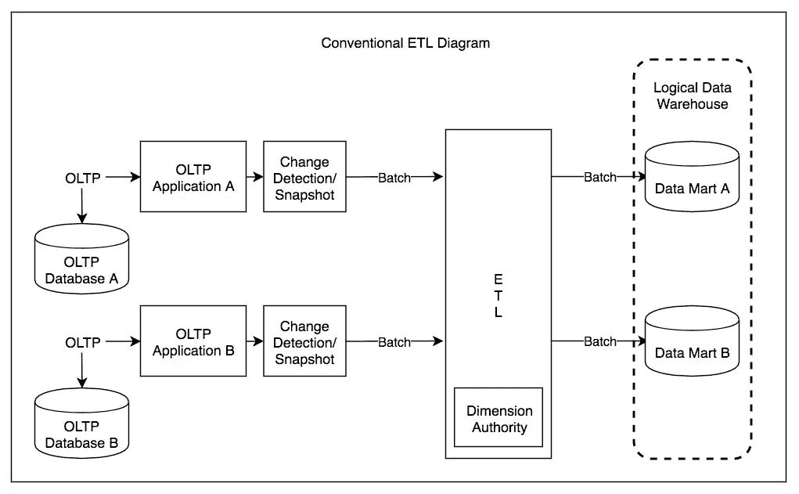
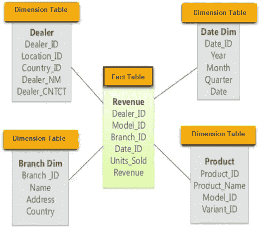
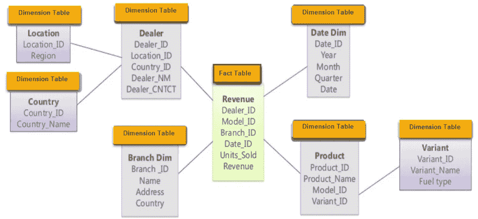

# 分析与交易处理

> 原文：<https://levelup.gitconnected.com/analytics-vs-transactional-processing-1118915a0ea7>

## OLTP、OLAP、星星和雪花

在 [Unsplash](https://unsplash.com/s/photos/snowflake-star?utm_source=unsplash&utm_medium=referral&utm_content=creditCopyText) 上由[zdenk macha ek](https://unsplash.com/@zmachacek?utm_source=unsplash&utm_medium=referral&utm_content=creditCopyText)拍摄的照片

在商业数据处理的早期，对数据库的写操作通常对应于发生的商业交易:销售、向供应商下订单、支付员工工资等。事务不涉及货币交换，但术语事务是停滞的，指的是构成逻辑单元的一组读取和写入。

即使数据库开始用于许多不同类型的数据注释，例如博客帖子、游戏中的动作、地址簿中的联系人等。，基本的访问模式仍然类似于处理业务事务。应用程序通常使用索引通过某些键来查找少量记录。根据用户输入插入或更新记录。由于这些应用是交互式的，所以访问模式被称为 ***在线事务处理*** (OLTP)。

然而，数据库也开始越来越多地用于数据分析，其访问模式非常不同。通常，分析查询需要扫描大量记录，只读取每条记录的几列，然后计算汇总统计数据(如计数、求和或平均)，而不是将原始数据返回给用户。例如，如果您的数据是销售交易表，则分析查询可能是:

*   我们每个商店二月份的总收入是多少？
*   在最近的促销活动中，我们比平时多卖了多少苹果？
*   哪个品牌的食物最常与芥末一起购买？

这些查询通常由业务分析师编写，并输入到帮助公司管理层做出更好决策的报告中(商业智能)。为了将这种使用数据库的模式与事务处理区分开来，它被称为*(OLAP)*

*起初，相同的数据库用于事务处理和分析查询。事实证明，SQL 在这方面非常灵活:它既适用于 OLTP 类型的查询，也适用于 OLAP 类型的查询。然而，在 20 世纪 80 年代末和 90 年代初，有一种趋势是公司不再使用他们的 OLTP 系统进行分析，而是在单独的数据库上运行分析。这个独立的数据库称为数据仓库。*

## ***数据仓库***

*公司可能有几十种不同的交易处理系统:支持面向客户的网站的系统、实体店的销售点(结账)系统、仓库的库存跟踪、车辆的路线规划、供应商、员工的管理等。这些系统都很复杂，需要一组人来维护，所以这些系统最终基本上都是彼此独立运行的。*

*这些 OLTP 系统通常被期望具有高可用性，并且能够以低延迟处理事务，因为它们通常对业务运营至关重要。因此，数据库管理员密切保护他们的 OLTP 数据库。他们通常不愿意让业务分析师在 OLTP 数据库上运行专门的分析查询，因为这些查询通常很昂贵，并且会扫描大部分数据集，这可能会损害并发执行事务的性能。*

*相比之下， ***数据仓库*** 是一个独立的数据库，分析师可以在不影响 OLTP 操作的情况下查询其内部内容。数据仓库包含公司各种 OLTP 系统中数据的只读副本。从 OLTP 数据库中提取数据(使用定期数据转储或连续更新流)，将其转换为易于分析的模式，清理它，然后将其加载到数据仓库中。将数据放入仓库的过程称为 ***提取-转换-加载*** (ETL)。*

**

*图片来自维基百科*

*现在，几乎所有的大型企业都有数据仓库，但在小型企业中，几乎闻所未闻。这可能是因为大多数小公司没有很多不同的 OLTP 系统，大多数小公司的数据量都很小。小到可以在常规 SQL 数据库中查询，甚至可以在电子表格中分析。在大公司，做一些在小公司很简单的事情，需要做很多繁重的工作。*

*使用单独的数据仓库而不是直接查询 OLTP 系统进行分析的一个很大的优点是，数据仓库可以针对分析访问模式进行优化。*

## *OLTP 数据库和数据仓库的区别*

*数据仓库的数据模型通常是关系型的，因为 SQL 通常非常适合分析查询。有许多图形数据分析工具可以生成 SQL 查询、可视化结果并允许分析师浏览数据(通过钻取、切片和切割等操作)。*

*从表面上看，数据仓库和关系型 OLTP 数据库看起来很相似，因为它们都有 SQL 查询接口。然而，系统的内部可能看起来完全不同，因为它们针对非常不同的查询模式进行了优化。许多数据库供应商现在专注于支持事务处理或分析工作负载，但他们无法同时支持这两者。*

*某些数据库(如 Microsoft SQL Server 和 SAP HANA)在同一产品中支持事务处理和数据仓库。然而，它们越来越成为两个独立的存储和查询引擎，恰好可以通过一个公共 SQL 接口访问。*

*数据仓库供应商(如 Teradata、Vertica、SAP HANA 和 ParAccel)通常在昂贵的商业许可下销售他们的系统。亚马逊红移是 ParAccel 的托管版。最近有很多开源的基于 SQL 的 Hadoop 项目。他们很年轻，但目标是与商业数据仓库系统竞争。其中包括 Apache Hive、Spark SQL、Cloudera Impala、脸书 Presto、Apache Tajo 和 Apache Drill。其中一些是基于谷歌 Dremel 的想法。*

## *星星和雪花图式*

*许多数据仓库以一种相当公式化的方式使用，称为*(也称为维度建模)。**

**下面的示例模式是使用 start 模式模式建模的。该模式的中心是所谓的*事实表*。事实表的每一行代表在特定时间发生的事件。**

****

**图片来自 guru99.com**

**通常，这些事实是作为单个事件捕获的，因为这为以后的分析提供了最大的灵活性。然而，这意味着事实表会变得非常大。像苹果、沃尔玛或易贝这样的大公司的数据仓库中可能有几十 Pb 的交易历史，其中大部分实际上都是表。**

**事实表中的一些列是属性，例如产品的销售量和收入。事实表中的其他列是对其他表(称为维度表)的外键引用。因为事实表中的每一行都代表一个事件，所以维度代表事件的人员、事件、位置、时间、方法和原因。**

**甚至日期和时间通常也由维度表表示，因为这可以对有关日期的其他信息(如公共假日)进行编码，以便查询可以区分假日和非假日期间的销售。**

**“星型模式”这个名字来源于这样一个事实:当可视化表关系时，事实表位于中间，并被它的维度表所包围；与这些表的联系就像星星的光。**

****

**图片来自 guru99.com**

**这种模板的一种变体被称为 ***雪花*** 图案，其中大小被进一步细分为多个子维度。例如，品牌和产品类别可能有单独的表，维度产品表中的每一行都可以将品牌和类别作为外键引用，而不是将它们作为字符串存储在表中。雪花模式比星型模式更规范化，但是星型模式通常更受欢迎，因为它们更便于分析师使用。**

**在一个典型的数据仓库中，表通常非常宽:事实表通常有 100 多列，有时有数百列。维度表也可能非常宽，因为它们包含可能与分析相关的所有元数据。**

## **最后的想法**

**OLTP 系统通常是面向用户的，这意味着它们可能会看到大量的请求。为了处理负载，应用程序通常只处理每个查询中的一些记录。应用程序使用某个键来请求记录，存储引擎使用索引来查找所请求键的数据。磁盘寻道时间通常是这里的瓶颈。**

**数据仓库和类似的分析系统鲜为人知，因为它们主要由业务分析师而不是最终用户使用。与 OLTP 系统相比，它们处理的查询要少得多，但对每个查询的要求通常很高，需要在短时间内扫描数百万条记录。磁盘带宽(而不是寻道时间)通常是这里的瓶颈。**