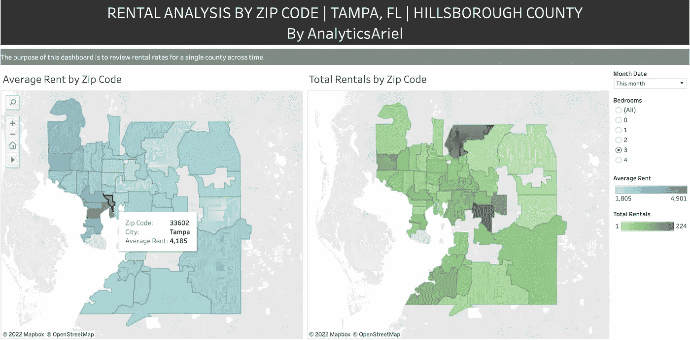
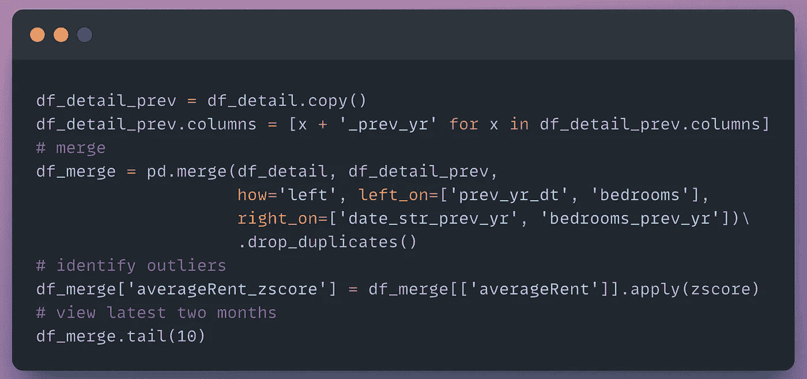

# 在 Python 中按邮政编码分析租金数据

> 原文：<https://levelup.gitconnected.com/analyze-rent-data-by-zip-code-in-python-3850723ba4e6>

## Python 教程获取一个县的历史租赁数据并在 Tableau 中可视化

艾伦·索萨在 [Unsplash](https://unsplash.com/photos/xlCmFoIS3oE) 上的照片

***租金价格和库存的租赁数据是衡量给定区域的供应、需求和市场趋势的有用信息。***

有很多免费发布租金数据的来源。这包括[美国人口普查](https://www.census.gov/topics/housing.html)和 [Zillow 研究数据](https://www.zillow.com/research/data/)。

这些免费来源的共同问题是:*陈旧的*数据(超过 1 年的过期数据)、有限的地理位置(只有城市或国家数据)或没有考虑到资产特征的平均统计数据。

***月度数据要紧！***

经济、政治和/或季节变化可能发生在一个地理区域内。这可以刺激租赁人口的内向或外向迁移。

陈旧的数据不会代表*当前的市场租赁价格。这可能会伤害那些定价过低或过高的投资者。*

****位置数据要紧！****

*分析城市或县一级的租赁数据会排除具有较低或较高质量特征的物业区域。*

*例如，一个拥有多个城镇的“海滨城市”，对于拥有滨水物业和非滨水物业的城镇，其租金价格会有很大的不同。*

**

*作者创建的图像*

*卧室的数量很重要！*

*如果你是一名房地产投资者，平均租金假设可能会错误地扭曲你对一处房产是否会产生现金流的分析。租金根据房产中卧室的数量而有所不同。*

**

*作者创建的图像*

****我们如何在邮政编码层面获得更好的租金数据？****

*我们可以从公共房地产网站上搜集出租房源。*

*我们能做得更好吗？网页抓取很繁琐！*

*是啊！我们可以使用面向公众的房地产网站的 API。我们可以查询和消费结构化数据。*

****我们可以得到什么类型的数据？****

*按房间数量划分的邮政编码级别的月度合计租金数据。*

****此帖子将使用 Python 获取单个邮政编码和单个县中所有邮政编码的租赁数据。****

**

*作者在 [Tableau 仪表板](https://public.tableau.com/app/profile/ariel.herrera5041/viz/RentalAnalysisbyZipCodeTampaFL/MainDashboard)中创建的图像*

# *问题陈述*

*我们需要获得美国佛罗里达州坦帕市希尔斯伯勒县每个邮政编码的 ***租赁市场价格*** 。*

*租赁市场数据将包括按月份、邮政编码和卧室数量划分的租赁库存和租赁价格。*

*这将使我们能够分析整个市场的邮政编码租赁数据。*

# *数据源*

*我们将使用 [Realty Mole 的 API](https://rapidapi.com/realtymole/api/realty-mole-property-api/) 来获取租金数据。*

*这个 API 已经为我们做了网页抓取。它每月提供邮政编码级别的综合租赁市场价格数据。*

**声明:我不是 API 的创建者，我只是一个消费者。**

# *先决条件*

1.  *[注册免费快速 API 账户](https://docs.rapidapi.com/docs/consumer-quick-start-guide)获取 API 密钥*

*[Realty Mole 的 API](https://rapidapi.com/realtymole/api/realty-mole-property-api/) 提供了订阅 **50 个免费 API 信用/ mo** 的选项(一个 API 信用=一个 API 调用)。*

**

*作者图片(截图来自[快速 API 定价](https://rapidapi.com/realtymole/api/realty-mole-property-api/pricing))*

1.  *[注册 RapidAPI 的步骤](https://docs.rapidapi.com/docs/consumer-quick-start-guide)*
2.  *订阅[房地产鼹鼠 API](https://rapidapi.com/realtymole/api/realty-mole-property-api/)*

# *支持视频*

*跟随我的 Python 教程视频。*

*视频输出(作者在 [AnalyticsAriel YouTube](https://www.youtube.com/c/analyticsariel) 频道上的视频)*

# *Python 教程*

*如果您没有现有的 Python 环境，那么我强烈建议首先用**克隆笔记本**(在文章的底部)。*

*这将允许您在 Google Colab 中运行 Python 代码(免费！).它是一个基于云的环境，让您无需在本地安装 Python 就可以运行代码。*

# *I .导入库*

*首先，导入所需的库。*

**

*导入的代码片段(作者使用 snappify.io 创建的图片)*

# *二。局部变量和常量*

*注册一个免费的 [RapidAPI 账户](https://docs.rapidapi.com/docs/consumer-quick-start-guide)并订阅 [RealtyMole API](https://rapidapi.com/realtymole/api/realty-mole-property-api/) 。*

*创建一个变量来保存我们的 API 键。*

**

*API 键的代码片段(作者使用 snappify.io 创建的图片)*

# *三。数据*

## *单一租赁邮政编码搜索*

*让我们从检索单个邮政编码 的 ***租赁数据开始。****

*要从 API 请求数据，我们只需要提供邮政编码**和**。*

**

*代码片段(作者使用 snappify.io 创建的图片)*

*在我们的 JSON 响应中，我们得到了租赁数据的冗长响应，其中包括:*

*   ***汇总**:当月市场租金和库存*
*   ***详细**:每间卧室的最低/最高/平均租金*
*   ***历史**:前几个月的详细数据*

**

*代码输出(作者创建的截图)*

****让我们把这个数据集转换成 pandas DataFrame(行和列)。****

*这将允许我们以表格的形式查看数据，以便以后下载。*

**

*代码片段(作者使用 snappify.io 创建的图片)*

*对于我们的单个邮政编码，我们有 141 列数据！哇！*

**

*代码输出(作者创建的截图)*

*让我们通过查看 ***历史租赁数据*** 来进一步解开这个数据集。*

## *查看历史租赁数据*

*为了查看历史租赁数据，我们将创建一个新的数据框架。*

*我们关注的是 DataFrame 中包含 ***详细*** 或 ***历史*** 数据的列。对于这些列中的每一列，我们将嵌套字典转换为子表，并将其追加回新的数据帧列表。*

**

*代码片段(作者使用 snappify.io 创建的图片)*

*我们将租赁历史数据的所有子表连接成一个数据框架。*

**

*代码片段(作者使用 snappify.io 创建的图片)*

*pandas 的方法 ***head()*** 允许我们查看新数据帧中的前 5 行。*

*我们现在有按卧室、月份和邮政编码分类的历史租赁数据。*

**

*代码输出(作者创建的截图)*

*但是从我们的预告中可以看到有 ***坏数据*** 。我们的三居室最大租金数据是 49，900 美元！这似乎是不对的！*

*让我们为*添加特征以移除异常值。**

## **添加功能**

**我们向数据集添加了两个要素:**

1.  ****年同比(YoY)统计** —执行左连接，将前几年的租金附加到当前数据框架中**
2.  ****平均租金 z 值** —确定我们的价值是否位于正态分布曲线之外，[关于 z 值的更多信息](https://www.statisticshowto.com/probability-and-statistics/z-score/)**

****

**代码片段(作者使用 snappify.io 创建的图片)**

**我们的 ***zscore 特性*** 允许我们识别数据集中的异常值。**

****

**代码输出(作者创建的截图)**

**让我们过滤数据集:**

*   **仅包括 4 间卧室或更少**
*   **移除平均异常值**

**此外，我们还计算了另外两个特征来确定平均租金和总租金同比变化。**

****

**代码片段(作者使用 snappify.io 创建的图片)**

**我们清理过的数据集的预览:**

****

**代码输出(作者创建的截图)**

**太好了，我们能够检索一个邮政编码的租赁市场数据，并清理详细/历史数据。**

*****现在是时候将同样的逻辑应用于美国某个县的邮政编码列表了。*****

## **多租赁邮政编码搜索**

**从 Github 的 ***geo-data.csv*** 文件中读取美国各州县、城市和邮政编码的完整列表。**

****

**代码片段(作者使用 snappify.io 创建的图片)**

**有大约 33K 的邮政编码。**

****

**代码输出(作者创建的截图)**

**让我们将数据集过滤到我们关心的县和州—佛罗里达州坦帕市希尔斯伯勒县。**

****

**代码片段(作者使用 snappify.io 创建的图片)**

**在数据集中有几个*无效的邮政编码*。**

****

**代码输出(作者创建的截图)**

**仅过滤有效的邮政编码。**

****

**代码片段(作者使用 snappify.io 创建的图片)**

**对于我们的希尔斯伯勒县，我们将检索 45 个邮政编码的租赁市场数据。**

****

**代码输出(作者创建的截图)**

******打开页面下方的 Github 笔记本使用检索租赁数据的功能******

**遍历列表中的每个邮政编码，获取并转换租金数据。**

**在每个邮政编码后暂停 1 秒钟，以免 web 服务器过载。**

****

**代码片段(作者使用 snappify.io 创建的图片)**

**查看我们的结果—所有 45 个邮政编码的数据！**

****

**代码输出(作者创建的截图)**

**现在我们有了希尔斯伯勒县所有邮政编码的租赁数据！**

**我们可以使用像 Tableau 这样的可视化工具来进一步分析我们的数据。**

# **不及物动词形象化**

**查看我的 ***tableau 公共仪表板*** 上传您的邮政编码租赁数据文件并查看市场趋势。**

**视频输出(作者在 [AnalyticsAriel YouTube](https://www.youtube.com/c/analyticsariel) 频道上的视频)**

# **结论**

**利用 API 是检索出租清单等面向公众的数据的好方法。**

**使用租赁数据集和可视化工具(如 Tableau)可以洞察房地产市场的表现和未来趋势。**

**查看我的 [YouTube 频道——analytics Ariel](https://youtube.com/c/analyticsariel),了解更多关于房地产数据源和数据分析的信息！**

# **克隆笔记本**

** [## 主分析处的 projects/realtymole _ rent _ all _ zip codes _ for _ county . ipynb

### https://analyticsariel.com/.通过在 GitHub 上创建帐户，为 analyticsariel/projects 开发做出贡献。

github.com](https://github.com/analyticsariel/projects/blob/master/rental_estimates/realtymole_rent_all_zipcodes_for_county.ipynb) 

[https://public . tableau . com/app/profile/Ariel . Herrera 5041/viz/rentalanalysisbyipcodetampafl/main dashboard](https://public.tableau.com/app/profile/ariel.herrera5041/viz/RentalAnalysisbyZipCodeTampaFL/MainDashboard)

# 来源

 [## Realty Mole 属性 API 文档(realtymole) | RapidAPI

### 免费增值即时访问 1.4 亿多条房产记录、业主详细信息、房屋价值和租金估算、活跃的…

rapidapi.com](https://rapidapi.com/realtymole/api/realty-mole-property-api/) 

# 分级编码

感谢您成为我们社区的一员！在你离开之前:

*   👏为故事鼓掌，跟着作者走👉
*   📰查看更多内容请参见[升级编码刊物](https://levelup.gitconnected.com/?utm_source=pub&utm_medium=post)
*   🔔关注我们:[Twitter](https://twitter.com/gitconnected)|[LinkedIn](https://www.linkedin.com/company/gitconnected)|[时事通讯](https://newsletter.levelup.dev)

🚀👉 [**加入升级人才集体，找到一份神奇的工作**](https://jobs.levelup.dev/talent/welcome?referral=true)**