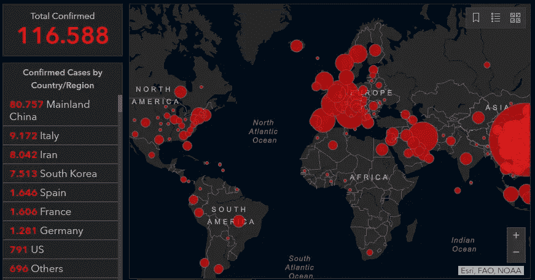
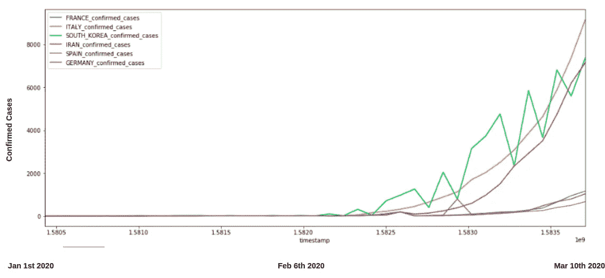
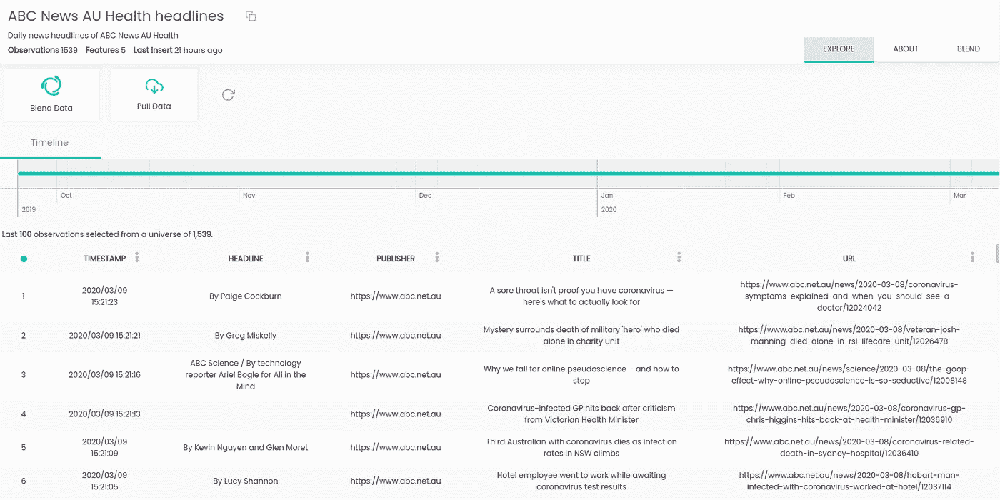
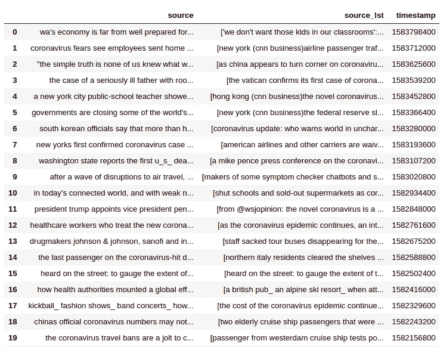
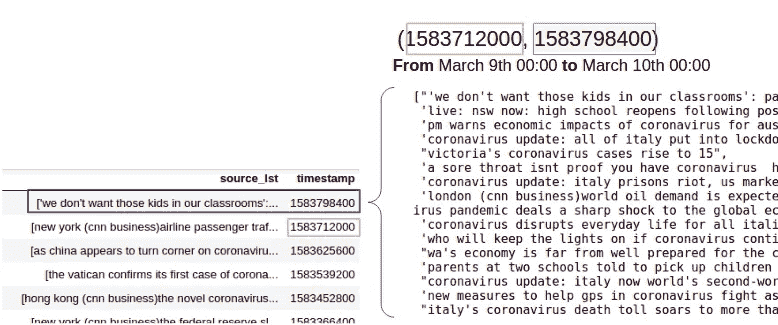
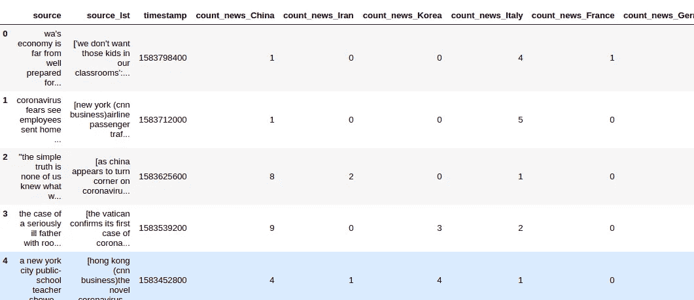
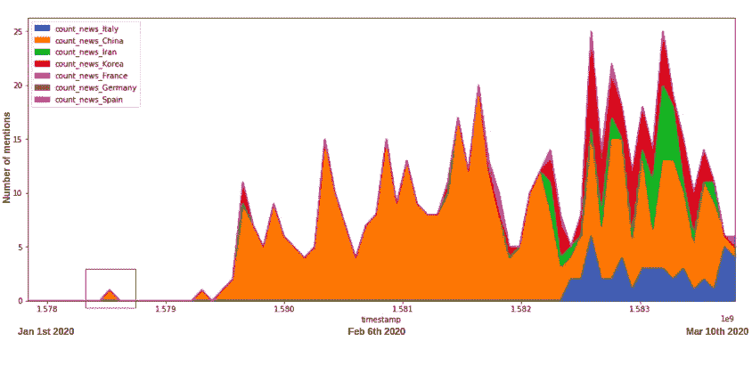
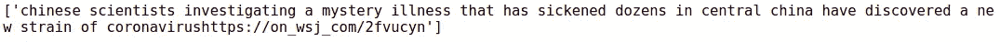
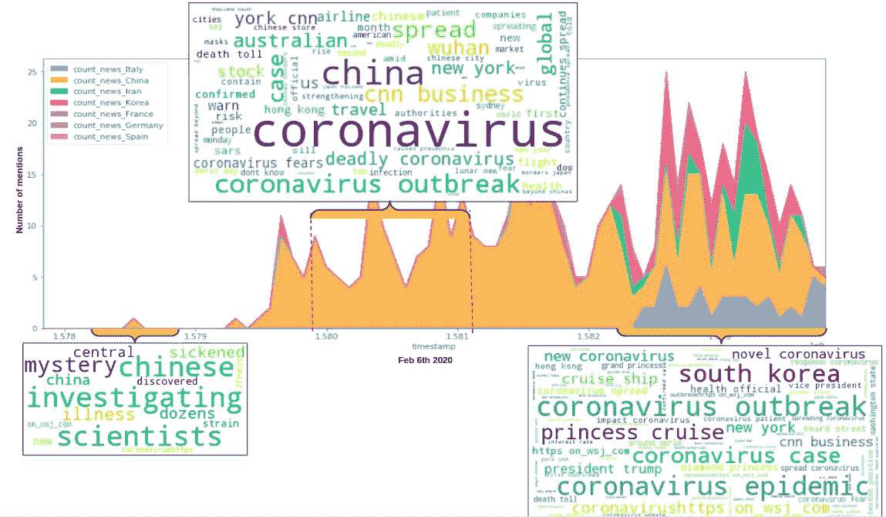
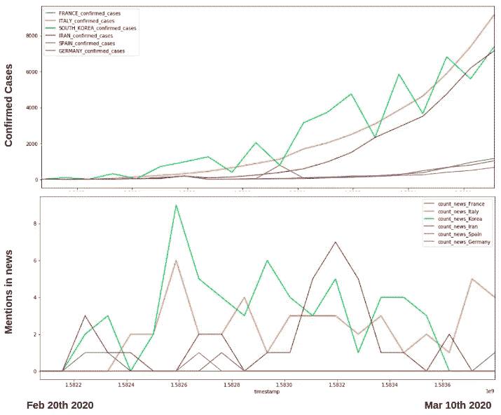

# 分析新冠肺炎确诊病例与新闻(使用 Python)

> 原文：<https://levelup.gitconnected.com/analyzing-covid-19-confirmed-cases-vs-news-using-python-ca6576290645>

## 简单是关键。

# 目标

最近爆发的冠状病毒疾病确诊令人担忧。我们的目标是将**新闻报道**与相关国家的**确诊病例**联系起来:

*中国*，*意大利*，*韩国*，*伊朗*，*法国*，*德国*，*西班牙*。



摘自 CSSE 新冠肺炎[现场图](https://gisanddata.maps.arcgis.com/apps/opsdashboard/index.html#/bda7594740fd40299423467b48e9ecf6)

*   *我们不得不* ***感谢 CSSE*** *将所有信息汇总到这张* [*令人惊叹的实时地图*](https://gisanddata.maps.arcgis.com/apps/opsdashboard/index.html#/bda7594740fd40299423467b48e9ecf6) *中，我们从中提取了数据。*

截至今天(2020 年 3 月 10 日)已有超过**116588 例确诊病例**和超过**例 4K 死亡**。

这篇文章的目的是**获得关于新冠肺炎的主动可见性**，并作为进一步研究的平台。

# 步伐

*   第一步:设置技术**先决条件**
*   第二步:收集新冠肺炎确诊病例
*   第三步:收集 COVID 的消息
*   第四步:比较和总结

# 第一步。先决条件

*   安装 Python 2.6+或 3.1+版本
*   安装 pandas，matplotlib，openblender 和 wordcloud(带 pip)

```
$ pip install pandas OpenBlender matplotlib wordcloud
```

# 第二步。收集新冠肺炎确诊病例

这些数据杂乱无章，而且存在于许多不同的数据集上，所以我对其进行了分类，并上传到 OpenBlender，为每个国家创建了一个数据集**:[中国](https://openblender.io/#/dataset/explore/5e66f5a09516291ea9386d81)，[韩国](https://openblender.io/#/dataset/explore/5e66f5ab9516291eaa43a46c)，[伊朗](https://openblender.io/#/dataset/explore/5e66f5a99516291eaa43a442)，[法国](https://openblender.io/#/dataset/explore/5e66f5ad9516291ea9386e91)，[德国](https://openblender.io/#/dataset/explore/5e66f5af9516291eaa43a4b8)，[西班牙](https://openblender.io/#/dataset/explore/5e66f5b29516291eaa43a4fd)和[意大利](https://openblender.io/#/dataset/explore/5e66f5829516291eaa439f4e)。**

**但是**我们只想要每一个中的‘确诊病例’**特征，所以让我们**混合所有这些**，并且只得到那些在**单个数据集**中的列，按 24 小时间隔聚集:**

```
# First we import all the libraries to be used
import OpenBlender
import pandas as pd
import json
from matplotlib import pyplot as plt
from os import path
from PIL import Image
from wordcloud import WordCloud, STOPWORDS, ImageColorGenerator
%matplotlib inlineaction = 'API_getObservationsFromDataset'# ANCHOR: 'COVID19 Italy confirmed Cases'
# BLENDS: 'COVID19 Mainland China confirmed Cases', 'COVID19 South Korea confirmed Cases', 'COVID19 France confirmed Cases', 'COVID19 Spain confirmed Cases', 'COVID19 Germany confirmed Cases', 'COVID19 Iran confirmed Cases'

parameters = { 
 'token':'**YOUR_TOKEN_HERE**',
 'id_dataset':'5e66f5829516291eaa439f4e',
 'consumption_confirmation':'on',
 'aggregate_in_time_interval':{"output":"avg","empty_intervals":"impute","time_interval_size":86400},
 'blends':[{"id_blend":"5e66f5a09516291ea9386d81","restriction":"None","aggregate_in_time_interval":{"empty_intervals":"impute","output":"avg","time_interval_size":86400},"blend_type":"ts","drop_features":["countryregion","deaths","last_update","latitude","longitude","provincestate","recovered"]},{"id_blend":"5e66f5ab9516291eaa43a46c","restriction":"None","aggregate_in_time_interval":{"empty_intervals":"impute","output":"avg","time_interval_size":86400},"blend_type":"ts","drop_features":["countryregion","deaths","last_update","latitude","longitude","provincestate","recovered"]},{"id_blend":"5e66f5ad9516291ea9386e91","restriction":"None","aggregate_in_time_interval":{"empty_intervals":"impute","output":"avg","time_interval_size":86400},"blend_type":"ts","drop_features":["countryregion","deaths","last_update","latitude","longitude","provincestate","recovered"]},{"id_blend":"5e66f5b29516291eaa43a4fd","restriction":"None","aggregate_in_time_interval":{"empty_intervals":"impute","output":"avg","time_interval_size":86400},"blend_type":"ts","drop_features":["countryregion","deaths","last_update","latitude","longitude","provincestate","recovered"]},{"id_blend":"5e66f5af9516291eaa43a4b8","restriction":"None","aggregate_in_time_interval":{"empty_intervals":"impute","output":"avg","time_interval_size":86400},"blend_type":"ts","drop_features":["countryregion","deaths","last_update","latitude","longitude","provincestate","recovered"]},{"id_blend":"5e66f5a99516291eaa43a442","restriction":"None","aggregate_in_time_interval":{"empty_intervals":"impute","output":"avg","time_interval_size":86400},"blend_type":"ts","drop_features":["countryregion","deaths","last_update","latitude","longitude","provincestate","recovered"]}] 
}df_confirmed = pd.read_json(json.dumps(OpenBlender.call(action, parameters)['sample']), convert_dates=False, convert_axes=False).sort_values('timestamp', ascending=False)
df_confirmed.reset_index(drop=True, inplace=True)
df_confirmed.head()
```

*****注意**:要获得令牌，你*需要*在 [openblender.io](https://www.openblender.io/#/welcome/or/34) (免费)上创建一个帐户，你可以在你的个人资料图标的“帐户”标签中找到它。**

**上面发生的事情是，**我们选择意大利数据集作为锚点，并混合所有其他数据集**，丢弃除“已确认”特征之外的所有特征，因此现在我们下载了单个数据集，其中所有列**按时间**混合。**

**让我们清理一下，并按国家绘制**确诊病例:****

```
df_confirmed['FRANCE_confirmed_cases'] = df_confirmed['COVID19_FRANCE_CONFI_confirmed']
df_confirmed['ITALY_confirmed_cases'] = df_confirmed['confirmed']
df_confirmed['SOUTH_KOREA_confirmed_cases'] = df_confirmed['COVID19_SOUTH_KOREA__confirmed']
df_confirmed['IRAN_confirmed_cases'] = df_confirmed['COVID19_IRAN_CONFIRM_confirmed']
df_confirmed['SPAIN_confirmed_cases'] = df_confirmed['COVID19_SPAIN_CONFIR_confirmed']
df_confirmed['GERMANY_confirmed_cases'] = df_confirmed['COVID19_GERMANY_CONF_confirmed']
df_confirmed['CHINA_confirmed_cases'] = df_confirmed['COVID19_MAINLAND_CHI_confirmed']
df_confirmed.reindex(index=df.index[::-1]).plot(x = 'timestamp', y = [col for col in df_confirmed.columns if 'confirmed_cases' in col], figsize=(17,7))
```

**中国的数据好像不太靠谱，我们过滤一下吧。**

```
cols_interest = ['FRANCE_confirmed_cases', 'ITALY_confirmed_cases', 'SOUTH_KOREA_confirmed_cases', 'IRAN_confirmed_cases','SPAIN_confirmed_cases','GERMANY_confirmed_cases']
df_confirmed.reindex(index=df.index[::-1]).plot(x = 'timestamp', y = cols_interest, figsize=(17,7))
```

****

**这里我们可以看到伊朗、意大利和韩国确诊病例的爆发。我们还可以看到西班牙、法国和德国开始崛起为 T21。**

# **第三步。从 COVID 收集新闻**

**我们将从这些来源收集 COVID 新闻和文本:[美国广播公司新闻](http://5d8848e59516294231c59581)，[华尔街日报](https://www.openblender.io/#/dataset/explore/5e2ef74e9516294390e810a9)， [CNN 新闻](https://www.openblender.io/#/dataset/explore/5d571b9e9516293a12ad4f5c)和[今日美国推特](https://www.openblender.io/#/dataset/explore/5e32fd289516291e346c1726)**

****

**每个数据集都有实时新闻，所以让我们通过运行这个脚本，使用 OpenBlender API 收集提到 COVID 的新闻。**

```
action = 'API_getOpenTextData'parameters = {
    'token':'**YOUR_TOKEN_HERE**',
    'date_filter':{"start_date":"2020-01-01T06:00:00.000Z", 
                   "end_date":"2020-03-10T06:00:00.000Z"},
    'sources':[
                # Wall Street Journal
               {'id_dataset' : '5e2ef74e9516294390e810a9', 
                 'features' : ['text']},
                # ABC News Headlines
               {'id_dataset':"5d8848e59516294231c59581", 
                'features' : ["headline", "title"]},
                # USA Today Twitter
               {'id_dataset' : "5e32fd289516291e346c1726", 
                'features' : ["text"]},
                # CNN News
               {'id_dataset' : "5d571b9e9516293a12ad4f5c", 
                'features' : ["headline", "title"]}
    ],
    'aggregate_in_time_interval' : {
              'time_interval_size' : 60 * 60 * 24
    },
    'text_filter_search':['covid', 'coronavirus', 'ncov']

}df = pd.read_json(json.dumps(OpenBlender.call(action, parameters)['sample']), convert_dates=False, convert_axes=False).sort_values('timestamp', ascending=False)
df.reset_index(drop=True, inplace=True)
```

**在上面，**我们指定了下面的**:**

*   **我们选择了 4 个**来源来收集数据**。具体来说，带有文本的功能列**
*   **我们指定要从 1 月 1 日到今天(3 月 10 日)的数据**
*   ****我们要求将新闻汇总成 24 小时组或观察****
*   ****我们**过滤了**提到‘冠状病毒’或‘冠状病毒’的新闻****

```
**# Let's take a look
df.head(20)**
```

********

****每个观察都是按天的新闻的**集合，我们有**源**和**源 _ 列表**，前者是所有新闻的串联，后者是该时段的新闻列表。******

****时间戳**(返回为 [unix 时间戳](https://www.epochconverter.com/))表示从前一个时间戳到当前时间戳(严格来说是之前)的间隔内发生的新闻**:****

****

**现在让我们来看看我们感兴趣的*国家*的**提及次数**。**

```
interest_countries = ['China', 'Iran', 'Korea', 'Italy', 'France', 'Germany', 'Spain']
for country in interest_countries:
    df['count_news_' + country] = [len([text for text in daily_lst if country.lower() in text]) for daily_lst in df['source_lst']]
df.head()
```

****

**现在，让我们想象一下**的提及次数。****

```
df.reindex(index=df.index[::-1]).plot(x = ‘timestamp’, y = [col for col in df.columns if ‘count’ in col], figsize=(17,7), kind=’area’)
```

********

*****第一个文本对应的是早在 1 月 9 日的那个第一个高峰。****

**让我们来看一则来自**最近 20 天**的新闻:**

```
plt.figure()
plt.imshow(WordCloud(max_font_size=50, max_words=80, background_color="white").generate(' '.join([val for val in df['source'][0: 20]])), interpolation="bilinear")
plt.axis("off")
plt.show()
```

**有趣的是，通过某些范围来看主要的**关键词**的演变。**

****

**早期新闻中的关键词如“神秘”、“正在调查”、“数十个”与后期关键词如“中国”、“冠状病毒”、“全球”形成对比。甚至更多的是最近的:“新冠状病毒”、“冠状病毒流行”、“爆发”、“巡航”、“新型冠状病毒”等..**

# **第四步。比较和分析**

**如果我们比较这两个图表，我们可以看到伊朗、韩国和意大利曲线几乎同时上升，韩国和意大利的覆盖范围与曲线上升的起点相匹配，但伊朗的覆盖范围延迟了近 2 周。**

****

**这些图表中出现了一些问题。**

1.  **为什么朝鲜、伊朗和意大利领先，为什么**几乎同时发生，人数非常接近**？鉴于这些国家都没有与中国接壤，而且彼此相距数千英里？**
2.  **为什么从伊朗传来的关于意大利和朝鲜的新闻会有延迟？**
3.  **我们能期待未来几天德国、西班牙和法国出现类似的“同时”蔓延吗？**

**目前还没有定论。我们将**继续我们的研究**并发布可执行代码，希望我们不会是唯一的。**