# 使用自然语言处理分析唐纳德·特朗普和乔·拜登的推文

> 原文：<https://levelup.gitconnected.com/analyzing-donald-trump-and-joe-biden-tweets-using-natural-language-processing-c6a357b11d68>

5 个月后，美国选民将前往投票站，选择他们的下一任总统。推定提名人——唐纳德·特朗普(Donald Trump)和乔·拜登(Joe Biden)一直在与公众接触，在 Twitter 等社交媒体平台上宣传他们的政治议程，以赢得选票。这篇文章将使用一种叫做自然语言处理的机器学习技术来分析特朗普和拜登的推文。

我在文章中使用的 python 代码笔记本可以在这里[找到](https://github.com/ocesteban/gomachinelearning/blob/master/DonaldTrump_JoeBiden_Tweets.ipynb)，在这里找到[。](https://github.com/gomachinelearning/Blogs/blob/master/Natural_Language_Processing_Trump_and_Biden_Tweets.ipynb)

只要你有必要的安全密钥，你就可以从 Twitter APIs 下载推文。你可以在 https://developer.twitter.com/en/apply-for-access[的推特上申请自己的钥匙。一旦你收到了密钥，在这个](https://developer.twitter.com/en/apply-for-access)[代码](https://github.com/ocesteban/gomachinelearning/blob/master/DonaldTrump_JoeBiden_Tweets.ipynb)中键入它们，并在 Python 中运行它来下载唐纳德·特朗普和乔·拜登的推文。

```
import twitter
import json# Note: Go to [https://developer.twitter.com/en/apply-for-access](https://developer.twitter.com/en/apply-for-access) to get your own secret keys.api = twitter.Api(consumer_key = '---',
                      consumer_secret = '---',
                      access_token_key = '---',
                      access_token_secret = '---',cache=None, tweet_mode='extended')
```

我在 2020 年 6 月 19 日运行了代码，能够检索到唐纳德·特朗普和乔·拜登发布的大约 3200 条推文。我上传了他们的推文[这里](https://github.com/gomachinelearning/Blogs/blob/master/DonaldTrumpTweets.txt)和[这里](https://github.com/gomachinelearning/Blogs/blob/master/JoeBidenTweets.txt)和他们的 Python 列表对象 pickles [这里](https://github.com/gomachinelearning/Blogs/blob/master/DonaldTrumpTweets.pickle)和[这里](https://github.com/gomachinelearning/Blogs/blob/master/JoeBidenTweets.pickle)

让我们加载他们的推文并显示前 500 个字符:

```
import requests
candidates = ['DonaldTrump', 'JoeBiden']
data = {}
for i, c in enumerate(candidates):
    url = "[https://raw.githubusercontent.com/gomachinelearning/Blogs/master/](https://raw.githubusercontent.com/gomachinelearning/Blogs/master/)" + c + "Tweets.txt"
    req = requests.get(url)
    data[c] = req.text# check the sizes: Count the number of characters
print("Verify the dictionary variables are not empty. Print total number of characters in the variables:\n")
print("Donald Trump: {} , Joe Biden: {}".format(len(data['DonaldTrump']) ,len(data['JoeBiden'])))def print_first_n_characters(n):
  if n == -1:
    print('Printing full tweets of each candidate \n'.format(n) )
  else:
    print('\n\nPrinting the first {} characters of tweets of each candidate \n'.format(n) )

  print('DONALD TRUMP: \n ' + data['DonaldTrump'][0:n])  
  print('\n\nJOE BIDEN: \n ' + data['JoeBiden'][0:n])print_first_n_characters(500)
```

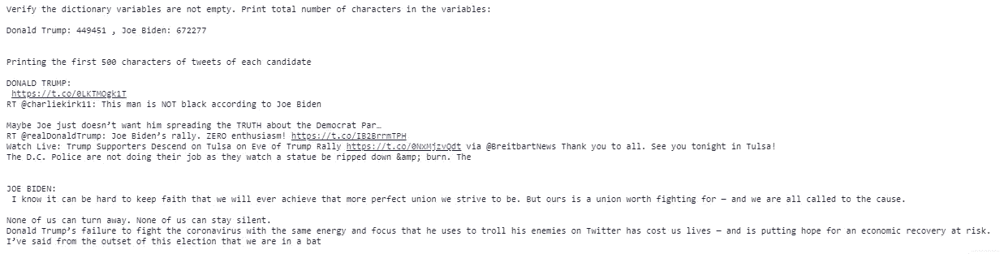

图 1:打印特朗普和拜登的样本推文

一个有趣的观察是，总体而言，乔·拜登的推特比特朗普的长。

```
import pickle
import cloudpickle as cp
lst_donald_trump_tweets=[]
lst_joe_biden_tweets=[]from urllib.request import urlopen
lst_donald_trump_tweets = cp.load(urlopen("[https://raw.githubusercontent.com/gomachinelearning/Blogs/master/DonaldTrumpTweets.pickle](https://raw.githubusercontent.com/gomachinelearning/Blogs/master/DonaldTrumpTweets.pickle)"))
lst_joe_biden_tweets = cp.load(urlopen("[https://raw.githubusercontent.com/gomachinelearning/Blogs/master/JoeBidenTweets.pickle](https://raw.githubusercontent.com/gomachinelearning/Blogs/master/JoeBidenTweets.pickle)"))
print("AVerage Number of characters per tweet:\n")
print("Donald Trump: {} , Joe Biden: {}".format(round(len(data['DonaldTrump'])/len(lst_donald_trump_tweets)) , round(len(data['JoeBiden'])/len(lst_joe_biden_tweets))))
```

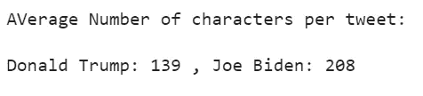

图 2:平均而言，拜登的每条推文比特朗普的长

# **可视化数据**

**Wordle** 又称词云或标签云，是以标签的形式对文本数据的可视化表示。标签通常是数据中的一个单词，其重要性以字体大小和颜色来表示。

Wordle 有自己的优势和劣势，我也听到了一些关于它的批评。但是现在让我们使用它来快速浏览一下，了解一下我们正在处理的是什么类型的数据。

```
from wordcloud import WordCloud
import matplotlib.pyplot as plt
wc = WordCloud( background_color="white", colormap="Dark2", max_font_size=150, random_state=42)def show_word_cloud(data, candidate):
  text = data[candidate]
  wordcloud = WordCloud().generate(text)
  plt.imshow(wordcloud, interpolation='bilinear')
  plt.axis("off")
  plt.show()
show_word_cloud(data,'DonaldTrump')
show_word_cloud(data,'JoeBiden')
```

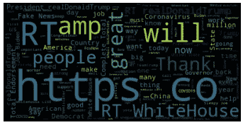

图 3:特朗普的原始推文

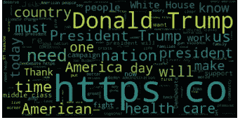

图 4:拜登的原始推文

哦，我们显然需要清理数据。例如，“https”在图中非常突出，但在我们的分析中实际上并不重要。

# **停止字**

***停用词*** 指的是一种语言中的常用词——这里指的是英语——比如 *a、the、is、at、on* 等。通常情况下，它们不能提供额外的数据洞察力，因此在我们开始分析之前必须从数据中删除。

```
from sklearn.feature_extraction.text import CountVectorizer
cv = CountVectorizer(stop_words='english')
```

# 最常用的词

一旦*停用词*被过滤掉，我们可以使用几个 NLP 工具来统计最常用的词——其中之一是 Python 中的文档术语矩阵(DLM)对象。

DLM 是一个数学矩阵，它描述了文本文档中单词出现的频率。我们将把矩阵中的行显示为 tweets 的集合，列将显示单词。

```
import pandas as pdfrom sklearn.feature_extraction.text import CountVectorizer
cv = CountVectorizer(stop_words='english')dict_dtm={}

def document_term_matrix(strTweets):  
  data_cv = cv.fit_transform([strTweets]) 
  return pd.DataFrame(data_cv.toarray(), columns=cv.get_feature_names())

dict_dtm['DonaldTrump'] = document_term_matrix(data['DonaldTrump'])
dict_dtm['JoeBiden'] = document_term_matrix(data['JoeBiden'])
print('Donald Trump Tweets Document Term Matrix:\n')
print(dict_dtm['DonaldTrump'])
print('\n\n')
print('Joe Biden Tweets Document Term Matrix:\n')
print(dict_dtm['JoeBiden'])
```

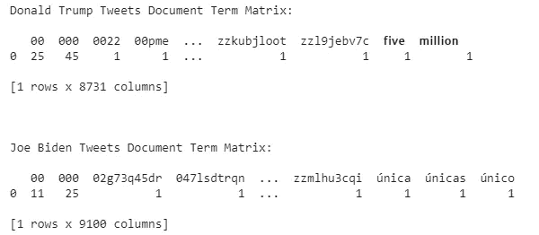

图 5:文档术语矩阵

我们去掉了*停用词*，但是 DTM 仍然是乱码。我们仍然需要做大量的清理工作。

让我们打印每个候选人的前 20 个单词:

```
def top_n_words(candidate,n):top_dict = {}
  data = dict_dtm[candidate]
  for c in data.columns:
    top_dict[c]=data[c][0]
  sort_orders = sorted(top_dict.items(), key=lambda x: x[1], reverse=True)
  for i in sort_orders[0:n]:
    print(i[0], i[1])print('Donald Trump:\n')
top_n_words('DonaldTrump',20)
print('\n\nJoe Biden:\n')
top_n_words('JoeBiden',20)
```

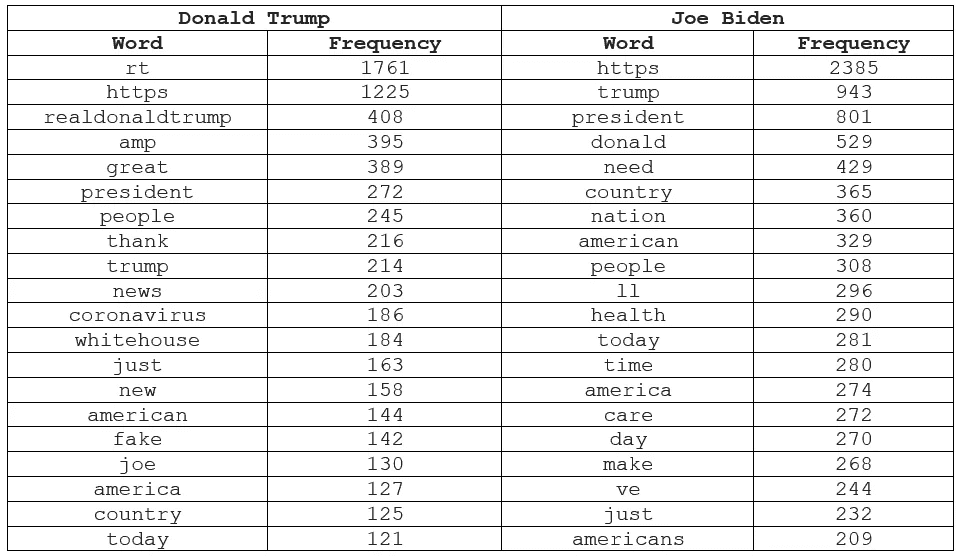

图 6:最常用的单词

这些话非常有希望，我们实际上可以得到一些分析，并得出一些有意义的见解。尽管如此，我们还是需要清理一下。

# 数据清理

这里有一些我们可以在推特上完成的数据清理任务。我们可以删除:网址，数字，标点符号，一些文本像 *amp* 和 *rt* ，换行符等等。

此外，我们可以将分析限制在候选人最近推文的前 10 万个字符。我们希望分析与当前事件相关的推文。

```
import re
import stringdef clean_tweets(tweets):
    '''Make tweetslowercase, remove tweetsin square brackets, remove punctuation and remove words containing numbers.'''
    tweets= tweets.lower()
    tweets= re.sub('\[.*?\]', '', tweets)
    tweets= re.sub('[%s]' % re.escape(string.punctuation), '', tweets)
    tweets= re.sub('\w*\d\w*', '', tweets)
    tweets= re.sub('[‘’“”…]', '', tweets)
    tweets= re.sub('\n', '', tweets)
    tweets= re.sub('\r', ' ', tweets)    
    tweets = re.sub(r'^https?:\/\/.*[\r\n]*', '', tweets, flags=re.MULTILINE)
    tweets = re.sub(r'http\S+', '', tweets)
    tweets = tweets.replace(' amp ','')
    tweets = tweets.replace(' rt ','')
    tweets = tweets.replace('realdonaldtrump','')
    return tweetsclean_data={}
clean_data['DonaldTrump'] = clean_tweets(data['DonaldTrump'])[0:100000]
clean_data['JoeBiden'] = clean_tweets(data['JoeBiden'])[0:100000]len(clean_data['DonaldTrump']) ,len(clean_data['JoeBiden'])#(100000, 100000)
```

让我们比较一个原始数据和干净数据的样本。以下是特朗普在数据清理前后的样本数据:

```
print('Print 200 characters only:\n')
print('Donald Trump raw data:\n')
print(data['DonaldTrump'][0:200])
print('\n\nDonald Trump clean data:\n')
print(clean_data['DonaldTrump'][0:200])print('\n\n')print('Joe Biden raw data:\n')
print(data['JoeBiden'][0:200])
print('\n\nJoe Biden clean data:\n')
print(clean_data['JoeBiden'][0:200])
```

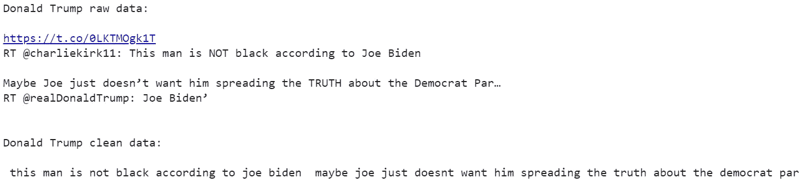

图 7:数据清理前后的 Donald Trump 样本数据

拜登数据清洗前后的样本数据:

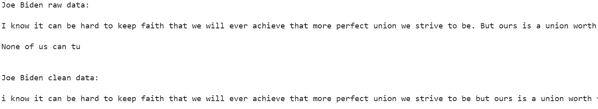

图 8:数据清理前后的 Joe Biden 样本数据

让我们用干净的数据展示这个世界

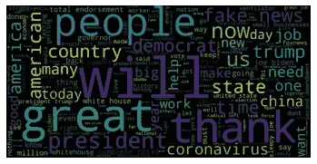

图 9:唐纳德·特朗普使用干净的数据

最前面和中间是“棒”字。这很可能是因为特朗普的竞选口号*让美国再次伟大*或*让美国保持伟大*。特朗普似乎没有经常在他的推文中提到乔·拜登。

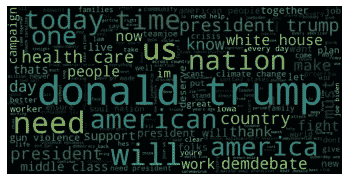

图 10: Joe Binden Worlde 使用干净的数据

乔·拜登在他的推文中似乎更经常提到唐纳德·特朗普，这可以在 wordle 中看到。拜登经常在他的推文中使用危机这个词，这很可能与疫情冠状病毒有关。

让我们用干净的数据再次打印最常用的单词。

```
dict_dtm['DonaldTrump'] = document_term_matrix(clean_data['DonaldTrump'])
dict_dtm['JoeBiden'] = document_term_matrix(clean_data['JoeBiden'])print('Donald Trump:\n')
top_n_words(dict_dtm['DonaldTrump'],20)
print('\n\nJoe Biden:\n')
top_n_words(dict_dtm['JoeBiden'],20)
```

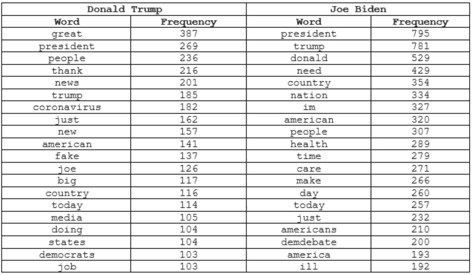

图 11:使用干净数据的最常用单词

与我们的第一次运行相比，这显然要好得多。我们可以在这里看到很多与这个国家目前发生的事情相关的词汇。

# 情感分析

情绪分析的目标之一是开发能够解释人类情绪的机器——模仿人类体验和回应他人情绪的方式。


注:图片复制自[https://blogeduonix-2f3a . kx cdn . com/WP-content/uploads/2018/12/44 ceff . jpg](https://blogeduonix-2f3a.kxcdn.com/wp-content/uploads/2018/12/44ceff.jpg)

我们将使用 [TextBlob](https://textblob.readthedocs.io/en/dev/quickstart.html) 来预测推文中的情绪。TextBlob 是一个用于处理文本数据的 Python 库，它提供了一个用于情感分析的 API。根据 TextBlob 文档，给定一个文本数据，情感 API 返回两个属性- ***极性*** 和 ***主观性*** 。*极性*告知文本是正还是负。其值范围从-1.0(非常负)到 1.0(非常正)。*主观性*讲述文字是客观的还是主观的。其值从 0(非常客观)到 1.0(非常主观)。首先，让我们测试 TextBlob 在给定这些示例语句集的情况下将如何执行:

```
statements=[]
statements.append("I will vote for that mayor again")
statements.append("The senator is the worst politician ever!")
statements.append("Make America Great Again")
statements.append("Keep America Great")
statements.append("OUR BEST DAYS STILL LIE AHEAD")
statements.append("The earth revolves around the sun")
statements.append("The sun revolves around the earth")
statements.append("The sun revolves around the earth") lst_sentiment_analysis=[]
for statement in statements:
  blob = TextBlob(statement)
  print(statement + ' ' + str(blob.sentiment))
```

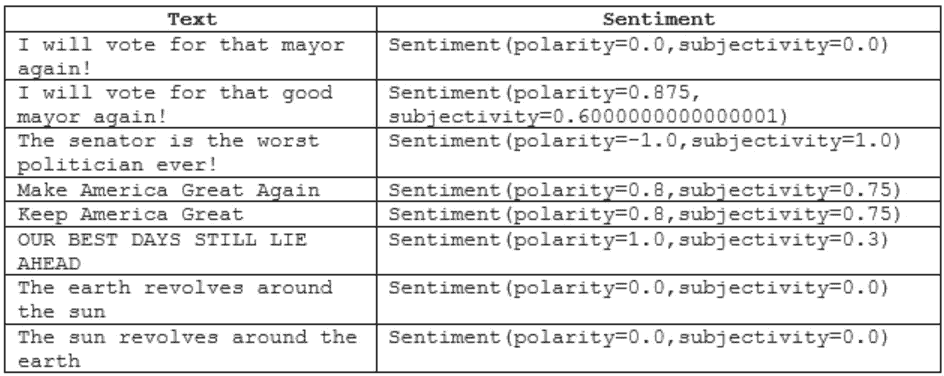

图 12: TextBlob 评估这些样本文本的情感

注意第一个和第二个例子之间的区别。在第二句话中加上“好”这个词使这句话变得肯定，也变得主观。第三个例子非常消极，也非常主观。

唐纳德·特朗普的竞选口号:*让美国再次伟大*和*保持美国伟大*与乔·拜登的*相比，不那么积极，更主观*。(注:我不能 100%确定这是不是拜登的口号，但这是我在他的竞选网站上看到的)。

“*地球绕太阳转*这个例子是中性的，非常客观。但是，TextBlob 不能告诉我们一个语句是否为真，请看最后一个例子。

让我们对特朗普和拜登最近的 200 条推文进行情感分析，因为它们更多地涉及当前事件。

```
import pickle
import cloudpickle as cp
lst_donald_trump_tweets=[]
lst_joe_biden_tweets=[]from urllib.request import urlopen
lst_donald_trump_tweets = cp.load(urlopen("[https://raw.githubusercontent.com/gomachinelearning/Blogs/master/DonaldTrumpTweets.pickle](https://raw.githubusercontent.com/gomachinelearning/Blogs/master/DonaldTrumpTweets.pickle)"))
lst_joe_biden_tweets = cp.load(urlopen("[https://raw.githubusercontent.com/gomachinelearning/Blogs/master/JoeBidenTweets.pickle](https://raw.githubusercontent.com/gomachinelearning/Blogs/master/JoeBidenTweets.pickle)"))
len(lst_donald_trump_tweets), len(lst_joe_biden_tweets)lst_donald_trump_polarity = []
lst_donald_trump_subjectivity  = []lst_joe_biden_polarity = []
lst_joe_biden_subjectivity  = []#number of tweets to analyze
n=200def sentiment_analysis(lst_tweets,lst_polarity, lst_subjectivity):
  for tweet in lst_tweets[0:n]:
    blob = TextBlob(clean_tweets(tweet))
    lst_polarity.append(blob.polarity)
    lst_subjectivity.append(blob.subjectivity)sentiment_analysis(lst_donald_trump_tweets,lst_donald_trump_polarity,lst_donald_trump_subjectivity) 
sentiment_analysis(lst_joe_biden_tweets,lst_joe_biden_polarity,lst_joe_biden_subjectivity)
```

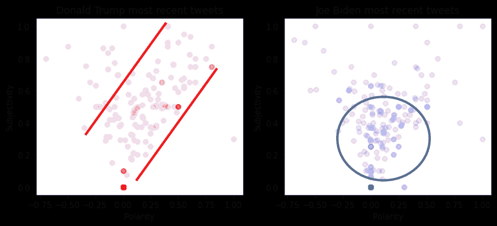

图 13:特朗普和拜登最近的 200 条推文

唐纳德·特朗普最近的推文聚集在图表的右侧，实证主义和主观性越来越强。而乔·拜登的推文排名垫底。他们更加中立和客观。

让我们用方框图对比一下他们推文的极性和主观性。

```
import pandas as pd
import numpy as npdf = pd.DataFrame(np.c_[np.array(lst_donald_trump_polarity),np.array(lst_joe_biden_polarity)], columns=['Donald Trump','Joe Biden'])
df.plot.box(grid='True', title='Polarity of Trump and Biden Tweets')df = pd.DataFrame(np.c_[np.array(lst_donald_trump_subjectivity),np.array(lst_joe_biden_subjectivity)], columns=['Donald Trump','Joe Biden'])df.plot.box(grid='True', title='Subjectivity of Trump and Biden Tweets')
```

相比拜登，特朗普一直在发布更多积极的推文。但拜登倾向于发布更极端的极性推文。这意味着拜登倾向于发布更多非常积极和非常消极的帖子。

与拜登相比，特朗普也表现出了更广泛的主观性。

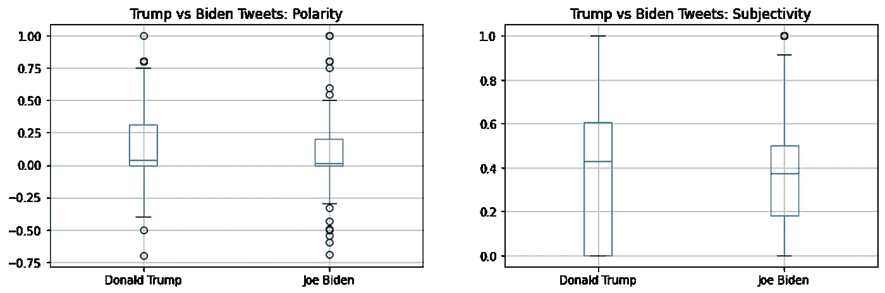

图 14:唐纳德·特拉姆和乔·拜登最近的推文

与拜登相比，特朗普最近的帖子更积极，也更主观。

# 基于潜在狄利克雷分配的主题建模

在这一部分，我们将从每位候选人的一组推文中发现抽象主题。我会将他们的推文分成 3 组，每组 1000 个字符，并使用 LDA 来预测主题。我们将看到候选人如何随着时间的推移改变他们推文的主题。

**词汇化**是将单词形式的变化组合在一起的过程，这样它们就可以作为单个单词进行分析。例如， ***行走*** ， ***行走*** ， ***行走*** 将组合为一个，分析为 ***行走。*** 我们将使用名为 **WordNetLemmatizer** 的 Python 自然语言工具包(ntlk)包对 tweets 进行预处理和 lemmatize。

LDA 主题建模中另一个有用的技术是在文档中省去除名词和形容词之外的要处理的单词。在下面的代码中， *NN* 是名词的约定， *JJ* 是形容词的约定。下面一行代码标识了推文中的名词和形容词。

```
pos[:2] = ‘NN’ or pos[:2] == ‘JJ’
```

下面是处理数据和生成主题的代码。

```
#install gensim as needed
#!pip install gensim
from gensim import matutils, models
import scipy.sparsefrom nltk.stem.porter import PorterStemmer
from nltk.stem import WordNetLemmatizer 
lemmatizer = WordNetLemmatizer()
porter = PorterStemmer()
from nltk import word_tokenize, pos_tagdef get_corpus(dtm):  
  sparse_counts = scipy.sparse.csr_matrix(dtm)
  corpus = matutils.Sparse2Corpus(sparse_counts)
  return corpus# tokenize nouns and adjectives only
def nouns_adjectives(text):
    is_noun_adj = lambda pos: pos[:2] == 'NN' or pos[:2] == 'JJ'
    tokenized = word_tokenize(text)
    nouns_adj = [lemmatizer.lemmatize(word) for (word, pos) in pos_tag(tokenized) if is_noun_adj(pos)]     
    return ' '.join(nouns_adj)def generate_topics(str_tweets):
  dtm = document_term_matrix(str_tweets)
  corpus = get_corpus(dtm)  
  id2word = dict((v, k) for k, v in cv.vocabulary_.items())
  lda = models.LdaModel(corpus=corpus, id2word=id2word, num_topics=1, passes=100,minimum_probability =0.5)
  return lda
```

让我们将推文分成 3 组，每组 1000 个字符，并打印组内的主题。

```
import matplotlib.gridspec as gridspec
import math
import nltk
nltk.download('wordnet')
from nltk.stem import WordNetLemmatizer 
lemmatizer = WordNetLemmatizer()
def print_topics(candidate,index_from,index_to): 
  n_topics = 1
  dtm = document_term_matrix(nouns_adjectives(clean_data[candidate][index_from:index_to]))
  corpus =get_corpus(dtm)
  id2word = dict((v, k) for k, v in cv.vocabulary_.items())lda = models.LdaModel(corpus, num_topics = n_topics, id2word = id2word, passes=50)
  topics  = [[topic for topic,_ in lda.show_topic(topic_id, topn=5)] for topic_id in range(lda.num_topics)]
  top_betas = [[beta for _,beta in lda.show_topic(topic_id, topn=5)] for topic_id in range(lda.num_topics)]
  print(topics)       

print_topics('DonaldTrump',0,1000)
print_topics('JoeBiden',0,1000)print_topics('DonaldTrump',1000,2000)
print_topics('JoeBiden',1000,2000)print_topics('DonaldTrump',2000,3000)
print_topics('JoeBiden',2000,3000)
```

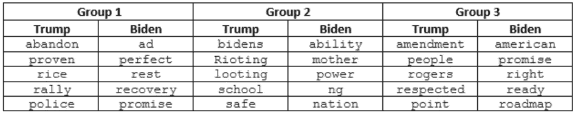

图 15:随着时间的推移改变主题。组 1 是最新的。第三组是最老的。

# **结论**

这篇文章的目的是展示唐纳德·特朗普总统和前副总统乔·拜登在使用机器学习的推文中的差异。我故意推迟对结果做出自己的解释，因为我希望尽可能客观。我将让读者自己做出解释。