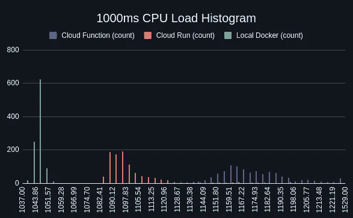

# 分析云功能中的峰值需要延迟

> 原文：<https://levelup.gitconnected.com/analyzing-weird-spikes-in-cloud-function-require-latency-50c5d1b0ce87>

使用 child_process 在云函数中运行代码似乎会在 require 语句周围产生显著的延迟峰值。我调查了一下，得出了一些数据。

> *代码复制本可在* [*GitHub*](https://github.com/ehacke/cloud-function-latency-spikes) 上获得

[断言](https://asserted.io)的整体思想是，它允许你对你的应用程序连续运行[定制测试代码。当我开始构建它的时候，我认为最快最简单的方法就是使用 GCP 云函数。云功能已经存在很多年了，具有众所周知的性能和安全特性，所以它看起来是一个安全的赌注。](https://asserted.io/features/uptime-as-code)

其核心是，实现很简单。将代码复制到云函数中，然后使用 **child_process** 在超时的情况下安全地执行它。

起初这似乎很有效。相对低的延迟，易于维护。

但是这段代码会持续运行，每分钟一次，永远如此。不到一天，我就在 child_process.exec 上得到一个超时。

# 神秘开始了

从逻辑上讲，我认为这是我的错，因为大多数事情都是这样。

我正在执行的代码正在调用 API 端点，可能他们保持连接打开的时间太长了或者什么的。我首先忽略了它，但是后来我注意到，当我在本地机器上长时间运行代码时，没有发生超时。所以它并不完全是代码，也不是我从代码内部调用的 API。

我开始调查。我做了通常的调试步骤，基本上是在每个地方添加 **console.log** 语句，以查看阻塞在哪里，并将 exec 设置为继承 stdio，这样我就可以很容易地查看日志。

我在 **child_process.exec** 周围加了一些:

以及用户代码本身中的其他内容:

在多次运行该函数后，我查看了 GCP 日志记录，在那里我可以看到日志行和它们发生的时间。

我惊讶地发现，延迟并没有发生在大部分用户代码中，而是发生在 exec 启动和 require 语句完成之间。

> *完成 require 语句所需的时间差异很大。有些时候，require 语句会在 100 毫秒内完成，而其他时候可能需要超过 2 秒钟，甚至在超时前还没有完成。*

这看起来很奇怪。这些并不是怪异深奥的依赖关系。它们是 NPM 最常用的图书馆。

在我自己的机器上对这些 require 语句进行分析显示影响可以忽略不计，所以可能是云函数本身的问题比较奇怪？

我决定想出一个更正式的测试，看看我是否能找到它。

# 实验

# 环境

大约在同一时间，我试用了 Cloud Run，知道我没有发现这个问题，只是在云函数中。所以我决定做个三方对比。我会在三种环境中运行相同的代码，并比较结果:

*   云功能— 2048 MB 内存—单个 2.4 GHz CPU
*   云运行— 2048 MB 内存—单个 vCPU
*   本地 Docker — 2048 MB 内存—单 CPU

# 密码

就我正在运行的代码而言，我不想依赖特定的预先存在的库。虽然这是我最初注意到它的地方，但我不想引入这样的想法，即出于某种原因，这种特定的依赖性是一个问题。

所以我写了一点随机生成节点模块的代码。每个都包含一个对象，该对象最多包含 100 个随机创建的属性。

然后我用它创建了一个文件夹，其中包含 1000 个随机生成的库，以及一个 index.js 文件，该文件需要所有这些库，并将它们导出到一个巨大的对象中。

> 1000 个依赖项听起来可能很多，但是如果你在一个任意的节点项目中运行***ls-al Node _ modules | WC-l****，你会发现它实际上是非常合理的。甚至可能保守。*

正如帖子开头提到的，你可以在这里看到这个实验的完整代码库。

# 情节

除了在 1000 个依赖项上调用 require 之外，我还想将它与一些不同的场景进行对比，以给出这个问题的一些背景。所以我想出了三个场景，我将在这三个环境中的每一个中运行:

*   正常要求—从默认目录加载 1000 个依赖项
*   重新生成并要求—在 **/tmp** 中重新生成并加载 1000 个依赖项
*   CPU —只吃 CPU 1 秒钟

这里的想法是，云函数从只读目录中加载您提供的代码。我对云功能的底层实现知之甚少，但我想控制这个只读目录可能会以某种方式影响事情的事实。所以我添加了第二个场景，在请求/tmp 的过程中重新生成所有的依赖项，然后从那里加载它们。

最后一个场景是一个简单的对照组，我只是原地旋转 1000 ms，然后退出。

# 结果呢

我在这三个环境中分别运行了 1000 次这些场景，并收集了结果。所有这些图表中显示的时间不是 HTTP 请求延迟，而是 child_process.exec 完成加载巨型依赖项所花费的时间。

# 需要时间

正如您在图表中看到的，在云函数中加载假依赖项所需的时间有很大的差异。从 2.5 秒到超过 10 秒。

云运行实例显示了一些变化，但是非常合理。本地 Docker 实例基本上没有变化，这是您所期望的。

统计数据:

*   云函数—标准偏差:862 毫秒—中位数:4015 毫秒
*   云运行—标准偏差:207 毫秒—中位数:2265 毫秒
*   本地 Docker —标准偏差:30 毫秒—中位数:1213 毫秒

上图显示了剔除 1%异常值后的延迟分布。本地 docker 非常紧凑，云运行有一些变化，云功能有很大变化。

# 再生需要时间

这种情况发生得更多，所以数字更大，但模式基本上是一样的。云函数表现最差，云运行有一定变异但合理，本地 Docker 吃紧。

统计数据:

*   云函数—标准偏差:1664 毫秒—中位数:7198 毫秒
*   云运行—标准偏差:524 毫秒—中位数:5895 毫秒
*   本地 Docker —标准偏差:36 毫秒—中位数:3245 毫秒

该分布类似于更简单的需求场景。本地 Docker 很紧，云运行得更宽(有一个离群值)，云函数分布得更广。

# CPU 时间(控制)

此图表上的纵轴已经过调整，与第一个场景相匹配，以便进行更好的直观比较。

你可以看到，当它只是做直接的 CPU 工作时，所有环境都接近相同。云函数时间有一些峰值，但不显著。

统计数据:

*   云函数—标准偏差:23 毫秒—中位数:1172 毫秒
*   云运行—标准偏差:20 毫秒—中位数:1095 毫秒
*   本地 Docker —标准偏差:2 毫秒—中位数:1045 毫秒

在这种情况下，我似乎不能调整水平轴，但请注意，这里显示的整体变化很窄，即使云函数比其他两个更宽。

# 结论

> 埃里克，这很有趣，但这意味着什么呢？
> 
> *我:我不知道。*

我对云功能是如何实现的了解还不足以推测为什么会出现这种情况。

乍一看，由于某种原因，从磁盘(或内存中的磁盘？)对于云函数似乎具有不可预测的性能特征。

我说不出这到底是为什么。但我可以说，这对我来说是一个足够大的问题，以至于我改用了云运行。

我真的很好奇，想知道是否有谷歌的人猜测为什么会这样，如果我听到什么，我一定会在这里发布。