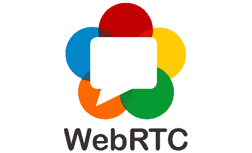
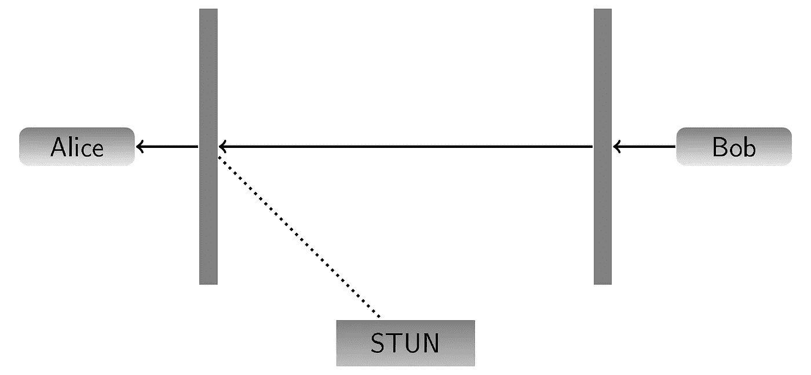
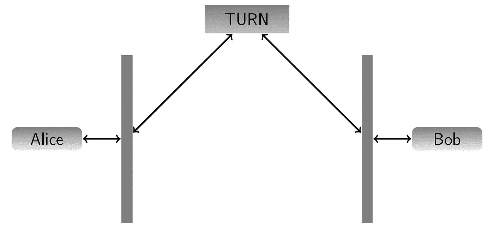
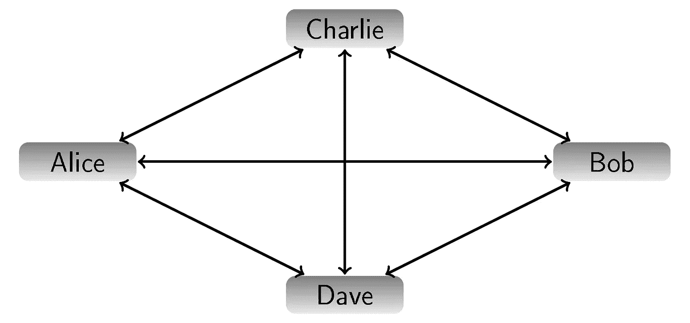
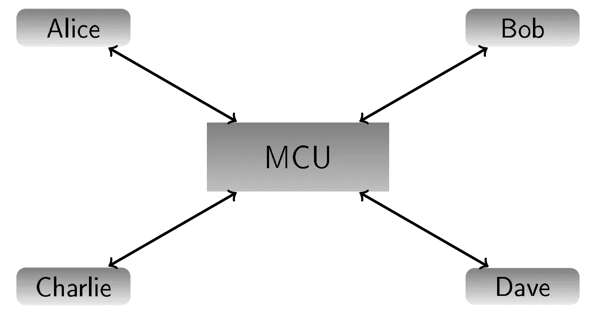

# WebRTC 视频会议剖析

> 原文：<https://levelup.gitconnected.com/anatomy-of-a-webrtc-video-conference-f924ba0ba930>

随着社交距离的拉近，我们大多数人在过去几周都参加了很多视频会议。无论您使用的是 Jitsi、Big Blue Button 还是某个商业项目的基于浏览器的界面，您都可能一直在使用 WebRTC 标准。当然，除了传统的视频会议，你还可以利用 WebRTC 引入的技术做更多的事情。你可以在协作应用中使用它作为 WebSockets 的替代品，在你的游戏中添加多人游戏(无论是一个小型的[炸弹人风格的技术演示](https://github.com/innovailable/rtc-bomber/)，还是一个[自我射击游戏在你的浏览器中的端口](https://firefoxmania.uci.cu/common/dev_files/demos/bananabread/index.html)，或者[把你的相机变成 ASCII 艺术](https://andrei.codes/ascii-camera/)。

我是一个新的[开源](https://github.com/Innovailable/vorb.chat)点对点视频会议应用程序 [vorb.chat](https://vorb.chat/) 的开发者之一，我想向您介绍一下在使用这些平台时会发生什么。我将尝试让您对所有相关技术有一个基本的了解，从集成在浏览器中的新 API 到帮助 WebRTC 启动其独特连接的服务器和协议。最后，我将通过展示几行代码来创建一个最小的视频会议应用程序。

# 浏览器 API

WebRTC 最重要的部分是在我们的浏览器中引入了一些新的 API。其中一些，如访问用户的麦克风和摄像头，是专门为视频会议设计的，而其他一些则是改善音频和视频处理的更广泛努力的一部分。

大多数开发人员在试用 WebRTC 时首先会遇到的是 [getUserMedia()](https://developer.mozilla.org/en-US/docs/Web/API/MediaDevices/getUserMedia) 。该功能用于获取用户麦克风和/或摄像头的[媒体流](https://developer.mozilla.org/en-US/docs/Web/API/MediaStream)。当请求流请求更高的分辨率时，您可以指定一些约束，或者让用户选择要使用的特定摄像头和麦克风(要获得可用设备的列表，请参见[enumerated devices()](https://developer.mozilla.org/en-US/docs/Web/API/MediaDevices/enumerateDevices))。浏览器通过在授予访问权限之前询问用户的许可来确保该功能不被利用。

[在 JSFiddle 上试试](https://jsfiddle.net/thammi/wskh0eq9/)

您既可以通过将流附加到一个标签来本地显示它，也可以将它添加到一个 [RTCPeerConnection](https://developer.mozilla.org/de/docs/Web/API/RTCPeerConnection) 中，以便将它发送给其他用户。这种对等连接是 WebRTC 标准的第二大部分。它建立了一个为实时连接而优化的连接(例如通过使用基于 UDP 的传输协议)，并且总是使用 [DTLS](https://en.wikipedia.org/wiki/Datagram_Transport_Layer_Security) 进行端到端加密(基本上是 UDP 上的 TLS)。

您可以将您的流(或者更具体地说，将流的曲目)添加到对等连接，并且一旦连接建立，将从另一个对等方接收曲目。更复杂的场景，如动态添加屏幕共享或更改使用的摄像头，将需要使用[收发器](https://developer.mozilla.org/de/docs/Web/API/RTCRtpTransceiver)。WebRTC 库可以为您处理这些复杂性。

# 建立连接

但是这种联系是如何建立的呢？同行是怎么找到对方的？对等体必须交换一些信令消息，这些消息包含关于将被发送和接收的媒体轨道的信息、支持的编解码器以及关于网络的一些信息。

信令消息中的数据使用 SDP 进行编码([会话描述协议](https://en.wikipedia.org/wiki/Session_Description_Protocol))。这是我们大多数人日常在 IP 语音电话中使用的一种成熟的协议。这是一个只有一个音轨的例子:

不要担心，除非您想做一些非常高级的事情或调试对等连接的内部，否则您不必了解这些。

标准本身并没有具体说明这些消息是如何传输的，但这通常是通过 WebSocket 来完成的。有为 WebRTC 和视频会议构建的信令服务器。其中大多数使用命名房间的抽象，客户端可以加入这些房间来找到其他对等点并与它们交换消息。您还可以使用任何其他方法在客户端之间传递这些消息。

在交换这些信令消息之后(一个客户端创建提议，另一个客户端应答)，浏览器将知道两个客户端都支持哪种编解码器和哪种设置。他们将开始尝试使用传输的网络信息建立连接。

# 通过防火墙和 NAT 连接

最简单的连接场景是两个客户端都在同一个本地网络中。两个客户端总是通过信令信道发送所有已知的 IP 地址，并将尝试连接到每个对等体的地址。但当然，这在大多数情况下不会成功。

更常见的是客户端通过互联网连接。这里的问题是，设备通常在单个路由器后面共享同一个公共 IP 地址。因此，传出数据通常会使用与最初发送时不同的端口，更重要的是，如果不创建手动端口转发，传入连接就无法连接到正确的设备。

如果一个客户端直接连接到互联网(让我们称她为 Alice ),而另一个客户端通过路由器连接(让我们称他为 Bob ),我们仍然可以创建连接。Bob 通过路由器向 Alice 发送了一个数据包(这可能会更改传出端口)。Alice 将简单地回答她接收数据的地址和端口。Bob 的路由器将收到该答案，并将其转发给 Bob，因为它记得以前通过该端口发送过 Bob 的数据。现在，两个客户端都可以发送和接收数据。

但是如果两个客户端都藏在路由器后面呢？在这个场景中，WebRTC 使用 STUN ( [用于 NAT](https://en.wikipedia.org/wiki/STUN) 的会话遍历实用程序)协议进行连接。两个客户端都向 STUN 服务器发送一个 UDP 包，STUN 服务器发送接收包的 IP 地址和端口作为响应。

为了了解我们如何使用这些信息，让我们在这些条件下再看一遍 Alice 和 Bob 的例子。Alice 通过信令信道将她的地址信息发送给 Bob。Bob 然后尝试使用给定的 IP 地址和端口启动连接。使用相同的端口很重要，因为 Alice 的路由器(希望)会记住它使用该公共端口发送了一个 UDP 数据包(即使它发送到不同的地址),并将该数据包转发给 Alice。然后，Alice 可以简单地响应该包，我们就有了一个开放的连接。

穿孔对等连接

如果所有这些都失败了，还有最后一个选择，那就是使用 NAT 服务器周围的中继进行[遍历。因为这个服务器有一个公共 IP 地址，所以每个人都可以访问它。Alice 连接到 TURN 服务器并转发关于如何连接 Bob 的信息。Bob 连接后，所有流量都可以通过服务器进行路由。数据甚至可以通过 TLS 加密的 TCP 连接进行隧道传输，以欺骗最偏执的网络管理员。当然，这是以更高的延迟(尤其是使用 TCP 时)为代价的，并且会在服务器上产生大量流量。](https://en.wikipedia.org/wiki/Traversal_Using_Relays_around_NAT)

对等连接通过 TURN 隧道传输

浏览器将浏览所有这些选项，这些选项按照预期的连接执行情况进行排序。整个过程被称为 ICE ( [交互连接建立](https://en.wikipedia.org/wiki/Interactive_Connectivity_Establishment))，开源项目 [coturn](https://github.com/coturn/coturn) 为这两种协议提供了一个服务器。

# 总是点对点？

我一直在谈论对等连接，那么每个 WebRTC 应用程序都是对等的吗？对等连接只是由 WebRTC 标准引入的概念，如何使用它取决于您自己。对等连接可以用于创建实际的对等应用程序，也可以连接到中间服务器。

当连接多个带宽有限的参与者时，这些服务器会很有用。当你创建一个基于点对点的应用程序时，所有的客户端都连接到所有其他的客户端，并且必须向每个客户端发送所有的数据。

对等会议

媒体服务器可以限制 WebRTC 应用程序用户的带宽要求。所有客户端都连接到媒体服务器，而不是创建直接连接。它们只需发送一次数据，媒体服务器就会将数据分发给所有对等体。

使用媒体服务器的会议

当然，这种解决方案也有缺点。由于对等连接的工作方式，对等 WebRTC 应用程序将始终是端到端加密的。另一方面，媒体服务器将不得不解密对等连接，因此可以访问你的数据(尽管有努力[克服这个限制](https://jitsi.org/blog/e2ee/))。

媒体服务器的另一个缺点是基础设施成本。使用对等连接，流量将在对等体之间直接交换，您的基础设施将只使用非常有限的资源。媒体服务器将使用大量流量，根据媒体服务器的类型，还可能使用大量 CPU。

使用媒体服务器的视频会议应用程序的例子有 [Jitsi Meet](https://jitsi.org/jitsi-meet/) 和[蓝色大按钮](https://bigbluebutton.org/)，而我们自己的 [vorb.chat](https://vorb.chat/) 是一个对等应用程序的例子。

# 把所有的放在一起

在这最后一部分，我想展示一个 WebRTC 应用程序可以有多简单。我们将使用 [rtc-lib](https://github.com/Innovailable/rtc-lib) 来做一些繁重的信令和流处理工作。

[在 JSFiddle 上试试](https://jsfiddle.net/thammi/eLrxozfd)

该代码实现了一个完整的视频会议应用程序。使用相同的房间名称在多个选项卡或多个设备上打开它，您将被连接。对于更复杂的应用程序，您可能希望使用 React 或 Vue 来代替 JQuery。

# 下一步是什么？

WebRTC 的内容远远超出了本文的范围。数据通道就是一个例子，它允许您通过对等连接发送自定义数据。这可以用于在视频会议中添加文本聊天和文件传输，但也可以在完全不同的环境中用于点对点文件共享或为浏览器游戏添加多人支持。

我将在以后的文章中探索 WebRTC 的其他部分。同时，这里有一些有趣的资源:

*   [WebRTC 示例](https://webrtc.github.io/samples/):低级示例的集合
*   [博客极客](https://bloggeek.me/blog/):关于 WebRTC 基础设施和标准的有趣文章
*   [WebRTC 黑客](https://webrtchacks.com/) : WebRTC 新闻和演示

感谢阅读。如果您有任何反馈或问题，请在下面留下，我希望在下一篇文章中再次见到您！

 [## 编写面试问题

### 一个完整的平台，在这里我会教你找到下一份工作所需的一切，以及…

技术开发](https://skilled.dev)