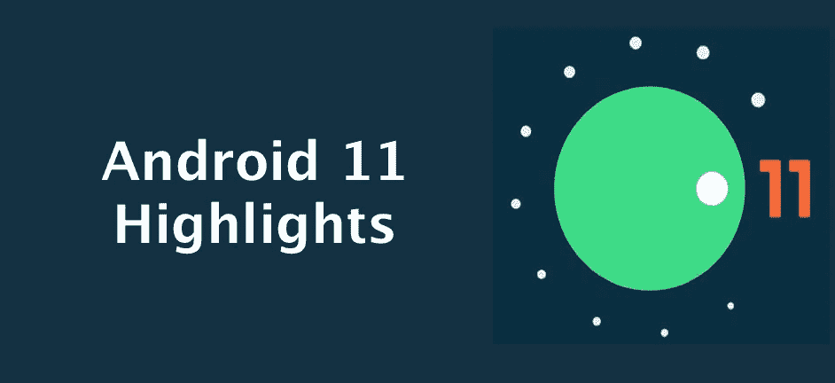
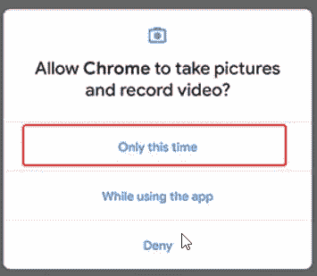

# Android 11 开发者预览版亮点

> 原文：<https://levelup.gitconnected.com/android-11-developer-preview-highlights-5b56c5b1c3cb>

## 查看 Android 11 的最新功能

# 介绍

**Android 11** 预览版于 2020 年 2 月 19 日首次亮相，仅面向开发者。虽然对 Android 爱好者来说现在还为时过早，但我们需要意识到市场上正在发生的事情。Android 11 开发者预览版现已在**谷歌 Pixel 4 / 4XL、Pixel 3a / 3a XL、Pixel 3 / 3 XL 和 Pixel 2 / 2 XL 上推出。开发者预览版**是早期的基线版本**，仅面向开发者**。因为它们不适合早期采用者或消费者的日常使用，谷歌通过**手动下载和仅 flash】提供它们。**

# 气泡

这是我最喜欢的部分之一。我们每个人都知道脸书的聊天头是如何工作的。**气泡**是所有消息应用的类似功能。使用**气泡**，任何人都可以在不打开应用的情况下回复任何消息应用。气泡是一种保持**视图中的对话**和**可访问的方式**，同时在他们的手机上执行**多任务**。对于那些想在看视频或玩游戏时快速回复的人来说，这将是一个方便的功能。

虽然这些气泡出现在 Android 10 预览版中，但它们并不是所有消息应用的一部分。最后，Android 11 已经准备好推出这些气泡功能，以便所有的消息通知都将出现在气泡上，从而改善用户体验。任何**消息**或**聊天**应用都应该使用通知上的 [**泡泡 API**](https://developer.android.com/guide/topics/ui/bubbles) 来启用 Android 11 中的这个泡泡功能。

# 从通知中发送图像

在之前的 Android 版本中，更新了通知面板的内联文本回复，并扩展了这一功能，Android 11 正在推出一种新的方式，在不打开应用程序的情况下，从通知面板发送图像和文本。在通知回复中插入图片是最酷的功能之一。要使用该功能，我们的应用程序需要支持图像**复制/粘贴**，这样我们现在就可以让用户直接将资产插入通知**内联回复**中，以支持**更丰富的**通信以及应用程序本身。对于这个版本，我们将看到图像**在 **Chrome** 中复制**支持，图像**通过 **Gboard** 剪贴板粘贴**支持。

# **专用对话部分**

说到消息，Android 11 还在我们的通知栏中增加了一个新的“**专用对话区**”。在通知阴影中，用户可以在他们最喜欢的应用程序中立即找到他们正在与人进行的对话。有了这个功能，与所有**聊天应用**相关的通知将被**分组**到一个**单独的部分**并显示在**顶部。**意识形态类似于泡泡，两者的功能都是为了改善谈话体验。

# **一次性许可**

自从**棉花糖**版本开始以来，谷歌试图改善安全措施，在该版本中，谷歌首次为应用程序引入了访问敏感数据的**权限**概念，每次推出新版本时，谷歌都会发布与此权限相关的内容。作为 Android 10 的一部分，我们在权限对话框中看到了新的选项，如“**仅在使用应用**时允许”。在 Android 11 中，我们通过新选项“**对权限有了更多的控制，只是这次是**。

从 Android 11 中开发者的角度来看，每当你的应用程序请求与位置、麦克风或摄像头相关的权限时，面向用户的权限对话框都包含一个名为**的选项，只是这次是**，如上图所示。如果用户在对话框中选择此选项，您的应用将被授予 ***临时一次性权限*** 。您的应用程序仅可在以下情况下访问相关数据:

*   自从用户授予一次性权限后，您的应用程序的活动就已经**可见**。
*   当用户授予权限时，您的应用程序是**可见的**，并且从那时起一直运行一个**前台**服务。只要前台服务保持运行，即使用户将你的应用移动到后台，你的应用也会保留权限。

如果这两个条件都不成立，我们需要再次请求用户的许可，而不管目标 SDK 版本。[查看 Android 11](https://developer.android.com/preview/privacy/permissions) 中的更多权限更新。

# **作用域存储**

Android 11 进一步增强了该平台，为外部存储上的应用程序和用户数据提供了更好的保护。作为这项工作的一部分，该平台引入了进一步的改进，以简化向 [**范围存储**](https://developer.android.com/training/data-storage#scoped-storage) 的过渡。

去年发布的这个预览版已经购买了许多选项，其中一个功能是选择加入媒体的 raw**文件路径访问，媒体的批量编辑操作，以及存储访问框架的更新 UI。这是为最终用户改进安全措施的特性之一，但是对开发者来说还有很多工作要做。**

在即将发布的开发者预览版中，期待对**文件访问、**的额外增强，以及关于**文件管理**和图片库的更新政策。查看关于[存储更新](https://developer.android.com/preview/privacy/storage)的更多信息

# **相机拍摄期间静音**

如果我们在捕捉特殊时刻时收到通知或电话，我们许多人都会分心或感到不安。但是应用程序现在可以使用新的 API 来在我们使用相机应用程序时将铃声、闹钟或通知的振动静音。现在，我们可以不受干扰地享受照片或视频拍摄。

# 本机屏幕记录器

虽然屏幕记录器是每个人都感兴趣的关键功能之一，但在 Android Q 之前，谷歌对此一无所知。但随着 Android 10 的发布，他们发布了一个初始屏幕记录器，但它并没有完全退出。因此，在 Android 11 中，我们希望这个原生屏幕记录器能有原生用户界面。我们可以在快速设置面板中找到屏幕记录器的选项。

# 5G 支持

**5G** 于 2019 年首次推出供人们使用。5G 为全球更多用户带来持续更快的速度和更低的延迟。借助 5G，我们可以将您的 Wi-Fi 应用体验(如 4K 视频流或加载更高分辨率的游戏资产)扩展到移动用户，或者我们可以构建专为 5G 设计的新体验。Android 10 支持的手机可以连接到 5G，但谷歌在这方面做了一些改进。

*   **动态计量 API** —使用此 API，我们可以检查连接是否**未计量，如果是，则提供**更高的**分辨率或质量，可能使用**更多数据**。谷歌已经将 API 扩展到包括蜂窝网络，以便我们可以识别其运营商在连接到运营商的 5G 网络时提供真正未计量数据的用户。**
*   ****带宽估算器 API** —谷歌已经为 5G 更新了这个 API，以便更容易检查 [**下游/上游带宽**](https://developer.android.com/reference/android/net/NetworkCapabilities.html#getLinkDownstreamBandwidthKbps()) ，而不需要轮询网络或计算自己的估计。如果调制解调器不提供支持，它会根据当前连接给出默认估计。**

# ****针孔和瀑布屏幕****

**设备制造商一直在努力以杰出的方式制造手机。我们经历了从全**边框**到无**边框的手机。**现在是一个新时代，人们寻找不同的模式，如可折叠和瀑布式屏幕。瀑布显示是指显示器的侧边弯曲到看不到任何侧边边框的程度，就好像有一个悬崖边，屏幕从上面倾泻而下。由于现在市场上已经有手机了，谷歌提供了一些 API 来让我们优化应用程序。**

**应用程序可以使用现有的 [**显示剪切 API**](https://developer.android.com/guide/topics/display-cutout)来管理针孔屏幕和瀑布屏幕。如果我们愿意，一个 [**新 API**](https://developer.android.com/reference/android/view/WindowManager.LayoutParams.html#LAYOUT_IN_DISPLAY_CUTOUT_MODE_ALWAYS) 可以让你的应用使用整个**瀑布屏幕**，包括**边缘**，用 [**插入**](https://developer.android.com/reference/android/view/DisplayCutout.html#getWaterfallInsets()) 来帮助我们管理边缘附近的交互。**

**这就是现在，如果我错过了你最喜欢的功能，请评论。**

**请让我知道你的建议和意见。**

**你可以在 [**中**](https://medium.com/@pavan.careers5208) 和 [**LinkedIn**](https://www.linkedin.com/in/satya-pavan-kumar-kantamani-61770a9b/) 上找到我**

**感谢阅读**