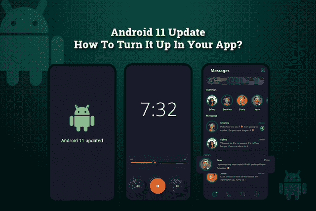
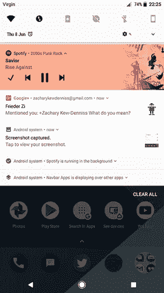
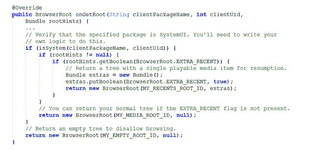
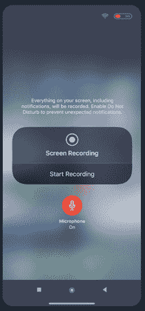
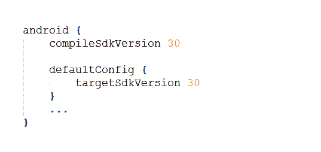

# Android 11 更新:如何在你的 App 里打开？

> 原文：<https://levelup.gitconnected.com/android-11-update-how-to-turn-it-up-in-your-app-e89cc8535fc7>

在 Android 10 成功更新后，如果您计划将您的应用程序转向 Android 11 更新，但您不确定它将在您的移动应用程序中包含哪些功能，以及它将如何影响移动应用程序开发？从行为变化到 Android 11 更新的特性和 API，这个博客将帮助你了解一切！

> **本博客开门见山:**

*   *Android 11 的更新是什么？*
*   【Android 11 更新给你带来了哪些主要功能和 API？
*   【Android 11 版本入门
*   *将您的应用迁移到 Android 11 的影响*
*   *结论*

让我们先睹为快，详细了解这篇博客，并了解它将如何影响您的移动应用程序开发…

## ***a . Android 11 更新是什么？***

Android 11 是 Android 最稳定的版本，已经开始在移动应用程序开发中推出。虽然 Android 11 的完整版本尚未公布，但 Android 应用程序开发公司都准备好了，看看他们未来可能会利用这次发布的功能。

基本上，它是在谷歌 Pixel 智能手机上推出的，但已经成为三星、一加等其他公司的旗舰产品。随着这个 Android 版本的推出，谷歌已经确保开发者在应用程序开发中添加一些独特性，以及 Android 11 的所有这些显著特征。

事实上，将这一最新版本解读为 Android 应用开发历史上的游戏规则改变者不会错。因此，不浪费任何时间，让我们解锁 Android 11 为您提供了哪些功能，并了解它将如何影响移动应用程序开发。

## ***b . Android 11 更新带给你的主要功能和 API 有哪些？***

虽然 Android 10 是谷歌在操作系统环境中的一个重大变化，并在这个时代结束时提供了期待已久的黑暗模式和几个应用程序权限。但 Android 11 正在发挥最终的愿景，并推出了谷歌希望在操作系统中实现的足够多的功能。

因此，在了解 Android 11 如何影响一直计划投资 Android 应用开发解决方案的企业家的应用领域之前，我们先来看看随着 Android 11 的推出而修改的新 Android 功能。

> 以下是关注 android 应用开发解决方案的每个人都应该知道的新特性和 API 列表:

## **1。更好的交流体验与聊天气泡**

毫无疑问，移动应用程序已经彻底改变了世界各地人们沟通和保持联系的方式。因为 Android 11 旨在改善沟通，并为消息传递体验增加了多项功能。因此，最大的新功能将与通知、聊天应用和其他与对话相关的系统相关。

聊天气泡最早出现在 Android 10 中，但谷歌之前并没有优先考虑它，它们很快就消失了。但随着 Android 11 的稳定版本，聊天气泡正在占据中心舞台。那么它到底是什么？它是如何工作的？

如果你曾经在 Android 上使用过 Facebook Messenger，你就已经知道聊天气泡是如何工作的了。使用 Messenger，一个“聊天标题”会出现在你的手机上，覆盖在每个应用程序的顶部。快速点击气泡将启动聊天，您可以快速将该聊天最小化回一个图标。这就是聊天气泡的工作原理。

有了 Android 11，你不再需要对聊天气泡进行手动设置，因为平台会自动将通知设置为总是在文档 UI 模式下启动。除此之外，泡泡的性能也有许多改进，用户可以更加灵活地在每个应用程序中启用和禁用泡泡。如果您已经在 Android 应用程序中实现了，那么下面是您需要知道的 Android 11 中 API 的一些变化:

*   开发人员可以使用这两个新构造函数 BubbleMetadata 中的任何一个。builder(pending content，Icon)或 BubbleMetadata。构建器(字符串)。
*   *通过调用 BubbleMetadata 从快捷方式 ID 创建 BubbleMetadata。构建器(字符串)。但是要确保该字符串与提供给 Notification.Builder 的快捷方式 ID 相匹配。*
*   *并使用新方法“createWithAdaptiveBitmapContentUri()”创建一个气泡图标。*

## **2。Android 11 确保更好的媒体控制**

用 Android 11 控制媒体成了一个有趣的游戏。您可以让媒体控制显示在快速设置面板上，而不是标准的播放通知。在 Android 11 中，抽屉的这一部分不是为对话保留的，媒体播放器被移到了快速设置部分。现在，媒体控制器不再像一个通知，事实上，它看起来像一个迷你应用程序，使您能够控制设置。

简而言之，只需轻触播放系统，就可以快速将音频或视频推送到不同的系统。例如，这将使从手机扬声器切换到蓝牙耳机变得非常容易。此外，你可以调整 Android 11 的设置，让播放器在你停止听音乐时自动消失。

为了开始 Android 11 更新，您可以使用 ***MediaSession*** 和***media router 2***API 来呈现控件和音频输出信息。此外，您可以查看示例代码，了解如何用 Java 实现它

[来源](https://developer.android.com/guide/topics/media/media-controls#java)

## **3。内置屏幕记录器**

自最近发布以来，Android 用户一直在急切地等待谷歌加入内置屏幕记录器。虽然每天很少使用这个功能，但是这个功能非常基本，非常有用。

通过使用这项功能，你可以录制手机的声音或使用麦克风来讲述你在做什么。这个功能可以作为一个很好的功能，用于创建短视频或技术娴熟的教程相关内容。最棒的是，你可以轻松地从一个应用程序中复制和粘贴图像、文本和视频，并立即发送给其他应用程序。

## **4。提高企业用户的隐私和安全性**

如果你在工作场所使用 Android 手机，那么你现在可以在手机中拥有更好的隐私和安全功能。Android 11 引入了大量的改变和限制，以增强用户隐私和数据安全。

> 以下是您可以找到的几个最新的安全 API:

***生物认证更新:*** 为了帮助您控制应用程序数据的安全级别，Android 11 在生物认证方面为您提供了多项改进。这些变化也出现在 [Jetpack 生物特征库](https://developer.android.com/jetpack/androidx/releases/biometric)中。

此外，Android 11 更新也带来了一些应用权限的变化。现在你可以允许你的应用程序在开/关的基础上访问相机或位置，而不是现有的选项“所有时间”和“只有在使用应用程序时”。

通过将您的应用程序更新到 Android 11，您的手机将自动遵循您之前授予的权限。

## **5。更好的屏幕显示支持各种设备**

在过去的几年里，你可能已经注意到了各种各样的可折叠设备，在未来，你可能会注意到更多不同屏幕尺寸和分辨率的可折叠设备。因此，谷歌已经适应了可折叠设备将是未来几年的下一件大事的事实，因此，Android 11 推出了几个支持瀑布显示的 API，这有助于在设备边缘包裹显示。

这些显示器被视为带有 ***显示剪切*** 和现有 ***显示剪切的显示器的变体。getSafeInset…()*** 方法现在返回安全嵌入，以避免瀑布区域和切口。因此，要在瀑布区域呈现您的应用程序内容，您需要遵循以下说明:

1.  要获得瀑布插图的精确尺寸，您需要调用***【display cutout . getwatersallinsets()***
2.  将窗口布局属性更改为***LAYOUT _ IN _ DISPLAY _ CUTOUT _ MODE _ ALWAYS***，允许窗口扩展到屏幕所有边缘的剪切和瀑布区域。但是，请确保没有必要的内容位于剪切区域或瀑布区域。

虽然所有这些功能都很容易集成到您现有的应用程序中，但为了避免留下任何导致任何错误的范围，还是值得雇佣一家 [**应用程序开发公司**](https://www.xicom.biz/offerings/mobile-app-development/) 来轻松地将应用程序更新到最新的功能和 API。此外，当你与专业人士合作时，更容易实时获得完美的解决方案。

> **Android 11 带给你的其他重要功能还有:**

如果您正在使用 Android 设备或计划为 Android 设备开发应用程序，您应该了解一些 Android 11 的新功能:

*   **5G 视觉指示器:**Android 11 最近推出的更新之一是更好的 5G 检测。如果你正在使用 5G 手机，Android 11 应用程序将自动识别它，并因此运行更快。
*   **画中画模式:**Android 11 的这次更新可以让你在管理屏幕上其他事情的同时继续观看你的视频，以确保你不间断的用户体验。最棒的是你可以改变窗口的大小，这样你就可以从你正在做的任何事情中获益。
*   **附近共享模式:**通过这一新的更新“附近共享”模式，您可以轻松地将信息和数据发送到附近的设备，如您的平板电脑、Chromebook 甚至使用 Chrome 的计算机。通过使用简单的命令，您可以轻松地将文件从您的手机发送到 PC 或首选机器。

# ***c . Android 11 入门***

最终决定开始使用 Android 11，但不确定如何继续使用它，以及您的智能手机是否兼容访问这些更新？如果是的话，那你就来对地方了。

你可以下载 Android 11，如果你有一个 ***谷歌 Pixel 2，Pixel 2XL，Pixel 3，Pixel 3XL，Pixel 3a，Pixel 3a XL，Pixel 4，Pixel XL，Pixel 4a，小米 Mi 10 或者小米 Mi 10 Pro*T3。由于 Android 11 更新主要是为 Pixel 推出的，因此，如果你正在操作这些设备，你可以下载操作系统。**

所以现在没有任何进一步的忙乱，让我们学习如何设置 Android 11 更新到您的兼容 Android 手机上。但是，为了获得 Android 11 SDK 的最佳开发体验，我们建议您遵循以下几个简单的步骤:

1.  ***获取 Android 11 SDK:*** *安装并打开 Android Studio 后，安装 Android 11 SDK 如下:*

*   单击工具> SDK 管理器
*   在 SDK 平台选项卡中，选择 Android 11。
*   在 SDK 工具选项卡中，选择 Android SDK 构建工具 30。
*   最后，单击 OK 开始安装。

***2。更新您的构建配置***

更改您的应用程序的构建配置以针对 Android 11，并让您的应用程序访问 Android 11 APIs，并测试应用程序的兼容性。为此，您需要打开您的模块级 build.gradle 文件，并更新***compileSdkVersion***和***targetSdkVersion***。下面是更好理解的代码:

要了解 Android 11 中可能影响你的应用程序的变化，你需要设置一个模拟器来测试应用程序并寻找问题。

## ***D .将你的 App 迁移到 Android 11 的影响***

进行下一项，直接进入重点。各种规模的创业者都很好奇 Android 11 的发布会对移动应用产生怎样的影响。然而，对于期待通过利用 Android 11 的更好功能来创建出色的 Android 应用程序的 Android 应用程序开发者来说，这将是一个很好的机会。他们主要需要关注三个主要方面:*行为变化、特性和 API。*

以下是 Android 11 的所有这些功能将如何影响移动应用程序:

**App 数据会保密:**由于 Android 11 更多的是保护用户数据，因此，最新版本的 Android 会将 App 使用情况的数据存储在加密存储中。这意味着任何应用程序或系统都不能在不进行编码的情况下访问数据。

**授予应用权限的灵活性:**为了克服所有这些重复的应用权限，Android 11 增加了限制权限对话框的规定，只需点击“拒绝”即可。该应用程序会自动暗示您的许可，并且不会再询问您。

**确保更好地支持神经网络:**Android 应用程序开发公司最大的公告之一是通过 Android 11 获得对机器学习和神经网络的更好支持。新的神经网络 API 1.3 已经准备好让应用程序在设备上无缝运行，并确保升级它的简单方式

**增量 APK 安装:**随着 Android 11 的推出，谷歌似乎已经意识到 APK 安装过程是多么复杂和漫长。因此，通过新的增量 APK 安装，这一过程将得到简化。

考虑到所有这些影响，你肯定会有一个简单的问题:把你的应用升级到 Android 11 需要多少钱？企业可以轻松地免费将他们的应用程序升级到 Android 11。他们所需要的就是雇佣一个移动应用程序开发专家来编写代码，并允许你毫无麻烦地更新应用程序。

# **闭幕词**

随着这篇博客的结束，你一定会明白 2020 年 Android 11 是如何凭借最新的功能一枝独秀的。毫无疑问，Android 10 为你带来了广泛的功能，但 Android 11 将这些体验带到了下一个阶段，并使谷歌智能手机的体验——Pixel——更加用户友好，使用起来更有趣。

虽然应用程序开发行业的趋势一直在变化，但 Android 11 是最新的关键趋势，可以帮助你在这个竞争激烈的市场中保持领先。而且对于商家和企业来说，Android 11 是个好消息！由于这些功能的兼容性取决于设备，因此 [**聘请移动应用开发公司**](https://www.xicom.biz/offerings/mobile-app-development/) 来帮助您将您的应用与 Android 11 的增强功能相结合，以获得更好的用户体验是有意义的。

# 分级编码

感谢您成为我们社区的一员！ [**订阅我们的 YouTube 频道**](https://www.youtube.com/channel/UC3v9kBR_ab4UHXXdknz8Fbg?sub_confirmation=1) 或者加入 [**Skilled.dev 编码面试课程**](https://skilled.dev/) 。

 [## 编写面试问题+获得开发工作

### 掌握编码面试的过程

技术开发](https://skilled.dev)