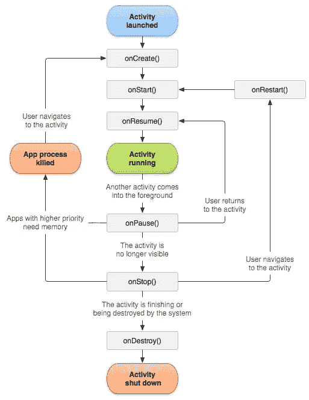
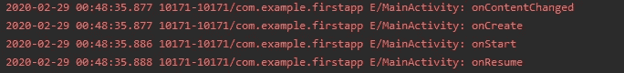
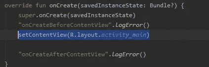
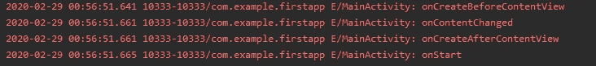
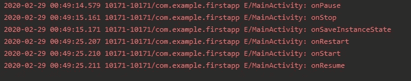

# Android 活动生命周期

> 原文：<https://levelup.gitconnected.com/android-activity-lifecycle-ffa4e8f34b47>

android 应用程序在其整个生命周期中的状态

# **什么事？**

活动生命周期是应用程序启动到关闭的方法顺序。换句话说，应用程序从出生到死亡的各个阶段就像人的生命一样(有一两种不同的情况，比如暂停和重启，但我们稍后会提到)。你启动了一个应用程序，然后把它发送到后台。接下来会发生什么？或者你把手机状态从纵向改成横向，之后会怎么样？

# **这很重要，因为...**

如果您在填充长条目时接到电话，这些方法应该保存您输入的信息。如果将应用程序发送到后台，应用程序应该会暂停。否则，你会有内存问题，也许还有软件错误。如果你把你的手机从纵向改为横向，应用程序不应该重新启动你已经完成的整个过程。

这是一个 app 的活动生命周期。基本方法有:

`onCreate()``onStart()``onResume()``onPause()``onStop()``onRestart()`

# 当你启动一个应用程序时

## *onCreate():*

这个方法是你点 app 图标的第一个方法。

## onStart()

启动一个 app 后的第二个方法是 onStart()。它负责启动用户界面。

## onResume()

第三种方法是你开始与应用程序交互的地方。它会一直持续下去，直到用户关闭应用程序或者生命周期中发生了一些事情。

## **让我们启动 App**

当应用程序启动时，您会看到第一批方法。但是图像中有些不同——`onContentChanged`方法是第一种方法。原因是`onCreate`方法调用:

`setContentView`而且是在`onContentChanged`法中。如果在`setContentView`后放置日志，结果将是:

# 如果应用程序中断了

## ***onPause()***

如果应用程序以某种方式关闭，暂停状态将变为活动状态。这意味着当你的应用程序不在屏幕层的顶部时，这个方法将被激活。即使当通知框出现时，你也应该知道这个方法是活动的。

## ***onStop()***

当用户看不到应用程序时，其中的代码会变为活动状态。您可以在关闭应用程序时实现一些方法，如保存一些值等。

## ***onRestart()***

如果您没有关闭应用程序，并且它被发送到后台，并且您再次打开`onRestart` 方法将被激活，活动将再次重新开始。

## ***onDestroy()***

当您关闭应用程序时，将调用此方法。从它的名字就可以理解，这个方法扼杀了 app 的活跃度。另一方面，如果你把手机从纵向设置为横向状态，你的 app 就会被这种方法杀死。此外，一些配置更改，如电话语言或字体，也会激活`onDestroy`方法。

## onSaveInstanceState()

当应用程序到达`onStop`方法时，这个方法被调用。在调用了`onStop` 方法之后，因为需要保存来自用户或 app 本身的信息，所以调用了`onSaveInstanceState` 方法。

当您将应用程序发送到后台并再次打开时，这些活动将被激活。

谢谢你看我写的东西。我将在以后的文章中更深入地介绍 Android。