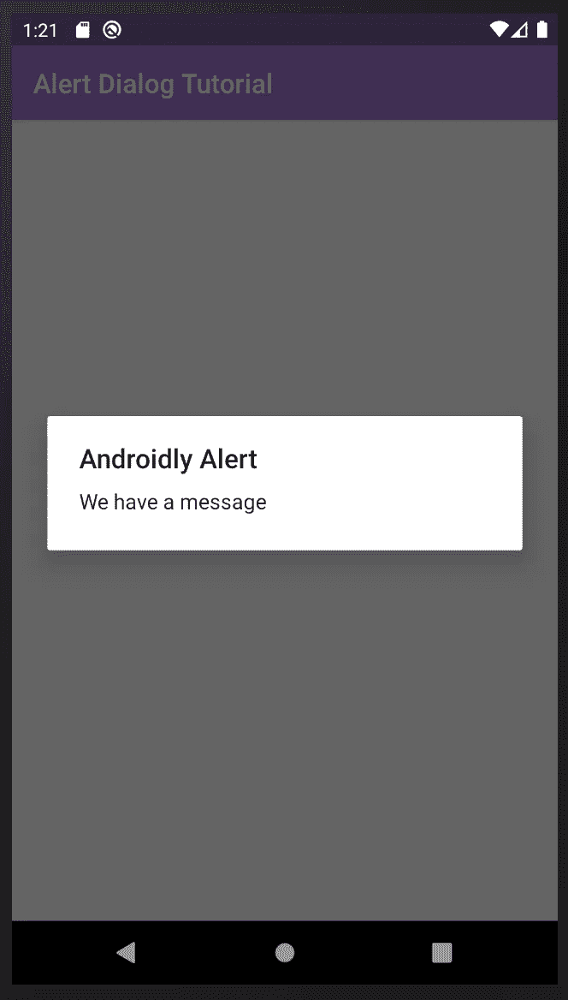

# Kotlin 中的 Android 警告对话框——教程

> 原文：<https://levelup.gitconnected.com/android-alert-dialogs-in-kotlin-tutorial-fbbe1f787015>

## 对话框和提醒是每个 Android 应用的基础部分，在本教程中，我将向你展示使用它们的基础知识

在数字世界中，对话出现在我们的日常生活中。当提到对话框时，几乎每个用户都知道我们在说什么:“那些覆盖屏幕并打断你想做的事情的烦人的小窗口”…差不多吧。它就像我们大多数的 Android UI 工具一样，是一种与用户交流重要信息的方式。这就是为什么我在 Kotlin 教程中创建了这个 Android 警告对话框。

首先，看看 Android 官方对对话框的定义，我们发现如下:

> 对话框是一个小窗口，提示用户做出决定或输入附加信息。对话框不会填满屏幕，通常用于需要用户在继续操作之前采取行动的模式事件。
> 
> [T3【https://developer.android.com/guide/topics/ui/dialogs】T5](https://developer.android.com/guide/topics/ui/dialogs)

作为一名 Android 开发者，你会在你的大多数应用程序中使用对话框，想想你每天使用的应用程序中的例子。我想到了三个简单的例子。

1.  确认消息。
2.  提醒输入日期或文本。
3.  提示选择一个选项。

# Android Kotlin 警告对话框教程

你可能已经知道，在本教程中，我们将学习如何创建一个 Android 对话框。虽然这是一个初学者教程，但任何人都可以跟着学习基础知识并了解最佳实践。从创建一个新的 Android Studio 项目开始，如果你不知道如何做，请在这里查看我的[教程](http://www.evanamargain.com/blog/android/new-android-studio-project-for-kotlin-and-java-tutorial/)，为了这个教程的目的，我使用:

*   Android Studio 3.5.3
*   科特林 1.3
*   Compat 库:AndroidX

如果你喜欢下载我的源代码，你可以在这里得到它:

[启动项目](http://www.evanamargain.com/blog/wp-content/uploads/2020/05/Project-Starter.zip)

# 开始项目

从“空活动模板”开始，配置默认设置，如下图 1 所示。

图 1。要开始的项目设置

运行应用程序，你应该能够看到类似于图片 2 的东西，颜色可能会有所不同。

图 2。初始屏幕

# 第 1 部分:警报基础知识

## 创建一个按钮来显示警告

在这个屏幕上，您需要做的第一件事是将屏幕上的“Hello World”文本替换为一个按钮。这个按钮会触发我们最基本的警报。要做到这一点，头到 **activity_main.xml** ，该文件应该已经在您创建项目时打开，否则，在文件夹***app>RES>drawable***中查找。第一次打开文件时，你会在左下角看到两个标签，设计和文本，最有可能选择的是“设计”(图 3)，虽然这是一个很好的预览屏幕，但几乎总是在“文本”部分编辑代码。

图 3。XML '设计'可视化编辑器

图 4。XML“文本”代码编辑器

代表“Hello world”文本的行在<textview>标记中，在上图(图 4)中，它们代表第 9 行到第 16 行。将该代码替换为以下内容:</textview>

如果你比较我们之前在图 4 中的代码和新代码，你会注意到我们只改变了文本和标签的名称，之前是“文本视图”，现在是“按钮”。如你所见，Android XML 布局代码非常简单，我们没有修改的其他行是视图的属性，指示它在空间中的位置，现在不要担心它们的意思。回到“设计”选项卡，您现在可以预览按钮，如下图所示(图 5)。

图 5。设计预览

现在运行应用程序，你应该会看到屏幕上的按钮，顺便说一下，类似于预览。如果你想知道你的结果应该是什么样子，看看下面的图片 6。

图 6。带有显示对话框按钮的屏幕。

## 为警报对话框编写 Kotlin 代码

打开 MainActivity.kt，这是包含我们之前编辑的控制屏幕的所有 Kotlin 代码的代码。如果您在项目创建后没有打开该文件，您可以在 app > java >您的项目名称> MainActivity.kt 中找到它。正如您可能看到的，该文件包含少量代码:

1.  它所属的包的名称。
2.  一些默认导入。
3.  你的主要活动课。
4.  onCreate()函数，这是一个在屏幕“创建”后执行的函数。在它的内部，通过*setContentView(r . layout . activity _ main)*指令，您告诉应用程序使用 activity_main.xml 文件作为这段代码的布局。

解释够了，让我们来看代码吧！

# 导入所需的类

首先，在导入行中，添加以下代码:

导入可能被最小化，你可以通过单词 import 后面的…信号知道这一点。通过双击这些省略号或者通过线右侧的(非常小的)“+”图标来打开它。别担心顺序，没什么区别。

## 创建显示警报的方法

现在，对于警报本身，在 onCreate()方法下，创建一个新方法，用以下代码显示警报:

让我们一部分一部分地检查这段代码。为了便于解释，我用注释(不一定要包含在项目中)标记了这些部分:

1.  Android 提供了一个默认的“生成器”来创建警告对话框，所以你不必担心背后的逻辑。使用它，并告诉应用程序在“这个”类上创建一个生成器。
2.  您可以设置警报的标题和消息。
3.  您请求构建器显示警告。

现在我们需要以某种方式调用这个方法，在 onCreate()的底部添加这行代码:

如果你对你的代码现在应该是什么样子有点困惑，看看下面的图片(图 7)来澄清一下。不要担心，这是很多新的信息，编码与实践是齐头并进的。

图 7。主要活动 Kotlin 代码

现在运行应用程序，看看会发生什么。

图 8。警报显示

发生了什么事？应用程序可以运行，但是……屏幕启动时显示警报，您能确定为什么会出现这种情况吗？由于我们在最后一步中添加到 onCreate()方法中的代码行，警报立即显示出来，这不是我们想要做的，但至少我们知道我们的警报现在可以工作了。

## 将 showAlert()方法附加到按钮操作

下一步是让按钮触发警报，而不是让 onCreate()来完成这项工作。为此，返回到 activity_main.xml 文件，在 button 标记中添加下面一行:

XML 文件的结果如下图所示(图 9)。

图 9。activity_main.xml 代码

您需要注意的是，添加到 onClick 属性中的参数与我们在上面创建的函数名称"*funshowBasicDialog(View:View？)*”，这里的关键是‘view’参数，你在 onClick 上使用的方法，必须有一个 view 参数才能工作。

现在从 onCreate 中删除“*showBasicDialog(****null****)*”调用，运行 app。

图 10。点击按钮时显示警告

成功了吗？太好了！这是创建警报的第一步。

# 第 2 部分:添加交互

让我们停下来想一想，我们脑海中第一个想到的词是对话，或者说警报。现在将它与我们上一篇文章的结果进行比较(图 11)，如果你需要提醒，这里是上一篇教程的结果:

图 11。上一个教程的结果

问题是…少了什么？这种警报通常缺少什么？我首先想到的是“纽扣”。大多数提醒是交互式的，我们的意思是它们给你提供了选项和选择的可能性。你可能熟悉我们实现的功能，通过点击周围的灰色区域来消除，但这不是最好的主意。作为应用开发者，我们必须优先考虑用户体验，缩写为 UX。

# 纽扣和 UX

按钮是数字世界中一个非常有趣的元素，但如果我们探究按钮的起源，它不是后计算机时代的一部分，按钮在计算机和智能手机之前就存在了。这就是按钮的魔力，它们属于物理世界，这就是为什么每个人几乎凭直觉就知道如何使用它们。另一方面，点击对话框外的灰色区域是我们从技术和现代设计实践中学到的，但不一定是直观的。

> 按钮是交互设计中常见的元素。虽然它们看起来是非常简单的 UI 元素，但它们仍然是最重要的创建元素之一。
> 
> [*https://www . smashingmagazine . com/2016/11/a-quick-guide-for-design-better-buttons/*](https://www.smashingmagazine.com/2016/11/a-quick-guide-for-designing-better-buttons/)

# 向您的提醒添加按钮

记住按钮给我们选择是很重要的，大多数警告对话框会让你在两个选项中选择，通常是“是”和“否”。请注意，根据您的行动，这些词语可能会被其他词语替换。

***Pro-tip*** *:使用实际告诉用户按钮将做什么的文字，例如:你要删除这个文件吗？好标签:“删除”/“不要删除”，坏标签:“是”、“否”。这可能看起来很傻，但对于一些用户来说，这可能是意外丢失文件或保持文件安全的区别。*

一旦您打开了项目，请转到文件' **MainActivity.kt** ，并在'**builder . set message(" your message ")**'指令之后和' **builder.show()** '之前找到**showBasicDialogFragment()**，您将为对话框添加选项。在那里添加以下代码。

该应用程序也很可能会用红色标记术语“toast”，这是因为缺少导入，所以在顶部添加 Toast 导入。你也可以使用快捷键 *option+intro* 或者 *ctrl+intro* 来自动导入。

注意:我在下面增加了一个解释什么是祝酒词的部分，以防你对它的工作原理感到好奇。

现在让我们一部分一部分地回顾这段代码:

1.  你是在告诉构建器对象，创建一个‘肯定的’按钮。默认情况下，Android 已经知道什么是正按钮，有时根据系统或可访问性设置，你可以通过语音命令或其他方式触发它。您表示要显示的文本是“**是**”。然后添加两个参数，第一个指示它是一个对话框，然后一个' *which* '参数告诉它当点击它时做什么。
2.  这是点击*“是”/肯定*按钮时将执行的动作。在本例中，您正在创建一个 **Toast** 项目，它也有文本“Yes”来测试您的按钮的功能。
3.  该代码与第一个代码相同，但是在本例中，您定义了一个“否定”按钮，文本为“否”。
4.  就像上一个一样，这和第二个一样，但是有“不”的文字。

运行应用程序并检查结果。

# 挑战

在对话框中添加一个可能按钮！

见下文获得提示或查看完整答案。但是之前，试着自己做！

**提示:**就像 Android 有正反按钮的方法一样，它也有一个你可以设置的中性按钮。

就像上面的元素一样，中立按钮是用文本和动作设置的。看看下面的 gif，看看运行 app 后的行为。你得到了同样的结果吗？

# 烤面包片

敬酒项目，也称为祝酒🍞。是 Android 中使用的元素，用于在某个时刻显示某些内容，然后自动将其删除。几年前，它们是快速消息的标准，但现在它们主要被开发人员用来显示对用户来说不太重要的错误，或者在开发过程中用来测试。

就这样，现在你的提醒有了按钮，并对用户的动作做出反应。

# 第 3 部分:列表对话框

你可能需要在你的对话框中添加很多东西，在这最后一部分，你将学习如何在你的对话框中添加选择列表，它分为三类:

1.  纯文本列表，您可以从中选择一个选项。
2.  单选按钮列表，也用于单个选项。
3.  复选框列表，用于选择多个选项。

# 添加更多按钮来显示对话框

在使用这个应用程序之前，我们将为每个新的提醒添加 4 个按钮，这样你就可以保留所有的例子，并在你的个人项目中重用它们。

# 设置新按钮

将以下代码添加到 **activity_main.xml** 中，位于上一个按钮的下方:

这段代码与上一个按钮非常相似，但是有 3 点需要注意:

1.  第一行有一个 id。id 对于操纵代码中的视图并能够引用它们非常重要。你会明白我为什么加这个。
2.  onClick 方法仍然指向 **showBasicDialog** ，这将在我们创建显示列表的方法后改变，但现在，让它像这样以避免 Android Studio 的错误。
3.  我们已经将按钮的文本更改为另一个文本。

构建并运行该应用程序，您应该会得到以下内容。

如果你看它，你应该注意到新的按钮被放置在前一个按钮之上，这就是为什么我们添加了 ID。为您的上一个按钮添加一个 ID:

我更喜欢将它们作为 XML 项的第一项来添加，以便于识别它们，但是它可以放在任何地方。现在注意两个按钮都有一些引用约束 **layout_constraintX_toYOf** 的行。在移动开发领域，也就是 Android 和 iOS，用约束来管理视图是很常见的。这些约束基本上告诉项目，它们在屏幕中的位置，如果你看两个按钮，它们被约束到'**父节点【T3 ' '，这意味着它们到屏幕的顶部、底部、右侧和左侧有相等的距离。为了显示两个按钮，我们需要相对于第二个按钮的顶部约束放置第一个按钮的底部约束。这就是这里需要 id 的原因。**

# 限制

更改第一个按钮的**layout _ constraint bottom _ to bottom of**，如下:

请注意，底部现在被约束为“**到顶部**”，而之前是“**到底部**”。

在第二个按钮中改变**layout _ constraint top _ toTopOf**，为:

注意:**layout _ constraint bottom _ toTopOf**和**layout _ constraint top _ tobottom of**两者不一定都加，但是如果把它们都加起来，你会得到更多的练习和逻辑感。

现在再次运行应用程序，你应该可以看到两个按钮。此时，它们将显示相同的对话框，因为它们都引用 showBasicDialog 操作。

# 添加其余的按钮

挑战:再添加两个按钮，文本为“显示单选按钮列表！”和“显示复选框列表！”。

添加四个按钮后，您应该会在屏幕上看到以下内容:

准备工作完成后，让我们开始对话。

# 带有列表的 Android 对话框

正如本文开头提到的，Android 提供了三个主要的列表选项来添加到对话框中:纯文本，没有指示器，单选按钮和复选框。

# 添加可选的文本列表

这第一种列表在 Android 文档中被称为“传统的单项选择列表”。

转到 MainActivity.kt 并创建一个新函数:

对于任何列表，您都需要创建一个包含您想要显示的项目的数组。假设你想问用户他最喜欢的爱好，在函数内部添加数组，像这样添加选项:

接下来，添加创建对话框的代码。

让我们回顾一下上面的代码:

1.  任何对话框都需要一个生成器，这个生成器总是以同样的方式创建。这个词指的是应用程序的上下文。我们还添加了一个标题，但注意这不是必需的。
2.  您将“爱好”数组中的项目设置为构建器，因此它知道您正在提供一个列表。添加 OnClickListener 方法，让它知道当某项被单击时该做什么。
3.  正如您在基本示例中所做的那样，当用户选择一个项目时，您将显示一个祝酒词。请注意，第二个参数现在引用的是单击的数组“which”项。请注意，它给出了一个索引，因此您将引用爱好[1]，这将为您提供显示在 toast 中的字符串。
4.  你需要让建造者知道它必须被展示。请记住这一点，我经常忘记它，并最终在长时间的思考是什么错了。注意这同样适用于吐司，很容易忘记在最后加上“show()”。

现在，转到 activity_main.xml 文件，通过更改相应按钮的 onClick 方法中的内容来引用该函数:

运行应用程序，点击**显示单选列表**按钮。您应该会看到类似下图的内容:

# 添加单选按钮列表

如果你得到了前一点的工作，我有好消息给你！添加一个带有单选按钮和复选标记的列表(我们的下一点)几乎和“传统列表”一样，但是继续下去，这样你就可以练习和掌握对话了。

对于这一个，我们需要跟踪所选择的项目，所以在函数之外，我们将为此创建一个变量:

我们添加-1 的原因是“不选择任何”，您可能希望在没有预先选择的情况下开始您的对话框。

接下来，正如我们在其他例子中所做的那样，创建一个函数，在本例中称为**showRadioButtonListDialog**:

要添加到函数中的代码如下:

让我们再次一步一步地看代码:

1.  你创建了一个城市的数组，想象你想让你的用户选择他们想住在哪个城市，因为有了技术一切皆有可能，所以我们有 4 个城市给他们作为选择。
2.  如上所述，每个对话框都需要一个生成器。我们再一次加上标题。
3.  现在我们的第一个变化是，你会看到条目现在是通过方法**setsinglectioneitems()**添加的，这是告诉构建器你想要一个单选按钮列表。这个方法与上面的 **setItems** ()方法的区别在于，这个方法接收的是“默认”项，也就是您之前创建的名为 selectedRadioItem 的变量。
4.  您将 selectRadioItem 设置为新选择的项目。在函数之外创建这个变量的原因是为了保存所选择的项，否则，每次调用函数时，保存的值都会被覆盖。正如您之前所做的，您正在输出一个祝酒词，以查看您的选择是否正确。
5.  对于这种对话框，您需要添加一个确认按钮，因为用户可能仍然不确定，并且希望再次更改选择，直到确认。
6.  再次提醒，记得显示对话框。

现在有一个问题，在这之后我们还有一步才能看到我们的新对话框，你还记得吗？

您需要将该方法添加到 activity_main.xml 中按钮的 onClick 中

再次运行应用程序，点击**显示单选按钮列表**项，查看更改结果，您可以看到下图以供参考:

# 添加勾号列表

我希望到现在为止，您已经了解了警报是如何工作的，否则请不要担心，软件开发是一项实践，这就是为什么我们现在将再次使用复选标记列表。

与单选按钮一样，您需要在函数外部创建一个变量来跟踪哪些项被选中，这可以通过一个布尔项数组来完成:

现在，创建一个名为 **showCheckmarkList** 的函数来显示最后一个对话框:

对于函数内部的代码，我们将有以下内容:

让我们像以前一样回顾一下代码的每一部分，看看它到底是关于什么的。

1.  我们在对话框中显示的项目数组。
2.  您创建每个对话框都需要的生成器。
3.  在这种情况下，您使用“setMultiChoiceItems”来显示复选标记列表。这个方法与单选按钮的方法非常相似，唯一的区别是它接收我们的布尔数组来跟踪选中的项目。
4.  您相应地选中或取消选中项目，并再次显示带有所选项目的祝酒词。
5.  与单选按钮对话框的模式相同，我们需要一个按钮来确认选择。
6.  我再说一遍，记得给你的建造者看。

我们只差了一步，你还记得是哪一步吗？将方法调用添加到按钮的 onClick 中。

搞定了。运行应用程序，你的对话框应该如下图所示。

今天到此为止！我希望一切都很容易理解，这个 Android Alert Dialogs Kotlin 教程对你有用。如果你想看这个教程的结果，你可以下载下面的项目

[最终项目](https://evanamargain.com/wp-content/uploads/2020/02/Project-Finisher-Part-3-Android-Kotlin-Dialogs.zip)

我希望你喜欢这篇文章的内容。如果你有任何疑问，不要犹豫留下评论，我会尽快回复。

下次见！

埃娃娜·马尔甘·普伊格