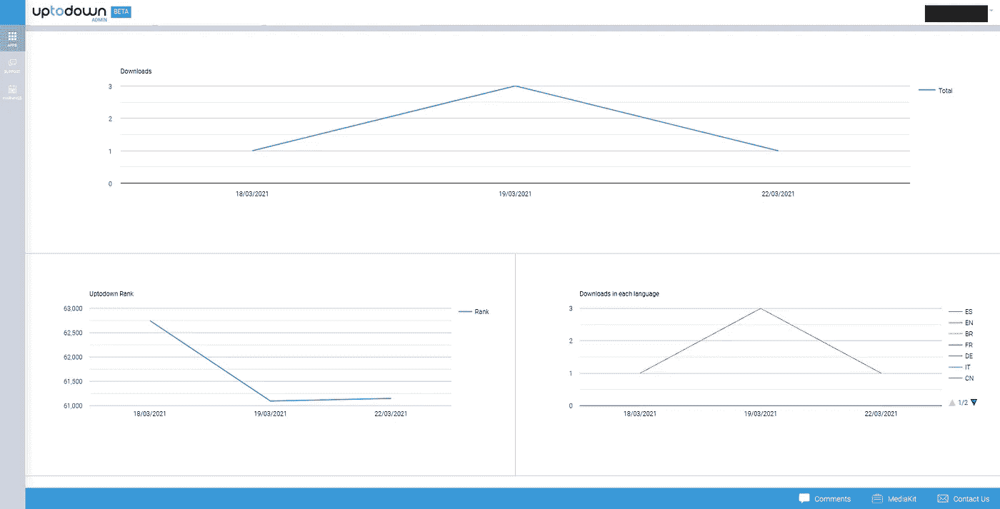
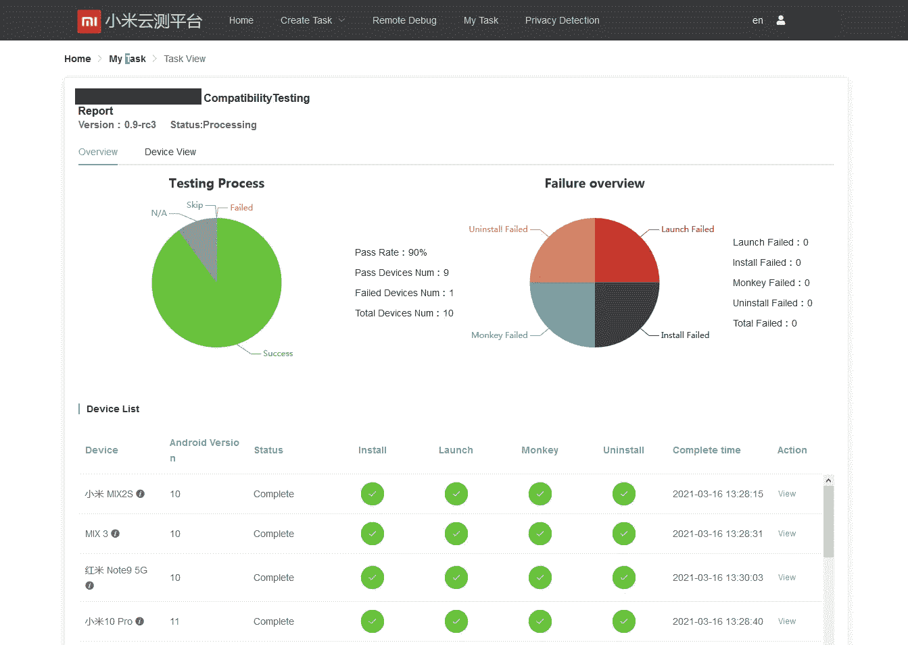
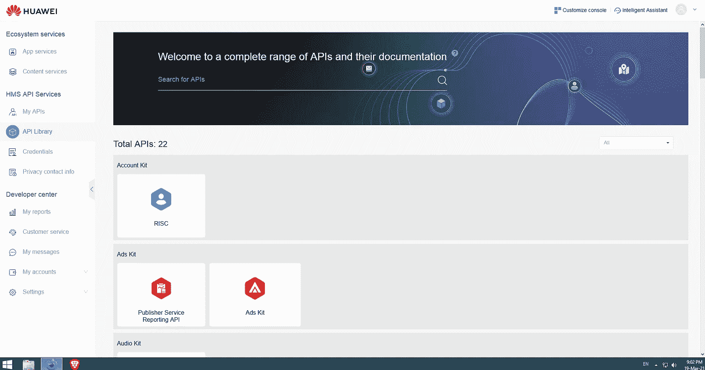
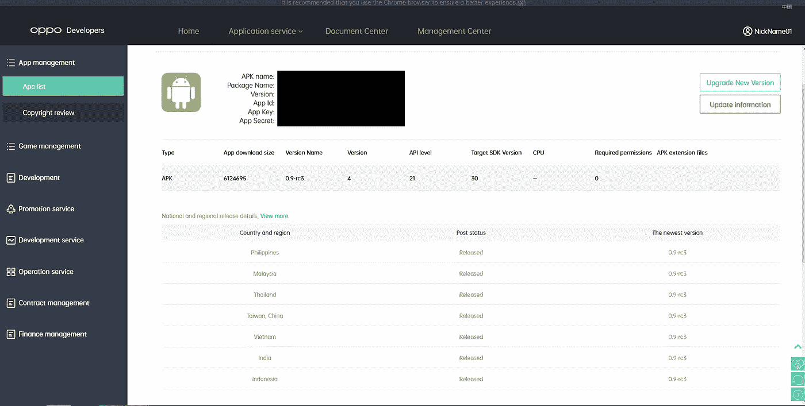

# Android 应用商店替代方案——开发者视角

> 原文：<https://levelup.gitconnected.com/android-app-store-alternatives-the-developer-view-80744c63cdf0>

起初，看起来 Google Play store 可以满足开发者在应用分发方面的所有需求。这是一个非常好和受欢迎的应用程序商店，为开发者提供了许多工具和 API。即使不使用 analytics SDK，我们也可以获得一些基本的统计数据，我们可以对常见问题进行测试和检查，我们可以为我们的应用程序设置要分发的国家和许多更有用的功能。它预装在许多 Android 设备上，但不是所有的设备(我们将在本文后面谈到它)。

Google Play 商店管理也做了很多工作来保护用户免受有害应用的影响。这包括但不限于，要求应用程序针对较新的 Android 版本，禁止开发人员使用某些功能，避免某些反模式等。

但随着我们开始深入研究，我们发现由于这种过度保护的行为，有些功能我们无法再使用，或者有些应用程序无法请求一些权限。例如，你的应用程序可能会因为“不恰当”使用 SystemAlertWindow 权限而被谷歌 Play 商店拒绝，或者如果 Google Play 评论团队认为你不需要，你的应用程序可能不允许使用后台位置。

而且谷歌 Play 商店要求还有更多问题——如果你的应用针对 Android 10 或更高版本，UVC 外部摄像头访问将不起作用，但如果你想在 Google Play 商店发布你的应用，你必须针对 Android 10 或更高版本。

还有传言称，一些应用程序因包含指向包含“用贝宝捐款”按钮的网页的链接而被取消发布。

因此，我们显然看到了许多寻找替代应用商店的技术原因。

除了我已经提到的技术原因之外，在另一个应用商店发布你的应用也有与用户获取相关的原因。美国和欧洲的用户数量庞大，但中国、印度和其他东南亚国家销售的数十亿台 Android 设备没有谷歌服务和谷歌 Play 商店应用程序，情况又如何呢？俄罗斯和其他前苏联国家呢，那里的人们因为便宜的价格而购买中国的“无谷歌”智能手机？

当然，我们不希望这几十亿人错过我们伟大的应用程序！

在本文中，我将尝试提供一些信息，以帮助开发人员或项目经理决定在哪个备选应用商店部署。我上传了一个小型的非盈利应用程序到每个商店，这篇文章是基于我自己的经验。

以下列表的顺序是随机的，每个店铺都有自己的受众，利弊。

**向上向下**

https://developers.uptodown.com

这个应用商店的简单性近乎完美，是发布谷歌 Play 商店认为不需要的功能的应用的好地方。正如在开发人员专区一节中提到的:

> “无论内容类型如何，Uptodown 的安全性都是无可争议的。在法律标准范围内，我们拥有许多应用程序，无论其性质或功能如何。除此之外，用户如何使用该软件由他们自己决定。”

快速免费注册，新用户注册后可以立即发布一个 app。

相对快速的审查时间。

发布应用程序是免费的。

重要通知:似乎不支持付费应用程序，商店的所有内容都是免费的。

不支持在特定国家发布，因为该商店旨在国际化，与其他应用商店相比限制较少。

应用程序发布过程与预期一样，输入应用程序的名称、简短描述、完整描述、图标和屏幕截图。支持 14 种语言的商店列表。

这个商店的独特功能之一是，用户可以下载你的应用程序的以前版本，如果他们愿意的话。

提供了基本的统计信息，显示每种语言的下载量。

应用统计屏幕

我的印象-如果应用程序需要比谷歌 Play 商店允许的权限更多的权限，或者功能需要更低的 targetApi 设置，那么这是放置应用程序的最佳位置。

**GetApps — Mi 开发者**

https://global.developer.mi.com/home

这是一个特殊的应用市场，只适用于装有 MiUi 的小米设备。我曾试图在其他设备上安装 market 应用程序，甚至在装有干净 Android 的小米上，但它无法安装。2020 年，小米已经售出约 1.464 亿台设备，其中大部分都装有 MiUi。

开发者注册是免费且简单的，需要身份证和信用卡的照片(不要忘记模糊你的信用卡号码)。说明上说注册批准需要 7 天，但我在注册后 24 小时内就获得了批准。

这种支持非常有回应性和礼貌，但不完全是专业的——我无法得到“新应用的最低 targetApi 要求是什么？”。

应用程序发布过程与预期一样，输入应用程序的名称、简短描述、完整描述、图标和屏幕截图。还有一个添加关键字和应用程序类型的选项。我的应用程序的新应用程序审查时间为 1 天。

发布应用程序是免费的，商店支持付费应用程序。

商店列表有一些限制，语言数量仅限于英语、印地语、印尼语、俄语、西班牙语和简体中文。发表论文的国家也很有限——中国、印度、印度尼西亚、西班牙和俄罗斯。为了在中国发布，应用程序必须有简体中文的商店列表。

应用发布后，你可以看到按国家的下载统计。在我看来，这些统计数据缺乏谷歌 Play 商店或华为 AppGallery 提供的高级功能。

此外，开发者控制台有一个免费的测试解决方案，可以在几款流行的小米设备上进行测试。测试包括兼容性、内存泄漏、ANR 检测和猴子测试。

小米测试结果

我的印象非常好——服务周到，涵盖数百万台设备，发布流程简单，审批时间快。我唯一错过的是开发者控制台中的“打开商店中的应用”按钮，以查看用户如何在商店中看到我的应用。

**华为 AppGallery**

https://developer.huawei.com

这是一个只针对华为设备的特殊应用市场。华为在 2020 年销售了大约 1.82 亿部智能手机，因此它看起来像一个重要的分销平台。

开发者注册免费，开发者手拿身份证照片，需要信用卡(别忘了模糊掉你的信用卡号)。说明上说注册批准需要 7 天，但我在注册后 48 小时内就获得了批准。重要—他们只接受英文的身份证件。因此，来自非拉丁字母国家的开发者将不得不使用他们的国际护照。

华为开发者控制台拥有大量的功能和服务，仅次于谷歌开发者控制台。这是因为所有新的华为设备都没有安装谷歌服务和谷歌游戏。应该记住这一点，可能应该在华为的 AppGallery 中发布一个特殊的应用程序版本(flavor)。华为制作了自己的 API 来取代谷歌的 API，这个清单非常令人印象深刻——相机、地图、位置等等。

重要提示—华为有自己的推送系统。如果你的应用程序使用推送，你应该测试客户端和服务器的兼容性。

总的来说，华为开发者是一个完整的生态系统，无法在一篇短文中完整描述。让应用兼容需要一些努力——从谷歌 API 切换到华为 API，将华为 push 添加到你的应用服务器，但考虑到售出的设备数量，这仍然是值得的。

应用程序发布过程与预期一样，输入应用程序的名称、简短描述、完整描述、图标和屏幕截图。还有一个添加关键字和应用程序类型的选项。

新申请审核时间大约为 2 天。如果审查小组发现问题，您将收到邮件，其中包含问题描述以及如何解决问题的建议。

该应用程序有非常详细的统计信息，几乎类似于 Google Play。

发布应用程序是免费的，商店支持付费应用程序。

我的印象是积极的——良好的服务，涵盖数百万台设备，简单的发布流程，快速的审批时间。这里唯一的缺点是必须努力适应华为 API 而不是谷歌，这将需要为华为 AppGallery 创建和维护一个单独的版本。

**Bemobi 移动商店又名 Opera 移动商店**

https://publishers.apps.bemobi.com/

又好又简单的店。我无法获得可靠的发行数据，但有传言说它在后苏联国家很受欢迎。

快速免费注册，新用户注册后可以立即发布一个 app。

礼貌而积极的支持。

发布应用程序是免费的，商店支持付费应用程序。

应用程序发布过程与预期一样，输入应用程序的名称、简短描述、完整描述、图标和屏幕截图。还有一个添加关键字和应用程序类型的选项。商店列表翻译仅限于 31 种语言。

您可以查看下载和销售的统计信息。

这里的问题是，你不能发布一个在谷歌 Play 商店不可用的应用程序，所以如果你想发布一个在谷歌 Play 商店无法验证的应用程序，Bemobi 不是一个好的选择。否则——一个好的备份应用商店。

引用与支持人员的对话:

> Bemobi 移动商店将 Android 用户指向 Google Play 上的应用列表。如果 Google Play 上没有您的 Android 应用程序，您需要为您的应用程序创建一个 Android 版本，并在 Google Play 上注册。
> 
> Bemobi 移动商店采取这一行动是为了更好地遵守谷歌的开发者许可证，并提高开发者的统计性能。

**莫班戈**

[http://developer.mobango.com](http://developer.mobango.com)

我注意到在网上找到的许多可供选择的应用商店列表都包括这个。它曾经在印度很受欢迎，但现在它看起来被遗弃了，支持者也不回复电子邮件。他们的脸书页面看起来也死了。

你仍然可以注册，甚至上传 apk，但它从来没有得到批准…

**Oppo 开发者**

[https://developers.oppomobile.com](https://developers.oppomobile.com)

Oppo Mobile 在中国售出的移动设备中占有相当大的份额，约为 16%。Oppo 有自己的应用商店，因为许多 Oppo 智能手机都没有安装谷歌服务和谷歌游戏。

开发者注册是免费的，需要身份证和信用卡的照片(不要忘记模糊信用卡号码)。说明上说注册批准需要几天时间，但我在注册后一天内就获得了批准。

支持是非常积极和礼貌的。

应用程序发布过程与预期一样，输入应用程序的名称、简短描述、完整描述、图标和屏幕截图。还有一个添加关键字和应用程序类型的选项。我的应用程序的新应用程序审查时间为 1 天。

发布应用程序是免费的，商店支持付费应用程序。

商店列表有一些限制——本地化仅限于英语、印地语、印度尼西亚语、泰语、越南语、马来语、汉语和菲律宾语。

发布的国家名单也很有限——菲律宾、马来西亚、泰国、台湾、中国、越南、印度、印度尼西亚。

应用程序详细信息屏幕

开发人员面板中有一些高级选项。“云机器”仅限于公司账户。

“Oppo PUSH”——没有谷歌服务的设备应该有自己的 PUSH 系统。

还有一个性能优化，叫做“Hyper Boost”，但我发现的所有解释都不清楚如何让他的应用兼容。

因为很多 Oppo 设备都是在没有谷歌服务的情况下销售的，所以你必须用 OPPO push 制作一个独立版本的应用程序。

我的印象不错——服务不错，覆盖了数百万台设备，发布过程简单，批准时间相对较快。它没有华为专卖店那么多特色，其中一些特色的目的也不清楚。这里的主要缺点是，人们必须努力适应 OPPO 推送服务，而不是谷歌，这将需要为 OPPO 移动商店创建和维护一个单独的版本。

**滑块**

[https://slideme.org](https://slideme.org)

我注意到网上有很多可供选择的应用商店，包括这个。它看起来被放弃了，支持部门没有回复电子邮件。很遗憾，因为它有一些独特的特性，比如它自己的 DRM API。

不幸的是，由于技术问题，我无法在那里发表。

应用的 APK 文件需要在应用清单中包含此标签:

*<使用-SDK Android:minSdkVersion = " 21 " Android:targetSdkVersion = " 30 "/>*

在应用程序清单中声明 minSDK 和 targetSDK 是不可取的，甚至会导致 Android Studio 4.1.2 的构建过程失败。您可能可以通过将构建设置为继续处理错误来解决这个问题，但是在我看来，这不值得。

奖金:

**SUNMI 合作伙伴**

[https://partner.sunmi.com](https://partner.sunmi.com)

Sunmi 是一家不太知名的设备制造商，生产各种各样的商业设备，比如手持或台式 POS，这些设备还附带扫描仪、打印机等外围设备。这些外设有自己的设备专用 API，正因为如此，Sunmi 开设了自己的应用商店。应用商店客户端仅在 Sunmi 设备上可用，但它对设备行为有很高的控制水平。该应用商店的独特功能之一是，您可以创建您自己的应用列表，该列表将在您的 Sunmi 设备上可用(设备按设备 s/n 与所有者相关联)，并且没有其他应用可用。

应用程序发布过程与预期一样，输入应用程序的名称、描述、图标和屏幕截图。还有一个添加关键字和应用程序类型的选项。

我的应用程序的新应用程序审查时间为 1 天。

发布应用程序是免费的，商店支持付费应用程序。

对应用分发的高度控制-可以通过序列号将应用安装到特定设备上。

你会问，为什么有人会在这个应用商店上发布内容？好吧，如果你做了一个面向销售或物流人员的应用程序，这是最好的发布地点之一。请记住阅读有关如何访问 Sunmi 外围设备的指南。