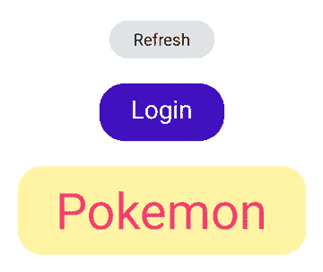
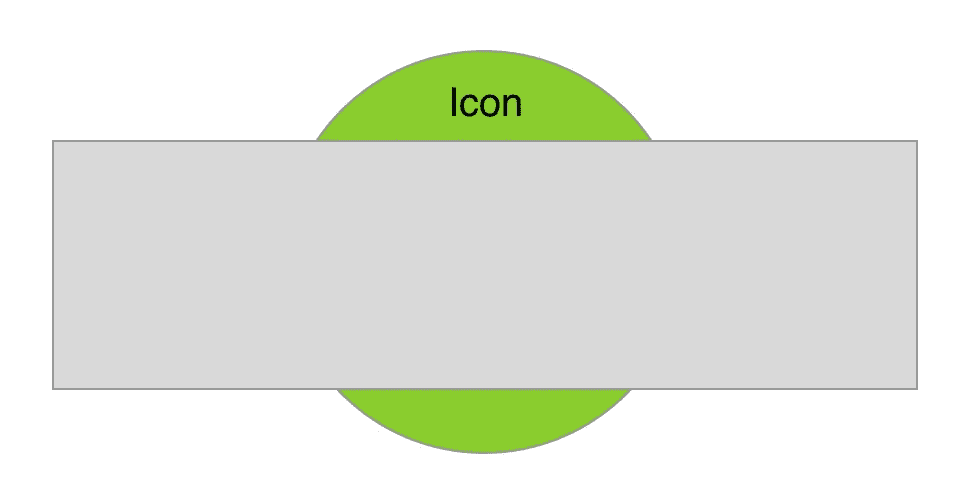
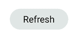
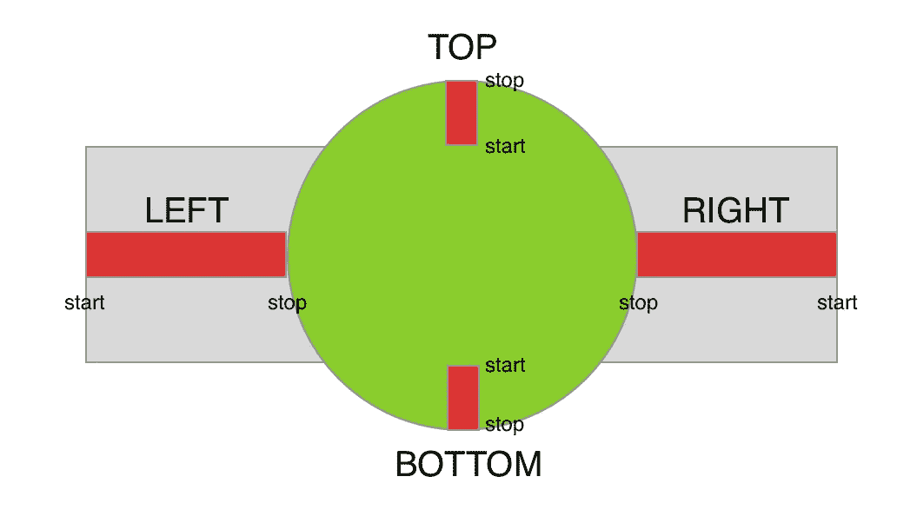

# Android 按钮变形动画

> 原文：<https://levelup.gitconnected.com/android-button-morphing-animation-bc3bed740501>

如何创建一个按钮变形动画

# 介绍

ProgressDialog 已被否决。备用的是什么？

ProgressDialog 是一个模型对话框，它阻止用户与应用程序进行交互。不要使用这个类，你应该使用一个进度指示器，它可以嵌入到你的应用程序的用户界面中。在这篇文章中，我将向你展示如何制作一个加载动画。

动画是向用户展示变化的最佳方式。有些动画就是很神奇。你打开应用程序，触摸屏幕。动画过渡引导您流畅友好地完成流程。你理解下一个动作，甚至对装载栏也感到高兴。

# 编码部分

我将编码部分分为 7 个步骤，如下所示。

*   [创建自定义视图。](#986a)
*   [检查动画。](#32b1)
*   [将背景颜色和文本颜色从灰色变为绿色。](#e22b)
*   [缩小文本，将圆形矩形变形为圆形。](#39de)
*   [放大图标并逆时针旋转。](#a785)
*   [调用 setUIState()来运行动画。](#2d9f)
*   [调用 runAnimation()来设置动画。](#8131)

# 步骤 1:创建自定义视图

您可以通过扩展`View`类来创建您的自定义视图，并且*覆盖一些函数*以使其具有一个大小并出现在屏幕上:

请注意以下事项:

*   `MorphButton` 的大小是图片中灰色矩形的大小，也是用户可以触摸的区域。灰色的矩形会变成绿色的椭圆形，比它还大。要允许子视图超过其界限，请在父视图上使用`setClipChildren` 。
*   要绘制图标，必须先设置绑定。将该代码放入`onSizeChanged` 方法中。将*放在那里会比`onMeasure`或`onLayout` **更优化。** `onSizeChanged`仅在该视图尺寸改变时触发。另一方面，当您使用`requestLayout()`方法时，`onMeasure`或`onLayout`会被更频繁地调用。*

# 步骤 2:检查动画

让我们放慢动画速度，看看如何让困难的事情变得简单:

动画分为 3 个部分:

1.  将背景颜色和文本颜色从灰色变为绿色。
2.  缩小文本并将圆形矩形变形为圆形。
3.  放大图标并逆时针旋转**。**

复杂的动画现在变成了 3 个小的连续步骤。

# 步骤 3:将背景颜色和文本颜色从灰色变为绿色。

创建一个`ValueAnimator`来获得背景颜色和文本颜色的分数。按照惯例，在这个例子中，我们对所有的动画师使用 0f 和 1f 的值:

通过`[ArgbEvaluator](https://developer.android.com/reference/android/animation/ArgbEvaluator)`获取取决于分数的颜色，并保存到`paint`:

在`onDraw`方法中，使用`paint`绘制背景色，填充包含视图的最大尺寸:

同样在`onDraw`方法中，在画布中央绘制文本:

# 步骤 4:缩小文本，将圆角矩形变形为圆形

创建第二个`ValueAnimator`来获得缩放文本和变形形状的分数:

然后在`onDraw`方法中，使用`scaleTextFraction`借助`[lerp()](https://developer.android.com/reference/com/google/android/material/math/MathUtils#lerp(float,%20float,%20float))`方法以特定比例绘制文本:

然后使用`morphFraction`绘制背景:

下面的图片将使描述上面的代码更加清晰:

开始和停止标签表示传入`lerp()`方法的值

# 步骤 5:放大图标并逆时针旋转

创建第三个`ValueAnimator`来获取缩放图标的分数:

在`onDraw`方法中，使用`scaleIconFraction`借助`[lerp()](https://developer.android.com/reference/com/google/android/material/math/MathUtils#lerp(float,%20float,%20float))`方法以特定比例绘制图标并旋转。

# 步骤 6:调用 setUIState()来运行动画

此视图中有 3 种状态:

*   `Button`:指示按钮。
*   `Loading`:指示装载旋转器。
*   `Animating`:表示动画正在运行，以从按钮变形到加载微调器。这是用来防止快速点击。

现在转到第 7 步，检查`runAnimation()`方法

# 第七步:打电话给`runAnimation() to set up the animation`

这个方法只是把上面的 3 个动画包在一个`AnimatorSet`中，每个动画将在 250 毫秒的时间内连续运行。

# 这是一个总结

以下是描述 MorphButton 的完整代码:

如果您在执行代码片段时发现问题，请查看 GitHub repo 以获取帮助:

 [## phonghuynh 93/变形按钮

### 在 GitHub 上创建一个帐户，为 PhongHuynh93/Morph-Button 开发做贡献。

github.com](https://github.com/PhongHuynh93/Morph-Button) 

正如你所看到的，创建一个复杂的动画并不难。您应该将它分成更小的步骤，以便于实现和维护。非常感谢你阅读我的文章。*如果你喜欢这个故事，请* ***点击*** 👏 ***按钮和*** *分享它来帮助别人！*关注我[中](https://mr-umbrella.medium.com/)获取更多牛逼安卓小技巧。你也可以在 LinkedIn 上找到我。祝您愉快！😄

# 继续读 Android 的东西

[Android 中使用 MaterialContainerTransform 的共享元素](/shared-element-using-materialcontainertransform-in-android-6d420e74b122)

[如何在 Android 中创建 like 按钮动画](/how-to-create-like-button-animation-in-android-part-1-f99e2792143d)

[运动布局——折叠工具栏](/motionlayout-collapsing-toolbar-d0ce8dd874b6)

# Jetpack 撰写

[在 Jetpack Compose 中实现 snack bar](/implement-android-snackbar-in-jetpack-compose-d83df5ff5b47)

[在 Jetpack Compose 中实现 tab layout](/implement-android-tablayout-in-jetpack-compose-e61c113add79)

[在 Jetpack Compose 中用 ViewPager 实现 talayout](/implement-tablayout-with-viewpager-in-android-jetpack-compose-d509fc6e2d8e)

[在 Jetpack Compose 中创建一个带有变形和 ken burns 效果的自动滚动浏览器](/create-an-auto-scroll-viewpager-with-transformation-and-ken-burns-effect-in-android-jetpack-compose-efdf46f2e8ed)