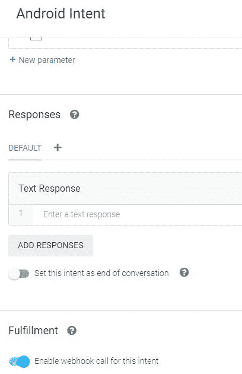
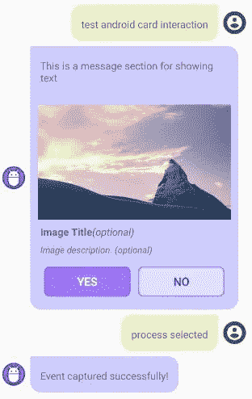

# Android Dialogflow 聊天机器人库

> 原文：<https://levelup.gitconnected.com/android-dialogflow-chatbot-library-6b7b3822e7bc>


大约两年前，我写了一篇关于如何将基于聊天机器人的对话流集成到你的 Android 项目中的文章，并分享了 T2 的样本项目库，供其他人参考。它解释了将基于 Dialogflow 的聊天机器人集成到 Android 应用程序中的两种方式——使用 Api.ai 和新的谷歌云的 Java V2 库。我收到了来自开发者社区的大量回复，我的文章现在是“Android Dialogflow Integration”的顶级搜索结果


考虑到我从世界各地的开发人员那里收到的查询以及我在集成过程中面临的一些挑战，我决定开发一个可以轻松集成到 Android 项目中的库，以便不仅显示基本的聊天窗口和轻松集成，还允许开发人员将交互式按钮和复选框等 Android UI 组件添加到聊天窗口中，并通过 Dialogflow 代理的 webhook 代码控制它们。这种方式将类似于从 webhook 代码在 Google Assistant 应用程序中控制 UI 的方式。

这里的优势将是减少 Android 本机端的代码更改，因为与基于 NodeJS 的 webhook 代码相比，这需要更多的时间，以及 chatbot bot 在前端和后端的整体开发时间。我现在将向您解释如何轻松地将该库集成到您的 Android 应用程序中，以添加基于 Google Cloud Dialogflow Java V2 的聊天机器人

1.  因此，第一步是将依赖项添加到应用程序的 gradle 文件中。(如果可能，请使用最新版本)

```
implementation 'com.tyagiabhinav:androiddialogflowchatbot:0.1.9'
implementation 'com.google.cloud:google-cloud-dialogflow:2.2.0'
implementation 'io.grpc:grpc-okhttp:1.31.1'
```

2.现在，在同一个应用程序的 gradle 文件中的 android 部分下添加包选项。

```
packagingOptions **{** exclude 'META-INF/LICENSE'
    exclude 'META-INF/DEPENDENCIES'
    exclude 'META-INF/INDEX.LIST'
**}**
```

3.现在，在清单文件中，我们应该从库中添加 ChatbotActivity 的条目

```
<activity android:name="com.tyagiabhinav.dialogflowchatlibrary.ChatbotActivity"
android:launchMode="singleTask"
android:theme="@style/Theme.AppCompat.Light.NoActionBar" />
```

4.正如我在[的上一篇文章](https://medium.com/@abhi007tyagi/android-chatbot-with-dialogflow-8c0dcc8d8018)中所解释的，我们需要一个 Google Credential JSON 文件作为我们的 Dialogflow 代理。为您的 Dialogflow 代理生成一个 Google Credential JSON 文件，并将其保存在 RES->raw-><Credential _ file . JSON>下

5.现在，根据您在应用程序中的用例，打开聊天机器人活动。

```
public void openChatbot() {
// provide your Dialogflow's Google Credential JSON saved under RAW folder in resources
DialogflowCredentials.getInstance().setInputStream(getResources().openRawResource(R.raw.test_agent_credentials));

ChatbotSettings.getInstance().setChatbot( new Chatbot.ChatbotBuilder().build());
Intent intent = new Intent(<CALLING ACTIVITY>.this,ChatbotActivity.class);
Bundle bundle = new Bundle();

// provide a UUID for your session with the Dialogflow agent
bundle.putString(ChatbotActivity.SESSION_ID, UUID.randomUUID().toString());
intent.addFlags(Intent.FLAG_ACTIVITY_NEW_TASK | Intent.FLAG_ACTIVITY_NO_HISTORY);
intent.putExtras(bundle);
startActivity(intent);
}
```

6.如果需要，将以下颜色添加到您的项目中，以替换库中的默认设置

```
Default Colours
<color name="userAvatarBG">#666666</color>
<color name="chatPrimary">#CC0000</color>
<color name="chatPrimaryFocus">#DD0000</color>
<color name="chatPrimaryPressed">#A60000</color>
<color name="chatPrimaryDisabled">#66cc0000</color>
<color name="chatBGnText">#FFFFFF</color>
<color name="chatSecondary">#FFFFFF</color>
<color name="chatSecondaryFocus">#F1F1F1</color>
<color name="chatSecondaryPressed">#E9E9E9</color>
<color name="chatSecondaryDisabled">#66FFFFFF</color>
<color name="botBGBubbleStroke">#FFCCCC</color>
<color name="botBGBubble">#FFCCCC</color>
<color name="userBGBubbleStroke">#CAE4F5</color>
<color name="userBGBubble">#CAE4F5</color>
<color name="checkbox">#161616</color>
<color name="statusBarColor">@color/chatPrimaryPressed</color>
```

7.构建您的项目并运行。基本的聊天机器人已经准备好了所有的聊天界面。如果发布版本没有给出任何聊天响应，您可能需要添加下面的 Progurad 规则。当我们缩小时会发生这种情况，一些用于创建会话的文件在执行过程中被缩小并且找不到。

```
-keep public class com.google.a** {
  public protected *;
}
```

到目前为止，这个库将帮助所有开发人员使用 Google Cloud 的 Dialogflow Java V2 构建一个简单的聊天机器人，我在之前的文章中已经解释过了。现在我将解释如何使用这个库来显示交互式按钮和小部件，并直接从 Dialogflow 代理的 webhook 代码中控制它们。

8.创建一个共同的意图，使用事件将所有 Android 交互捕获到其中，并分配一个事件名称，例如“android_event”。您可以有多个事件捕获意图，但是要确保为意图提供不同的事件名称，并在本文后面解释的参数中发送相应的事件名称


9.为意向启用 webhook 实现


10.现在，对于需要从机器人端向 Android 聊天窗口发送 UI 控件的意图，像上面为事件捕获意图所做的那样，为所有意图启用 webhook 实现。记住，这些是您的代理的常规意图，您可能需要发送一些动作给用户来执行。它可以是一个按钮、复选框或导航到应用程序中的任何其他活动，甚至是一个在浏览器中打开的 URL。用户操作将在事件捕获中被捕获



11.在意图中，代码看起来类似于下面的代码片段。在这里，我们在参数中设置一些规则，并在“param_context”内将这些规则发送到 Android 库，在那里它将被读取，相应的 UI 将被触发到聊天窗口。仅更改 params 值来更改 UI。短信是从 agent.add( <text message="">)传过来的</text>

```
const params = <Depending on Interaction Type Change params here>;
const param_context = {name: "param_context", lifespan: 10, parameters: params};
agent.context.set(param_context);
agent.add('This is a message section for showing text'); // Text message to be shown to the user
```

12.要从 webhook 显示一个简单的文本，请使用下面的代码。这也是 webhook 未启用时的默认参数

```
const params = {"template": "text"};
```


13.用按钮显示文本消息。单击该按钮后，它将被禁用，因此用户无法向上滚动并再次单击它。

```
const params = {"template": "button", "buttonItems":[{"uiText":"Action 1", "actionText":"action 1 selected", "isPositive": true},{"uiText":"Action 2", "actionText":"action 2 selected", "isPositive": false}], "align": "h", "size":"l", "eventToCall":"android_event" };
```


点击的按钮信息可以从 webhook 端捕获的事件中提取出来

```
{
    "name": "projects/<project name>/agent/sessions/<sessionID>/contexts/android_event",
    "parameters": {
        "selectedButton": {
            "isPositive": true,
            "actionText": "action 1 selected",
            "uiText": "Action 1"
        }
    }
}
```

14.复选框也是如此

```
const params = {"template": "checkbox", "checkboxItems":[{"uiText":"item 1<br> this item is best", "id":"1"},{"uiText":"item 2<br> this item is OK", "id":"2"},{"uiText":"item 3", "id":"3"}], "buttonItems":[{"uiText":"Yes", "actionText":"process selected", "isPositive": true},{"uiText":"No", "actionText":"cancel", "isPositive": false}], "align": "h", "size":"l", "eventToCall":"android_event" };
```


并且所选项目被捕获为

```
{
    "name": "projects/<project name>/agent/sessions/<sessionID>/contexts/android_event",
    "parameters": {
        "selectedButton": {
            "uiText": "Yes",
            "isPositive": true,
            "actionText": "process selected"
        },
        "template": "checkbox",
        "selectedItems": [
            {
                "id": "1",
                "uiText": "item 1<br> this item is best"
            }
        ]
    }
}
```

15.如果您想要导航到应用程序中的一些内部活动或 Google.com 的外部 URL，请使用以下参数规则。在这里，将向用户显示一个弹出窗口，表明他们正在聊天窗口之外导航，会话将结束

```
const params = {"template": "hyperlink", "linkItems":[{"uiText":"Next Activity", "linkType":"internal", "navigateAndroid":"com.tyagiabhinav.dialogflowchat.NavTestActivity", "navigateIOS":"", "isPositive": true},{"uiText":"Google", "linkType":"external", "navigateAndroid":"http://www.google.com", "navigateIOS":"http://www.google.com", "isPositive": false}], "align": "v", "size":"l", "eventToCall":"android_event" };
```


16.你也可以展示卡片，并从 webhook 本身控制它。它将有文本消息作为其他模板以及图像，图像标题和图像描述。下面将提供按钮来接受用户输入。要显示卡片视图，参数看起来应该是这样的

```
const params = {"template": "card", "cardItems":{"imgUrl":"https://picsum.photos/seed/picsum/900/500", "title":"<b>Image Title</b><i>(optional)</i>", "description":"<i>Image description. (optional)</i>"}, "buttonItems":[{"uiText":"Yes", "actionText":"process selected", "isPositive": true},{"uiText":"No", "actionText":"cancel", "isPositive": false}], "align": "h", "size":"l", "eventToCall":"android_event" };
```



17.与卡片类似，您可以显示旋转木马，当选择任何项目时，每个图像都有自己的标题、描述、id 和 toast 视图消息。

```
const params = {"template": "carousel", "carouselItems":[{"id":"1","imgUrl":"https://loremflickr.com/900/500/dog", "title":"<b>Image Title</b><i>(optional)</i>", "description":"<i>Image description. (optional)</i>","toast":"selected Dog (optional)"},{"id":"2","imgUrl":"https://loremflickr.com/900/500/cat", "title":"<b>Image Title</b><i>(optional)</i>","toast":"selected Cat (optional)", "description":"<i>Image description. (optional)</i>"},{"id":"3","imgUrl":"https://loremflickr.com/900/500/owl", "title":"<b>Image Title</b><i>(optional)</i>", "description":"<i>Image description. (optional)</i>","toast":"selected Owl (optional)"}], "buttonItems":[{"uiText":"Select", "actionText":"process selected", "isPositive": true},{"uiText":"Cancel", "actionText":"cancel", "isPositive": false}], "align": "h", "size":"l", "eventToCall":"android_event" }
```


所选项目在 selected items 中捕获，类似于上面的 selected 复选框。

18.请确保重置事件捕获响应中的参数，以便在 param_context 的生命周期设置为 10 次交互时，不会触发早期的模板。

```
const androidEvent = (agent) => {
    const params = {"template": "text"};
    const param_context = {name: "param_context", lifespan: 10, parameters: params};
    agent.context.set(param_context);
    agent.add('Event captured successfully!');
};
```

下面是用于构造 param 对象的属性的详细信息

```
- template - to show what UI you want on Android chat
- *items - list of interactable UI components  
- uiText - text shown for the item on Android like Button text, Text for checkbox. Simple HTML formatting will work for Checkboxes
- actionText - text to be shown when a button is clicked as input from user in the chat
- isPositive - for colour scheme
- align - for horzontal or vertical layout of buttons. takes values h/v
- size - text size for button. takes values s,m,l (s=10, m=14, l=18)  
- eventToCall - event name provided in the Dialogflow Intent to capture user interaction result from Android like "android_event"
- id - unique number for identification
- linkType - within app or outside app navigation. takes value internal/external
- navigateAndroid - complete class name or URL to navigate
- imgUrl - image URL for the card/carousel
- title - image title for the image(optional)
- description - image description for the image(optional)
- toast - message to be shown in toast when user selects the image
```

开发人员在构建聊天机器人对象时还可以使用其他 UI/UX 特性，例如

```
- setShowMic(true) - to show a mic icon for user to speak into instead of typing
- setDoAutoWelcome(false) - to stop auto welcome message from the bot (by default this is True and requires Default Welcome Intent to be present in the agent with training phrase "hi"
- setChatBotAvatar(getDrawable(R.drawable.avatarBot)) - to set custom bot avatar
- setChatUserAvatar(getDrawable(R.drawable.avatarUser)) - to set custom user avatar
```

该库和 webhook 的完整代码在 Apache 2.0 许可下在 GitHub - [Android Dialogflow 聊天机器人库](https://github.com/abhi007tyagi/Android_Dialogflow_Chatbot_Library)、 [](https://github.com/abhi007tyagi/Android_Dialogflow_Chatbot_Library) 上共享。探索图书馆并与我分享您的反馈。