# 安卓:达尔维克 vs 阿特

> 原文：<https://levelup.gitconnected.com/android-dvm-vs-art-5687c7903e65>

在本文中，我们将讨论 Android 运行时环境。值得注意的是，我们承诺会简短地解释 Android 中 ART 和 Dalvik (DVM)的差异。

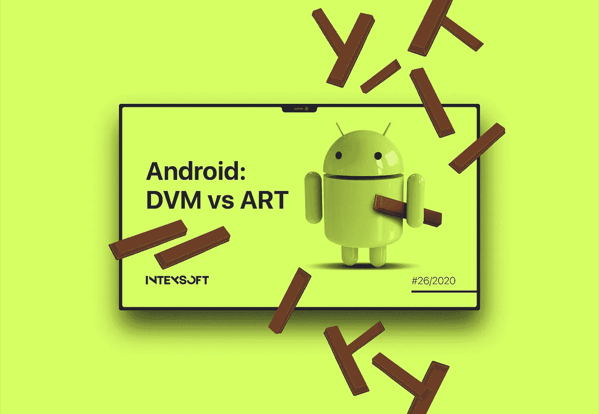

# 虚拟计算机

让我们先弄清楚 JVM 和 DVM 的区别。

**Java 虚拟机**是能够执行 Java 字节码的虚拟机，不考虑基础平台。它基于“一次编写，随处运行”的原则 Java 字节码可以在任何支持 JVM 的机器上运行。

Java 编译器会转换。java 文件进入*。类*文件(字节码)。字节码被传递给 JVM，JVM 将其编译成机器代码，以便直接在 CPU 上执行。

JVM 特性:

*   堆栈架构。堆栈用作放置和存储方法的数据结构。它的工作原理是后进先出法。
*   跑*。仅类*文件。
*   使用 JIT 编译器。

Dalvik 虚拟机 (DVM)是由丹·博恩施泰因等人开发和编写的 Java 虚拟机，是 Android 移动平台的一部分。

我们可以说 Dalvik 是 Android 操作系统组件和用户应用程序的运行时。每个进程都在其隔离的域中执行。当用户启动一个应用程序(或者操作系统启动它的一个组件)时，Dalvik 虚拟机内核(Zygote Dalvik VM)在共享内存中创建一个单独的安全进程，其中 VM 直接部署为运行应用程序的环境。简而言之，Android within 看起来像一组 Dalvik 虚拟机，每个虚拟机都执行一个应用程序。

DVM 功能:

*   基于寄存器的架构。方法所在的数据结构基于处理器寄存器。由于没有弹出和推送，寄存器 VM 中的指令比堆栈 VM 中的类似指令执行得更快。
*   执行其格式的字节码。Android dexer(后面再说)转换*。将*类文件放入*中。dex* 格式针对 DVM 执行进行了优化。不像一个*。类*文件，一个*文件。dex* 文件一次包含几个类。

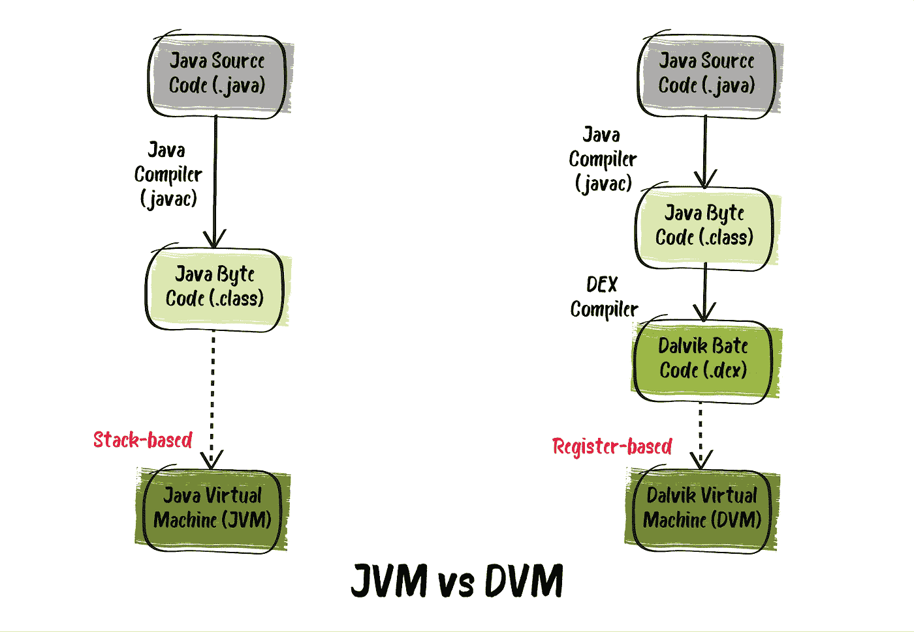

如果你有兴趣，可以在这里阅读更多关于 DVM 架构[的内容。](http://www.davidehringer.com/software/android/The_Dalvik_Virtual_Machine.pdf)

# Android Dexer

创建 APK 的关键步骤是将 Java 字节码转换成*。dex* 字节码供 Android 运行时和 Android 开发者了解。dex 编译器主要在日常应用程序开发中“卧底”工作，但它直接影响应用程序的构建时间。dex 文件大小和运行时性能。

如前所述。 *dex* 文件本身同时包含几个类。重复字符串和其他常量，在多个*中使用。包含类*文件只是为了节省空间。Java 字节码也被转换成 DVM 使用的可选命令集。一个未压缩的*。dex* 文件通常比来自同一个*的压缩 Java 归档文件(JAR)小几个百分点。类*文件。

最初，*。类别*文件被转换为*。使用内置 DX 编译器的 dex* 。但是从 [Android Studio 3.1](https://android-developers.googleblog.com/2017/08/next-generation-dex-compiler-now-in.html) 开始，默认编译器是 [D8](https://developer.android.com/studio/command-line/d8) 。与 DX 编译器相比，D8 编译更快，输出更小。dex 文件，在运行时提供高应用程序性能。使用开源实用程序 [ProGuard](https://www.guardsquare.com/en/products/proguard) 将产生的字节码缩小。结果，我们得到相同的*。dex* 文件，但是更小。然后这个文件被用于 APK 构建，最后被部署到 Android 设备上。

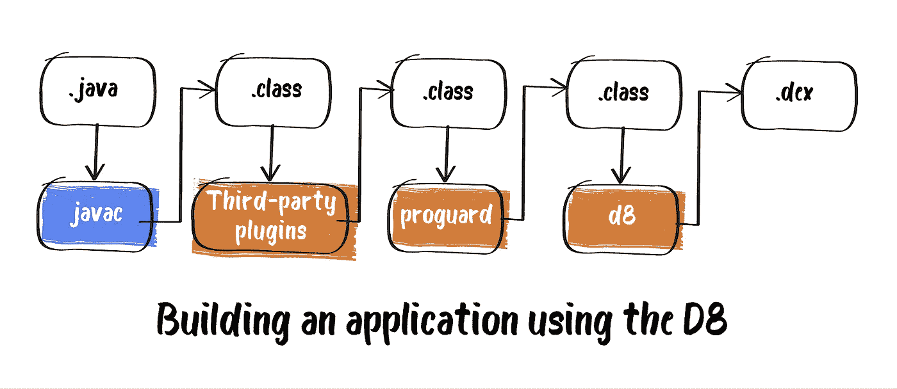

继 [2018](https://android-developers.googleblog.com/2018/11/r8-new-code-shrinker-from-google-is.html) 中的 D8 之后，又来了 [R8](https://developer.android.com/studio/build/shrink-code) ，本质上是同一个 D8，只是更新了。

在使用 Android Studio 3.4 和 [Android Gradle 3.4.0](https://developer.android.com/studio/releases/gradle-plugin#3-4-0) 插件或更高版本时，编译期间不再使用 Proguard 进行代码优化。该插件默认情况下与 R8 一起工作，后者自己执行代码收缩、优化和模糊处理。尽管 R8 只提供了 Proguard 提供的一部分功能，但它允许将 Java 字节码转换成 dex 字节码只需执行一次，从而进一步减少了构建时间。

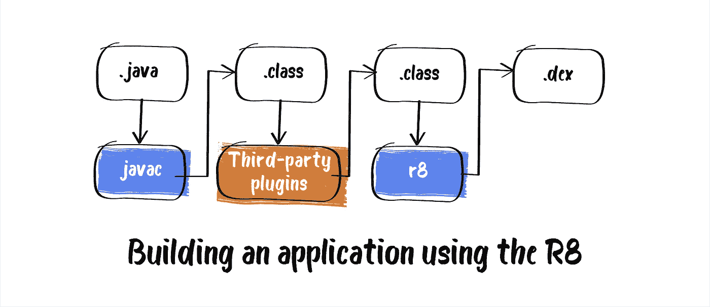

# R8 和代码收缩

我们都知道大部分应用使用的是第三方库比如 Guava，Jetpack，Gson，Google Play 服务。当我们使用这些库中的一个时，通常每个库中只有一小部分在应用程序中使用。如果没有代码收缩，库的全部代码都存储在您的应用程序中。

当开发人员使用冗长的代码来提高可读性和可维护性时，就会发生这种情况。例如，有意义的变量名和构建器模式可以用来使其他人更容易理解您的代码。但是这种模式通常会导致比所需更多的代码。

在这种情况下，R8 来救援。它允许您通过优化应用程序实际使用的代码量来显著减小应用程序的大小。

作为一个例子，我将引用在 2019 年 [Android 开发峰会](https://www.youtube.com/watch?time_continue=3&v=uQ_yK8kRCaA&feature=emb_title)上提交的[R8](https://www.youtube.com/watch?time_continue=3&v=uQ_yK8kRCaA&feature=emb_title)报告中的数字:

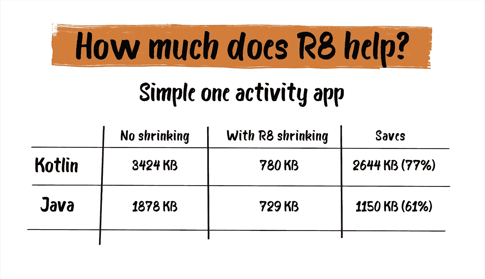

下面你可以看到测试版发布时的 R8 效率(摘自 [Android 开发者博客](https://android-developers.googleblog.com/)来源):

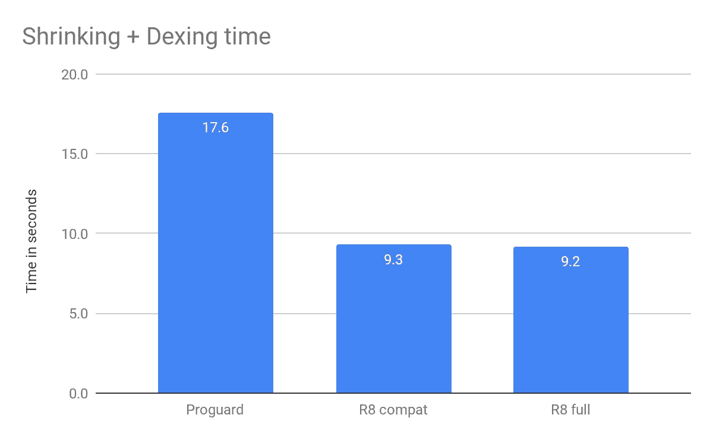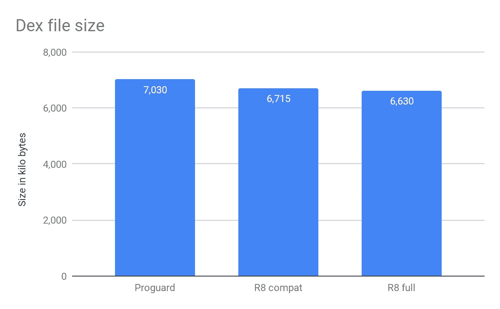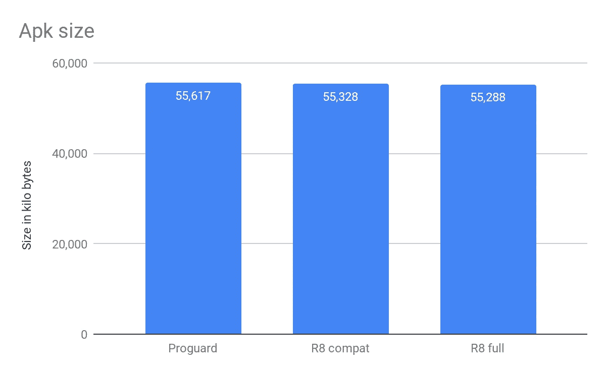

有关详细信息，请查看[官方文档](https://developer.android.com/studio/build/shrink-code)和上述报告。

# Android 中的 ART vs DVM

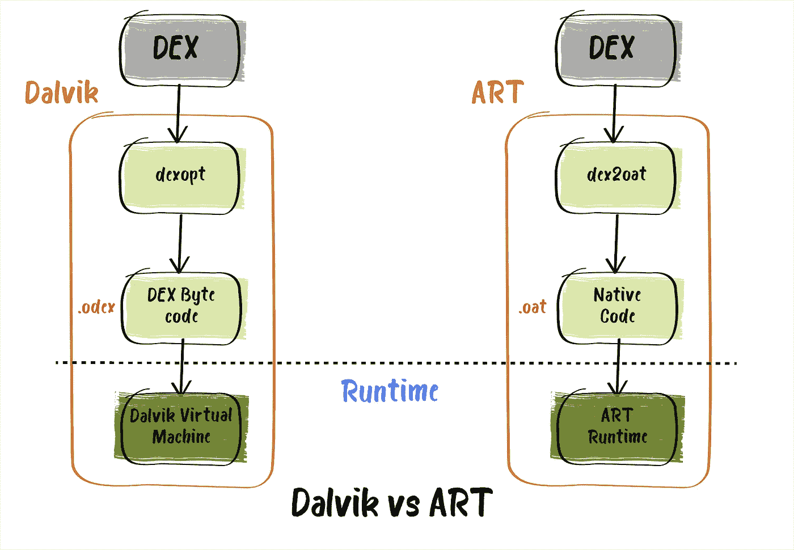

DVM 是专为移动设备设计的，在 android 4.4 Kitkat 之前，它被用作虚拟机来运行 Android 应用程序。

从这个版本开始， [ART](https://source.android.com/devices/tech/dalvik) 作为运行时环境被引入，在 Android 5.0 (Lollipop)中，ART 完全取代了 Dalvik。

ART 和 DVM 之间最明显的区别是 ART 使用 AOT 编译，而 DVM 使用 JIT 编译。不久前，ART 开始使用 AOT 和 JIT 的混合。我们将对此进行更深入的探讨。

**DVM**

*   使用 JIT 编译:无论何时启动应用程序，执行应用程序所需的代码部分都会编译。其余代码动态编译。这减慢了应用程序的启动和运行，但减少了安装时间。
*   加速设备的启动，因为应用程序缓存是在运行时创建的。
*   DVM 应用比运行在 ART 上的应用需要更少的内存。
*   通过增加 CPU 负载来降低电池性能。
*   Dalvik 已经“过时”，在 4.4 以上的 Android 版本上不再使用。

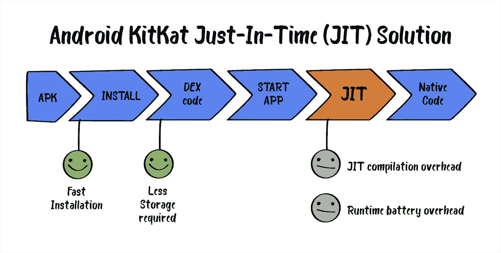

**艺术**

*   使用 AOT 编译，即在应用程序安装期间编译所有代码。这加快了应用程序的运行和操作，但需要更多的安装时间。
*   减慢设备的启动速度，因为缓存是在第一次启动时创建的。
*   由于 AOT 编译方法，与 DVM 应用程序相比，需要更多的内存。
*   通过减少运行应用程序时由于编译缺失而导致的 CPU 操作来提高电池性能。
*   改进的垃圾收集。使用 Dalvik 时，垃圾收集器必须执行两次堆传递，这导致了糟糕的 UX。在 ART 的例子中，情况并非如此:它为内存整合清理一次堆。

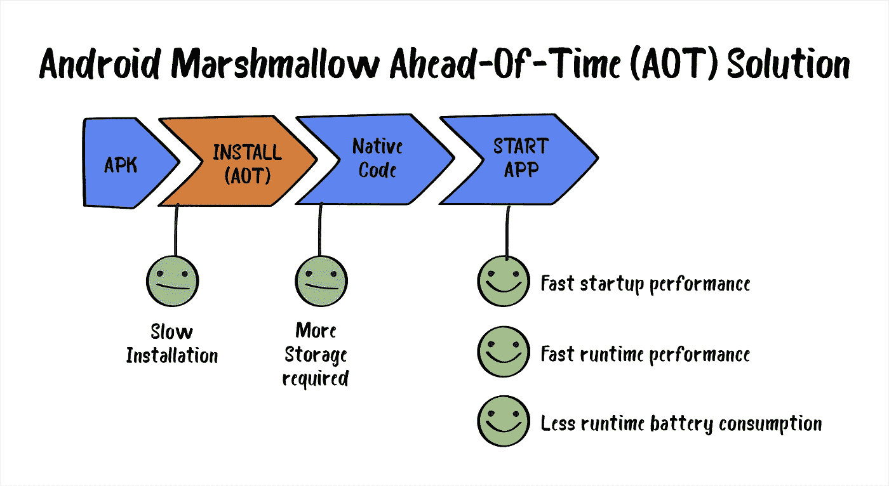

# 艺术中的 JIT + AOT

从 Android 7 开始，Android 运行时环境包含了一个带有代码分析的 JIT 编译器。JIT 编译器补充了 AOT 编译器，提高了运行时性能，节省了磁盘空间，并加快了应用程序和系统的更新。

它是根据以下方案进行的:

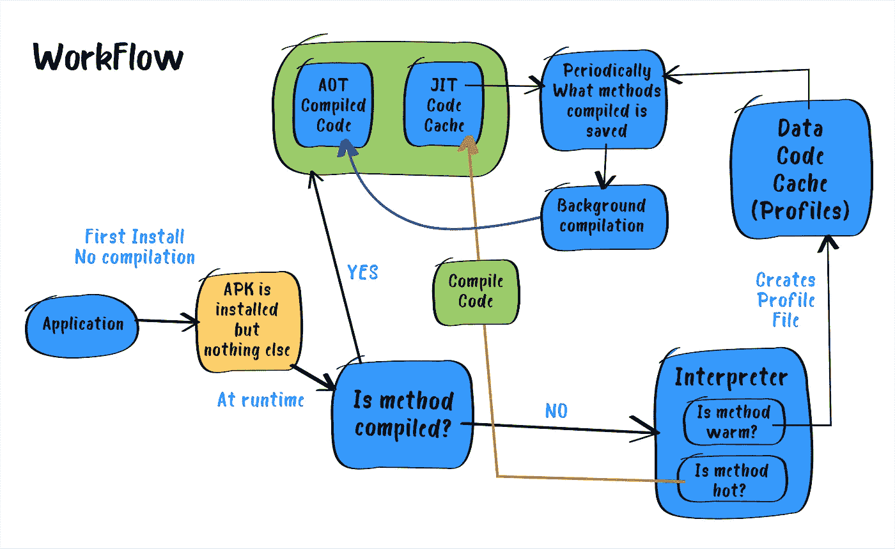

它不是在安装期间运行每个应用程序的 AOT 编译，而是在使用 JIT 编译器的虚拟机下运行应用程序(几乎与 Android 中的< 5.0) but keeping track of pieces of app code executing most often. This information is after used for the AOT compilation of these code fragments. The last operation is performed only during the smartphone is inactive, which is on a charge.

Merely speaking, now two different approaches work together, which brings its benefits:

*   More efficient compilation — when you start an app, the compiler can learn much more about its operation than when performing static analysis, and, as a result, more suitable optimization methods are applied for each situation.
*   Preserving RAM and permanent memory — bytecode is more compact than machine code. When we perform AOT compilation only of separate application parts and do not compile applications the user doesn’t use, we can significantly save. NAND-memory space;
*   A sharp increase in installation speed and first boot after system update — no AOT compilation, no delay.

More information about JIT compiler implementation in ART you can find [相同，这里是](https://source.android.com/devices/tech/dalvik/jit-compiler))。

# 总结

在本文中，我们已经分析了 DVM 和 ART 之间的主要差异，并大致了解了 Android 如何随着时间的推移改进其开发工具。

ART 仍在开发中:正在添加新功能来改善用户和开发人员的体验。

我们希望这篇文章对那些刚刚开始使用 Android 的人有所帮助。

*原载于 2020 年 8 月 3 日*[*【https://intexsoft.com】*](https://intexsoft.com/blog/android-runtime-environment-dvm-vs-art/)*。*