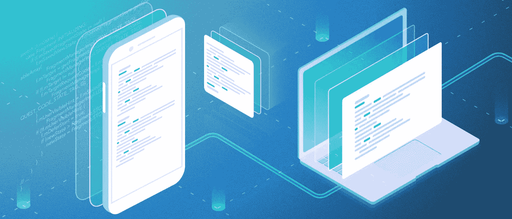

# Android 碎片:常见查询和错误

> 原文：<https://levelup.gitconnected.com/android-fragments-common-queries-and-mistakes-915b4a1f34ce>

## 用户面临的最常见问题的详细概述



Android 中的`Fragment`类用于构建动态用户界面，应该在活动中使用。使用片段的最大好处是它简化了为多种屏幕尺寸创建 UI 的任务。一个活动可以包含任意数量的片段。

现在，这个解释让片段听起来很好很容易，对吗？没那么快，还有很多事要做。在这一部分中，我们将涵盖使用片段时的主要需求和常见错误。

*注意:我假设你对片段和片段生命周期回调有基本的了解。此外，我假设您知道如何实现两个片段之间的通信。本文超越了这一点。*

# 障碍

这里有一些与碎片相关的障碍，你们中的一些人肯定已经面临过或者将来可能会遇到:

*   fragment manager:getSupportFragmentManager 和 getChildFragmentManager。在使用它们时使用哪一个并避免内存泄漏
*   从 DialogFragment、ChildFragment、BottomSheetFragment 回调到父片段
*   使用 ViewPager 时的片段以及何时使用 FragmentStateAdapter vs FragmentPagerAdapter。
*   何时使用 FragmentTransaction 添加还是替换
*   碎片接收器、广播和内存泄漏
*   如何处理这些碎片
*   commit()和 commitAllowingStateLoss()
*   片段选项菜单
*   片段 getActivity()、getView()和 NullPointers 异常
*   具有嵌套片段的 onActivityResult
*   片段和束
*   后退导航

哇，这是一个大名单！如果你遇到了我错过的，请在评论中告诉我。

# getSupportFragmentManager 和 getChildFragmentManager

FragmentManager 是框架提供的类，用于创建添加、删除或替换片段的事务。

*   getSupportFragmentManager**与一个活动相关联。把它当作你活动的一个片段管理器。**

**因此，无论何时在活动中使用 ViewPager、BottomSheetFragment 和 DialogFragment，都将使用 getSupportFragmentManager**

**示例:**

```
BottomDialogFragment bottomSheetDialog = BottomDialogFragment.*getInstance*();
bottomSheetDialog.show(getSupportFragmentManager(), **"Custom Bottom Sheet"**);
```

*   **getChildFragmentManager 与片段相关联。**

**当你在一个片段中查看页面时，你将使用 getChildFragmentManager。**

**示例:**

```
FragmentManager cfManager=getChildFragmentManager();
viewPagerAdapter = new ViewPagerAdapter(cfManager);
```

**这里是[官方链接](https://developer.android.com/reference/android/support/v4/app/FragmentManager.html)为了更好的理解。**

**当谈到人们在片段中使用 ViewPager 时所犯的常见错误时，他们通常会传递 getSupportFragmentManager，这是一个活动的片段管理器，它会导致诸如内存泄漏或 ViewPager 无法正确更新等问题。**

**在片段中使用 getSupportFragmentManager**导致的最重要的问题是内存泄漏。但是为什么会这样呢？嗯，您有一个由 ViewPager 使用的片段堆栈，并且所有这些片段都在活动中堆栈，因为您使用了 getSupportFragmentManager。现在，如果关闭父片段，它将被关闭，但不会被销毁，因为所有子片段都是活动的，它们仍在内存中，因此会导致泄漏。它不仅会泄漏父片段，还会泄漏所有子片段，因为它们都不能从堆内存中清除。所以永远不要尝试在片段中使用 getSupportFragmentManager****

# ****从 DialogFragment、ChildFragment、BottomSheetFragment 回调到父片段****

****这是人们在使用 BottomSheetFragment 或 DialogFragment 或 ChildFragment 时面临的一个非常常见的问题。****

****示例:****

****添加子片段:****

****另一个示例 bottomSheetFragment:****

```
**BottomSheetDialogFragment fragment = BottomSheetDialogFragment.newInstance();
fragment.show(getChildFragmentManager(), fragment.getTag());**
```

****现在假设您想要从这些子片段回调到父片段。大多数人使用活动在两个片段之间创建连接，很少有人将接口侦听器作为参数传递给片段(这是一个应该避免的坏习惯)。从子片段调用 getParentFragment()的最佳方式是创建一个回调。这个很简单。考虑下面的例子:****

```
**dialogFragment.show(ParentFragment.this.getChildFragmentManager(), "dialog_fragment");**
```

****然后通过在子片段中添加以下代码来设置对父片段的回调:****

****就是这样。现在，您可以轻松地回调父片段。****

****使用相同的方法，可以创建从 ViewPager 内部的子片段到持有 ViewPager 的父片段的回调。****

# ****使用 ViewPager 时的片段以及何时使用 FragmentStateAdapter vs FragmentPagerAdapter****

****`FragmentPagerAdapter`将整个片段存储在内存中，如果在`ViewPager`中使用大量片段，会导致内存开销增加。`FragmentStatePagerAdapter`只存储碎片保存的实例，当它们失去焦点时销毁所有的碎片。****

****所以当你有很多片段时，使用 FragmentStateAdapter。如果 ViewPager 的片段少于三个，请使用 FragmentPagerAdapter。****

****让我们看看一些普遍面临的问题。****

******更新 ViewPager 不工作:******

****记住 ViewPager 片段是由 FragmentManager 管理的，要么来自片段，要么来自活动，FragmentManager 持有所有 ViewPager 片段的实例。****

****因此，当人们说 ViewPager 没有被刷新时，它只不过是碎片的旧实例仍然被 FragmentManager 持有。您需要找出 FragmentManger 持有片段实例的原因。到底有没有漏？理想情况下，刷新 ViewPager 的代码如下。如果不是，那你就做错了。****

```
**List<String> strings = **new** ArrayList<>();
strings.add(**"1"**);
strings.add(**"2"**);
strings.add(**"3"**);
viewPager.setAdapter(**new** PagerFragAdapter(getSupportFragmentManager(), strings));
strings.add(**"4"**);
viewPager.getAdapter().notifyDataSetChanged();**
```

******从 ViewPager 访问当前片段:******

****这也是我们经常遇到的问题。如果遇到这种情况，要么在适配器中创建一个片段数组列表，要么尝试使用一些标记来访问片段。然而，我更喜欢另一种选择。FragmentStateAdapter 和 FragmentPagerAdapter 都提供方法 setPrimaryItem。这可用于设置当前片段，如下所示:****

****我将为这个简单的 ViewPager 项目留下一个 GitHub 链接，以便每个人都能更好地理解。****

****[](https://github.com/amodkanthe/ViewPagerTest) [## amodkanthe/ViewPagerTest

### 在 GitHub 上创建一个帐户，为 amodkanthe/ViewPagerTest 开发做贡献。

github.com](https://github.com/amodkanthe/ViewPagerTest)**** 

# ****FragmentTransaction 添加与替换****

****在我们的活动中，我们有一个容器，里面显示了我们的片段。****

*****添加*将简单地添加一个片段到容器中。假设您将 FragmentA 和 FragmentB 添加到容器中。容器将有 FragmentA 和 FragmentB，如果容器是 FrameLayout，片段将一个接一个地添加。****

****替换将简单地替换容器顶部的一个片段，所以如果我调用 create FragmentC 并调用替换顶部的 FragmentB，FragmentB 将从容器中移除(除非你没有调用 addToBackStack ),现在 FragmentC 将在顶部。****

****那么什么时候用哪个呢？`replace`删除现有片段并添加新片段。这意味着当您按下 back 按钮时，被替换的片段将被创建，其 onCreateView 被调用。另一方面，`add`保留现有片段并添加新片段，这意味着现有片段将是活动的，它们不会处于“暂停”状态。因此，当在 CreateView 上按下 back 按钮时，不会为现有片段(在添加新片段之前的片段)调用该按钮。就碎片的生命周期事件而言，在`replace`的情况下会调用 onPause、onResume、onCreateView 等生命周期事件，而在`add`的情况下不会调用。****

****如果不需要重新访问当前片段，并且不再需要当前片段，请使用替换片段。此外，如果你的应用程序有内存限制，考虑使用替换而不是添加。****

# ****碎片接收器、广播和内存泄漏****

****在片段中使用接收者时，一个常见的错误是忘记在 onPause 或 OnDestroy 中注销接收者。如果您注册一个片段来监听 onCreate 或 OnResume 中的接收器，您必须在 onPause 或 onDestroy 中取消注册它。否则会造成内存泄漏。****

```
**LocalBroadcastManager.getInstance(getActivity()).unregisterReceiver(mYourBroadcastReceiver);**
```

****此外，如果有多个片段收听同一个广播接收器，请确保在 onResume 中注册，并在 onPause 中取消注册。如果您使用 onCreate 和 onDestroy 来注册和取消注册，其他片段将不会接收到广播，因为这个片段没有被销毁****

# ****如何处理片段底部导航和导航抽屉****

****当我们使用 BottomBarNavigation 和 NavigationDrawer 时，经常会看到诸如片段被重新创建或者同一个片段被多次添加之类的问题。****

****在这种情况下，您可以使用片段事务显示和隐藏，而不是添加或替换。****

****还有一个漂亮的库叫做 FragNav，它负责导航，避免了碎片的重新创建。下面我已经链接了。****

****[](https://github.com/ncapdevi/FragNav) [## ncapdevi/FragNav

### 一个用于管理多个片段栈的 Android 库——ncapdevi/FragNav

github.com](https://github.com/ncapdevi/FragNav)**** 

# ****commit()和 commitAllowingStateLoss()****

****如果您的活动不处于恢复状态，并且您试图提交一个片段，您的应用程序将会崩溃。为了避免这种情况，您需要检查活动或片段是否处于恢复状态`isAdded()` / `isResumed()`****

****另一个解决方案是，如果您不太关心片段的状态，您可以调用 commitAllowingStateLoss。这确保了片段被添加或替换，尽管活动正在结束或不处于恢复状态。****

# ****片段选项菜单****

****当在片段内部使用选项菜单时，记得添加下面一行。人们经常忘记添加这个选项，并且一直想知道这个选项在工具栏的什么地方。****

```
**@Override
    public void onCreate(Bundle savedInstanceState) {
        super.onCreate(savedInstanceState);
        setHasOptionsMenu(true);
    }**
```

****当在片段中使用工具栏时，您可以使用代码展开菜单:****

****`getToolbar().inflateMenu(R.menu.toolbar_menu_gmr);`****

****或者，您可以覆盖 createOptionsMenu，但是我更喜欢上面的方法，因为它不依赖于超类****

# ****Fragment getActivity()，getView() NullPointers 异常****

****如果任何后台进程发布一个结果，而该片段不在堆栈中或处于恢复状态，则访问该片段的视图将导致 NullPointer 异常。因此，当您在后台操作或延迟后访问 getView 或 getActivity 时，请确保在终止时取消所有后台操作。****

****示例:****

# ****嵌套片段 onActivityResult****

****是的，嵌套片段中的`onActivityResult()`不会被调用。****

****onActivityResult(在 Android 支持库中)的调用顺序是****

1.  ****`Activity.dispatchActivityResult()`。****
2.  ****`FragmentActivity.onActivityResult()`。****
3.  ****`Fragment.onActivityResult()`。****

****您必须在父片段或活动中使用`onActivityResult()`,并将结果传递给嵌套片段，如下所示:****

# ****片段和束****

****无论何时向片段传递参数，都要确保使用 Bundle 而不是构造函数。****

****Android 文档声明:****

*****每个片段必须有一个空的构造函数，这样在恢复其活动状态时就可以实例化。强烈建议子类不要有其他带参数的构造函数，因为这些构造函数在片段被重新实例化时不会被调用；相反，参数可以由调用者用 setArguments(Bundle)提供，稍后由片段用 getArguments()检索。*****

****这就是为什么最好使用 bundle 来设置片段的参数，当片段被重新实例化时，系统更容易恢复它的值。****

# ****后退导航****

****您应该确保在详细屏幕上按下*返回*按钮会将用户返回到主屏幕。为此，在提交事务之前调用`[addToBackStack()](https://developer.android.com/reference/android/app/FragmentTransaction.html#addToBackStack(java.lang.String))`:****

****当后台堆栈上有`[FragmentTransaction](https://developer.android.com/reference/android/app/FragmentTransaction.html)`个对象，用户按下 *Back* 按钮时，`[FragmentManager](https://developer.android.com/reference/android/app/FragmentManager.html)`从后台堆栈弹出最近的事务，并执行相反的操作(如删除事务添加的片段)。****

# ****结论****

****片段一开始看起来很简单，但是还有更多。在使用片段时，你需要注意很多事情，比如内存、导航、回调和捆绑。我希望本文涵盖了最常见的问题和最常犯的错误。****