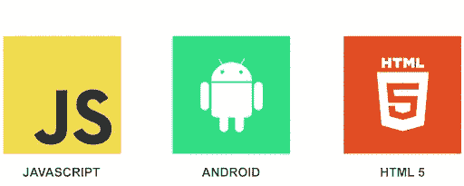

# Android Javascript 渲染图库图像

> 原文：<https://levelup.gitconnected.com/android-javascript-render-gallery-images-94de628338c2>

所以，你决定建立一个画廊 android 应用程序，但原生 android 布局系统让你头痛？你现在有一个选择。

我为什么选择写这篇文章？我想建立一个 android 应用程序，就像在私有云上的谷歌照片一样。这意味着我需要一个 android 应用程序来同步我所有的设备照片和视频，并通过某种请求(http，tcp…)将它们发送到远程服务器。此外，我希望能够在我的应用程序上看到画廊风格的那些图像和视频。

我首先做的是尝试用纯 android 构建它，因为我需要读取所有内部和外部存储，搜索媒体并发送它们。我的主要问题不是从设备上读取所有媒体，而是以一种简单优雅的方式呈现它。内置的 android 功能是一个真正的痛苦，所以我寻找一个替代品。

在网上搜索并没有多大帮助，因为我几乎没有找到任何有用的东西。我在那里找到一片，在这里找到一片，但没有完整的版本。

因此，我将尝试展示如何从设备中读取所有图像，并通过 JavaScript 呈现出来。仅此而已。我不会做任何关于同步或任何东西的花哨逻辑，也许在一篇专题文章中。今天，我只想介绍一些基础知识。

首先，读一下我之前的文章会很棒，关于**从这里用 JavaScript** 调用 Android 原生函数[https://beniaminpantiru . medium . com/how-to-call-Android-functions-from-JavaScript-3f 7628340374](https://beniaminpantiru.medium.com/how-to-call-android-functions-from-javascript-3f7628340374)。它会让你更容易阅读这篇文章。

首先，您应该使用 Android Studio 创建一个 Android 项目。之后，添加**读取外部存储器**的权限到 manifest。您的清单应该与此类似:

之后，您必须在 MainActivity 中声明一个 **Android WebView** ，并创建一个**Java scription interface**来将其映射到 WebView。此外，在项目的*资产*文件夹下创建一个*main.html*文件。让我们看看它是什么样子的:

太好了！现在我们有了 JavaScript 和 Android 之间通信的粘合代码。现在，我们必须创建一个从设备中获取所有图像的函数。我们将通过使用 android 原生 API 来做到这一点，因为它为我们提供了我们所能获得的最佳性能。此外，我们正在创建一个图像数据类来保存关于图像的信息

我们的函数看起来像这样:

这里，我们首先在第 2 行定义一个图像列表。然后，我们定义一个*图像投影*，它基本上包含了我们需要的关于每张图像的信息。我们正在使用 ***媒体商店上的*内容解析器*进行查询。images . media . external _ CONTENT _ URI****这意味着我们要从外部存储中读取所有图像(如果要读取所有视频，只需使用 ***MediaStore。视频.媒体.外部 _ 内容 _URI*** )。最后，我们迭代游标迭代器，获取我们需要的所有信息，创建一个新的 *Image* 对象，并将其添加到最终列表中。*

*好了，现在，我们要做的就是把这个*图片*列表发送给 JavaScript。再简单不过了。为此，在 *getAllImages()* 方法中，我将获取由 *queryImageStorage* 方法返回的列表，并使用 google gson 库将其转换为 JsonArray。*

*我的函数应该类似于这个:*

*现在，我所要做的就是从 JavaScript 调用 *getAllImages()* 函数，并以 html 格式呈现我的图像。为了渲染图像，为了简单起见，我将使用 *jQuery* 库和 *bootstrap* 样式类。*

*我的*main.html*现在应该是什么样子:*

*如你所见，我创建了一个空的 *div* ，点击按钮后我调用了*JSON . parse(androidapp . getallimages())*，它给了我所有来自设备的图像，并将它们解析为对象。之后，我只是将 *< img/ >* 标签追加到空的 div 中。*

*最后， *MainActivity.kt* 的最后一个版本看起来会像这样:*

*当然，正如你所看到的，这是一个非常简单的例子，还可以做更多的工作，比如延迟加载图像。*

*在本文中，我只想展示一个非常简单的例子，通过 JavaScript 和 Html 从 android 设备渲染所有图像，因为我很难找到一个可行的例子。*

***PS:** 如果你曾经需要一个正常运行时间监控工具，只需检查 [RoboMiri](https://robomiri.com) 。最好的免费正常运行时间监测服务。*