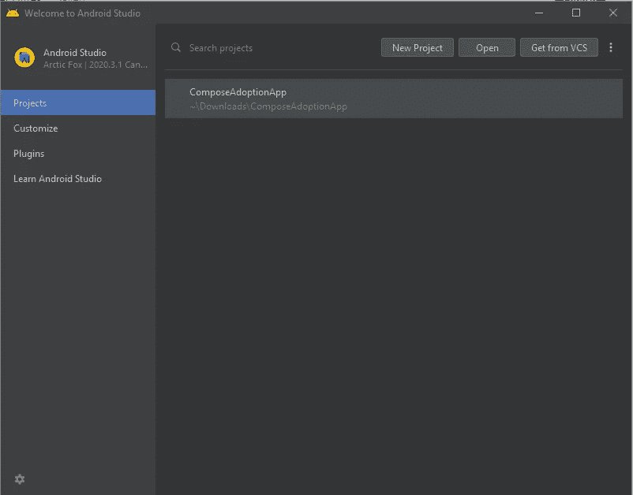
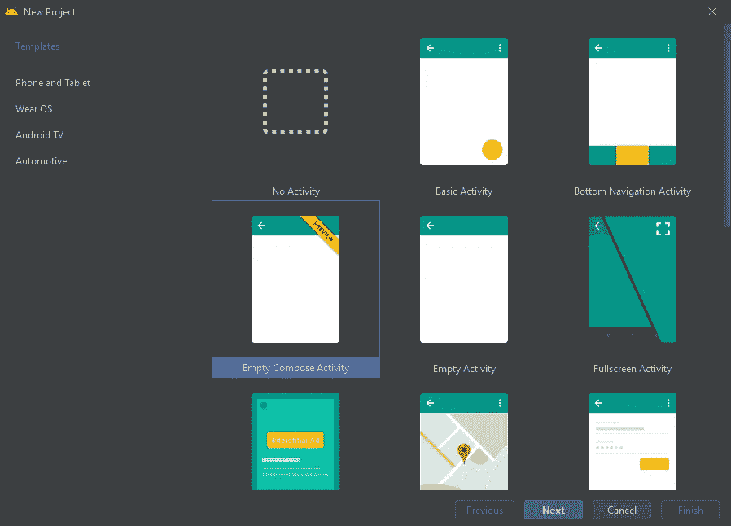
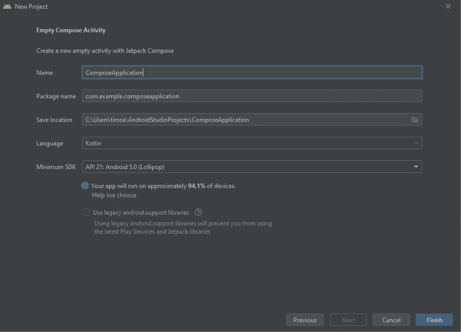
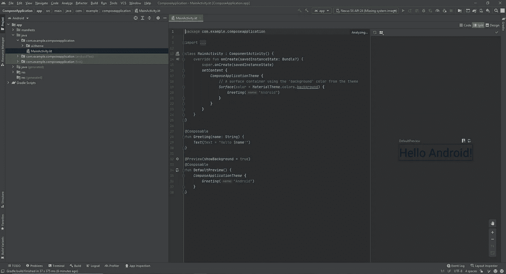
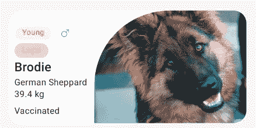
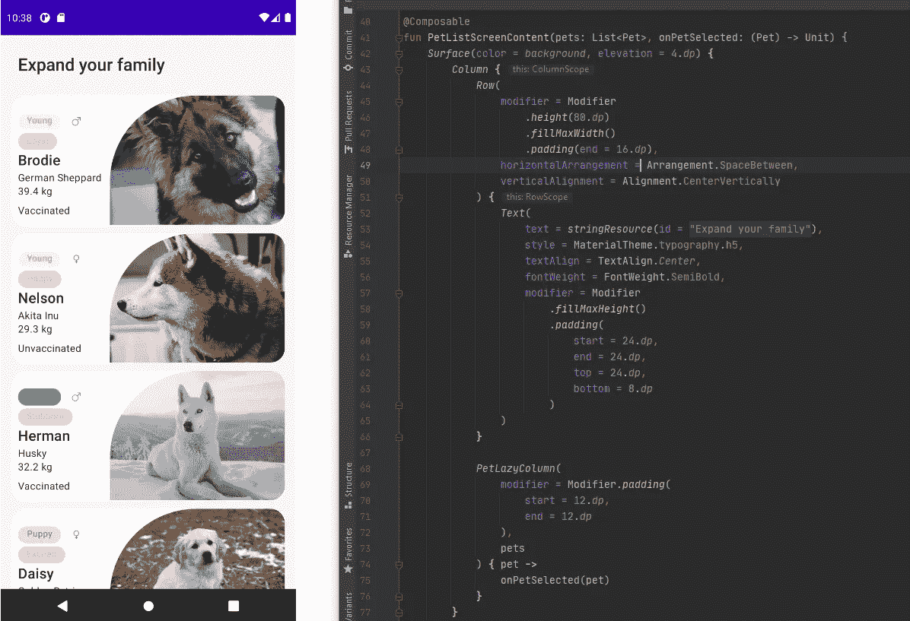
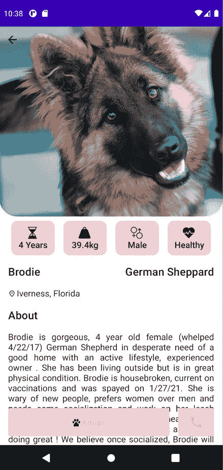

# Android Jetpack 撰写基础知识和应用程序审查

> 原文：<https://levelup.gitconnected.com/android-jetpack-compose-basics-app-review-c4350bb430a>


各位开发者好，距离我的上一篇文章已经过去了几个月。我沉默背后的原因其实是好消息。我很高兴地宣布我找到了一份工作。💪🎊我加入的公司名字叫 [@Getir](https://getir.com/en/) 。Getir 是土耳其最成功的公司之一，上个月我们已经成为土耳其第二家[独角兽公司](https://www.linkedin.com/posts/canergures_getir-entered-the-world-unicorn-list-ranking-activity-6782322088528117760-aS9A/)。在这里已经 5 个月了，我真的习惯了职业经验。这太令人兴奋了！

短暂的交流之后，让我继续这个话题。二月份，Jetpack Compose Beta 版发布了，我想尝试一下这个新的 API 并写一篇关于它的文章。(实际上，我几个月前就试过了，但我们不要深究这个问题了:)

# 什么是 Jetpack Compose？

Jetpack Compose 是谷歌宣布的一个新的 UI 工具包，旨在使其成为更快更简单的原生应用。最重要的特性之一是 Compose 提供了声明式 API！

> 今天，我们发布了测试版的 [Jetpack Compose](https://developer.android.com/jetpack/compose) ，这是我们新的 UI 工具包，旨在更快更容易地在所有 Android 平台上构建原生应用。Compose 提供现代的、声明性的 Kotlin APIs，帮助您用更少的代码构建漂亮的、响应迅速的应用程序。构建为与现有的 Android 应用程序和 Jetpack 库集成，您可以通过结合 Android 视图和 Compose 以自己的速度采用 Compose。

# **好处**

1.  **简洁而地道的科特林**

具备 Kotlin 带来的优势

2.**声明式**

完全声明性地定义 UI 组件，包括绘制和创建自定义布局

3.**兼容**

与现有视图兼容

4.**启用精美应用**

从一开始就采用现成的材料设计和动画设计

5.**加快发展**

通过编写更少的代码和使用工具来加速开发

# 我们在 Beta 中有什么？

*   协程支持
*   对讲的可访问性支持—对其他技术的支持将保持稳定
*   易于使用的[动画](https://developer.android.com/codelabs/jetpack-compose-animation)，拥有自 alpha 以来全新的 API。
*   [互通](https://developer.android.com/jetpack/compose/interop)同见
*   [物料 UI 组件](http://material.io/blog/jetpack-compose-beta)，均带有@Sampled 代码
*   懒惰列表——Jetpack Compose 对 RecyclerView 的看法
*   基于 DSL 的[约束布局](https://developer.android.com/jetpack/compose/layout#contraintlayout)
*   修饰语
*   测试
*   主题和图形，轻松支持黑暗和光明模式
*   输入和手势
*   文本和可编辑文本
*   窗口管理

# 使用 Jetpack Compose 构建应用程序

首先，你需要下载并使用金丝雀版本的[安卓工作室北极狐](https://developer.android.com/studio/preview?gclid=CjwKCAiAyc2BBhAaEiwA44-wW02UxPzHservPxmOjAhKgYKMLmJF1vWR4Vvln4M6tZNIDgw2l3qDxxoCmawQAvD_BwE&gclsrc=aw.ds)。



在上面选择一个新项目，之后选择“清空编写活动”。



在上面选择一个新项目，之后选择“清空编写活动”。



```
buildFeatures **{** compose true
**}**
```

不要忘记在 b *uild.gradle* 中设置撰写标志。

onCreate 中的 *SetContent* 方法基本上就是活动的 XML 布局。我们将在那里调用可组合函数。我将使用我为#AndroidDevChallenge 第一周编写的应用程序。但是首先，让我们创建一个可组合的函数作为例子。

使用 compose 的好处是你可以很容易地制作一个基于组件架构的应用程序。只需分别编写所有组件，并在一个布局中调用它们。就这么简单。

“预览”注释允许我们在不运行应用程序的情况下查看和修改我们的组件。

**列&行:**你可以认为列基本上是线性布局，行是水平线性布局。

**修饰符:**修饰符是一组元素的集合，用于修饰或添加 UI 元素的行为，如背景、填充等。


*MovieItem()* 是我们的可组合项目，它看起来像这样

# 让我们回顾一下我的领养程序



在我的领养应用程序中，我最喜欢的项目是👆



[**表面**](https://developer.android.com/reference/kotlin/androidx/compose/material/package-summary#Surface(androidx.compose.ui.Modifier,androidx.compose.ui.graphics.Shape,androidx.compose.ui.graphics.Color,androidx.compose.ui.graphics.Color,androidx.compose.foundation.BorderStroke,androidx.compose.ui.unit.Dp,kotlin.Function0))

```
@[**Composable**](https://developer.android.com/reference/kotlin/androidx/compose/runtime/Composable)
fun [**Surface**](https://developer.android.com/reference/kotlin/androidx/compose/material/package-summary#Surface(androidx.compose.ui.Modifier,androidx.compose.ui.graphics.Shape,androidx.compose.ui.graphics.Color,androidx.compose.ui.graphics.Color,androidx.compose.foundation.BorderStroke,androidx.compose.ui.unit.Dp,kotlin.Function0))(
    modifier: [**Modifier**](https://developer.android.com/reference/kotlin/androidx/compose/ui/Modifier) = Modifier,
    shape: [**Shape**](https://developer.android.com/reference/kotlin/androidx/compose/ui/graphics/Shape) = RectangleShape,
    color: [**Color**](https://developer.android.com/reference/kotlin/androidx/compose/ui/graphics/Color) = MaterialTheme.colors.surface,
    contentColor: [**Color**](https://developer.android.com/reference/kotlin/androidx/compose/ui/graphics/Color) = contentColorFor(color),
    border: [**BorderStroke**](https://developer.android.com/reference/kotlin/androidx/compose/foundation/BorderStroke)? = null,
    elevation: [**Dp**](https://developer.android.com/reference/kotlin/androidx/compose/ui/unit/Dp) = 0.dp,
    content: () -> [**Unit**](https://kotlinlang.org/api/latest/jvm/stdlib/kotlin/-unit/index.html)
): @[**Composable**](https://developer.android.com/reference/kotlin/androidx/compose/runtime/Composable) [**Unit**](https://kotlinlang.org/api/latest/jvm/stdlib/kotlin/-unit/index.html)
```

> 材料表面是材料设计的中心隐喻。每个曲面都存在于给定的高程，这将影响该曲面在视觉上与其他曲面的关系以及该曲面投射阴影的方式。

[**正文**](https://developer.android.com/reference/kotlin/androidx/compose/material/package-summary#Text(kotlin.String,androidx.compose.ui.Modifier,androidx.compose.ui.graphics.Color,androidx.compose.ui.unit.TextUnit,androidx.compose.ui.text.font.FontStyle,androidx.compose.ui.text.font.FontWeight,androidx.compose.ui.text.font.FontFamily,androidx.compose.ui.unit.TextUnit,androidx.compose.ui.text.style.TextDecoration,androidx.compose.ui.text.style.TextAlign,androidx.compose.ui.unit.TextUnit,androidx.compose.ui.text.style.TextOverflow,kotlin.Boolean,kotlin.Int,kotlin.Function1,androidx.compose.ui.text.TextStyle))

```
@[**Composable**](https://developer.android.com/reference/kotlin/androidx/compose/runtime/Composable)
fun [**Text**](https://developer.android.com/reference/kotlin/androidx/compose/material/package-summary#Text(kotlin.String,androidx.compose.ui.Modifier,androidx.compose.ui.graphics.Color,androidx.compose.ui.unit.TextUnit,androidx.compose.ui.text.font.FontStyle,androidx.compose.ui.text.font.FontWeight,androidx.compose.ui.text.font.FontFamily,androidx.compose.ui.unit.TextUnit,androidx.compose.ui.text.style.TextDecoration,androidx.compose.ui.text.style.TextAlign,androidx.compose.ui.unit.TextUnit,androidx.compose.ui.text.style.TextOverflow,kotlin.Boolean,kotlin.Int,kotlin.Function1,androidx.compose.ui.text.TextStyle))(
    text: [**String**](https://kotlinlang.org/api/latest/jvm/stdlib/kotlin/-string/index.html),
    modifier: [**Modifier**](https://developer.android.com/reference/kotlin/androidx/compose/ui/Modifier) = Modifier,
    color: [**Color**](https://developer.android.com/reference/kotlin/androidx/compose/ui/graphics/Color) = Color.Unspecified,
    fontSize: [**TextUnit**](https://developer.android.com/reference/kotlin/androidx/compose/ui/unit/TextUnit) = TextUnit.Unspecified,
    fontStyle: [**FontStyle**](https://developer.android.com/reference/kotlin/androidx/compose/ui/text/font/FontStyle)? = null,
    fontWeight: [**FontWeight**](https://developer.android.com/reference/kotlin/androidx/compose/ui/text/font/FontWeight)? = null,
    fontFamily: [**FontFamily**](https://developer.android.com/reference/kotlin/androidx/compose/ui/text/font/FontFamily)? = null,
    letterSpacing: [**TextUnit**](https://developer.android.com/reference/kotlin/androidx/compose/ui/unit/TextUnit) = TextUnit.Unspecified,
    textDecoration: [**TextDecoration**](https://developer.android.com/reference/kotlin/androidx/compose/ui/text/style/TextDecoration)? = null,
    textAlign: [**TextAlign**](https://developer.android.com/reference/kotlin/androidx/compose/ui/text/style/TextAlign)? = null,
    lineHeight: [**TextUnit**](https://developer.android.com/reference/kotlin/androidx/compose/ui/unit/TextUnit) = TextUnit.Unspecified,
    overflow: [**TextOverflow**](https://developer.android.com/reference/kotlin/androidx/compose/ui/text/style/TextOverflow) = TextOverflow.Clip,
    softWrap: [**Boolean**](https://kotlinlang.org/api/latest/jvm/stdlib/kotlin/-boolean/index.html) = true,
    maxLines: [**Int**](https://kotlinlang.org/api/latest/jvm/stdlib/kotlin/-int/index.html) = Int.MAX_VALUE,
    onTextLayout: ([**TextLayoutResult**](https://developer.android.com/reference/kotlin/androidx/compose/ui/text/TextLayoutResult)) -> [**Unit**](https://kotlinlang.org/api/latest/jvm/stdlib/kotlin/-unit/index.html) = {},
    style: [**TextStyle**](https://developer.android.com/reference/kotlin/androidx/compose/ui/text/TextStyle) = LocalTextStyle.current
): @[**Composable**](https://developer.android.com/reference/kotlin/androidx/compose/runtime/Composable) [**Unit**](https://kotlinlang.org/api/latest/jvm/stdlib/kotlin/-unit/index.html)
```

正如您在文本组件中看到的，您可以像示例中那样给出属性，如 style、textAlign、fontWeight。

[lazy column](https://developer.android.com/reference/kotlin/androidx/compose/foundation/lazy/package-summary#lazycolumn)

```
@[**Composable**](https://developer.android.com/reference/kotlin/androidx/compose/runtime/Composable)
fun [**LazyColumn**](https://developer.android.com/reference/kotlin/androidx/compose/foundation/lazy/package-summary#LazyColumn(androidx.compose.ui.Modifier,androidx.compose.foundation.lazy.LazyListState,androidx.compose.foundation.layout.PaddingValues,kotlin.Boolean,androidx.compose.foundation.layout.Arrangement.Vertical,androidx.compose.ui.Alignment.Horizontal,androidx.compose.foundation.gestures.FlingBehavior,kotlin.Function1))(
    modifier: [**Modifier**](https://developer.android.com/reference/kotlin/androidx/compose/ui/Modifier) = Modifier,
    state: [**LazyListState**](https://developer.android.com/reference/kotlin/androidx/compose/foundation/lazy/LazyListState) = rememberLazyListState(),
    contentPadding: [**PaddingValues**](https://developer.android.com/reference/kotlin/androidx/compose/foundation/layout/PaddingValues) = PaddingValues(0.dp),
    reverseLayout: [**Boolean**](https://kotlinlang.org/api/latest/jvm/stdlib/kotlin/-boolean/index.html) = false,
    verticalArrangement: [**Arrangement.Vertical**](https://developer.android.com/reference/kotlin/androidx/compose/foundation/layout/Arrangement.Vertical) = if (!reverseLayout) Arrangement.Top else Arrangement.Bottom,
    horizontalAlignment: [**Alignment.Horizontal**](https://developer.android.com/reference/kotlin/androidx/compose/ui/Alignment.Horizontal) = Alignment.Start,
    flingBehavior: [**FlingBehavior**](https://developer.android.com/reference/kotlin/androidx/compose/foundation/gestures/FlingBehavior) = ScrollableDefaults.flingBehavior(),
    content: [**LazyListScope**](https://developer.android.com/reference/kotlin/androidx/compose/foundation/lazy/LazyListScope).() -> [**Unit**](https://kotlinlang.org/api/latest/jvm/stdlib/kotlin/-unit/index.html)
): @[**Composable**](https://developer.android.com/reference/kotlin/androidx/compose/runtime/Composable) [**Unit**](https://kotlinlang.org/api/latest/jvm/stdlib/kotlin/-unit/index.html)
```

一个 **LazyColumn** 是一个滚动列表，列出了当前可见的项目。这类似于回收者的观点。我在这里没有使用按钮组件，我给每个项目一个点击事件来打开细节屏幕。



我希望这篇文章能帮助你理解 Compose 及其实现。另一篇文章再见。再见！

**Github 回购:**[https://github.com/CanerGures/Adoption-App-Jetpack-Compose](https://github.com/CanerGures/Adoption-App-Jetpack-Compose)

**我们来连线:**[https://www.linkedin.com/in/canergures/](https://www.linkedin.com/in/canergures/)