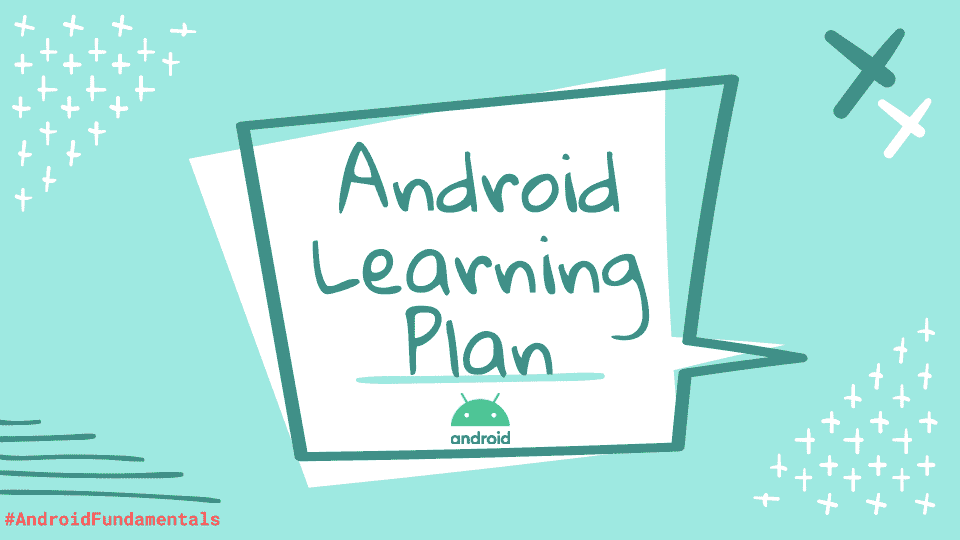

# Android 学习计划

> 原文：<https://levelup.gitconnected.com/android-learning-plan-febf01990f3a>

经常有人问我如何开始学习 Android，或者如何成为一名 Android 开发者。所以我在想，写一篇博客来回答这些问题可能是个好主意。

我们每个人都有自己的学习方式。因此，首先重要的是确定你的 **VARK 学习风格**，然后检查专用资源。

**VARK 学习风格**有:

*   ***V*** *视觉*:你更喜欢使用图像、图形、图式、视频来获取和理解新信息
*   ***答*** *听力*:通过听力理解新内容
*   ***R****EAD&Write*:你通过阅读单词来学习，并对新信息做大量笔记
*   ***K*** *不感兴趣的*:你通过亲身体验来学习新概念和新技能

研究估计，50%到 70%的人更喜欢几种不同学习方式的结合。所以选择你的搭配组合吧。🤓

# ✅Programming 基础知识

## 视觉和听觉

*   [如何使用 Git](https://www.udacity.com/course/version-control-with-git--ud123)
*   [如何写 READMEs](https://www.udacity.com/course/writing-readmes--ud777)
*   [Java 面向对象编程](https://www.udacity.com/course/object-oriented-programming-in-java--ud283)
*   [软件调试](http://software%20debugging/)
*   [软件架构和设计](https://www.udacity.com/course/software-architecture-design--ud821)
*   [软件开发过程:从想法到产品](https://www.udacity.com/course/software-development-process--ud805)

## 听众

*   [用 Minko Gechev 制作播客](https://podcast.mgechev.com/)
*   罗比·拉塞尔的可维护播客

## 读和写

*   [官方文件](https://developer.android.com/)
*   [安卓开发官方博客](https://android-developers.googleblog.com/)
*   [设计模式——重构大师](https://refactoring.guru/design-patterns)
*   [设计模式——源码制作](https://sourcemaking.com/design_patterns)
*   [头先设计图案](https://www.goodreads.com/book/show/58128.Head_First_Design_Patterns)
*   [清理代码](http://clean%20code:%20A%20Handbook%20of%20Agile%20Software%20Craftsmanship/)
*   [敏捷开发人员的实践:在现实世界中工作，文卡特·苏布拉马年著](https://www.goodreads.com/book/show/4102.Practices_of_an_Agile_Developer)

## 动觉的

*   [初学者的编码卡塔](https://kata-log.rocks/starter)

# ✅Android 基础知识

## 视觉和听觉

*   [如何安装 Android Studio](https://www.udacity.com/course/how-to-install-android-studio--ud808)
*   [安卓和 Java 的 Gradle](https://www.udacity.com/course/gradle-for-android-and-java--ud867)
*   [科特林程序员训练营](https://www.udacity.com/course/kotlin-bootcamp-for-programmers--ud9011)
*   [面向 Android 开发者的 kot Lin](https://www.udacity.com/course/kotlin-for-android-developers--ud888)
*   [使用 Kotlin 开发安卓应用](https://www.udacity.com/course/developing-android-apps-with-kotlin--ud9012)
*   [一个周末的 Firebase——Android](https://www.udacity.com/course/firebase-in-a-weekend-by-google-android--ud0352)
*   [安卓操作系统](https://www.youtube.com/c/AndroidDevelopers/playlists?view=50&sort=dd&shelf_id=9)

## 听众

*   [通过碎片化播客学习科特林](https://fragmentedpodcast.com/category/episodes/learning-kotlin/)
*   [谈论科特林——来自 JetBrains 的播客](https://talkingkotlin.com/)

## 读和写

*   [介绍文章](https://magdamiu.com/category/android-fundamentals/)
*   [科特林官方文档](https://kotlinlang.org/)
*   [科特林文章](https://magdamiu.com/category/kotlin/)

## 动觉的

*   [谷歌的 Android code labs](https://codelabs.developers.google.com/?cat=Android)
*   [科特林动手](https://play.kotlinlang.org/hands-on/overview)
*   [科特林公案](https://play.kotlinlang.org/koans/overview)

# ✅Material 设计

## 视觉和听觉

*   [快速成型](https://www.udacity.com/course/rapid-prototyping--ud723)
*   [面向 Android 开发者的材料设计](https://www.udacity.com/course/material-design-for-android-developers--ud862)
*   [面向移动开发者的 UX 设计](https://www.udacity.com/course/ux-design-for-mobile-developers--ud849)
*   [谷歌设计官方频道](https://www.youtube.com/channel/UClKO7be7O9cUGL94PHnAeOA)

## 听众

*   [谷歌设计播客](https://design.google/library/podcasts/)

## 读和写

*   [官网](https://material.io/)
*   [官方文件](https://developer.android.com/guide/topics/ui/look-and-feel)

## 动觉的

*   [官方代码样本](https://github.com/material-components/material-components-android)

# 安卓中的✅Testing

## 视觉和听觉

*   [如何让软件失效](https://www.udacity.com/course/software-testing--cs258)
*   [在 Android 上测试应用](https://www.udacity.com/course/gradle-for-android-and-java--ud867)
*   [Android 中的测试](https://www.youtube.com/playlist?list=PLaC2ibKkxGSJGBsIuYyyTGEq2gjTrUULX)

## 听众

*   [关于测试的播客片段](https://fragmentedpodcast.com/episodes/183/)

## 读和写

*   [官方文件](https://developer.android.com/training/testing)

## 动觉的

*   [Android 测试代码实验室](https://developer.android.com/codelabs/advanced-android-kotlin-training-testing-basics#0)

# ✅Android 高级

## 视觉和听觉

*   [采用 Kotlin 的高级 Android](https://www.udacity.com/course/advanced-android-with-kotlin--ud940)
*   [高级 Android 应用开发:生产和发布您的应用](https://www.udacity.com/course/advanced-android-app-development--ud855)
*   [Android 性能:优化应用程序的速度和可用性](https://www.udacity.com/course/android-performance--ud825)
*   [安卓喷气背包](https://www.youtube.com/watch?v=LmkKFCfmnhQ&list=PLWz5rJ2EKKc9mxIBd0DRw9gwXuQshgmn2)
*   [现代安卓开发](https://www.youtube.com/c/AndroidDevelopers/playlists?view=50&sort=dd&shelf_id=1)
*   [Kotlin for Android](https://www.youtube.com/c/AndroidDevelopers/playlists?view=50&sort=dd&shelf_id=4)

## 听众

*   [安卓开发者后台](http://androidbackstage.blogspot.com/)

## 读和写

*   [高级篇](https://magdamiu.com/category/android-advanced/)

## 动觉的

*   [Android 架构组件示例](https://github.com/android/architecture-components-samples)

我希望这个学习计划能帮助你开始或继续你在 Android 世界的旅程。

如果您想与 Android 社区保持联系并了解更多信息📚你可以查看这篇关于 Android 开发的文章。😉

感谢您的阅读！🙏 🤗🥰你可以关注我:[推特](https://twitter.com/MagdaMiu)

*原载于 2021 年 1 月 9 日 http://magdamiu.com**的* [*。*](https://magdamiu.com/2021/01/09/android-learning-plan/)