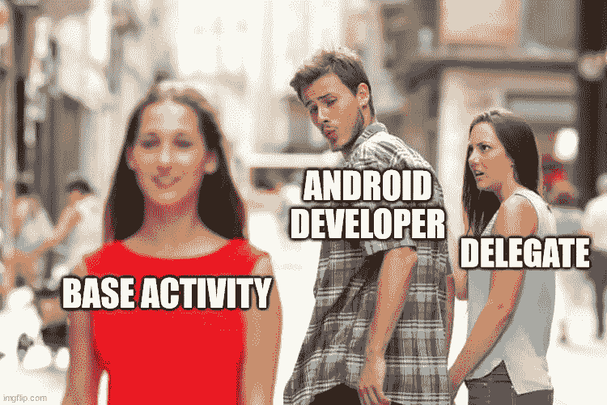

# 安卓噩梦😱|基本类别

> 原文：<https://levelup.gitconnected.com/android-nightmares-base-classes-ccf55dbd0604>

别做那种人

当我开始作为 Android 开发人员工作时，还没有片段、回收视图、视图模型和协程。在这十年里，一切都变了，除了一件事:**classes🥶基地**。

如果您从未遇到过 BaseActivity、BaseFragment 或 BaseViewModel，那么您应该感到幸运🌟。

> 这些类是软件开发中一个正确原则的错误结果:**不要重复自己**

> **“不要重复自己**”(**DRY**)是软件开发的一个原则，旨在减少软件模式的重复，用抽象来代替，或者使用数据规范化来避免冗余。([来源](https://en.wikipedia.org/wiki/Don%27t_repeat_yourself))

一个常见的场景是，当您需要跟踪应用程序的分析时，或者可能在每个活动上注册一个 BroadcastReceiver。

坏习惯的坏例子

看起来不错，现在每个扩展 BaseActivity 的活动都可以跟踪和注销，而不需要任何新的代码行。
但是如果你需要一个不需要跟踪日志就能自动注销的活动呢？如果您需要一个无需自动注销就能跟踪日志的活动呢？

> 不，答案不是**特征标志🙄**

Kotlin(甚至 Java，带有一些额外的代码行)和 Android 生命周期组件可以通过 [**委托**](https://kotlinlang.org/docs/delegation.html#overriding-a-member-of-an-interface-implemented-by-delegation) 将你从这个噩梦中解救出来

> D **继承模式**是一种面向对象的设计模式，允许对象组合实现与继承相同的代码重用。([来源](https://en.wikipedia.org/wiki/Delegation_pattern))

您可以实现一个接口并将实际代码委托给另一个类。此外，由于生命周期组件，我们可以将我们的逻辑绑定到生命周期。

你只需要

*   每个功能的接口和实现(单一责任原则💓)
*   您的活动/片段实现了接口，委托给 Impl 并附加了生命周期。

最终结果:

您的代理将如下所示:

你以前用过委托吗？请在评论中告诉我你最糟糕的基类体验！😎