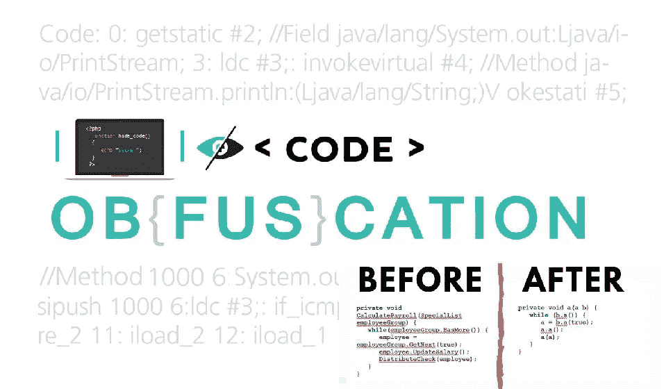
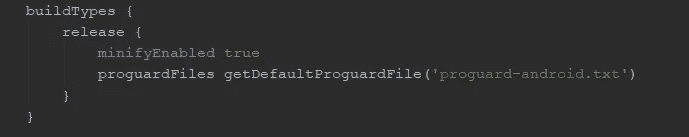
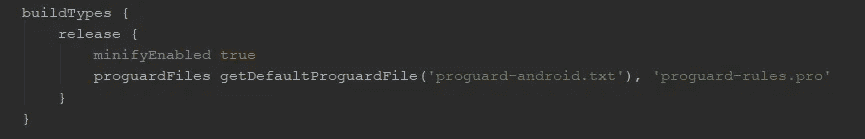

# Android 中的混淆

> 原文：<https://levelup.gitconnected.com/android-obfuscation-e608f79f0d09>

# 什么是混淆？

根据牛津词典，混淆指的是使某事变得模糊、不清楚或难以理解的行为。在软件中，代码的**混淆**是修改可执行文件的过程，这样它对未授权方(如黑客)不再有用，但仍保持完整的功能。但是只要花费足够的时间和精力，几乎所有的代码都可以被逆向工程。然而，大多数平台包括 Android、iOS、JAVA 和。NET 有自己的反编译器，它可以用来从可执行文件和库反向工程源代码，而不需要花费更多的时间和精力。本文主要讨论混淆技术以及如何在 Android 应用程序中编写混淆代码。

# 混淆的重要性

当可执行文件(例如在 Android → APK 中)被反编译时，任何有编程知识的人都可以很容易地捕捉到源代码的全貌。虽然，通过混淆过程，我们可以给源代码增加额外的安全性，使人类，尤其是黑客，很难理解代码。为了保护商业秘密，可以使用模糊处理来进行流程、未授权访问、漏洞发现和绕过许可或其他控制。

混淆不同于加密。加密的主要目的是转换数据和信息，使其对外界保密。实际的混淆是为了让人类难以理解。加密的代码在执行之前必须被解密，但是执行它们不需要模糊处理，例如去模糊处理。

# 混淆技术

很少有技术可以在编程中执行混淆。这些如下。

**[1]重命名混淆**

许多混淆器(如 Android、iOS 和 Java)都使用这种基本转换。这是通过重命名变量和方法名来完成的。它使用新的字符串、字母、数字、不可打印字符和不可见字符进行转换。

**【2】字符串加密**

所有字符串在托管可执行文件中都是可发现和可读的。即使方法和变量被重命名，也可以通过在二进制文件中查找字符串引用来使用字符串导航关键代码段。例如，显示给用户的消息(错误消息)可以通过攻击对用户产生重大影响。因此，字符串加密可用于隐藏可执行文件中的字符串。例如， [Caesor 密码算法[1]](http://practicalcryptography.com/ciphers/caesar-cipher/) 可用于执行字符串文字混淆作为基本混淆。

**[3]控制流混淆**

这使得反编译的代码看起来更像是混合逻辑，黑客很难理解。换句话说，控制流模糊综合了产生有效可执行文件的条件、分支和迭代构造。这些技术可以应用于方法[【2】](https://www.sciencedirect.com/science/article/pii/S0167404816300529)的运行时性能。

**【4】指令模式转换**

指令模式可用于将编译器创建的常见指令转换为其他不太明显的结构。这些是复杂的合法机器语言指令，可能无法清晰地映射到高级语言，如 C#或 Java。

**[5]虚拟代码插入**

在可执行文件中插入不影响主程序逻辑的代码段。但通过反编译或逆向工程破解代码变得越来越难，也很难分析。

**[6]移除未使用的代码和元数据**

从应用程序中移除包括日志、不必要的元数据和使用的代码段在内的调试信息变得更小，并且减少了暴露给攻击者的信息。这些方法可能会影响性能的提高。

**【7】二进制链接和合并**

这种技术将多个输入可执行文件和库组合成一个或多个输出二进制文件。链接可以使应用程序变得更小。这将有助于简化部署场景，并可能减少黑客的信息。

**[8]不透明谓词插入**

此方法用于通过添加条件分支来进行模糊处理，这些条件分支总是评估为无法通过静态分析确定的已知结果。这是引入潜在不正确代码的方式，这些代码实际上永远不会被执行，但是对于试图理解反编译输出的攻击者来说是令人困惑的。

**【9】防篡改**

混淆器可以将应用程序自我保护注入到我们的代码中，以验证我们的应用程序没有以任何方式被篡改。如果检测到篡改，它可以关闭应用程序，限制功能，调用随机崩溃(以掩盖崩溃的原因)，或执行任何其他自定义操作。它还可能向服务发送一条消息，提供有关检测到的篡改的详细信息。

**【10】反调试**

当黑客试图盗版或假冒您的应用程序、窃取您的数据或改变基础架构软件的关键部分的行为时，他们几乎肯定会从逆向工程开始，并使用调试器逐步调试您的应用程序。混淆器可以通过注入代码来检测您的生产应用程序是否正在调试器中执行，从而实现应用程序的自我保护。如果使用调试器，它可能会破坏敏感数据(防止数据被盗)、引发随机崩溃或执行任何其他自定义操作。它还可能向服务发送消息以提供警告信号。

# 模糊处理的利弊

安全性(优点)

可维护性(缺点)

优化代码(优点)

错误(缺点)

追踪非法拷贝(优点)

# 混淆工具。

Android Studio 相关的工具有**progguard**和 **DexGuard** 等。ProGuard 是一个免费工具，包含在 Android Studio 中，DexGuard 是 ProGuard 的商业版本。它可从 https://www.guardsquare.com/en.[获得](https://www.guardsquare.com/en.)当 ProGuard 使用时，它已被重命名为变量，但我们仍然可以看到代码结构。但是 DexGuard 不只是重命名变量，它执行更强的控制和预防性混淆。

**。NET 开发者**可以使用 [**ArmDot**](https://www.armdot.com/docs/armdot/tutorial.html) 商业版。ArmDot 使用几种方法进行混淆:混淆名称、控制流混淆和虚拟化。虚拟化是一种将原始代码转换为特定虚拟机的指令的方法，这些指令由虚拟机执行，因此原始代码无法恢复或修改。一些混淆工具如下。

1.  。NET:[**Dotfuscator**](http://www.preemptive.com/products/dotfuscator/overview)**，**[**il protector**](http://www.vgrsoft.com/en/products/ilprotector)**，** [**ArmDot**](https://www.armdot.com/)
2.  JavaScript:[**JavaScript 混淆器**](https://javascriptobfuscator.com/Javascript-Obfuscator.aspx) **，**[**js crambler**](https://jscrambler.com/)
3.  Android:[**progguard**](https://www.guardsquare.com/en/products/proguard)**，** [**DexGuard**](https://www.guardsquare.com/en)

# 如何在 Android 中混淆代码？

首先，我们需要在 Android Studio 的 app 级 Gradle 文件中启用***minify enabled true***。

在应用程序级梯度文件中启用 ProGuard

如果您正在添加自己的 ProGuard 规则，您可以按如下方式修改代码。

在应用程序级梯度文件中添加自定义程序文件

关于 ProGuard 示例的更多细节，请点击链接，你可以从这篇文章中获得关于 ProGuard 规则以及如何在 android 混淆中使用 ProGuard 的更多信息。