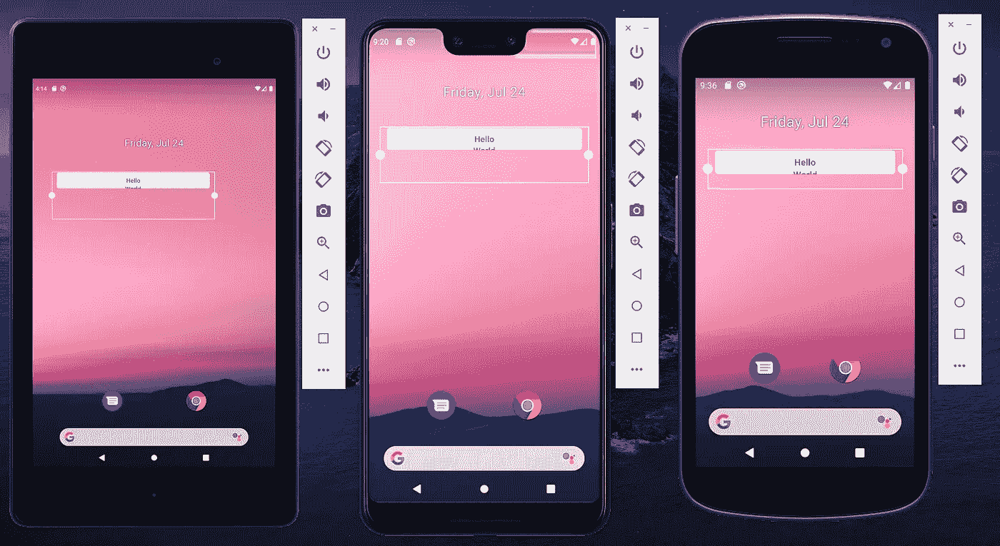
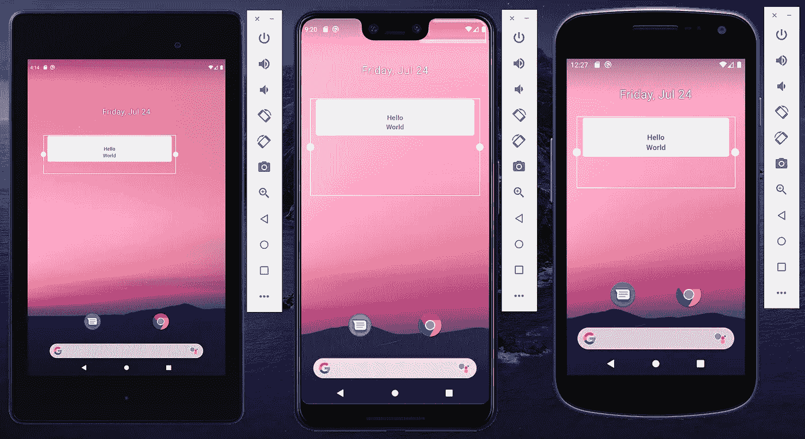
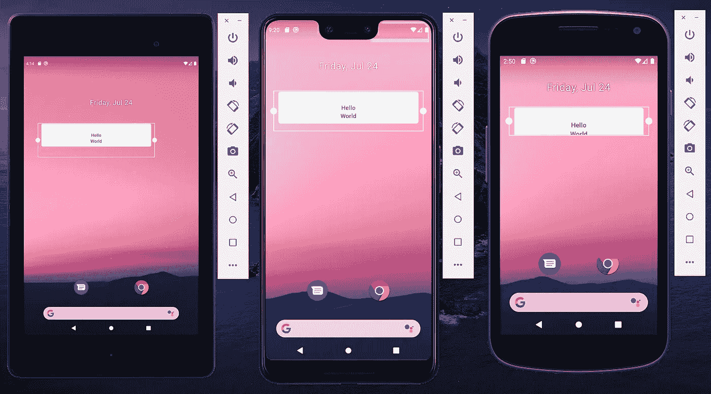

# Android 单行主页小工具提示

> 原文：<https://levelup.gitconnected.com/android-one-row-home-widget-tips-811d8920a67d>

罗斯·乔伊纳在 [Unsplash](https://unsplash.com?utm_source=medium&utm_medium=referral) 上的照片

大家好，我想分享一下我在开发 android widget 时的经历。这篇文章将以故事的形式出现。随意跳入[TL；DR 部分](#6383)如果你想直接去我的一行 android home 小工具上的提示。

你现在有一个很好的应用程序，已经被成千上万的用户下载了。你的用户开始问他们是否能为你的应用程序获得一个插件。您快速开发了小部件，您的用户也很高兴。因为你听他们的歌，所以他们给你甜蜜的 5 颗星。然而，更多的要求来了。他们认为你的应用程序的小工具占用了太多的屏幕空间。你坐下来看你的应用。把这个部件做成一排不会有太多问题，48 小时后你会对自己做错了什么感到困惑。

让我们开始看看来自谷歌的关于 android widget 大小的官方指南。它说我们需要保守的高度和宽度的部件。让我们把建议放在桌面上。我们从 appwidget-provider 上的 **40dp 和布局上的 **40dp 开始。**这是一个非常简单的 hello world 小部件布局的完整代码:**

当我们在几个不同屏幕尺寸的 android 设备上运行代码时，结果是:

好吧，官方文件似乎是正确的。所有设备都显示单行小工具。然而，我们的 hello world 缺少“world”。实际上不是，因为世界因为新冠肺炎而暂停了(原谅我的双关语)。我想让我们把小部件的高度做得更高一些。让我们为 appwidget-provider 和布局设置 **80dp，它看起来像这样:**

如果你感到困惑，请举手。中心的小部件大小和正确的设备是预期的。因为一行是 40dp(基于官方文件)，所以如果我写 80dp，它将是两行。然而，左边的设备仍然有一个单行小部件。为什么？

左边的设备是 android nexus 7，右边的设备是 nexus。这两款设备的像素密度都被归类为 xhdpi。然而，他们每个人都有不同的高度。Nexus 7 高度 1920dp 而 Nexus 只有 1280dp。它们都有 5 排。正如我们可以看到的，nexus 7 上的一行比 nexus 上的一行高，因此小工具的结果不同。

另一个问题是设备中间(像素 3 xl)和右边的小工具的高度。两者上的 widget 高度几乎都是一行。我们能把它们排成一排吗？我们可能有一个问题，在小部件下面产生了那些空白空间。

好吧，让我们试试另一个不同的高度。这次让我们在 appwidget-provider 上设置 4 **0dp，在布局上设置 80dp。**结果将如下所示:

中间和左边的设备现在是一排。但是，右边的设备在小部件上有垂直滚动条。根据这个实验我们可以得出结论。

**TL；博士**

**appwidget-provider** 上的 **minHeight** 是 widget 始终停留在一行 **40dp** 的关键。但是，小部件布局的高度不需要与最小高度相同。

小部件的高度没有确切的公式。这取决于你的应用的设备目标。如果你包括更小的设备，那么你需要按照 android 官方文档的指示，对小部件本身的高度非常保守。

根据我的经验**如果你想覆盖更小的设备，60dp** 是你可以放置的最大布局高度。如果你放得太多，那么就有垂直滚动出现的风险。不然可以放 **40dp** - **80dp** (我更喜欢 50dp) **。**它将使大多数设备显示一行，但在较小的设备上将显示两行。

感谢您的阅读。如果你有问题，请告诉我。

> 分享是关心和爱你的邻居，就像爱你自己一样。