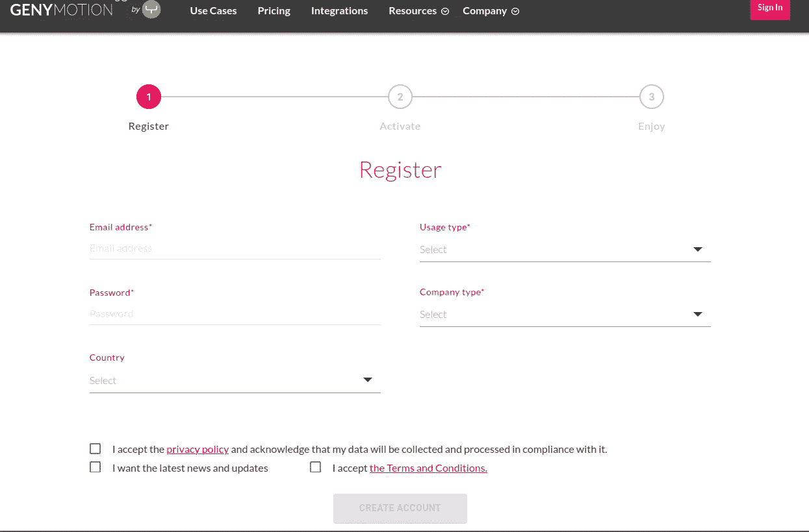
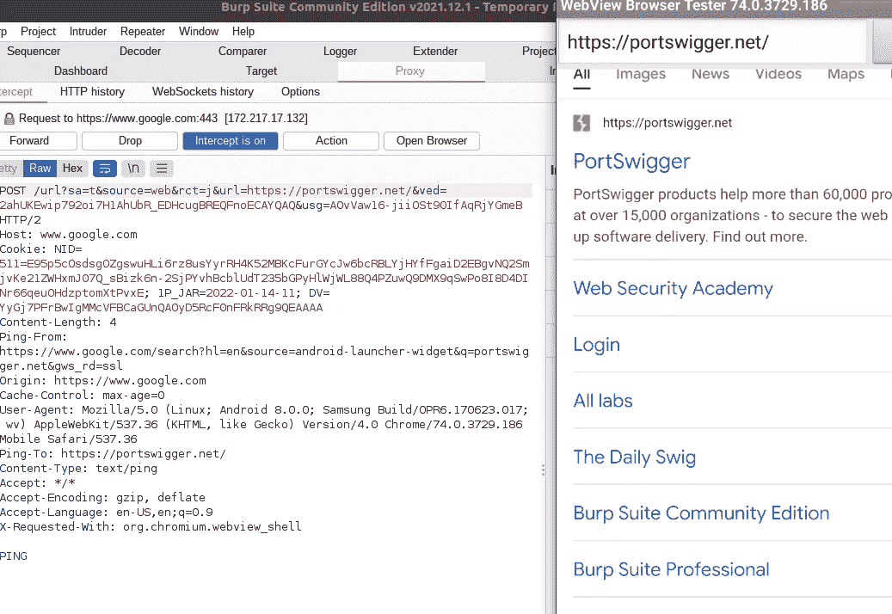

# Android Pentest 实验室设置:移动 Pentest 初学者综合指南

> 原文：<https://levelup.gitconnected.com/android-pentest-lab-setup-a-comprehensive-guide-for-beginners-in-mobile-pentesting-45d0fa29930f>


洛伦佐·埃雷拉拍摄的图片

# 介绍

最近，我决定揭开手机测试背后的秘密。出于某种原因，网络测试、论坛和问题太多了，然后你可以花几天时间试图将 APK 文件插入 Genymotion，因为没有人喜欢谈论 Android 测试。

本文将从 Android 世界开始，尝试深入这个小移动应用程序的测试之旅。

# 目录

1.  安装 VirtualBox
2.  Genymotion — Android 设备仿真器
3.  在 Genymotion 中安装 APK 文件
4.  使用 Android 仿真设备设置打嗝套件
5.  静态和动态分析工具

# 建立实验室

## 1.安装 VirtualBox

VirtualBox 被 Genymotion 用作核心来虚拟化 Android 操作系统。因此，为了成功安装 Genymotion，您需要在系统中安装 VirtualBox。继续，点击这个[链接](https://www.virtualbox.org/wiki/Downloads)，找到你的操作系统并安装 VB。

## 2.**下载并安装 Genymotion**

现在，假设你已经安装了 VirtualBox，你可以从这里下载 Genymotion。如果你用的是 Windows，不安装 VirtualBox 也可以选择*。当然，不出所料，对于其他系统，只有一个选项，所以就用那个吧。*

下载 Genymotion 后，要访问该界面，您需要有一个帐户。首先在这里创建账户[。](https://www-v1.genymotion.com/account/create/)



Genymotion 登记表

一旦你这样做了，下载就完成了，安装 Genymotion 并用你刚刚创建的帐户登录。该应用程序看起来会像这样。我已经安装了一个设备，您可以安装任意多的设备。


现在你会遇到一些问题。

**第 1 期 ARM 翻译器库**

现在，为了插入 APK 文件并让它们实际工作，90%的时间都需要一个 ARM 翻译器。现在你可能会想“等等，等等，我把你弄丢了”。这是它的基本知识:

*   Genymotion 的设备由 x86 (32 位)架构组成。
*   当我说架构时，我指的是手机中的处理器类型。通常选项有 ARM、ARM64、x86 和 x86_64。ARM 和 x86 适用于 32 位处理器，而 ARM64 和 x86_64 适用于 64 位处理器。
*   现在，如果您下载的 apk 已经构建在 ARM 架构上，Genymotion 设备将无法运行它，因为 x86 和 ARM 文件不交叉兼容。
*   这就是你需要一个 **ARM 翻译库的原因。**

要安装 ARM 翻译器库，找到正确的 Android 版本，并从[T3 下载相应的 zip 文件。](https://github.com/m9rco/Genymotion_ARM_Translation) 所以如果你的设备运行的是 Android 版本，你应该下载 Genymotion-ARM-Translation _ for _ 8.0 . zip

下载后，将 zip 文件拖放到仿真设备中。ARM 库的成功安装是指屏幕上弹出一条成功消息。

**问题#2 查找您设备的信息**

*   为了能够准确地知道你的设备是基于哪种架构，你可以安装 [Droid Hardware Info](https://apkpure.com/droid-hardware-info/com.inkwired.droidinfo) ，这是一个免费的 apk 文件，它会告诉你你需要知道的一切。下载文件后，只需将它拖放到设备模拟器中，您应该会看到一个类似如下的屏幕:


Droid 硬件信息

## 问题 3:下载和安装 GApps

将 GApps 安装到仿真设备中可以更容易地从 Google Apps 下载目标应用程序。这可以通过以下方式实现:

**选项 1:** 点击仿真设备中的小工具


间隙通过

**选项 2:** 从[](https://opengapps.org/#2 </strong>这种做法是从 Play Store 下载应用，然后用 adb (Android Bridge)拉。</p><ul class=)

*   [如果可以从 Play Store 直接安装应用程序，为什么还需要 apk 文件呢？反编译器需要它来检查静态分析的源代码。](https://opengapps.org/#2 </strong>这种做法是从 Play Store 下载应用，然后用 adb (Android Bridge)拉。</p><ul class=)

[好吧，现在这已经不碍事了。这些命令如下:](https://opengapps.org/#2 </strong>这种做法是从 Play Store 下载应用，然后用 adb (Android Bridge)拉。</p><ul class=)

```
# Call package manager (pm) and filter out a specific app's package name
$- **./adb shell pm list packages | grep** appname
# Check the absolute path 
$- **./adb shell pm path com.appname.android** # Pull apk and rename to twitter_lite.apk
$- **./adb pull /data/app/com.appname.android.somevalue.apk** **Now drag and drop the apk file into the emulated device**
```

[***注意*** *:* 为了能够使用 adb，它通常预装在 genymotion 工具中，因此如果您在主目录中安装了 genymotion，您可以通过首先导航到: *~/genymotion/tools/* 来执行上述命令](https://opengapps.org/#2 </strong>这种做法是从 Play Store 下载应用，然后用 adb (Android Bridge)拉。</p><ul class=)

[此时，我们已经设置了仿真器，可以看到我们想要在仿真设备中测试的应用程序。](https://opengapps.org/#2 </strong>这种做法是从 Play Store 下载应用，然后用 adb (Android Bridge)拉。</p><ul class=)

[](https://opengapps.org/#2 </strong>这种做法是从 Play Store 下载应用，然后用 adb (Android Bridge)拉。</p><ul class=)

[接下来，我们需要设置 Burp Suite 作为代理，然后安装并连接一些工具，我们将使用这些工具进行动态和静态分析。](https://opengapps.org/#2 </strong>这种做法是从 Play Store 下载应用，然后用 adb (Android Bridge)拉。</p><ul class=)

## [4.使用 Android 仿真设备设置打嗝套件](https://opengapps.org/#2 </strong>这种做法是从 Play Store 下载应用，然后用 adb (Android Bridge)拉。</p><ul class=)

[首先，如果你还没有，安装 Burp Suite 的社区版本:](https://opengapps.org/#2 </strong>这种做法是从 Play Store 下载应用，然后用 adb (Android Bridge)拉。</p><ul class=)[链接](https://portswigger.net/burp/releases/professional-community-2021-12-1?requestededition=community)。

现在，您需要在模拟设备中设置 Burp CA 的证书。这些步骤如下:

1.  导航到 Burp ->代理->选项->导出 CA 证书-> DER 格式的证书。
2.  您已经导出了一个证书，使用 OpenSSL 将 DER 转换为 PEM 并重命名为 <cert-hash>.0</cert-hash>

为此，命令如下:

```
**$- openssl x509 -inform DER -in cacert.der -out cacert.pem**
**$- openssl x509 -inform PEM -subject_hash_old -in cacert.pem | head -1**
9a5b575**$- mv cacert.pem 9a5b575.0**
```

3.现在，使用 adb 在仿真设备中移动创建的证书

```
# Change /system partition into writable mode with remount
$- **./adb remount**# Transfer certificate
$- **./adb push 9a5ba575.0 /system/etc/security/cacerts/**# Change its permissions
$- **./adb shell chmod 644 /system/etc/security/cacerts/9a5ba575.0**# Reboot to let changes occur
$- **./adb shell reboot**
```

4.该证书现在应该安装为系统信任的 CA 证书，您可以通过在“设置”->“安全和位置”->“加密和凭证”->“信任凭证”中导航仿真设备来确认该证书


确认证书已经安装

5.接下来是配置 burp suite 的代理，导航到代理->选项->代理监听器->添加。在这里，您可以将端口号设置为 8082，并将其绑定到一个特定的地址，即 VirtualBox 的接口 IP。


配置 Burp 的代理

要找到你的 VirtuaLBox 的接口 IP，打开你的终端并输入 *`ifconfig`。*

5.最后要做的是，在仿真设备上，您还应该设置 WiFi 设置。导航到 WiFi ->长按 WiFi 名称->修改网络->高级选项->将代理无更改为手动。


配置 WiFi 网络

之后，你可以看到网络流量在打嗝。



打嗝网络流量

## 5.静态和动态分析工具

继续设置，为了能够进行动态和静态移动分析，我们需要一些工具。

正如我最近了解到的那样，有很多可用的工具，这完全取决于你的偏好。然而，在本文中，我将提到一些用于扫描、静态/动态分析的工具，或者整合了您在安装中可能需要的这两种工具的框架，并在后续文章中向您介绍它们的安装和深入使用。

***应用扫描仪***

*   **Android bugs 框架**——一个 Android 漏洞分析系统，帮助开发者或黑客发现 Android 应用中潜在的安全漏洞。没有华丽的 GUI 界面，但效率最高(平均每次扫描不到 2 分钟)而且更准确。
*   **Android 快速审查工具包(QARK)** —该工具旨在寻找源代码或打包的 apk 中的几个与安全相关的 Android 应用程序漏洞。该工具还能够创建“概念验证”的可部署 apk 和/或 ADB 命令，能够利用它发现的许多漏洞。不需要对测试设备进行根操作，因为该工具关注的是在其他安全条件下可能被利用的漏洞。

***动态分析工具***

*   Frida —这是一个动态代码工具套件，它允许你动态地将代码片断注入到应用程序的运行过程中，以改变它的行为。

***静态分析工具***

*   **Android warn**—针对恶意 Android 应用的静态代码分析器。恶意行为的检测是通过静态分析应用程序的 Dalvik 字节码来执行的，用`[androguard](https://github.com/androguard/androguard)`库表示为 Smali。该分析导致根据用户选择的技术细节级别生成报告。
*   **字节码查看器** —用于反编译源代码，以便更好地审查。

***框架***

*   **MobSF** —移动安全框架(MobSF)是一个自动化的一体化移动应用程序(Android/iOS/Windows)笔测试、恶意软件分析和安全评估框架，能够执行静态和动态分析。MobSF 支持移动应用程序二进制文件(APK、XAPK、IPA & APPX)以及压缩源代码，并提供 REST APIs 与您的 CI/CD 或 DevSecOps 管道无缝集成。动态分析器帮助您执行运行时安全评估和交互式仪表测试。

这些是建立一个像样的 Android 安全测试实验室所需的一些工具。但是请记住，这个列表还在不断扩展，如果您在当前的开源世界中找不到想要的东西，您可以使用甚至构建自己的工具。

继续#hashtalking，在我揭开手机黑客世界的时候和我呆在一起。