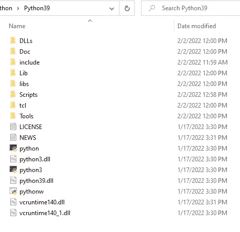
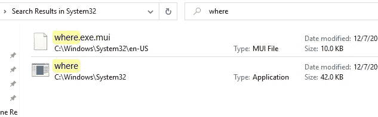

# Android Pentest 实验室设置:Windows+[错误] Python3 未安装已解决

> 原文：<https://levelup.gitconnected.com/android-pentest-lab-setup-mobsf-installation-on-windows-error-python3-is-not-installed-solved-fead0e86f8ae>

移动安全框架(MobSF)是一个自动化的一体化移动应用程序(Android/iOS/Windows)笔测试、恶意软件分析和安全评估框架，能够执行静态和动态分析。

从 Unsplash 上的 [@abillion](https://unsplash.com/@abillion)

它在 Linux 上的安装非常简单，但是这不是我们在 Windows 主机上可以说的。因为花了我相当长的时间，我想我应该写一个关于 Windows 安装过程的完整帖子。

系好安全带，我们开始聊天吧！

# 安装前的先决条件

1.  **安装**[**Git**](https://git-scm.com/download/win)**———下载 Git 后确保打开环境变量- >系统变量- >路径，看看是否有 C:\Program Files\Git\cmd**

*   ****安装**[**Python 3.8–3.9**](https://www.python.org/)———安装最新的 3.9 版本并在系统变量中插入 Python path，你应该有 2 个条目，通常应该看起来像 C:\ Users \ username \ AppData \ Local \ Programs \ Python \ Python 39；c:\ Users \用户名\ AppData \ Local \ Programs \ Python \ Python 39 \ Scripts**
*   ****安装**[**JDK 8+**](https://www3.ntu.edu.sg/home/ehchua/programming/howto/JDK_Howto.html)———按照本指南在 Windows 路径下设置 Java JDK[https://confluence . atlassian . com/doc/setting-the-Java _ home-variable-in-Windows-8895 . html](https://confluence.atlassian.com/doc/setting-the-java_home-variable-in-windows-8895.html)**
*   ****安装** [**微软 Visual C++构建工具**](https://visualstudio.microsoft.com/thank-you-downloading-visual-studio/?sku=BuildTools&rel=16)**
*   ****安装****
*   ****下载&安装**[**wkhtmltopdf**](https://wkhtmltopdf.org/downloads.html)**———在系统变量 Path 变量中插入 wkhtmltopdf 二进制文件夹(C:\ Program Files \ wkhtmltopdf \ bin)****

# ****装置****

****git clone[https://github . com/MobSF/Mobile-Security-Framework-MobSF . git](https://github.com/MobSF/Mobile-Security-Framework-MobSF.git)CD Mobile-Security-Framework-MobSF****

****现在你做了所有这些，下一个命令是 **setup.bat** ，你运行。bat 文件，你有[错误] python3 没有安装错误。你有几个选择可以施展魅力:****

1.  ****运行 python -V，应该会打印出 python 版本，如果没有的话，你真的没有安装 python 或者你的 path 中没有它****
2.  ****运行 python3 -V，这也应该打印 python 版本，如果没有，转到 python.exe 所在的文件夹，复制 python.exe 并在 python3 中重命名它，所以现在你应该在同一个文件夹中有两个 python 文件，python 和 python3，现在重新运行 python3 -V，应该打印出版本****

********

****Python 目录****

****3.最后一招，也可能是解决方案是尝试运行命令*，其中*在 cmd 中。如果*安装在*的位置，您应该查看使用手册，如果没有安装，您将得到‘where’不被识别为内部或外部命令。****

****where.exe 是 System32 中的一个文件，所以您可以做的第一件事是检查它是否真的在那里，在 C:\Windows\System32 文件夹中****

********

****如果你能检测到而 cmd 检测不到，那么你应该在系统变量-> Path 中添加 C:\Windows\System32。添加后，关闭当前 cmd，打开一个新的 cmd，再次键入命令 *where* 。如果现在检测到了，执行 setup.bat，应该就可以了。****

# ****跑步暴民 f****

****run.bat 127.0.0.1:8000****

****在您的网络浏览器中，导航至`http://localhost:8000/`以访问 MobSF 网络界面。****

****仅此而已。您安装了 MobSF。我希望这个小小的话题为你节省了几个小时，因为它花了我很多钱。****

****他们没有对 python3 错误进行故障排除的完整文档可以在这里找到:[https://mobsf.github.io/docs/#/](https://mobsf.github.io/docs/#/)****