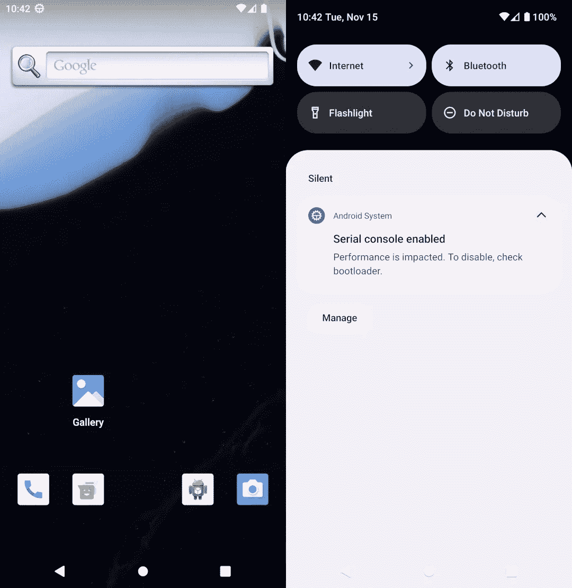

# Android 平台(AOSP)开发(第 1 部分):入门

> 原文：<https://levelup.gitconnected.com/android-platform-aosp-development-part-1-getting-started-55e2c5af07dd>

如何下载并构建自己版本的 Android 操作系统？


安卓汽车

你有没有好奇心去了解 Android、Windows、Linux、macOS 或任何其他操作系统是如何工作的？也许自己开发一些东西或者开发一个操作系统嵌入到一个硬件中？那这篇文章就送给你了！从头开发一个操作系统真的很难，很耗时，但是 Android 是开源的，允许你以它为基础，并根据你的需要进行必要的修改！

当我开始为 Android 操作系统开发时，它是势不可挡的，几乎没有关于它的文档，你必须做大量的研究才能做任何事情，这比我想象的要困难得多，这就是我写这篇文章的原因，我计划写一些关于你成为 Android 平台开发者所需的几乎所有东西的文章，但在第一部分，我们将设置环境，下载并构建一个 Android 13 模拟器！欢迎评论和提问！

# 什么是 AOSP？

AOSP，或 android 开源项目，是 Android 操作系统本身，所有基于 Android 的手机，电视，汽车和许多其他设备所依赖的基础。

# 要求

要构建 AOSP，您需要一台有 300 多 GB 可用存储空间、16GB 内存、8GB 内存的机器，但您可能会遇到问题，可能会面临很长的构建时间。你还需要一台 Linux 机器，我在这篇文章中使用的是 Ubuntu 20.04.4 LTS，你也可以在 windows 上使用 WSL，只要记得增加 WSL 可用的内存和启用 WSL-g。

# Android 平台清单

Android 平台清单是将整个项目结合在一起的粘合剂，它是一个包含每个“子项目”的引用的文件。你可能会认为 android 是一个巨大的存储库，所有的东西都生活在一起，但这对于像 android 这样大且可定制的操作系统来说并不太实际，所以它被分成多个存储库，清单包含对这些存储库的引用，你可以在这里查看每个 Android 版本的清单[，如果你想看看它的样子，你可以搜索特定的 Android 版本或者](https://android.googlesource.com/platform/manifest)[点击这里](https://android.googlesource.com/platform/manifest.git/+/refs/heads/android-13.0.0_r15/default.xml)直接进入 Android 13 release 15 清单。

# 设置环境

构建 AOSP 需要大量的包和工具，要在 Ubuntu 20.04 或 18.04 上开始，运行下面的命令来获得所需的包:

```
sudo apt-get install git-core gnupg flex bison build-essential zip curl zlib1g-dev gcc-multilib g++-multilib libc6-dev-i386 libncurses5 lib32ncurses5-dev x11proto-core-dev libx11-dev lib32z1-dev libgl1-mesa-dev libxml2-utils xsltproc unzip fontconfig
```

对于旧版本的 Ubuntu，请查看谷歌的指南。

## 回购工具

还记得清单包含了对许多存储库的引用吗？如果你需要手动克隆每一个引用，那就太糟糕了，这就是 repo 存在的原因，它是一个 python git 包装工具，允许你轻松管理这个清单和整个项目。许多 Linux 发行版都包含 repo，所以您可以运行:

```
# Debian/Ubuntu.
sudo apt-get install repo

# Gentoo.
sudo emerge dev-vcs/repo
```

出于某种原因，Ubuntu 20.04 不包含 repo，所以您必须使用以下脚本手动安装它:

```
mkdir -p ~/.bin
PATH="${HOME}/.bin:${PATH}"
curl https://storage.googleapis.com/git-repo-downloads/repo > ~/.bin/repo
chmod a+rx ~/.bin/repo
```

如果你安装了 repo，你应该可以运行`repo version`。

# 正在下载 Android 源代码

现在，终于到了我们开始下载 android 源代码的时候了，首先，创建一个新的文件夹，您要在其中存储项目并打开一个终端，然后，您需要使用 repo 并指向您要使用的清单，命令是`repo init -u [URL_TO_MANIFEST_REPOSITORY] -b [BRANCH]`，您可以使用您自己的 Android 清单分支，但在本文中，我将只使用 Android 13 release 15 的 Google 清单:

```
repo init -u https://android.googlesource.com/platform/manifest -b android-13.0.0_r15
```

现在文件夹中有了清单，我们可以使用`repo sync`下载 android 的源代码，要知道，第一次运行 repo sync 可能需要几个小时，有很多文件要下载。你也可以添加`-j[NUMBER_OF_THREADS_TO_USE]`来加快进程，默认情况下，repo 会尝试找到最适合你的线程数，但是你可以稍微摆弄一下来加快速度。

```
repo sync --optimized-fetch
```

# 构建 Android 操作系统

在构建操作系统之前，我需要谈一谈一些常用的命令:

```
# Setup the enviroment and make other commands available from terminal
# Remember to execute it from the root of the project.
source build/envsetup.sh

# Lists all commands
hmm

# Selects which target and variant will be built, a product target is a
# set of variables and configurations that will enable or disable features
# and allow for the OS to work on different hardwares.
# The build type (or variant) will change the behavior of the OS itself,
# where 'user' is limited and suited for production, 'userdebug' has root 
# access and debugging capabilities, and 'eng' has additional debugging tools.
lunch [TARGET_PRODUCT]-[BUILD_TYPE]

# Build the current target variant, can take several hours in the first run.
m

# Cleans the cache and currently built targets, use with caution.
m clean
```

# 选择一个目标，然后建造它

在执行`source build/envsetup.sh`之后，我们可以最终选择我们的目标并构建它，我们将使用的目标是`aosp_x86_64`，它将为我们生成一个可用的手机仿真器，您也可以使用`aosp_car_x86_64`来构建一个 Android 汽车仿真器。

```
lunch aosp_x86_64-eng
m
```

在几个小时的构建之后，您将需要重复这个过程来为模拟器构建 sdk，这通常只需要一次，但是如果您在未来的构建中遇到问题，您将只需要为目标构建。

```
lunch sdk_x86_64-eng # Use sdk_car_x86_64-eng if you built Android Automotive
m
```

# 启动模拟器

随着 Android 和 SDK 的建立，现在我们可以启动模拟器了！要做到这一点，你只需要运行`emulator &`，瞧！您已经构建了自己的仿真器:



aosp_x86_64 仿真器

如果您使用的是 Android automotive target ( `aosp_car_x86_64`)，您的仿真器应该是这样的:


aosp_car_x64_86 仿真器

# 结论和后续步骤

Android 几乎无处不在，从智能手机，到电脑(Android 和 chromeOS 的 windows 子系统)，智能手表，电视，信用卡终端，汽车…无处不在！有很多事情可以做，但是关于它的文档仍然很差，信息到处都是，而且没有很多 AOSP 开发者(至少没有移动开发者多)。android 的用途是无限的，如果你想成为一名 Android 平台开发者，我会尽我所能帮助你！

在下一篇文章中，我将讲述如何在 Android 操作系统中创建一个新的应用程序，所以如果你想了解更多关于 Android 操作系统以及如何成为 Android 平台开发人员的信息，请继续关注我！