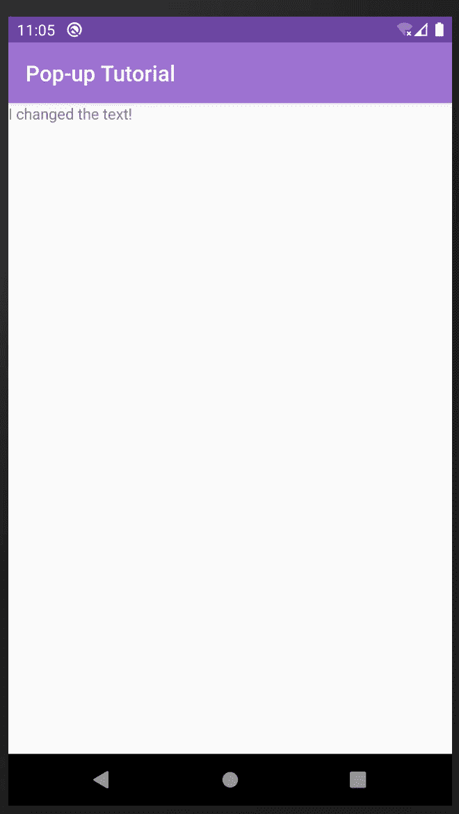

# Android 弹出消息初学者教程

> 原文：<https://levelup.gitconnected.com/android-pop-up-messages-tutorial-for-beginners-51b15ddd68ce>

## 如何用 Kotlin 在 Android 中实现 Snackbar


自从计算机出现的最初几年，我们就开始熟悉“弹出”这个术语。那时候，这是你想尽一切办法阻止的事情。大多数情况下，这与宣传或恶意软件有关。现在在智能手机时代，我们有警告和对话框，我之前在其中创建了一个由三部分组成的教程。在本教程中，我们将学习 Android 弹出消息。

Android 赋予了术语**弹出窗口**新的含义。在我看来，他们的定义更准确，它与显示从屏幕底部弹出的消息有关。这个用一个图像来描述比较好，下面来看看。


图一。屏幕底部的 Snackbar 或 Android 中的弹出窗口

小吃店在 2015 年与材料设计一起推出。在此之前，显示简短消息的首选方法是祝酒词(在 Kotlin 的 Android Alert 对话框的第二部分[中，我简要解释了什么是祝酒词)。零食条相对于吐司的一个优势是它们可以包含按钮。](http://www.evanamargain.com/blog/android/android-alert-dialogs-in-kotlin-tutorial-part-2-interact/)

在本教程中，我将教您如何创建这些弹出窗口来与您的应用程序集成。和之前所有的教程一样，我们将以“[新的 Android Studio project for kot Lin and Java](http://www.evanamargain.com/blog/android/new-android-studio-project-for-kotlin-and-java-tutorial/)结果文件”中解释的项目为起点。

如果您需要该文件，可以从这里下载:

下载:[入门项目](http://www.evanamargain.com/blog/wp-content/uploads/2020/05/Starter-project.zip)

这个项目写在:

*   安卓工作室 3.6.1
*   科特林 1.3
*   Compat 库:AndroidX

在开始本教程之前，构建并运行 starter 应用程序是一个很好的起点，可以确保一切工作正常。您应该看到的屏幕如下图 2 所示。


图二。启动项目

# 在协调器布局中使用 Snackbar

Android 推荐在协调布局中使用 snackbars。你仍然可以在任何其他类型的布局中使用 snackbar，但是根据 [Android 的文档](https://developer.android.com/training/snackbar/showing#coordinator)，协调器给出了两个优点:

1.  Snackbars 只有在协调器布局中才能被消除。
2.  当 snackbar 出现时，协调器布局负责将一些 UI 元素推到顶部，这样您就有了一个干净的布局。

默认情况下，这个项目和大多数 Android starter 项目都有一个约束布局。你需要做的第一件事是通过打开 activity_main.xml 来改变它，你可以在 app > RES > layout > activity _ main . XML 中找到它，如图 3 所示。


图 3。选择 activity_main.xml

打开文件后，您将能够看到 XML 的根标签，这是一个 ConstraintLayout(图 4)。


图 4。约束布局

用以下代码替换约束布局:

```
<androidx.coordinatorlayout.widget.CoordinatorLayout 
  android:id="@+id/myCoordinatorLayout"   
  xmlns:android="http://schemas.android.com/apk/res/android" 
  xmlns:app="http://schemas.android.com/apk/res-auto" 
  xmlns:tools="http://schemas.android.com/tools" 
  android:layout_width="match_parent" 
  android:layout_height="match_parent" 
  tools:context=".MainActivity"> ... </androidx.coordinatorlayout.widget.CoordinatorLayout>
```


图 5。更改布局后的结果

如果你运行应用程序后，这一变化，你会注意到标签改变的地方(图 5)。实际上，现在所有的约束都没有用了，所以您可以删除下面几行:

```
app:layout_constraintBottom_toBottomOf="parent" app:layout_constraintLeft_toLeftOf="parent" app:layout_constraintRight_toRightOf="parent" app:layout_constraintTop_toTopOf="parent"
```

如果你有错误，看看下面(图 6)你的代码在这些改变后应该是什么样子。


图 6。结果 activity_main.xml

# 将材料设计添加到项目中

为了在任何项目中使用 snackbars，您首先需要在应用程序的 Gradle 文件中添加材料设计依赖关系。该文件可以在 grad le Scripts > build . grad le(Module:app)中找到，可以在下图中看到。


图 7。应用程序梯度文件位置

一旦在底部打开了该文件，在依赖项内部添加以下代码。

```
implementation 'com.google.android.material:material:1.0.0'
```

Android Studio 将请求同步项目，请继续执行。什么都不会改变，但是现在你可以使用 Snackbars 了。

# 在 MainActivity 中创建 Snackbar

完成所有这些设置后，您现在可以添加 snackbar 了。打开 MainActivity.kt，位于 app > Java > c . e . Android . my application > main activity . kt，如下图所示。


图 8。Android 项目视图中的主要活动位置

在文件的顶部，我们需要用以下代码导入 Android Snackbars 的依赖项:

```
import com.google.android.material.snackbar.Snackbar
```

然后创建 snackbar，并用下面的代码显示它:

```
//1 
val snackbar = Snackbar.make(findViewById(R.id.myCoordinatorLayout), "Hello snackbar world!", Snackbar.LENGTH_LONG) //2 
snackbar.show()
```

让我们回顾一下这段代码:

1.  您将把 snackbar 存储在一个`val`变量中。然后使用 Snackbar.make 方法创建 Snackbar，它接收三个参数:

*   父视图，如上所述，推荐使用 CoordinatorLayout，但也可以是 LinearLayout、ConstraintLayout 或您能想到的任何其他视图。
*   您希望它包含的文本—在本例中是“Hello snackbar world！”
*   snackbar 将显示的时间长度，可以是 *LENGTH_LONG* 、*LENGTH _ 不定*或 *LENGTH_SHORT*

2.你让小吃店出现。

请注意，您可以在一行中执行指令一和指令二，但是为了清楚起见，我们在这里将它们分成两行。

完成这些更改后，您可以运行应用程序，并会在应用程序启动后几秒钟内看到 snackbar 出现。


图 9。零食条显示

# 向 Snackbar 添加操作

正如开头提到的，Android Snackbars 也可以有一个动作按钮。所以在教程的这一部分，我们将添加一个。

首先，转到 activity_main.xml 并在 TextView 标记中添加一个 id:

```
android:id="@+id/text_view_welcome"
```

然后返回 MainActivity.kt 并导入操纵 snackbar 所需的“View”类。

接下来，在 onCreate 方法中，使用以下代码添加 snackbar 按钮:

```
snackbar.setAction("Click me", View.OnClickListener { 
    text_view_welcome.text = "I changed the text!" 
})
```

这段代码有两部分。首先，设置按钮的动作和文本，在本例中是“Click me”。然后创建一个 onClickListener，它将引用添加到文本视图中的 id。通过设置此属性，您将通过单击 Snackbar 按钮来更改屏幕中的文本。

运行应用程序并单击按钮，您可以在下面的图片 10 和 11 中看到结果。


图 10。带按钮的零食条



图 11。单击按钮后，文本发生了变化

就是这个！您已经涵盖了小吃店所需的一切。如果你想看看这个项目最后应该如何运作，你可以在这里下载完成的项目:

下载:[完成项目](http://www.evanamargain.com/blog/wp-content/uploads/2020/05/Finished-project.zip)

如果你有任何疑问，不要犹豫留下评论，我会尽快回复。

下次见！

埃娃娜·马尔甘·普伊格