# Android React 原生窗口设置

> 原文：<https://levelup.gitconnected.com/android-react-native-window-setup-how-to-setup-android-environment-for-react-native-app-588aaa13c3a6>

## 如何为 React 原生应用设置 Android 环境

在本教程中，我们将学习如何在 Windows 上设置您的开发环境，以使用 React Native 和 Android Studio。

在我们开始之前，请找到以下重要技术的定义。

1. **React Native** 是一个 JavaScript 框架，用于为 iOS 和 Android 编写真实的、原生呈现的移动应用。React Native 还为平台 API 公开了 JavaScript 接口，因此 React Native 应用程序可以访问手机摄像头或用户位置等平台功能。

2. **Android Studio** 是谷歌 Android 操作系统的官方集成开发环境(IDE)，基于 JetBrains IntelliJ IDEA 软件，专为 Android 开发而设计。它可以在基于 Windows、macOS 和 Linux 的操作系统上下载，或者在 2020 年成为一项基于订阅的服务。它取代了 Eclipse Android 开发工具(ADT ),成为原生 Android 应用程序开发的主要 IDE。

> **先决条件:**
> **下载软件的**
> 1。[**node . js**(8 版或更新版本)](https://nodejs.org/en/download/)—[https://nodejs.org/en/download/](https://nodejs.org/en/download/)
> 2。**铬**——[https://www.google.com/chrome/](https://www.google.com/chrome/)T21【3。[**Visual Studio Cod**e](https://code.visualstudio.com/)(可以使用其他任何编辑器或 IDE)
> 4。[**Android Studio**](https://developer.android.com/studio/)—从[https://developer.android.com/studio/](https://developer.android.com/studio/)下载并安装最新版本的 Android Studio for Windows
> 
> [**5。Java 开发工具包** (JDK 8 或更新版本)](http://www.oracle.com/technetwork/pt/java/javase/downloads/jdk8-downloads-2133151.html)
> 从 http://www . Oracle . com/tech network/pt/Java/Java se/downloads/JDK 8-downloads-2133151 . html 下载并安装最新版本的 Java SDK
> 6 . [**从 https://www.python.org/downloads/windows/
> 7 下载安装 Python 2.7.15**](https://www.python.org/downloads/windows/) 。**英特尔 x86 仿真器加速器(HAXM 安装程序)—(**HAXM-Windows _ V7 _ 6 _ 1)
> [https://github . com/Intel/HAXM/wiki/Installation-Instructions-on-Windows](https://github.com/intel/haxm/wiki/Installation-Instructions-on-Windows)。
> 
> 8.如果需要运行仿真器，BOIS 设置(在 BIOS 中启用 VT-x)

# **安装完所有软件后**

# **第一步:打开安卓工作室**

Android Studio 默认安装最新的 Android SDK[https://developer.android.com/studio](https://developer.android.com/studio)

安装后，您可以转到工具> SDK 管理器并选择最新版本。

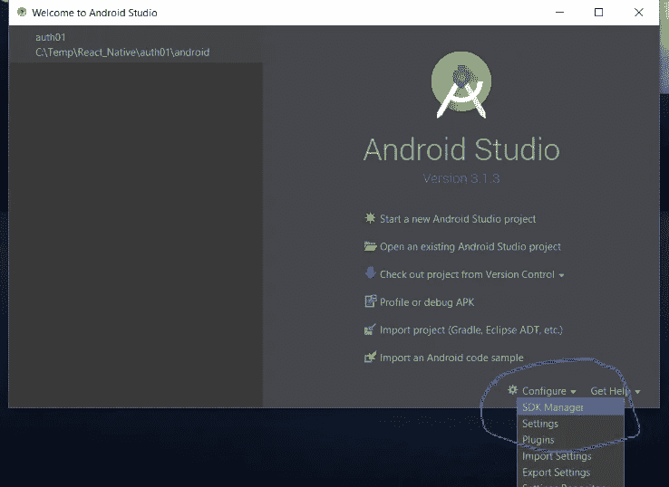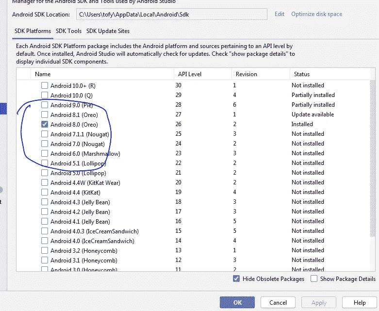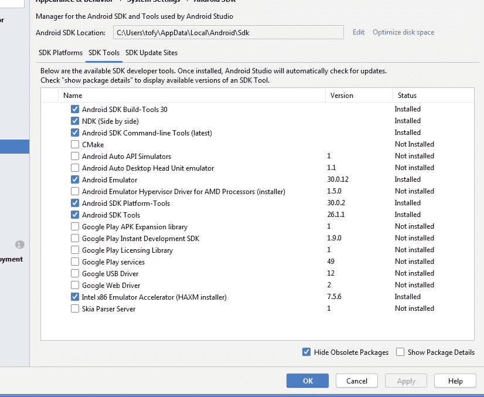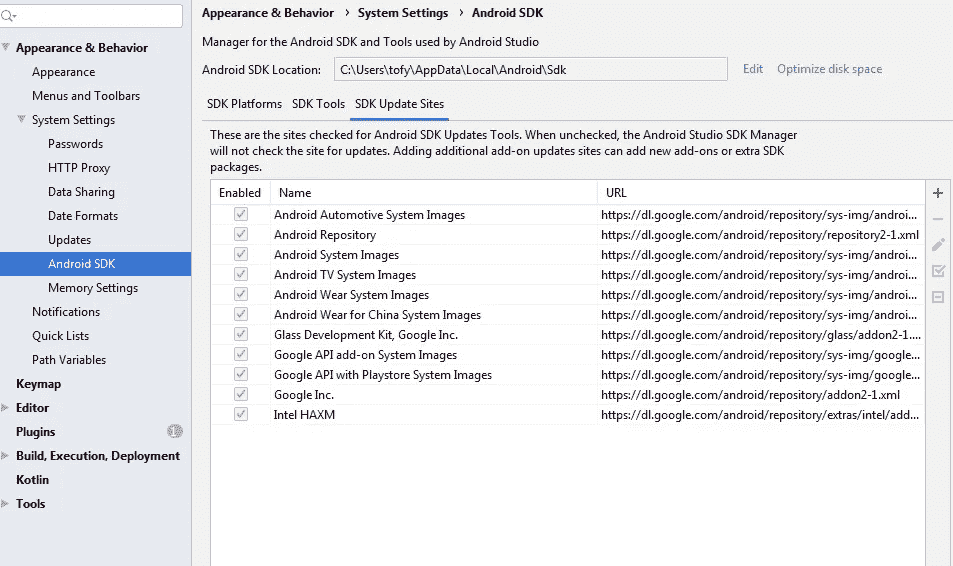

# **第二步:**配置环境变量

**a)添加 ANDROID_HOME 变量:**

c:\ Users \*{用户名}*\ AppData \ Local \ Android \ Sdk

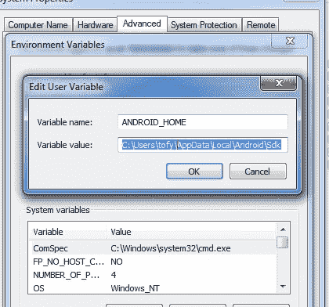

**b)添加 JAVA_HOME 变量:**

c:\ Program Files \ Android \ Android Studio \ JRE

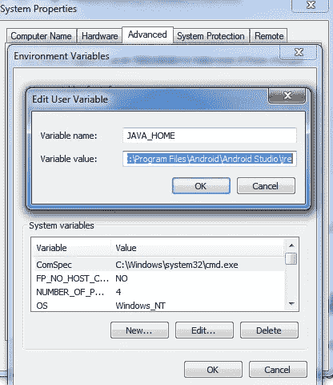

c)确保在 **Path** 变量中添加 Java SDK 和 Android 平台工具的路径:

*C:\ Users \ { user _ name } \ AppData \ Local \ Android \ Sdk \ platform-tools* C:\ Program Files \ Java \ JDK-14 . 0 . 1 \ bin

# 准备模拟器 Android -

> **配置 AVD 管理器**
> 
> **在模拟器或虚拟设备上运行您的应用**

a)按照以下步骤打开 android studio 和 AVD 管理器

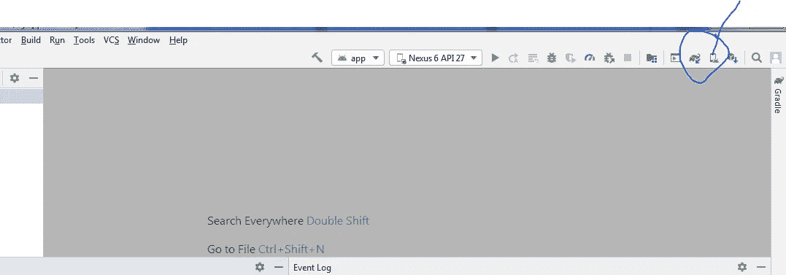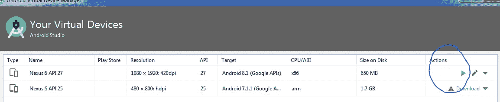

如果一切设置正确，您应该很快就会看到您的 Android 模拟器。


# **如何在 Android 模拟器 BIOS 中启用 VT-X**

> **确保根据笔记本电脑配置运行在 BIOS 设置中启用了 VT-x 的仿真器。**
> 
> **如何在 x86 windows 的 BIOS 中启用 VT-x 运行仿真器**

按照以下步骤解决您的问题:

1.  重新启动计算机
2.  打开 BIOS(在互联网上搜索您的制造商计算机类型)或按(可能有一些变化，但先试试这些)
3.  使用箭头键选择配置，然后搜索虚拟技术—有时称为英特尔 VTx。
4.  启用它
5.  退出并保存配置中的更改

# 步骤 3:安装 create-react-native-app

在您的系统中成功安装 NodeJS 和 NPM 之后。

a)打开终端

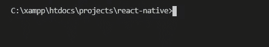

b)您可以继续安装 create-react-native-app(全局安装，如下所示)

```
$ npm install -g create-react-native-app 
```

c)再次运行下面的命令“MyReactNative1 是您的文件夹名称”,并选择默认的新应用程序

```
create-react-native-app MyReactNative1
```

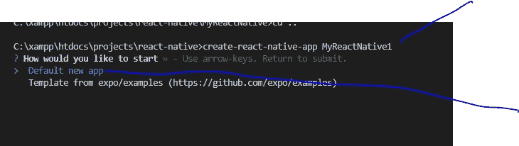

选择默认的新应用程序后，它将安装所有的 javascript，项目依赖和项目准备就绪。

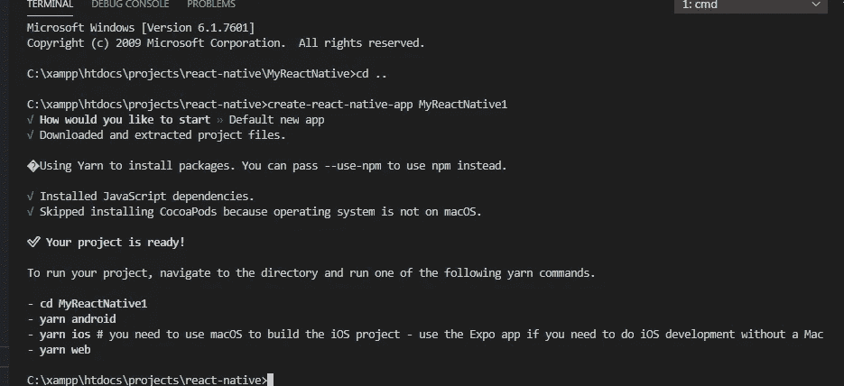

执行上述命令后，将创建一个具有指定名称的文件夹，其中包含以下内容。

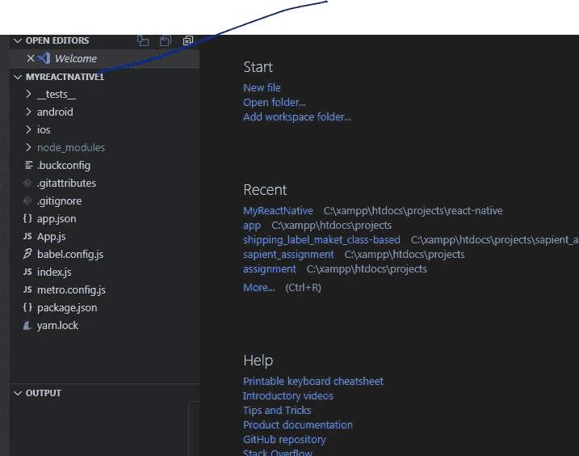

要在 React 本地项目文件夹中启动下面的应用程序，请执行以下命令:

```
 yarn run android 
```

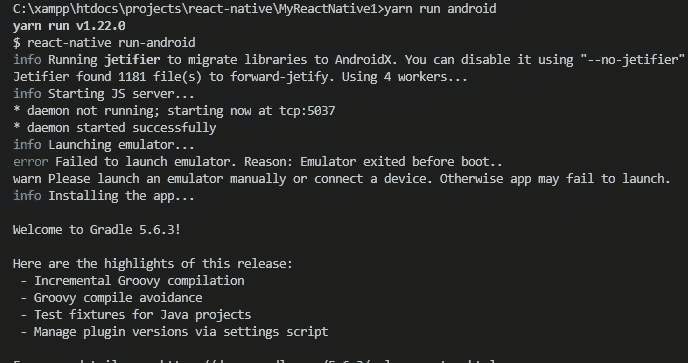

如果一切设置正确，您应该很快就会看到您的新应用程序在您的 Android 模拟器中运行。

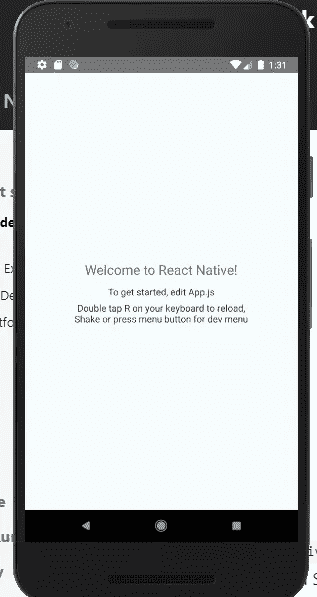

# 结论:

这是如何为 **React 原生应用**设置 **Android 环境**的说明性媒体故事，如果您有任何疑问，请在 kirtikau@gmail.com 上给我发邮件

请关注我下面的故事:)

[](/how-to-add-swagger-ui-to-existing-node-js-and-express-js-project-2c8bad9364ce) [## 如何将 Swagger UI 添加到现有 Node.js 和 Express.js 项目中

### 在本教程中，我们将学习如何向现有的 Node Js 和 Express.js 添加 swagger

levelup.gitconnected.com](/how-to-add-swagger-ui-to-existing-node-js-and-express-js-project-2c8bad9364ce) [](https://medium.com/geekculture/how-to-add-docker-to-create-react-app-cra-run-unit-tests-439b3b25bd2c) [## 如何添加 Docker 来创建 React 应用程序(CRA) +运行单元测试

### 在本教程中，我们将学习如何添加 docker 来创建-反应应用程序并运行单元测试。

medium.com](https://medium.com/geekculture/how-to-add-docker-to-create-react-app-cra-run-unit-tests-439b3b25bd2c) [](https://kirtikau.medium.com/tools-screen-readers-browser-extension-color-contract-tools-for-website-accessibility-1f09480c5f4) [## 工具:屏幕阅读器、浏览器扩展、用于网站可访问性的色彩契约工具

### 网站无障碍工具-

kirtikau.medium.com](https://kirtikau.medium.com/tools-screen-readers-browser-extension-color-contract-tools-for-website-accessibility-1f09480c5f4) [](https://medium.com/geekculture/quickest-five-way-to-center-div-with-css-5529788d3a2c) [## 用 CSS 将 Div 居中最快的五种方法

### 在本教程中，我们将学习如何用 CSS 将 div 居中:)

medium.com](https://medium.com/geekculture/quickest-five-way-to-center-div-with-css-5529788d3a2c) 

**快乐学习:)**