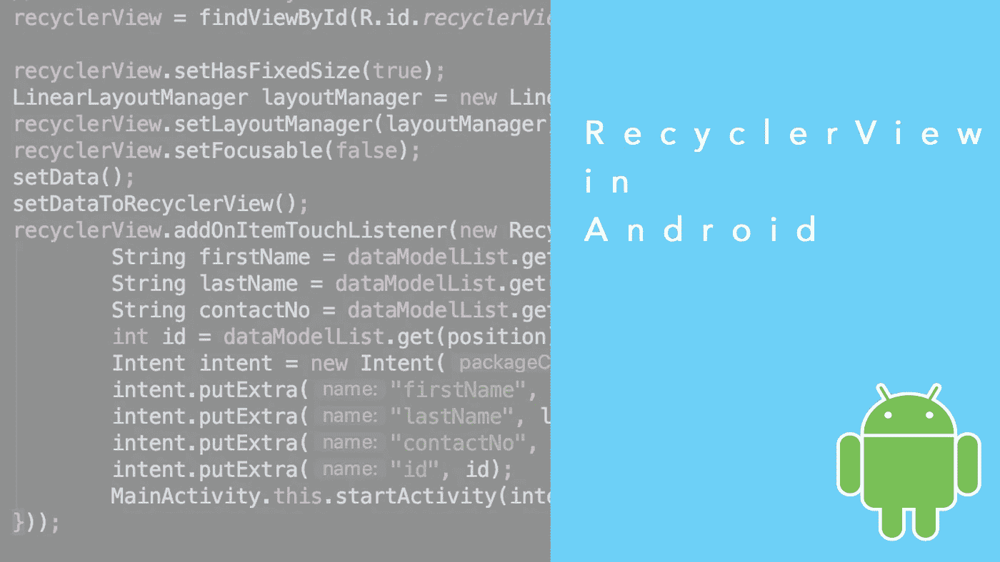
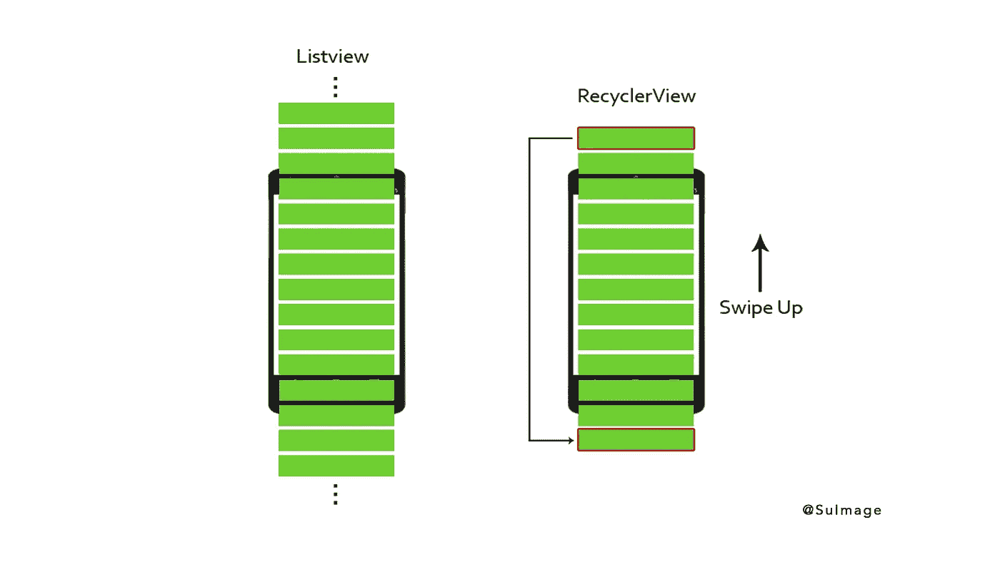
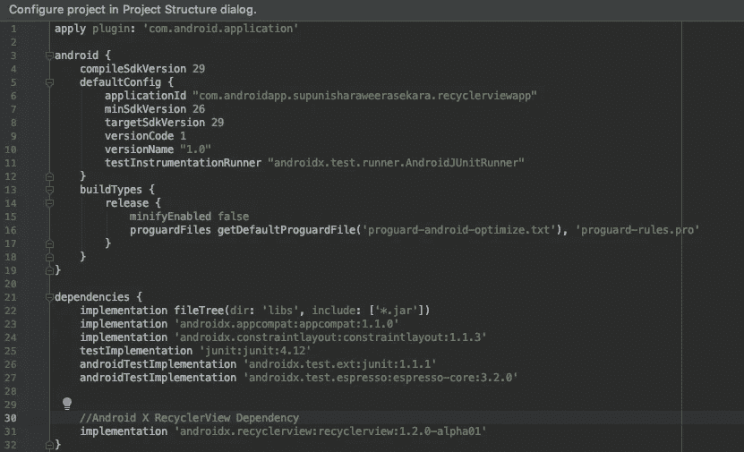
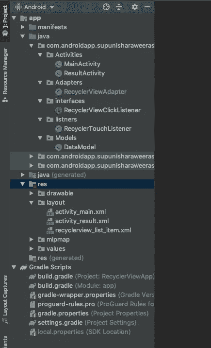

# Android 回收器视图

> 原文：<https://levelup.gitconnected.com/android-recycler-view-b1bc493cac53>

带有点击监听器的 recyclerView 的高级增强。



ndroid recyclerview 是 listview 的最高级版本。基本上，android listview 用于呈现简单的数据集。如果您想在应用程序中显示大型数据集，您应该使用 recyclerview。在本文中，我描述了 recyclerview 的特性，以及如何通过一个简单的示例应用程序以高级方式实现它。

RecyclerView 是一个更加强大、灵活、流畅的 listview 的主要增强。以前大多数开发者使用安卓**列表视图**和安卓**网格视图**。根据 android 开发者网站，recyclerview 是由 Android Lolipop 发起的，版本是支持库下的 [22.1.0](https://developer.android.com/reference/android/support/v7/widget/RecyclerView#) 。而且属于 Maven 神器(***com . Android . support:recycler view-V7:28 . 0 . 0-alpha 1)****)。*recycler view 的最新版本(***AndroidX . recycler view:recycler view:1 . 2 . 0-alpha 01)***与 AndroidX ***相关。***

> android 支持库不再由 Android 维护。然而，几乎所有由支持库带来的特性都可以在 [AndroidX](https://developer.android.com/jetpack/androidx) 的支持下使用，AndroidX 是 [Jetpack](https://developer.android.com/jetpack) 的一部分。

RecyclerView 拥有比列表视图项目更吸引人、更流畅的控件、功能和可靠性。recyclerview 使用重要的设计模式来呈现结果。比使用其他视图如 ListView、GridViews 有更多的优势。Recyclerview 比 listview 更具可定制性，并为其开发人员提供了很多控制和权力。

# **使用 RecyclerView 的优势**

**【1】。负载性能**

使用 RecyclerView 的主要优势是将列表中的列表项加载到视图时的性能。RecyclerView 准备可见条目之外的前后视图。当您需要从后台任务获取列表中的位图图像时，它会提供显著的性能。如果您使用 RecyclerView.setHasFixedSize，它将为您提供一种非常快速的方法。ListView 的前提是，在滚动完成之前，没有办法预先计算或缓存列表中条目的大小。



**【2】。取景器模式**

这是 listview 和 recyclerview 的主要区别。建议使用 ViewHolder 设计模式，但这不是必须的。但是，必须使用 [**RecyclerView。视域**T3 类。当我们使用 listview 时，我们遇到了许多问题，这些问题在 recyclerview 中得到了解决，而且它比其他视图的实现要复杂一些。](https://developer.android.com/reference/android/support/v7/widget/RecyclerView.ViewHolder.html#RecyclerView.ViewHolder(android.view.View))

**[3]。布局管理器**

这是 recyclerview 比 listview 的另一个主要增强。在 Listview 中，只有一种类型的视图可用。对于水平列表视图，没有最佳的实现方式。使用 recyclerview，我们可以使用布局管理器创建不同的布局，并且可以动态地创建所有视图。这些如下。

1.  LinearLayoutManager —支持垂直和水平列表
2.  GridLayoutManager 支持网格视图列表。(例如:-图片库)
3.  StaggeredLayoutManager —支持交错列表(例如:- Pinterest)

**【4】。物品装饰**

在 ListViews 中，通过添加边框或分隔线以及给列表项添加不同的装饰来实现更加困难。但是在 RecyclerView 的情况下是 [**RecyclerView。ItemDecorator**](https://developer.android.com/reference/android/support/v7/widget/RecyclerView.ItemDecoration.html) 类为开发人员提供了更复杂的控制。然而，这有点更费时间和复杂。

**【5】。物品动画**

Listview 并没有给好的动画提供太多的支持。但是，RecyclerView 为它带来了一个全新的维度。使用[和**循环查看。ItemAnimator**](https://developer.android.com/reference/android/support/v7/widget/RecyclerView.ItemAnimator.html) 类，动画视图变得如此容易和直观。

**【6】。OnItemTouchListener**

RecyclerView 通过 [**RecyclerView 给予开发者更强大的控制。OnItemTouchListener**](https://developer.android.com/reference/android/support/v7/widget/RecyclerView.OnItemTouchListener.html)**比ListView **。但是开发者还需要完成更多的实现。虽然 ListView 中的列表项点击事件可以通过 [**AdapterView 来处理。OnItemClickListener**](https://developer.android.com/reference/android/widget/AdapterView.OnItemClickListener.html) 接口。****

**欲了解更多详情，请访问 [Android 开发者网站。](https://developer.android.com/guide/topics/ui/layout/recyclerview#structure)**

# ****使用 RecyclerView 的缺点****

1.  **比 ListView 更复杂。**
2.  **实现比 ListView 实现花费更多的时间。**
3.  **对于初学者来说，要完全理解 RecyclerView 可能需要很长时间。**
4.  **它会不必要地使你的编码生活变得困难。**

# ****Android RecyclerView 实现****

**首先，我应该说，正在使用最新版本的 Android Studio 和 AndroidX 来开发这个示例应用程序。在这个例子中，我试图解释如何实现 Recylerview 以及当列表项被单击时如何处理 click 事件。代码可以在 GitHub 中找到，下面会一步步解释。**

**存储库的 GitHub 链接:**

**[](https://github.com/SupunIsharaWK/RecyclerviewSample) [## SupunIsharaWK/RecyclerviewSample

### 此存储库基本展示了 recyclerview 的实现以及在…中单击项目时的行为

github.com](https://github.com/SupunIsharaWK/RecyclerviewSample)** 

# ****1。)创建一个新项目****

****【1】。**在 Android Studio 中进入文件→新建→新建项目。选择**空活动**并点击**下一步**按钮，然后填写创建新项目所需的详细信息。最后，按下**完成**按钮。**

****【2】。**在 app 级打开 ***build.gradle*** ，添加下面提到的依赖项。**

```
implementation 'androidx.recyclerview:recyclerview:1.2.0-alpha01'
```

****

**build.gradle 中 recyclerview 在应用程序级别的依赖关系**

****【3】。**拥有最新版本的 Android Studio 构建工具。它将生成一个名为***activity _ main . XML .***的布局填充，它包含一个 CoordinateLayout。出于开发人员的考虑，我将它更改为 RelativeLayout。(我在 *activity_main.xml 中所做的更改没有什么不同)。***

*****activity _ main . XML*****

****【3】。在 Android 项目结构的 Android 视图中的 ***res*** 目录下，有一个值目录。其中，它有 ***colors.xml、strings.xml、styles.xml*******

# **2.)创建适配器类和视图。**

**添加 RecyclerView 小部件后，我们应该创建一个适配器类和视图容器来呈现数据。RecyclerView 适配器与 ListView 适配器相同，但它是用 RecyclerView adapter 扩展的。**

****【1】。**用 getters 和 getters 创建一个用于数据操作的模型类，在这里我将这个类命名为 **DataModel****

**DataModel.java**

****【2】。**为列表项创建布局。它用于分别表示列表中的每个项目。清单上的每一个项目都使用过这个视图。这里我在名为***recycler view _ list _ item . XML***的视图中添加了名字、姓氏、联系号码和 Id**

*****recycler view _ list _ item . XML*****

****【3】。**通过扩展 RecyclerView.Adapter 创建一个带有 ViewHolder 的类名 RecyclerViewAdapter，这里我特别要提一下，这里有一些重要的方法，比如***oncreateviewmoder***将布局文件展开到视图中，***onBindViewHolder***将数据设置到视图中的每个视图持有人，以及***getItemCount()***用于获取列表中可用的项目数同样，我还添加了该类的**构造函数**，并将 ***数据模型*** 类的列表对象作为参数。**

```
//create constructor with list
public RecyclerViewAdapter(List<DataModel> dataModelList) {
    this.dataModelList = dataModelList;
}
```

**通过扩展 RecyclerView。ViewHolder 类 I 已经创建了***recyclerviewmoder***作为 adapter 类的内部类。**

```
// declare view holder inner class
class RecyclerViewHolder extends RecyclerView.ViewHolder {
    TextView tvID;
    TextView tvFirstName;
    TextView tvLastName;
    TextView tvContactNo;
    LinearLayout llItemView;

    public RecyclerViewHolder(View itemView) {
        super(itemView);
        llItemView = itemView.findViewById(R.id.*llItemView*);
        tvID = itemView.findViewById(R.id.*tvID*);
        tvFirstName = itemView.findViewById(R.id.*tvFirstName*);
        tvLastName = itemView.findViewById(R.id.*tvLastName*);
        tvContactNo = itemView.findViewById(R.id.*tvContactNo*);
    }
}
```

> **不要忘记在 onCreateViewHolder 方法中放大列表项的布局文件**

**适配器类代码片段如下。**

**RecyclerviewAdapter.java**

**然后打开***MainActivity.java***，用 DataModel 对象创建私有列表。**

```
private List<DataModel> dataModelList;
```

**将数据设置为列表**

```
private void setData() {
    dataModelList = new ArrayList<>();
    dataModelList.add(new DataModel(1, "Supun", "Ishara", "+94711234567"));
    dataModelList.add(new DataModel(2, "Jhon", "Smith", "+11711234567"));
    dataModelList.add(new DataModel(3, "Alexa", "Mori", "+23711234567"));
    dataModelList.add(new DataModel(4, "Kasun", "Weerasekara", "+61711234567"));
    dataModelList.add(new DataModel(5, "Ishara", "De Silva", "+91711234567"));
    dataModelList.add(new DataModel(6, "Sanath", "Weerawarana", "+67711234567"));
    dataModelList.add(new DataModel(7, "Jhone", "English", "+41711234567"));
    dataModelList.add(new DataModel(8, "April", "Beauty", "+32711234567"));
}
```

**然后在 ***onCreate()*** 方法中初始化视图和适配器**

```
protected void onCreate(Bundle savedInstanceState) {
    super.onCreate(savedInstanceState);
    setContentView(R.layout.*activity_main*);

    // Instantiate the recyclerView
    recyclerView = findViewById(R.id.*recyclerView*);

    recyclerView.setHasFixedSize(true);
    LinearLayoutManager layoutManager = new LinearLayoutManager(this, LinearLayoutManager.*VERTICAL*, false);
    recyclerView.setLayoutManager(layoutManager);
    recyclerView.setFocusable(false);
    setData();
    setDataToRecyclerView();
}
```

**最后，将数据设置到适配器**

```
private void setDataToRecyclerView() {
    RecyclerViewAdapter adapter = new RecyclerViewAdapter(dataModelList);
    recyclerView.setAdapter(adapter);
}
```

# **3.)实现点击监听器及其用法。**

**当单击 RecyclerView 中的列表项时，必须管理 click 事件。因此我们需要监听 click 事件，所以我们用***onitemtouchlistener***实现了 click***RecyclerTouchListener***，这样每个 clack 事件都会触发 recyclerview 及其列表项。**

****

**代码的架构**

**在这里，我创建了***recyclerviewclicklelistener***用于传输信息，以通知哪个项目被单击。**

```
package com.androidapp.supunisharaweerasekara.recyclerviewapp.interfaces;

import android.view.View;

public interface RecyclerViewClickListener {
    void onClick(View view, int position);
}
```

**然后在**上添加实现*RecyclerTouchListener*****

*****RecyclerTouchListener.java*****

# ****如何在 recyclerView 上集成 RecyclerTouchListener。****

**我们需要调用 recyclerview 对象和***addOnItemTouchListener***进行点操作。在我的示例中，我创建了另一个活动来传递数据，并在单击 recyclerview 列表项时显示在新活动上。这里您可以看到实现。**

```
recyclerView.addOnItemTouchListener(new RecyclerTouchListener(this, recyclerView, new RecyclerViewClickListener() {
    @Override
    public void onClick(View view, int position) {
        String firstName = dataModelList.get(position).getFirstName();
        String lastName = dataModelList.get(position).getLastName();
        String contactNo = dataModelList.get(position).getContactNo();
        int id = dataModelList.get(position).getId();
        Intent intent = new Intent(MainActivity.this, ResultActivity.class);
        intent.putExtra("firstName", firstName);
        intent.putExtra("lastName", lastName);
        intent.putExtra("contactNo", contactNo);
        intent.putExtra("id", id);
        MainActivity.this.startActivity(intent);
    }
}));
```

**我创建了另一个名为***result activity***的活动，它显示了来自主活动的数据。**

**ResultActivity.java**

**现在就这些了...我知道这个具体例子的内容有限。我希望很快更新更多的文章，包括不同的例子和应用的细节。我会用新的文章链接更新这个页面。**

**谢谢你读了这篇文章，我希望你喜欢，鼓掌吧。**