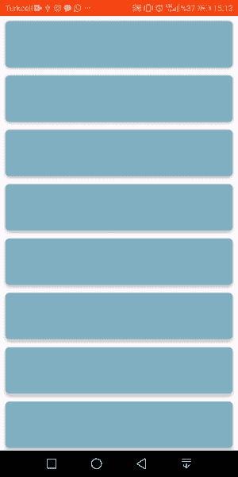
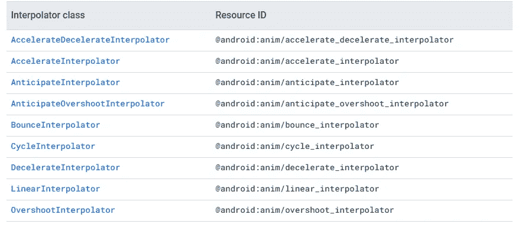

# Kotlin 中的 Android RecyclerView 动画

> 原文：<https://levelup.gitconnected.com/android-recyclerview-animations-in-kotlin-1e323ffd39be>


图片取自[101android.com](https://101android.com/recyclerview-the-easiest-approach-weekly-series-day1/)

对 app 进行编码后，功能性对于一个好看的现代 app 来说是不够的。我认为每个人都接受今天，应用程序应该包括用户界面/UX，过渡动画，当然还有客户端。今天，我将尝试解释其中一个方面，即回收查看项目的动画。我将使用 Android Studio 和 Kotlin。玩得开心:)

# 让我们从基础开始

首先，你需要创建一个 anim 文件夹来存储你的动画文件。


res(右键)->新建->Android 资源目录


我们设定了“动画”这个名字

之后右击 anim 文件夹，创建一个*“动画资源文件”*。

# 属性的解释

当你创建*动画资源文件*时，你会在其中看到一些属性。我会试着解释它们，之后，我们会创作我们的动画。


## -翻译

平移主要用于移动 x 轴和 y 轴上的项目。它有如下一些属性:


*FromXDelta* 和 *fromYDelta* 代表物品将来自哪个方向。如果您为*“fromXDelta”*设置一个正值，它将来自屏幕的右侧。 *ToDelta* 属性表示项目将停止的位置。通常，我使用 0%的 *toDelta* 属性。因为即使你设置了“-100%”，当动画持续时间结束时，该项目将返回到屏幕上，这看起来不太好*。*最后，*“时长”*是动画时间。让我们来看一个带有“仅平移”属性的动画。


只有动漫

## *-阿尔法*

Alpha 用于确定不透明度。该属性主要用于淡入/淡出动画。属性如下:


淡入和淡出动画可以使用 fromAlpha 和 toAlpha 属性来实现。如果你使用上面的值，你将获得这个动画。


只有动漫

## -旋转

从名称可以理解，Rotate 属性用于回收器视图项目的旋转动画。


这些属性在开始时也让我感到困惑，因此我会尽可能清晰地解释它们。FromDegrees 属性表示项目将来自哪个级别。想象一下度数，现在看看图像。物品来自 270 度，顺时针旋转。透视属性类似于根据值固定项目。例如，如果您设置 *pivotX:100%* 和 *pivotY:0%* 和 fromDegrees: 90，它会将项目锁定在右上角并相应地旋转它。动画可以在下面的 gif 中看到。


只有动漫

## -规模

Scale 属性用于放大和缩小项目。这些属性比其他属性更多，所以让我们深入了解一下。


枢轴属性在这里有一点不同的功能。两个枢轴的 50%值表示项目的中心。我这样设置是因为我想从中间开始放大。 *FromScale* 和 *ToScale* 属性用于缩放项目。1 表示原始尺寸，0 表示起始尺寸。这些属性的输出如下所示。


<scale>只有动漫</scale>

## -设置

```
holder.shopDetailParent.*animation* =
    AnimationUtils.loadAnimation(holder.itemView.*context*, R.anim.*example_anims*)
```

首先，您需要在适配器中定义回收器视图项的视图，您希望将该视图动画化。之后，你可以使用上面 *OnBindViewHolder* 上的代码片段添加你的动画。我想制作整个项目的动画，所以我在适配器中定义了我的 *shopDetailParent* 卡片视图。*“example _ anims”*是我的 anim 文件所以，你需要把自己的文件名写到代码里。

# 一些漂亮的动画例子

```
//Animation One//
<translate
    android:fromYDelta="100%"
    android:toYDelta="0%"
    android:duration="500"
    />

<alpha
    android:fromAlpha="0.0"
    android:toAlpha="1.0"
    android:duration="500"/>

<scale
    android:pivotX="50%"
    android:pivotY="50%"
    android:fromXScale="0.5"
    android:fromYScale="0.5"
    android:toXScale="1"
    android:toYScale="1"
    android:duration="500"

    />
```


动画一

```
//Animation Two//
<translate
    android:fromXDelta="200%"
    android:toYDelta="0%"
    android:duration="500"
    />

<scale
    android:pivotX="50%"
    android:pivotY="50%"
    android:fromXScale="0"
    android:fromYScale="0"
    android:toXScale="1"
    android:toYScale="1"
    android:duration="500"

    />
```


动画二

```
//Animation Three//
<translate
    android:fromXDelta="200%"
    android:toYDelta="0%"
    android:duration="500"
    />
<alpha
    android:fromAlpha="0.0"
    android:toAlpha="3.0"
    android:duration="2500"/>
```


动画三

# 插值器

我们有最后一个属性是插值器。插值器基本上是动画的行为。通常动画在线性插值器上工作。该插值器在动画的每一帧上均匀地移动视图。(从现在开始所有的图都取自[jebware.com](https://jebware.com/interp/android-animation-interpolators.html)，你可以去网站上试试不同因子的插值器)它的图是这样的:


线性插值器

但是其他插值器有不同的线。我将向你展示如何添加插值器，并展示几个例子，然后你可以自己尝试。你所要做的就是将这一行添加到你的*集合中。*


减速插值器将使项目从屏幕右外侧进入，并在它们接近最终位置时减慢它们的速度。



减速插补器


弹跳插值器


过冲插值器

来自 [developer.android](https://developer.android.com/guide/topics/resources/animation-resource) 的插值器列表，但是你也可以编写自定义插值器。



感谢您阅读我的文章。我试图解释我所知道的。希望对你理解和应用 recycler view 的精美动画有所帮助:)