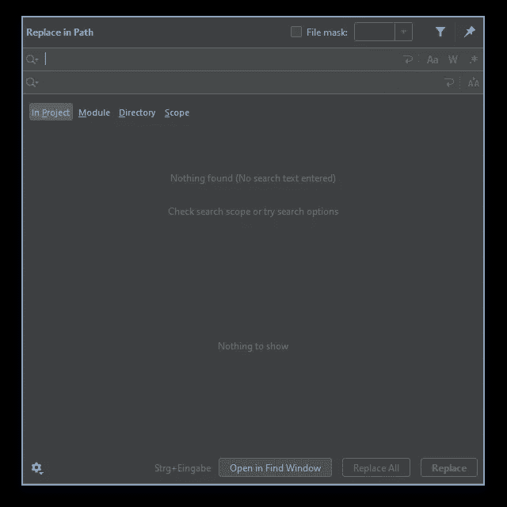
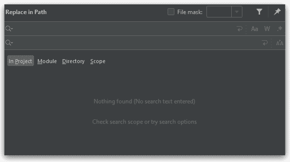
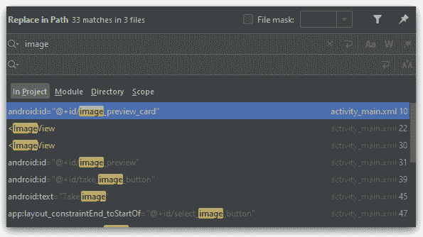
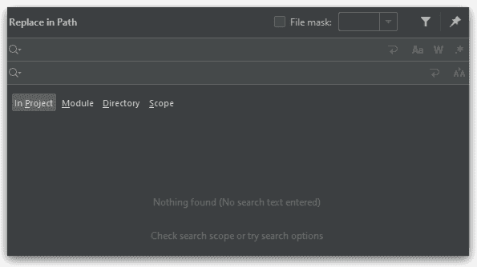
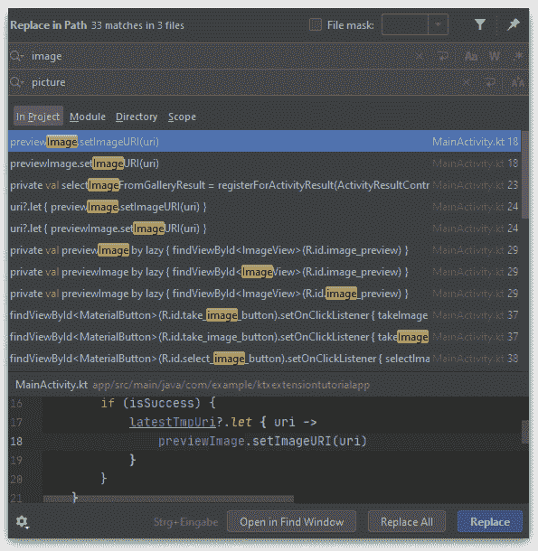
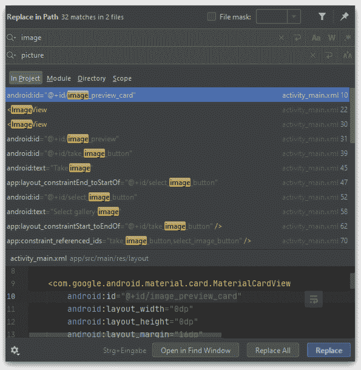

# Android Studio 重构技巧#01:查找和替换

> 原文：<https://levelup.gitconnected.com/android-studio-refactoring-tips-01-find-and-replace-5163432f2449>

## 如何在 AndroidStudio 或 IntelliJ IDEA 项目中轻松找到并替换关键字

由[毛里西奥·马斯卡罗](https://www.pexels.com/de-de/@maumascaro?utm_content=attributionCopyText&utm_medium=referral&utm_source=pexels)在[像素](https://www.pexels.com/de-de/foto/person-die-lupe-halt-712786/?utm_content=attributionCopyText&utm_medium=referral&utm_source=pexels)上拍摄的照片

他的文章将是我的一个新系列的开始。在这个系列中，我将介绍一些快速简单的技巧，帮助你重构和维护你的 Android 应用。

我想先谈谈 Android Studio 的查找和替换功能。因为 Android Studio 是建立在 IntelliJ IDEA 之上的，所以这个技巧当然也适用于 IntelliJ。

然而，为了简单起见，本文的其余部分我将参考 Android Studio。

# 在路径中替换

你可能知道，Android Studio 提供了一个非常好的搜索工具 *"Find in Path"* ，它允许你在整个项目中或者在单个文件或文件夹的范围内查找关键词。

除了搜索功能，IDE 还提供了“在路径中替换”功能。

作为一个例子，我将使用我以前的一个教程的项目。

 [## 如何使用 Android 活动结果 API 来选择和拍摄图像

### ActivityResult API 预构建合约简介

medium.com](https://medium.com/codex/how-to-use-the-android-activity-result-api-for-selecting-and-taking-images-5dbcc3e6324b) 

要打开“在路径中替换”功能，请使用以下快捷键:

***窗口*** :Ctrl+Shift+R

*:⇧⌘r*

*将出现以下对话框提示您:*

**

*IntelliJ 在路径中替换功能*

# *搜索您的关键字*

*如您所见，我们有两个输入字段。上面一个指定了我们想要搜索的关键字。下面一个定义了我们想要用哪个关键字来替换它。*

*在两个输入字段的正下方，我们可以定义我们的搜索范围。默认选择*“在项目中”*范围。在右边，我们找到了三个选项来逐渐缩小范围。*

**“范围”*设置为我们提供了一个下拉菜单，允许我们在范围之间切换，例如仅包含项目文件或当前打开的文件。*

*通过设置对话框顶部的“文件掩码”，我们可以指定我们想要搜索的特定文件类型。例如，我们可以输入*。xml 只搜索 XML 文件。*

*此外，文件掩码选项右侧的过滤器图标允许我们添加一些更细粒度的过滤器选项来指定我们想要搜索的位置。*

*如果我们不选择任何进一步的位置过滤器，并将我们的范围设置为项目中的*，那么对关键字*“图像”的简单搜索可能如下所示。***

**

*没有过滤器的简单关键字搜索*

*如您所见，我们的结果包含了所有与“image”匹配的事件。不管是用大写还是小写写的，或者只是包含在一个单词里。*

*为了进一步指定我们想要搜索的关键字，我们可以使用上部输入字段右侧的过滤器选项。*

*如果你想用你的关键字匹配任何大小写，忽略大小写，不管是包含还是独立匹配，你可以使用“*区分大小写*”选项。*

**

*带有“区分大小写”选项的关键字搜索*

*如果您想完全按照您输入的关键字进行搜索，请使用“ *Words* ”选项。*

**

*带有“单词”选项的关键字搜索*

*如果你想对你的匹配有更多的权力，那么“*替换路径*”工具甚至为你提供了一个“*正则表达式*”选项。*

**

*使用“正则表达式”选项进行关键字搜索*

# *替换您的关键字*

*现在我们知道了如何细粒度搜索我们的关键字，我们来看看如何替换找到的匹配。*

*要替换我们的火柴，我们有两个选择。一个是“*替换所有*功能。顾名思义，按下“全部替换”按钮，我们将替换对话框中显示的所有匹配项。*

**

*替换所有匹配的关键字*

*如果我们想对替换的内容有更多的控制，我们可以使用“*替换*”功能。此选项只是替换当前从选择窗口中选择的匹配。*

**

*替换选定的关键字匹配*

*您可能已经注意到，此时关键字 match 会被您输入的精确替换词所替换。*

*但是，如果您想保持匹配的大小写敏感性，该怎么办呢？为此，只需激活第二个输入字段右侧的*“保留大小写”*选项。*

*如果您现在替换关键字，无论使用第一个还是第二个选项，关键字都是区分大小写的。*

> ***提示**:如果你想了解这个特性的更多信息，请查阅官方的 [IntelliJ IDEA 文档](https://www.jetbrains.com/help/idea/finding-and-replacing-text-in-project.html?keymap=secondary_macos_system_shortcuts#replace_search_string_in_project)*

# *结论*

*在路径中替换特性为我们提供了一个非常方便的特性，在我们想要替换整个项目或者更细粒度的指定范围中的关键字甚至句子的情况下，可以很容易地维护我们的项目。*

*即使该工具乍看起来非常简单，但它为我们提供了许多有用的选项来定义我们的搜索。*

*我希望你有一些收获，如果你喜欢我的文章，请鼓掌，并关注更多！*

* [## 取消 Android 工作管理器任务的 4 种方法

### 关于所有可能的工作管理器取消方法的简短指南

medium.com](https://medium.com/tech-takeaways/4-ways-to-cancel-android-workmanager-tasks-63d212c32109)  [## 为什么许多人在学习如何编码方面失败了

### 关于学习过程中的常见错误以及如何避免它们

medium.com](https://medium.com/swlh/why-many-people-fail-at-learning-how-to-code-73771befb29c)*