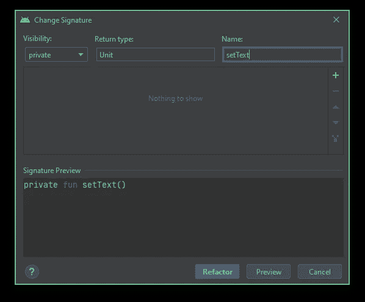
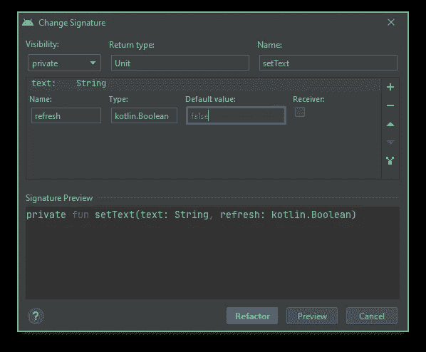
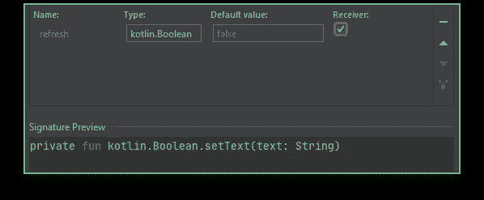
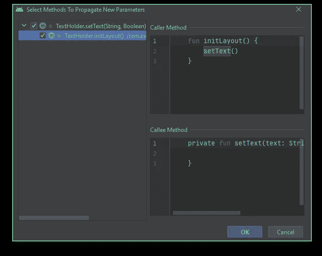
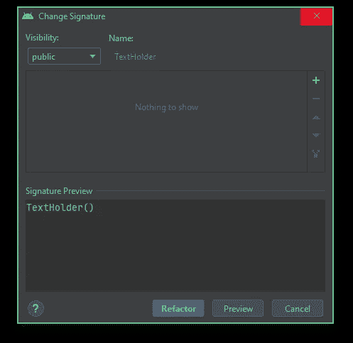
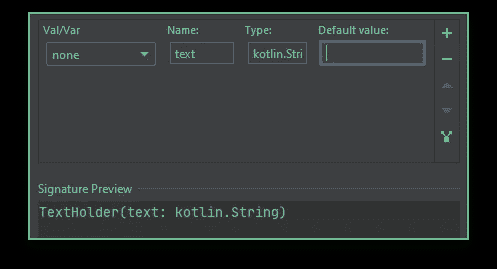

# Android Studio 重构技巧#02:更改签名

> 原文：<https://levelup.gitconnected.com/android-studio-refactoring-tips-02-change-signature-22fbb8f67739>

## 如何轻松更改和排序您的函数或方法参数

来自 [Pexels](https://www.pexels.com/de-de/foto/grun-und-gelb-bedrucktes-textil-330771/?utm_content=attributionCopyText&utm_medium=referral&utm_source=pexels) 的[马库斯·斯皮斯克](https://www.pexels.com/de-de/@markusspiske?utm_content=attributionCopyText&utm_medium=referral&utm_source=pexels)的照片

这篇文章将是我关于 Android Studio 和 IntelliJ IDEA 重构技巧系列的第二篇文章。

在我的上一篇文章中，我谈到了“ *Find and Replace* ”特性，该特性允许您轻松地在整个项目中更改特定的关键字，或者将范围限定在代码库的显式部分。

 [## Android Studio 重构技巧#01:查找和替换

### 如何在 AndroidStudio 或 IntelliJ IDEA 项目中轻松找到并替换关键字

levelup.gitconnected.com](/android-studio-refactoring-tips-01-find-and-replace-5163432f2449) 

接下来的这篇文章将讲述另一个惊人地促进代码重构的特性。

我们将讨论“*更改签名*”。顾名思义，这个特性允许您轻松地重构函数签名。

# 更改签名

在重构菜单中可以找到“*修改签名*”重构功能。为了使用这个特性，您需要选择您的类构造函数或者您想要重构的相应函数。

选择一个函数或类构造函数，右键单击选择并选择**重构→更改签名**。

如果您想依赖快捷方式，请使用以下组合:

***窗口*** : Ctrl+F6

***macOS*** : ⌥⌘S

因为该特性是由这两个不同的品种提供的，所以我们将分别研究它们。

对于这两种情况，我们使用下面的类作为示例:

我们要看的第一个变化是函数签名的重构。

## 功能签名

如您所见，所提供的代码片段中的`setText()`函数目前还没有实现。

函数名意味着文本被设置。但是哪条短信？目前，我们没有这方面的信息。所以我们需要检索文本的输入参数。我们选择类型`String`。

因此，为了适应我们的功能，我们可以手动添加参数，或者使用“*更改签名*”重构特性。

当您选择`setText()`功能并选择“*更改签名*时，您会看到如下对话框。

更改签名对话框

对话框的底部显示了您的签名改编的预览。

在顶部，有三个字段“*可见性*”、“*返回类型*”和“*名称*”。

*   **可见性**:显示当前可见性类型，并提供下拉菜单进行更改
*   **返回类型**:显示函数的返回类型，并允许您通过提供新类型来更改它
*   **名称**:显示功能的当前名称，并允许您对其进行重命名

在右边，您有各种选项来选择“*”、*、*删除“*、*移动“*”或“*传播参数”*参数。前三个参数的效果应该是不言自明的。我们将在以后的某个时间点看一下第四个。

因此，如果我们现在想要添加我们的文本参数，我们单击加号图标。

对于我们使用的名称`text`，类型为`kotlin.String`。我们让其余的参数保持默认状态。

如果我们还想让函数的调用者决定文本的可视状态是否应该被刷新，我们还添加了一个类型为`kotlin.Boolean`的参数`refresh`。这次我们将默认值设置为`false`。

在下面的截图中，你可以看到签名预览。

两个附加参数文本和刷新的预览结果

如果您激活了接收器开关，该函数将被转换为所提供类型的扩展函数。对于布尔类型，函数如下所示:

布尔接收器的签名预览已激活

但是让我们把它还原，应用我们的两个参数。生成的代码片段如下所示:

如果我们想要切换这两个参数，我们可以返回到“*更改签名*”对话框，选择其中一个参数，并使用右侧的两个箭头按钮更改其位置。

不幸的是，调用函数`initLayout()`现在仍然使用旧的实现，没有为我们的`setText(..)`函数提供任何参数。

我们现在可以在`initLayout()`中提供各自的参数，并将它们插入到`setText()`函数调用中。但是因为我们懒惰，我们退回到我们的“*更改签名*”对话框。

这里已经提到的“*传播参数*”选项开始发挥作用。如果您删除刷新参数并编辑文本参数，您可以单击“传播参数”图标打开以下对话框:

传播参数对话框

在左侧，您可以选择应该受到传播影响的所有函数。在我们的例子中，我们只需要检查一个函数。

生成的代码如下所示:

如您所见，`inintLayout()`函数也自动获得了文本参数，并将其设置为`setText()`函数的输入参数。

但是如果我们现在也想删除文本参数呢？再次回到“*更改签名*对话框。选择文本参数并点击“*移除*图标。

当您应用重构时，`setText`的输入参数不仅会从函数本身中移除，还会从任何调用函数中移除。

另一方面，我们在前面的步骤中借助“ *Propagate Parameters* ”选项添加的`tinitLayout()`函数中的文本输入参数不会被删除。

现在，我们已经讨论了函数用例的“变更签名”重构工具的所有选项。但是类构造函数的重构呢？

## 类别签名

正如我们重构函数签名一样，我们也可以对类构造函数做同样的事情。

让我们坚持我们以前的例子。如果我们想通过类构造函数为文本提供一个参数呢？

选择类名并打开“*更改签名*对话框。

更改类构造函数的签名对话框

正如您所看到的，这个对话框看起来非常类似于重构函数签名的对话框。但是，也有一些限制。我们只能选择改变构造函数的可见性。

因为构造函数总是与类名同名，所以我们只能看到它的名字，而不能改变它。因为构造函数没有返回类型，所以也没有修改该部分的选项。

如果我们想添加一个新的构造函数参数，我们只需像以前一样完成同样的过程。

对于添加文本参数，如下所示。

添加新的构造函数参数

如你所见，除了已知的参数，我们还有选择变量类型的选项。当然，我们不能像在 function case 中那样将它标记为 receiver。

重构后的类的最终结果如下所示:

太棒了，现在我们重构了我们的构造函数和函数，而不需要手动操作任何东西。

> 如果您想了解更多关于“更改签名”的信息，请查阅[官方文档](https://www.jetbrains.com/help/idea/change-signature.html#change_method_signature_refactoring)。

# 结论

在本文中，我们了解了 Android Studio / IntelliJ IDEA 中提供的“*变更签名*”重构工具。它让我们有可能快速轻松地重构我们的功能，并在所有依赖关系中应用各自的更改。

在我看来，该特性对于重构来说是一个很大的帮助。尤其是在简单地来回切换几个参数或删除一个参数而不必调整所有依赖关系时，是否使用该工具的决定是绝对不需要动脑筋的。

**我希望你有一些收获，如果你喜欢我的文章，请鼓掌，并关注更多！**

 [## Kotlin 1.5 内联类——几乎没有成本地提高代码的可维护性

medium.com](https://medium.com/codex/kotlin-1-5-inline-classes-improve-code-maintability-at-almost-no-cost-9fd10f1668c4)  [## Android 约束布局—关于指南、组和障碍

medium.com](https://medium.com/tech-takeaways/android-constraint-layout-about-guidelines-groups-and-barriers-c76149e4e4b1)