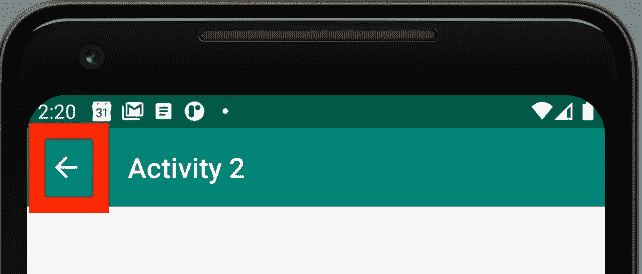
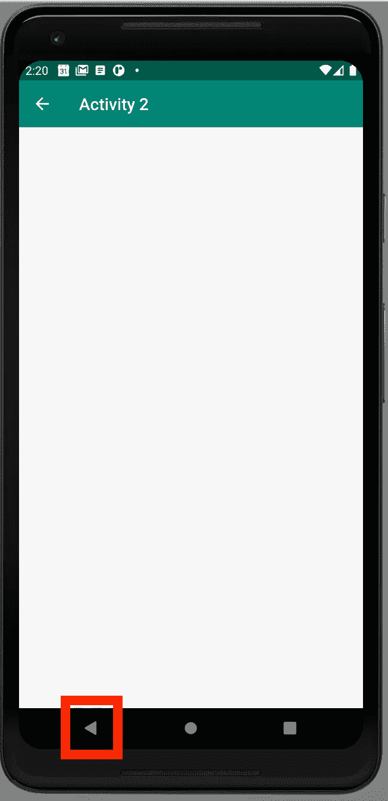
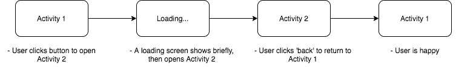
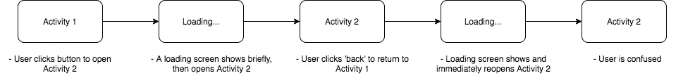

# Android:返回按钮

> 原文：<https://levelup.gitconnected.com/android-the-back-buttons-d71848a11b8a>

android 应用程序中后退按钮的介绍性指南。

杰米·坦普尔顿在 [Unsplash](/s/photos/sign?utm_source=unsplash&utm_medium=referral&utm_content=creditCopyText) 上拍摄的照片

# 目标:

*   让小箭头出现在应用程序栏中
*   按下小箭头将用户带到不同的活动
*   控制当用户按下设备的物理后退按钮时会发生什么

当我使用 Android Studio 向导创建一个活动时，有时它会在应用程序栏中包含一个小箭头，如下所示:

小箭头(又名“向上按钮”)的位置

在 Android 文档中，这被称为“向上按钮”,尽管它指向左边。

为了使箭头出现，我们可以在清单中为活动的条目包含一个`android:parentActivityName`属性。该属性的值是当用户点击小箭头时应该打开的活动的名称。

这不会改变物理后退按钮的行为:

物理后退按钮的位置(因设备而异)

即使活动顶部没有小箭头，物理按钮也在。

按下物理后退按钮会将用户带回到上一个活动，而不管清单上写了什么。然而，这可能并不总是我们想要的。

例如，假设您有一个“加载”活动，当您准备好下一个活动时，它会显示一个微调器或进度条。当用户按下 back 按钮时，他们被送回装载活动，并且必须再按一次 back 才能到达他们实际想要去的地方。更糟糕的是，如果您实现了在加载完成后自动前进到下一个活动的逻辑，用户将被直接弹回下一个活动，这将更加令人困惑。

即

我们想要的:

默认行为:

要改变这一点，我们可以覆盖`onBackPressed`函数。

在上面的例子中，默认的`onBackPressed`功能会将用户送回“加载”活动。我们可以覆盖函数直接打开 Actvity 1。

全部完成！现在这个活动有一个小箭头，它把用户带到他们想去的地方，物理按钮的行为也一样。