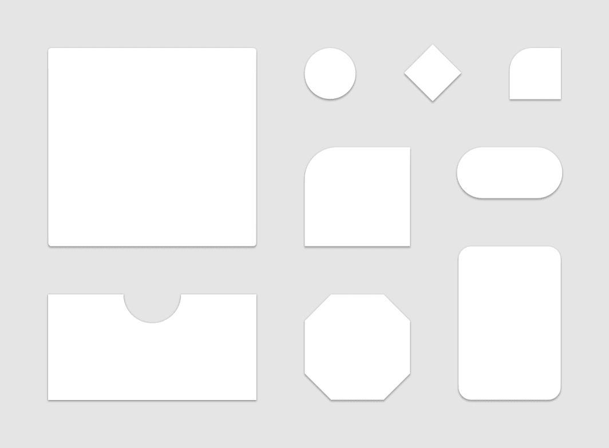
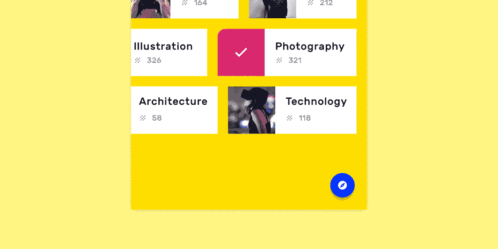
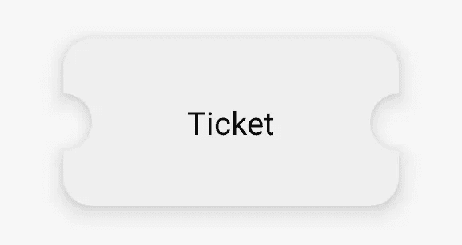
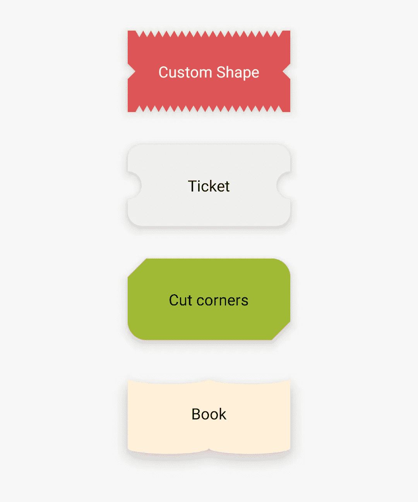

# Android 提示💡|为您的抽屉提供高级形状

> 原文：<https://levelup.gitconnected.com/android-tips-advanced-shapes-for-your-drawables-5a7186e68fd>



[https://material.io/design/shape/about-shape.html](https://material.io/design/shape/about-shape.html)

材质设计是一个非常受欢迎的设计系统，在 Android 世界中非常有名。

> 材料设计的灵感来自物理世界及其纹理，包括它们如何反射光线和投射阴影。材料表面重新想象了纸和墨水的媒介。

在 2014 年首次发布后，它不断更新现代和新鲜的指南。为了帮助 Android 开发者构建吸引人的 UI，谷歌工程师发布了一套非常受欢迎的组件，叫做 Android 的[材料组件](https://github.com/material-components/material-components-android)

# 形状



[https://material . io/design/shape/about-shape . html #塑形-材料](https://material.io/design/shape/about-shape.html#shaping-material)

常见的设计模式是将内容包含在容器中。它可以是一张卡片或任何其他带有彩色背景的布局。Android 应用程序通常使用流行的 CardView 组件来实现这一目的，其他应用程序有位图、9-patch、矢量和更多类型的图形元素。

> 在现实世界中，物体可以相互堆叠或连接，但不能相互穿过。它们投射阴影并反射光线。([来源](https://material.io/design/environment/surfaces.html#material-environment))

所有这些解决方案都非常好用，直到你开始使用 elevation 和 z-translations，因为 Android 无法根据你的自定义形状自动绘制阴影。基于这个原因，我想向你展示一些新的类，它们可以帮助你创建你独特的形状，并让系统相应地生成阴影。

# *材料形状绘制和*形状外观模型🎉

MaterialShapeDrawable 是一个特定的 Drawable，它为生成的路径处理阴影、高度、比例和颜色。

路径是在 ShapeAppearanceModel 中定义的，它允许您定义形状的所有角和边的外观。

边缘的路径由 EdgeTreatment 类绘制

# 让我们创建一个形状💻

在本例中，我们将创建一个代表票证的形状:



首先你需要配置你的项目。只需添加物料组件依赖关系

```
dependencies {
    // ...
    implementation 'com.google.android.material:material:<version>'
    // ...
  }
```

现在是时候创建一个新的类来绘制典型的票的形状了。
为此，我们将扩展 EdgeTreatment 类并绘制一个内弧

如你所见，shapePath 对象有绘制直线和曲线的方法。一旦我们有了边缘处理，我们就可以创建自定义左右边缘的 ShapeAppearanceModel

现在，您可以通过编程方式应用此 drawable。我建议的另一个步骤是让它也适用于 xml 布局

现在你可以这样设置它

```
**...
android:background="@drawable/bg_ticket"
...**
```

搞定了。你的 drawable 已经准备好和你的应用一起使用了

这里有更多你可以做的例子



下一篇文章再见，感谢阅读！🙌