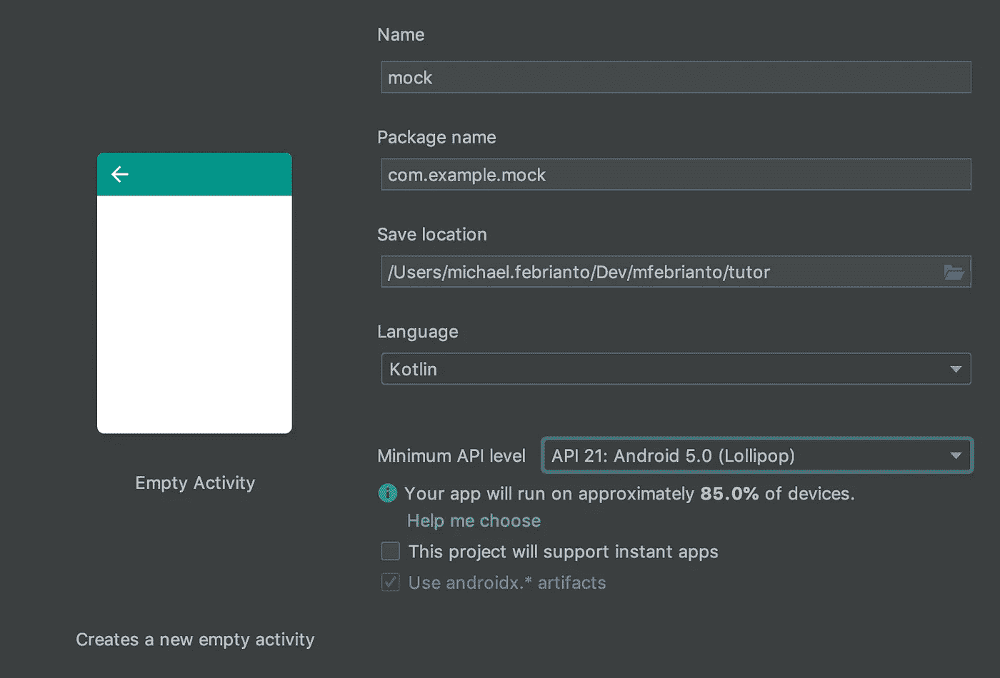
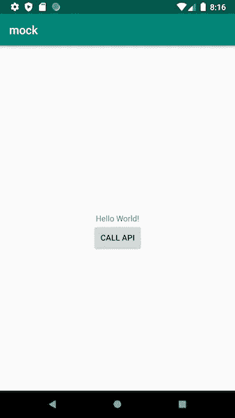
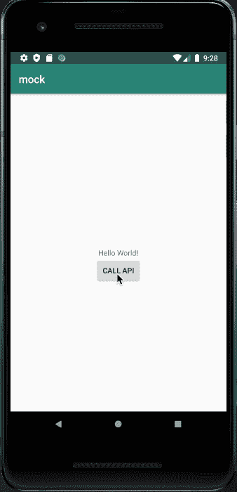
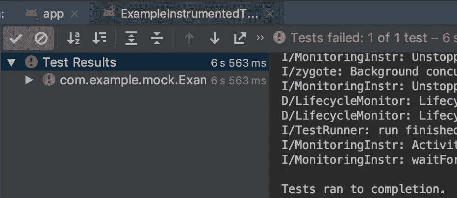

# 使用模拟 API 的 Android UI 测试

> 原文：<https://levelup.gitconnected.com/android-ui-test-with-mocked-api-7b8e11f5499c>

Android 中的 UI 测试非常重要，非常有用。它确保应用程序本身在与外部依赖(如 API)分离时不会出现任何问题。

TL；你可以直接去我在 GitHub 上的库运行应用程序和 UI 测试。


有许多不同的方法可以在 android 上进行 UI 测试。在本文中，我将使用 espresso 和 mockwebserver 来实现它。Espresso 是 Android UI 测试的默认框架。Mockwebserver 是我们用来在 android 测试环境中启动 web 服务器的库。

# 我们做个 app 吧

我将用一个非常简单的例子来解释我们如何让 mockwebserver 在 Android 上工作。我们将创建一个带有一个按钮的 android 应用程序，这个按钮将调用一个 API。打开 Android Studio，让我们创建一个新项目。在*创建新项目*窗口中选择空活动。



创建新项目窗口

在等待 gradle 同步完成时，我们可以检查项目结构。确保它在 *AndroidManifest.xml* 上有 MainActivity，并且文件存在于 src/main/java 上。

让我们添加按钮:转到*RES/layout/activity _ main . XML*单击组件选项上的按钮，然后将其拖动到屏幕设计。之后，我们可以打开文本选项卡，因为默认情况下它使用的是 *ConstraintLayout* ，为了简单起见，我们不会更改它。下一步是向 textview 添加一个 id，然后使 textview 成为 new button 的约束。完整的代码将如下所示:

在我们继续之前，让我们运行应用程序，以确保一切都在正确的位置。如果一切正常，那么您应该会在模拟器的屏幕上看到以下内容:



祝贺你，拍拍你的背。休息 5 分钟，喝点咖啡或茶。

所以我们可以继续。现在，我们将使用 HttpUrlConnection 调用 API，HttpUrlConnection 是一个 android 内置库。**这不是调用 API** 的最佳实践，但为了简单起见在这里使用。我们首先在 AndroidManifest.xml 中添加新的权限来访问互联网和访问网络状态:

下一步是调用 API。点击*调用 API 按钮*，然后在按钮顶部的文本视图上显示结果。我们将使用 Postman 提供的公共 API。这个 API 将为我们提供当前的 GMT 日期时间，然后我们将在 textView 上显示它。再次以简单的名义，我们将把一切都放在不是最佳实践的活动上。主活动代码如下所示:

好了，我们的申请都完成了。您可以运行它并单击 Call API 按钮。它会是这样的:



太好了，你应该得到一块饼干(网飞最终空间的休说)。我们刚刚上完主菜。我们现在要上主菜了:Android UI 测试和 mockwebserver。

# 让我们写一些测试

我知道你们中的一些人会对我大喊这不是 TDD，所以这不是最佳实践。在我看来，TDD 测试需要快速运行(不到 1 分钟)以使开发过程高效。这不是 UI 测试的目的。与测试的全面性相比，UI 测试的执行时间是第二重要的。

接下来，请检查您安装了 espresso 依赖项的项目的 *build.gradle* :

```
androidTestImplementation 'androidx.test.espresso:espresso-core:3.1.1'
androidTestImplementation 'androidx.test:rules:1.1.0'
```

如果你已经有了它，那么去文件*exampleinstrumentedtest . kt . W*我们需要更新这个文件，所以它点击调用 API 按钮，然后等待它从 API 得到结果。它看起来像这样:

现在，你可以在 Android Studio 上点击*类示例 InstrumentedTest* 旁边的绿色箭头，应用程序将运行并执行测试。目前看来不错。

# 让我们嘲笑它

这是本文有趣且重要的部分。我们想要模仿 API 的返回值。让我们说，而不是格林威治时间，我们想把固定日期:*星期三，2020 年 1 月 29 日 23:19:51 +1000*

第一步是我们需要在 build.gradle 中安装 mockwebserver 依赖项，它看起来像这样:

```
androidTestImplementation 'com.squareup.okhttp3:mockwebserver:4.3.0'
```

然后，我们同步项目的 gradle，这样它将获取依赖关系。webmock 服务器将运行在 [*http://127.0.0.1:8080 上。*](http://127.0.0.1:8080.) 然而，我们目前指向的网址是[https://postman-echo.com/time/now](https://postman-echo.com/time/now)。所以我们需要更新 URL 来使用基于构建类型的构建配置(您也可以使用构建风格)。一旦同步过程完成，我们可以将 *build.gradle* 更新如下:

然后我们需要将配置和模拟放到 *ExampleInstrumentedTest 中。*文件的更新将如下所示:

注意前后标注。正如它所呈现的，我们把嘲弄的结果。当我们运行测试(使用绿色箭头)时，它将失败。



当然，我们不能让它处于失败状态。因此，我们需要更新 contains 字符串来查找+1000，如下所示:

```
onView(ViewMatchers.withId(R.id.*hello_world*))
 .check(ViewAssertions.matches(ViewMatchers.withText(StringContains.containsString("+1000"))))
```

再次运行它，它将是绿色的。

恭喜你成功地模拟了你的 android 应用程序的 API。

# 这之后是什么？

当您的应用程序在增长时，API 的复杂性也在增长。Mockwebserver 可以使用 dispatcher 根据请求的路径或参数映射请求和响应，并使用资产返回更复杂的结构，如 JSON。

目前就这些。

> 分享是关爱，像爱自己一样爱你的邻居。