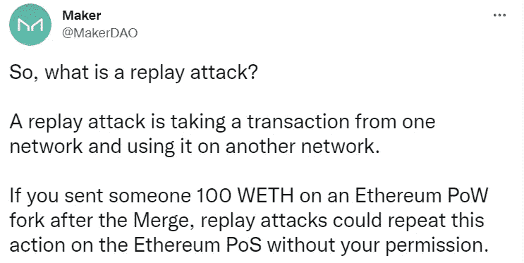

# 愤怒的矿工宣布计划放弃以太坊，否则他们的生意将化为乌有

> 原文：<https://levelup.gitconnected.com/angry-miners-announce-plans-to-fork-ethereum-or-see-their-businesses-go-up-in-smoke-e7b930d9971a>

这就是它对你的影响

[信用—股票 Adobe.com](https://stock.adobe.com/uk/images/mining-and-construction-concept-man-with-angry-face-in-protective-helmet-holds-shovel-in-teeth-bearded-man-wears-working-uniform-and-harthat-man-worker-in-helmet-holds-sapper-shovel-military-spade/197219693?as_campaign=ftmigration2&as_channel=dpcft&as_campclass=brand&as_source=ft_web&as_camptype=acquisition&as_audience=users&as_content=closure_asset-detail-page)

在接下来的 48 小时里，不开心的矿工们可能会坐在价值数百万美元的闲置电脑硬件上，他们再也无法使用这些硬件了。

以太坊转向股权证明的目的是提高其可扩展性，并使区块链降低 99.95%的能耗。

这就像在飞行途中更换飞机引擎，导致以太坊比网飞更节能。

一旦合并完成，每笔交易的成本将从平均家庭 2.8 天的能源消耗减少到相当于为一台电视供电 20 分钟。

这是件大事。

能源使用的差异是惊人的。然而，并不是每个人都为此欣喜若狂。

矿工们对此不以为然。谁能责怪他们呢？

很明显他们为什么会不满。然而，以太坊向利益相关者共识模型的转移一直在路线图上。

并且已经准备了大约七年。

与其看着他们的生计化为乌有，他们已经宣布计划通过一个“Hark Fork”来维护以太坊的工作证明版本。

[Chandler Guo](https://twitter.com/ChandlerGuo) ，一位前加密货币矿工和“工作证明”的大力支持者，正在召集一个开发团队来创建一个以太坊分叉，保持其最初的共识机制。

[信贷—钱德勒郭](https://medium.com/@SuperbloomHQ/chandler-guo-1m-btc-believer-talks-to-superbloom-about-ico-hype-and-whats-next-for-crypto-in-1385901923ed)

郭在以太坊经典叉子中扮演了一个重要的角色，最近有人引用他的话说。

> “我叉过以太坊一次；我再叉一次！”。

在接受[预测新闻](https://forkast.news/chandler-guo-why-would-hard-fork-ethereum/)采访时，郭在他家举办的泳池派对上提出了这个想法，矿工们在派对上表达了他们对放弃股权证明的担忧。

> “我们是在 8 月初开始的，所以时间不长，但进展很快。
> 
> 我四处打听，发现合并可能会导致许多矿商失去业务，其中一些甚至无法弥补成本。
> 
> 矿工们在采矿设施和设备上投入了大量资金。
> 
> 采矿设施不同于建造普通工厂。矿区很难被转作他用。
> 
> 我知道这是一个迫在眉睫的事情，所以我提出了一个分叉。"

如果以太坊的 Hark Fork 成功，你可以拥有旧以太坊链的副本版本上的每个数字令牌的副本。

假设分叉成功，你很可能会收到一个空投，形式是你已经存在非保管钱包中的资产的“副本”。

通过将您的数字资产存储在 MetaMask 或比特币基地钱包等钱包中，您将在合并时自动收到基于余额快照的空投。

这些代币可能没有价值，也不能在大多数交易所交易。

如果你考虑抛售股票获利，你应该谨慎。

您可能容易受到所谓的“重放攻击”

[信用创造者道推特](https://twitter.com/MakerDAO/status/1567953179333066753)

受欢迎的加密交易所，[币安](https://www.finder.com/binance-exchange-review)、[比特币基地](https://www.finder.com/coinbase-exchange-review)和 [Nexo](https://www.finder.com.au/how-to-buy-nexo) 尚未拒绝合并后的 ETHW coin 上市。

然而，一些交易所正在上市拟议中的 ETHW 硬币的借据版本。如果分叉成功，这些 IOU 版本在合并后不久就可以兑换战俘币。

目前上市的交易所有 IOU、 [Poloniex](https://www.finder.com/poloniex-exchange-review) 、 [Gate.io](https://www.finder.com/gate-io-exchange-review) 、MAC、Pemex、DigiFinex 和 CoinW。

以太坊创始人 Vitalik Buterin 就该问题发表评论，称支持硬叉的人是。

> “努力赚快钱”。

我们知道大多数加密行业不会尊重或重视重复的资产。任何显示价值的重复资产都是高度投机的。

所以要小心。

不要为了快速赚钱而冒险。

在 [Medium](https://t.co/0WsCUfngD2) 、 [LinkedIn](https://www.linkedin.com/in/jayden-levitt-aa93511b9/) 或 [Twitter](https://twitter.com/JaydenLevitt) 上关注我。

*本文仅供参考；不应将其视为财务、税务或法律建议。在做出任何重大财务决定之前，请咨询财务专家。*